# 最先进的卷积神经网络解释 DenseNets

> 原文：<https://pub.towardsai.net/state-of-the-art-convolutional-neural-networks-cnns-explained-densenets-451819d32ced?source=collection_archive---------0----------------------->

## [深度学习](https://towardsai.net/p/category/machine-learning/deep-learning)

## 面部识别、定向广告和图像识别都有一个共同点。它们都是用最好的卷积神经网络完成的。

> 原载于 [louisbouchard.ai](https://www.louisbouchard.ai/densenet-explained/) ，前两天在[我的博客](https://www.louisbouchard.ai/tag/artificial-intelligence/)上看到的！

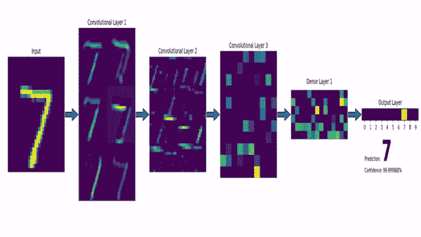

MNIST 数据集上的卷积神经网络。图片 via [msvanjie](https://gfycat.com/@msvanjie)

## 卷积神经网络

卷积神经网络也称为 CNN，是最常用的神经网络类型，最适合任何计算机视觉应用。一旦你明白了这些，你就准备好一头扎进这个领域，成为专家了！卷积神经网络是一类深度神经网络，主要使用卷积来实现预期的任务。

**A …卷积？**

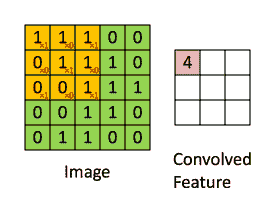

卷积。图片来自 [Irhum Shafkat](https://medium.com/@irhumshafkat)

顾名思义，卷积是一个过程，在这个过程中，原始图像(我们在计算机视觉应用程序中的输入)使用检测图像重要小特征(如边缘)的滤波器进行卷积。网络将自动学习检测重要特征的过滤器值，以匹配我们想要的输出，例如作为输入发送的特定图像中的对象名称。这些过滤器基本上是 3x 3 或 5x 5 大小的正方形，因此它们可以检测边缘的方向:左、右、上或下。就像你在这张图片中看到的一样，卷积的过程在滤镜和它所面对的像素之间产生了一个点积。然后，它向右走，再次这样做，卷积整个图像。一旦完成，这些给我们第一个卷积层的输出，它被称为特征图。然后，我们用另一个滤镜做同样的事情，最后给我们很多滤镜贴图。这些图像都被发送到下一层作为输入，以再次产生许多其他特征地图，直到它到达网络的末端，具有关于图像包含什么的非常详细的一般信息。

**训练一个 CNN**

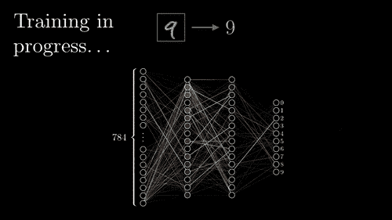

培训过程。图片来自[3 棕色 1 蓝色](https://www.youtube.com/c/3blue1brown)

通常，为了学习我们在卷积中使用的滤波器的参数，称为权重，我们使用一种称为反向传播的技术。这种技术基本上要求首先向您的网络进行前向传播。也就是说，你给它一个或多个例子，并从中得出一个预测。其中预测是您希望您的模型实现的，就像告诉您您发送的图像中是否包含一只猫或一只狗。然后，你使用一种学习技术，在这种情况下，反向传播技术。计算我们的猜测和真实答案之间的误差。在整个网络中传播该误差，基于该误差改变滤波器的权重。一旦传播的误差到达第一层，另一个例子被馈送到网络，整个学习过程被重复。从而迭代地改进我们的算法。

**激活功能**

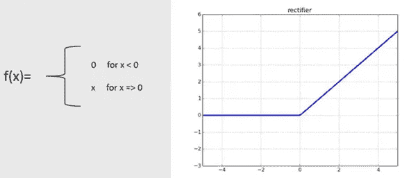

ReLU 激活功能

该激活函数负责确定每个卷积计算的最终输出，并在我们的网络中引入非线性，允许它对非线性数据建模。这样，它可以堆叠卷积并引入“深度”的概念，因为堆叠线性变换等同于只有一个线性变换。因此，引入这种非线性对于我们的深度神经网络是必不可少的。最受欢迎的激活功能被称为 ReLU 功能，代表整流线性单位。如下图所示，在我们称之为“卷积单元”或“conv”的卷积之后，立即使用它。它将任何负结果置零，使卷积的输出更加稀疏，这意味着我们有许多零和一些重要的参数。因此“迫使”网络集中在这些参数上，并且在计算时间上更有效地训练，因为与零的乘法将总是等于零。这也有助于克服消失梯度问题，让模型学习得更快，表现得更好，我们将在后面讨论。

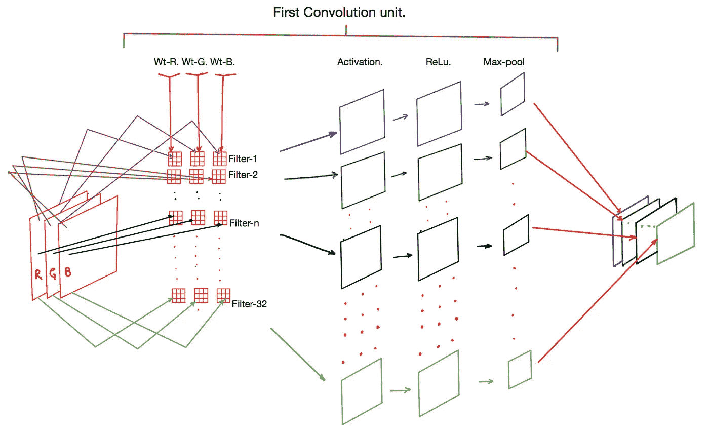

**汇集层**

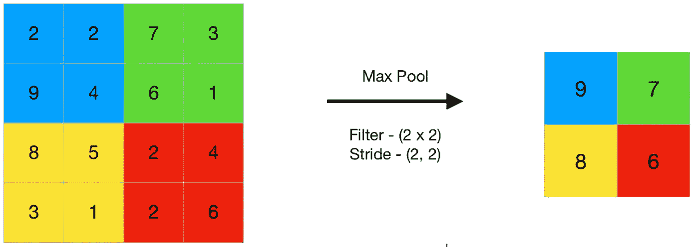

最大池化。图片来自 [GeeksForGeeks](https://www.geeksforgeeks.org/)

然后，为了简化我们的网络并减少参数数量，我们有了池层。通常，我们使用一个 2×2 像素的窗口，并取该窗口的最大值来制作特征图的第一个像素。然后，我们对整个特征图重复这一过程，这将减少特征图的 x-y 维度，从而随着我们越深入，减少网络中的参数数量。这一切都是在保留最重要信息的情况下完成的。

这三层，卷积层、激活层和池层可以在一个网络中重复多次，我们称之为“conv”层，如上图所示，使网络越来越深。这就是“深度学习”这个术语的来源。

**计算机视觉 CNN 架构的最后几层**

最后，全连接层从最后一个池层的输出中学习非线性函数。在下图中表示为“FC”层。它将汇集层产生的多维体积展平为具有相同数量的总参数的一维向量。然后，我们在具有一层或多层的小型全连接神经网络中使用该向量，用于图像分类或其他目的，从而产生每个图像的一个输出，例如对象的类别。当然，这是卷积神经网络的最基本形式。

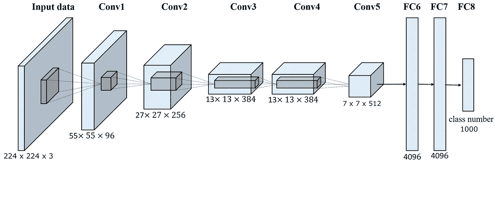

用于图像网对象分类的基本 CNN 结构。图片来自[安德鲁·吉比安斯基](https://andrew.gibiansky.com/blog/machine-learning/convolutional-neural-networks/)

## 最先进的有线电视新闻网

**快速历史**

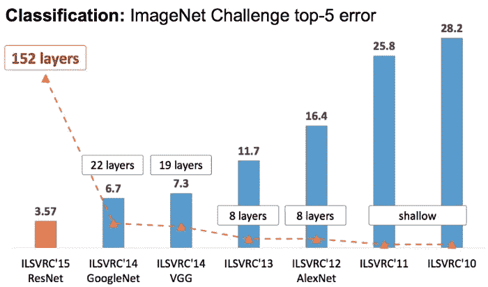

ILSVRC 年度结果。图片来自[帕布](https://medium.com/u/e482242bd86f?source=post_page-----451819d32ced--------------------------------)

自从 Yann LeCun 在 1998 年提出 LeNet-5 以来，已经有了许多不同的卷积架构，最近随着我们的 GPU 的进步，第一个深度神经网络应用于最受欢迎的对象识别竞赛:2012 年的 AlexNet 网络。这场比赛是 Imagenet 大规模视觉识别比赛(ILSVRC)，其中最好的对象检测算法每年都在有史以来最大的计算机视觉数据集 ImageNet 上进行竞争。就在今年之后爆炸了。直到今天，新的体系结构一直在击败以前的体系结构，并且总是表现得更好。

**最有前途的 CNN 架构:DenseNet [1]**

CNN 的历史。图片 via [深度卷积神经网络近期架构综述](https://doi.org/10.1007/s10462-020-09825-6)

如今，大多数最先进的架构都有类似的性能，并且有一些更好的特定用例。您可以在这里看到最强大的架构的快速概述。这就是为什么我在这篇文章中只涉及我最喜欢的网络，在我的研究中产生最好结果的网络，DenseNet。也是我认为最有趣最有前途的 CNN 架构。如果你想让我介绍任何其他类型的网络架构，请在评论中告诉我！

DenseNet 家族于 2016 年首次出现在脸书人工智能研究公司名为“密集连接的卷积网络”的论文中。它是一个家族，因为它有许多不同深度的版本，从 121 层的 80 万个参数到 264 层的 1530 万个参数。这比 101 层深的 ResNet 架构还要小！

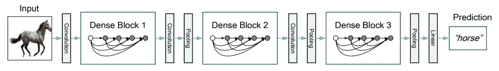

有三个致密块体的深致密网。两个相邻块之间的层被称为过渡层，并通过卷积和池化来改变特征地图的大小。通过 [DenseNet 纸](https://arxiv.org/pdf/1608.06993.pdf)成像

正如您在这里看到的，DenseNet 架构使用了相同的卷积、池和 ReLU 激活函数的概念来工作。此网络架构中的重要细节和创新是密集块。

这是一个五层致密块体的例子。

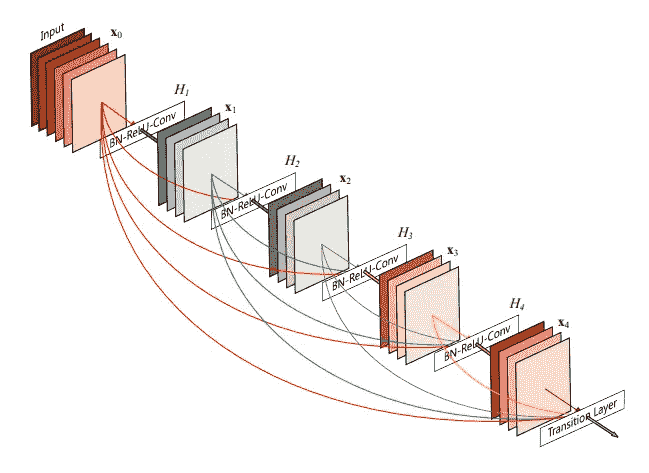

一个 5 层的密集街区。每一层都将所有前面的特征图作为输入。图片通过 [DenseNet 纸](https://arxiv.org/pdf/1608.06993.pdf)

在这些密集的区块中，每一层都将所有先前的特征地图作为输入，因此通过缓解消失梯度问题来帮助训练过程。这种消失梯度问题出现在非常深的网络中，当我们将误差反向传播到网络中时，该误差在每一步都减小，最终变为 0。这些连接基本上允许误差进一步传播，而不会减少太多。出于同样的原因，这些连接还鼓励特征重用并减少参数的数量，因为它重用了以前的特征映射信息，而不是生成更多的参数。因此，由于总参数的减少，访问网络的“集体知识”并减少过度拟合的机会。正如我所说的，与具有相同层数的最先进的 ResNet 架构相比，这非常有效，将参数数量减少了约 5 倍。

正如您在下面所看到的，原始 DenseNet 系列由 4 个密集块组成，带有过渡层(也进行卷积和合并)，以及最终分类层(如果我们正在处理图像分类任务，如 ILSVRC)。DenseNet 系列的每个版本中，密集块的大小是唯一的变化，以使网络更深。

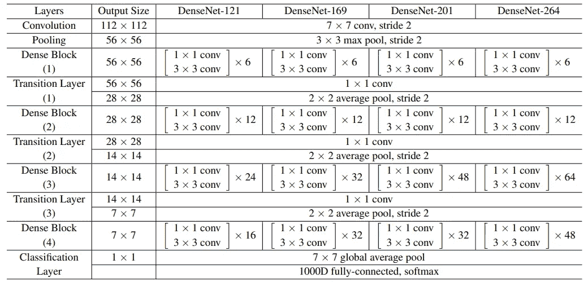

DenseNet 家族。图片来自 [DenseNet 纸](https://arxiv.org/pdf/1608.06993.pdf)

**结论**

当然，这只是对卷积神经网络的介绍，更准确地说是对 DenseNet 架构的介绍。如果您想对您的应用程序做出深思熟虑的选择，我强烈建议您进一步阅读这些架构。下面是 DenseNet 的论文[1]和 GitHub [2]链接以获取更多信息。请让我知道，如果你想让我涵盖任何其他建筑！

如果你喜欢我的工作，并想与人工智能保持同步，你绝对应该关注我的其他社交媒体账户( [LinkedIn](https://www.linkedin.com/in/whats-ai/) 、 [Twitter](https://twitter.com/Whats_AI) )并订阅我的每周人工智能[简讯](http://eepurl.com/huGLT5) ！

## 支持我:

*   支持我的最好方式是在[**Medium**](https://medium.com/@whats-ai)**上关注我，或者如果你喜欢视频格式，在[**YouTube**](https://www.youtube.com/channel/UCUzGQrN-lyyc0BWTYoJM_Sg)**上订阅我的频道。****
*   ****支持我在 [**上的工作**](https://www.patreon.com/whatsai)****
*   ****加入我们的 [**Discord 社区:** **一起学 AI**](https://discord.gg/learnaitogether)和*分享你的项目、论文、最佳课程、寻找 Kaggle 队友等等！*****

******参考文献******

****[1] G .黄，Z .刘，l .马腾，k .温伯格，[密集连接卷积网络](https://arxiv.org/pdf/1608.06993.pdf) (2016)，****

****[2] G .黄，Z .刘，l .马腾，k .温伯格，[密集连接卷积网络— GitHub](https://github.com/liuzhuang13/DenseNet) (2019)，【https://github.com/liuzhuang13/DenseNet】****