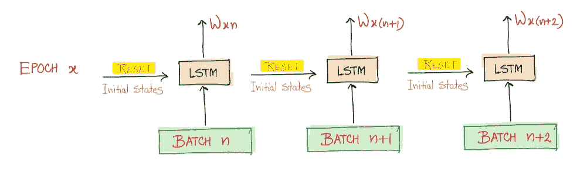
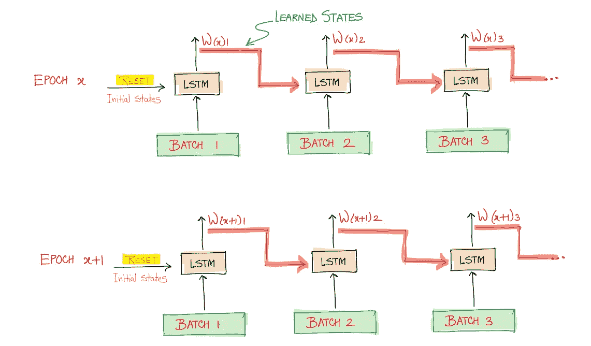
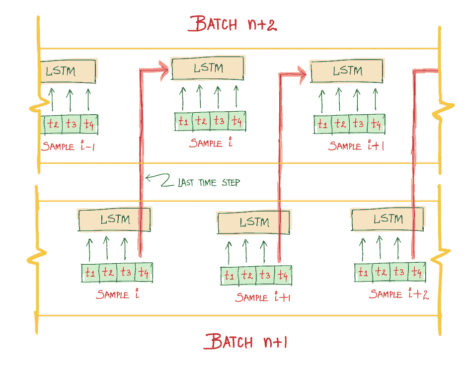

# 无状态与有状态 LSTMs

> 原文：<https://pub.towardsai.net/stateless-vs-stateful-lstms-265c83116c49?source=collection_archive---------1----------------------->

在机器学习中，通常假设训练样本是独立且同分布的(IID)。就序列数据而言，这并不总是正确的。如果序列值之间具有时间相关性，例如时间序列数据，则 IID 假设失败。

因此，序列建模算法有两种风格，**无状态**和**有状态**，这取决于训练时使用的架构。下面以 LSTM 为例进行讨论，但是该概念也适用于其他变体，即 RNN、GRU 等。

当 IID 假设成立时，使用这种架构。在为培训创建批次时，这意味着批次之间没有相互关系，并且每个批次都是相互独立的。

无状态 LSTM 架构中的典型培训过程如下所示:

作者图片

这两种体系结构的不同之处在于，随着训练从一批进展到另一批，模型(对应于每一批)的状态(单元和隐藏状态)被初始化的方式。这不要与参数/权重混淆，参数/权重无论如何都会在整个训练过程中传播(这是训练的全部)

在上图中，每次接收和处理新批次时，LSTM 的初始状态被重置为零，因此没有利用已经学习的内部激活(状态)。这迫使模型忘记来自先前批次的学习。

时序数据(如时间序列)包含非 IID 样本，因此假设划分的批次是独立的(实际上不是),这不是一个好主意。因此，直观地将学习到的状态传播到后续批次，使得模型不仅捕获每个样本序列内的时间相关性，还捕获批次间的时间相关性。
(注意，对于文本数据，当一个句子代表一个序列时，通常假设语料库由独立的句子组成，它们之间没有联系。因此，选择无状态架构是安全的。每当这个假设不成立时，有状态是首选。)
下面是有状态 LSTM 架构的样子:

作者图片

这里，使用来自前一批的学习状态来初始化每一批的 LSTM 的单元和隐藏状态，从而使模型学习跨批的依赖性。然而，状态在每个时期开始时被复位。下面是一个更细粒度的可视化图，显示了批次间的这种传播:

作者图片

这里，位于索引 I，X[i]的样本的状态将用于下一批中样本 X[i + b s]的计算，其中 b s 是批大小。更准确地说，一批中索引 I 处的每个样本的最后状态将被用作下一批中索引 I 的样本的初始状态。在图中，每个样本序列的长度是 4(时间步长)，时间步长 t=4 时的 LSTM 状态的值用于下一批中的初始化。

**观察:**
1。随着批处理大小的增加，无状态 LSTM 倾向于有状态 LSTM。
2。对于有状态的体系结构，批处理不会在内部被打乱(否则在无状态的情况下，这是默认的步骤)

**参考文献:**

1.  [Keras 中的有状态 LSTM](http://philipperemy.github.io/keras-stateful-lstm/)
2.  [Python 中时序预测的有状态和无状态 LSTM](https://machinelearningmastery.com/stateful-stateless-lstm-time-series-forecasting-python/)