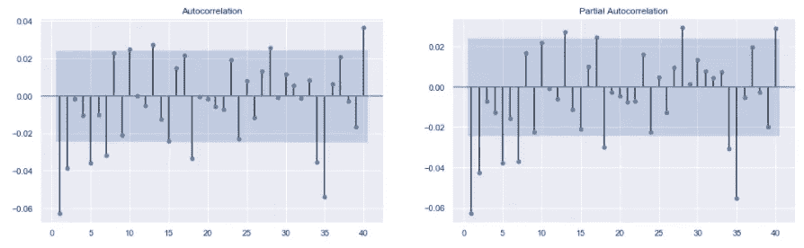
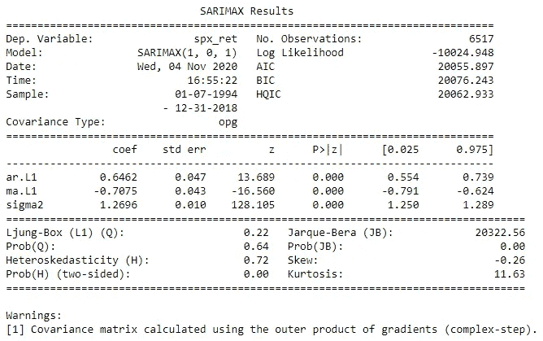
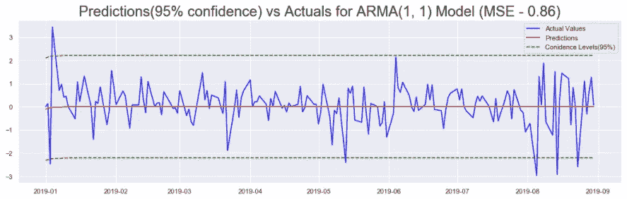
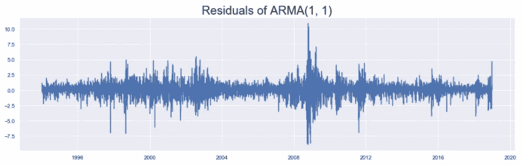
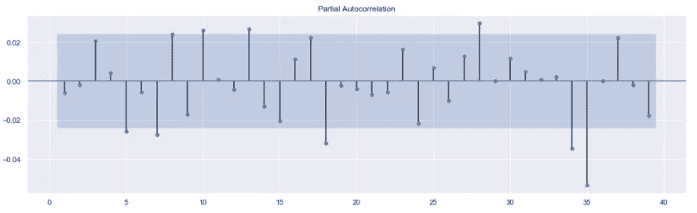
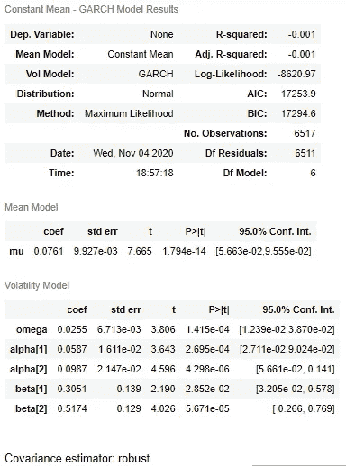
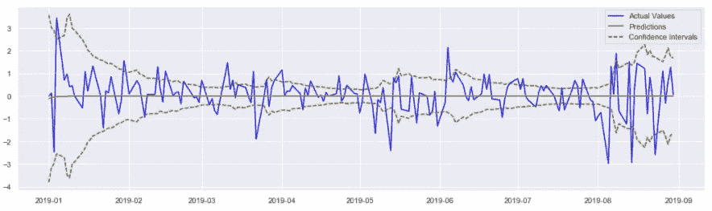

# 时间序列数据的统计预测第 5 部分:时间序列预测的 ARMA+GARCH 模型

> 原文：<https://pub.towardsai.net/statistical-forecasting-for-time-series-data-part-5-arma-garch-model-for-time-series-forecasting-98beeedcfba8?source=collection_archive---------0----------------------->

## [数据可视化](https://towardsai.net/p/category/data-visualization)

照片由[克里斯·利维拉尼](https://unsplash.com/@chrisliverani?utm_source=medium&utm_medium=referral)在 [Unsplash](https://unsplash.com?utm_source=medium&utm_medium=referral) 拍摄

在这一系列文章中，我们使用流行的统计模型来分析标准普尔 500 市场指数: **SARIMA** (季节性自回归综合移动平均线)，以及 **GARCH** (广义自回归条件异方差)。

在第一部分中，该系列从 python 中的`yfinance` API 中废弃。它被清理并用于导出 **S & P 500 收益**(连续价格的百分比变化)和**波动率**(收益的大小)。在第二部分中，使用了一些时间序列探索技术来从数据中获得关于趋势、季节性、平稳性等特征的见解。有了这些认识，在第三和第四部分，研究了 SARIMA 和 GARCH 类模型。所有这些部分的链接都在本文的底部。

在这一部分中，前面介绍的两个模型(SARIMA 和 GARCH)被结合起来建立标准普尔 500 收益的预测和有效置信区间。本文中使用的代码来自这个[资源库](https://github.com/yashveersinghsohi/Statistical_Modeling_for_Time_Series_Forecasting)中的**Returns Models/ARMA-GARCH for SPX Returns . ipynb**笔记本

# 目录

1.  导入数据
2.  列车测试分离
3.  ARMA 的参数估计
4.  对收益率拟合 ARMA 模型
5.  ARMA 模型残差
6.  GARCH 参数估计
7.  基于 ARMA 残差的 GARCH 模型
8.  ARMA + GARCH 模型的预测
9.  结论
10.  链接到本系列的其他部分
11.  参考

# 导入数据

这里，我们导入在本系列的第 1 部分中被废弃和预处理的数据集。参考第 1 部分准备好数据(最后链接)，或者从这个[库](https://github.com/yashveersinghsohi/Statistical_Modeling_for_Time_Series_Forecasting)下载 **data.csv** 文件。

从本系列的第 1 部分导入标准包和预处理数据集的代码

显示数据集前 5 行的前一个代码单元格的输出

因为这与本系列前面部分中使用的代码相同，所以为了简洁起见，这里不再详细解释每一行。

# 列车测试分离

我们现在将数据分为训练集和测试集。这里所有来自`2019–01–01`的观测值构成了测试集，之前的所有观测值就是训练集。

将数据分成训练集和测试集的代码

先前代码单元的输出显示了训练集和测试集的形状

# ARMA 模型的参数估计

ARMA 模型是 ARIMA 模型的一个子集，在本系列前面已经讨论过。它有两个参数表示为:ARMA(p，q)。像 ARIMA 一样，

*   **PACF** 图中显著滞后的数量表示 **p** 的顺序(控制过去值对现在值的影响)。
*   **ACF** 图中显著滞后的数量表示 **q** ( 控制过去残差对当前值的影响)的顺序。

为标准普尔 500 回报生成 ACF 和 PACF 图的代码

标准普尔 500 回归的 ACF 和 PACF 阴谋

`statsmodels.graphics.tsaplots`库中的`plot_acf()`和`plot_pacf()`函数用于绘制标准普尔 500 收益的 ACF 和 PACF 图。在检查这些图时，很明显，前两个滞后在两个图中都是显著的。此后，显著性水平突然关闭，然后再次上升。因此，为了保持模型简单，合理的做法是将初始参数设置为:

*   p = 1 或 p = 2
*   q = 1 或 q = 2

# 对收益率拟合 ARMA 模型

让我们建立标准普尔 500 收益的 ARMA(1，1)模型。

**注:**在拟合 SARIMA 模型类的模型之前，需要检查用于拟合模型的输入序列是否平稳。对于平稳的时间序列，汇总统计数据不会随时间发生显著变化。这意味着创建数据的底层进程与。直觉地认为，只有在生成序列的基础过程在未来保持不变的情况下，才能对序列进行建模。本系列`spx_ret`的平稳性在本系列之前的部分(第 2 部分和第 3 部分)使用`statsmodels.tsa.stattools`中的`adfuller()`测试进行测试。

对标准普尔 500 收益拟合 ARMA(1，1)模型的代码，并绘制汇总表。

显示标准普尔 500 收益 ARMA(1，1)汇总表的上一个代码单元格的输出

`statsmodels.tsa.statespace.sarimax`库中的`SARIMAX()`函数用于拟合 SARIMAX 系列模型的任何子集。将序列`spx_ret`和顺序`order = (1, 0, 1)`传递到函数中，以获得 ARMA(1，1)模型定义。模型上的`fit()`方法用于训练模型定义。拟合模型结果上的`summary()`方法打印模型汇总表，如图所示。

汇总表显示，模型的所有系数都是显著的。

# ARMA 模型预测和置信区间

在本节中，我们使用 ARMA(1，1)模型来预测测试集的收益。此外，使用相同的模型来生成置信区间。

标准普尔 500 收益的 ARMA(1，1)预测和置信区间

ARMA(1，1)模型预测(红色)和置信区间(绿色)与实际回报(蓝色)的关系图

`get_forecast()`方法用于构建一个预测对象，该对象稍后可用于使用`conf_int()`函数导出置信区间。`predict()`函数用于获得测试集的预测。 **RMSE** (均方根误差)指标用于计算预测相对于测试集中实际回报的准确性。然后根据测试集的实际回报绘制预测和置信区间，以直观地确认模型的准确性。

在检查图(如图所示)时，预测在某些情况下是准确的，而在某些情况下，它们会有很大的误差。置信区间不能表明预测在测试集的不同时间段内将如何表现。在某些情况下，置信区间似乎过于保守，回报超出了界限。在其他情况下，置信区间不够保守。

为了解决这个问题，在下一节中，我们将分析模型的残差，并尝试预测 ARMA 预测何时会相差很小，何时会相差很大。

# ARMA 模型残差

在这一节中，我们将绘制模型的残差图，并探索它的一些特性。

绘制标准普尔 500 回报的 ARMA(1，1)残差的代码

标准普尔 500 收益的 ARMA(1，1)残差图

ARMA(1，1)模型生成的残差可以通过使用拟合模型的`resid`属性来访问。在检查该图时，可以清楚地看到残差显示出波动聚类现象。这意味着，如果序列在特定时间步显示高波动性(高方差)，那么它在附近的时间步也会显示高波动性，反之亦然。在 2004 年、2008 年(高波动时期)以及两者之间的时期(低波动时期)，这一现象明显可见。

显示这种波动性聚类的序列可以使用 GARCH 模型成功地建模(如最后链接的第 4 部分所示)。在下一节中，我们开始估计在 ARMA(1，1)模型的残差上拟合 GARCH 模型所需的参数。

# GARCH 参数估计

GARCH 模型有两个参数，表示为:GARCH(p，q)。这些参数是通过计算 PACF 图中显著滞后的数量来估计的。生成这种图的代码没有显示，因为它与上面的 PACF 图代码非常相似。传递的数据中只需要调整。在这种情况下，通过的系列将是`model_results.resid`。

ARMA(1，1)残差的 PACF

该图显示残差中没有明显的滞后。因此，我们将拟合各种 GARCH 模型:GARCH(1，1)，GARCH(1，2)，GARCH(2，1)，GARCH(2，2)，等等。直到我们得到一个具有重要系数和最佳精度的模型。

# 基于 ARMA 残差的 GARCH 模型

如前所述，PACF 图没有提供任何关于起始参数的信息。在这种情况下，应该拟合各种模型，以便找到具有重要系数和最佳精度的模型。这确保了我们有一个尽可能简单的模型和尽可能高的精度。

在拟合了几个这样的模型后，GARCH(2，2)满足了我的条件。请随意在当地试用各种型号，并选择您喜欢的型号。让我们看看符合 GARCH(2，2)模型的代码:

根据 ARMA(1，1)残差拟合 GARCH(2，2)模型的代码

GARCH(2，2)模型汇总表

在拟合模型之前，准备一个新的数据框架。该数据帧由原始数据集中的所有时间步长组成(在训练测试分割之前)。训练时间步长由来自 ARMA(1，1)模型的残差占据。这些实际上用于训练 GARCH 模型。测试周期被之前一个时间步观察到的实际回报所占据。这相当于说，该模型将使用今天观察到的回报来预测明天的回报波动。

`arch`库中的`arch_model()`函数用于定义 GARCH 模型。`fit()`函数用于训练定义的模型。`last_obs`参数用于确定模型应该从哪个时间步开始预测。`summary()`功能打印出如图所示的汇总表。汇总表显示模型的所有系数都是显著的。

# ARMA+GARCH 模型的预测

在本节中，我们使用拟合 ARMA(1，1)残差的 GARCH(2，2)模型来预测测试集中残差的波动性。

使用 ARMA 构建标准普尔 500 回报预测的代码，以及使用 GARCH 构建这些预测的置信区间

使用 ARMA+GARCH 模型对标准普尔 500 收益(蓝色)的预测(红色)+置信区间(绿色)

`forecast()`方法用于拟合模型:`resid_model_results`。这将输出一个`ARCHModelForecast`对象，其中包含均值模型和波动性模型的预测。接下来，调用`residual_variance`属性来获得对波动性的预测。从存储在`arma_predictions_df`中的 ARMA 模型的预测中减去(和加上)波动率模型的预测，以获得模型的下(和上)置信区间。

接下来，预测(来自 ARMA(1，1))和置信区间(来自 GARCH(2，2))相对于实际的标准普尔 500 回报被绘制。在检查该图时，很明显，当回报稳定时，并且当预测接近实际回报时，置信区间通过接近来反映这一点。当回报不稳定，预测与回报相差甚远时，情况也是如此。在这种情况下，置信区间也会调整并变得远离。

# 结论

因此，使用组合的 ARMA 和 GARCH 模型，我们能够建立更有意义的预测。查看预测和置信区间，我们可以了解未来回报的大概数字以及市场的稳定性。在本系列的下一篇也是最后一篇文章中，我们将研究如何使用 SARIMA 模型族来处理非平稳数据:标准普尔 500 价格。

# 链接到本系列的其他部分

*   [时间序列数据的统计建模第 1 部分:预处理](https://medium.com/@yashveersinghsohi/statistical-modeling-of-time-series-data-part-1-data-preparation-and-preprocessing-b52f26f6213c)
*   [时间序列数据的统计建模第二部分:探索性数据分析](https://medium.com/@yashveersinghsohi/statistical-modeling-of-time-series-data-part-2-exploratory-data-analysis-5c3aaedc04b7)
*   [时间序列数据的统计建模第三部分:利用 SARIMA 预测平稳时间序列](https://medium.com/@yashveersinghsohi/statistical-modeling-of-time-series-data-part-3-forecasting-stationary-time-series-using-sarima-f0ff1284bebb)
*   [时间序列数据的统计建模第四部分:利用 GARCH 预测波动率](https://medium.com/@yashveersinghsohi/statistical-forecasting-of-time-series-data-part-4-forecasting-volatility-using-garch-1e9ff832f7e5)
*   时间序列数据的统计建模第 5 部分:时间序列预测的 ARMA+GARCH 模型。
*   [时间序列数据的统计建模第六部分:用 ARMA 预测非平稳时间序列](https://medium.com/@yashveersinghsohi/statistical-forecasting-for-time-series-data-part-6-forecasting-non-stationary-time-series-using-9acc28c39db9)

# 参考

[1][365 数据科学](https://365datascience.com/courses/time-series-analysis-in-python/)时间序列分析课程

[2][machine learning mastery](https://machinelearningmastery.com/time-series-forecasting/)关于时序分析的博客

[3] [维基百科](https://en.wikipedia.org/wiki/Autoregressive_conditional_heteroskedasticity)关于 GARCH 的文章

GARCH 模型上的 YouTube 视频。

[5] [Tamara Louie:应用统计建模&机器学习进行时间序列预测](https://www.youtube.com/watch?v=JntA9XaTebs)

罗布·J·海曼和乔治·阿萨纳索普洛斯的《预测:原理与实践》