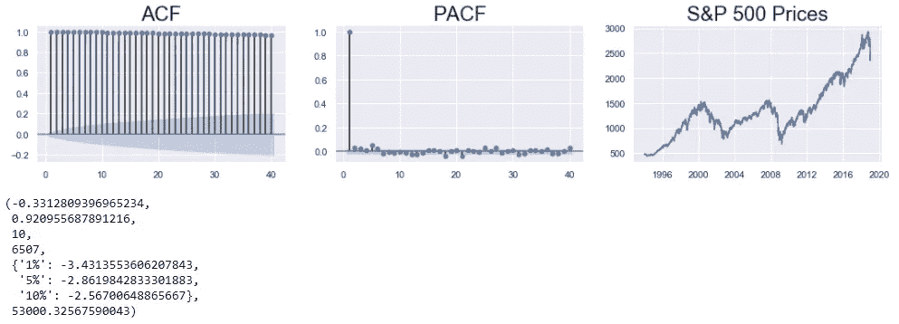
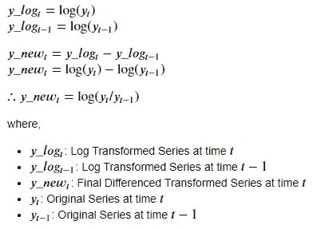
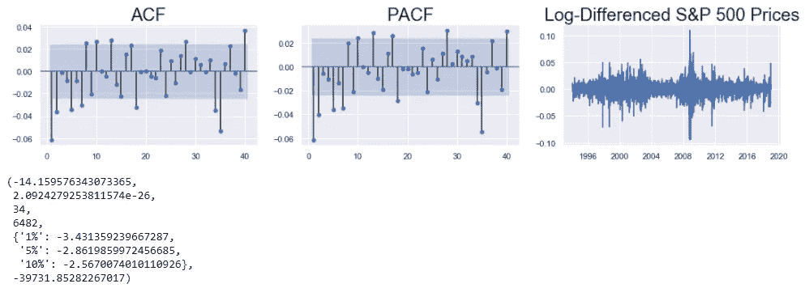
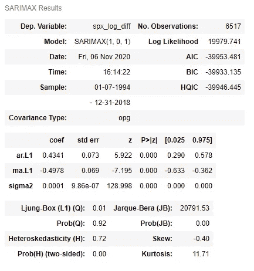
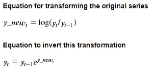
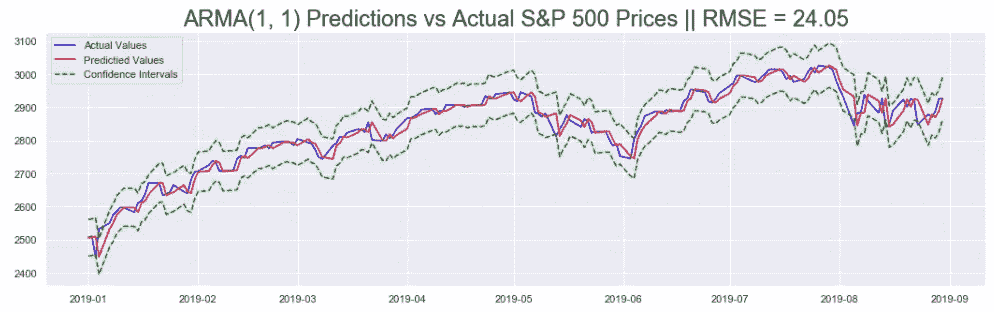

# 时间序列数据的统计预测第 6 部分:用 ARIMA 预测非平稳时间序列

> 原文：<https://pub.towardsai.net/statistical-forecasting-for-time-series-data-part-6-forecasting-non-stationary-time-series-using-9acc28c39db9?source=collection_archive---------1----------------------->

## [数据可视化](https://towardsai.net/p/category/data-visualization)

照片由[克里斯·利维拉尼](https://unsplash.com/@chrisliverani?utm_source=medium&utm_medium=referral)在 [Unsplash](https://unsplash.com?utm_source=medium&utm_medium=referral) 拍摄

在这一系列文章中，标准普尔 500 市场指数使用流行的统计模型进行分析: **SARIMA** (季节性自回归综合移动平均线)，和 **GARCH** (广义自回归条件异方差)。

在第一部分中，该系列从 python 中的`yfinance` API 中废弃。它被清理并用于导出 **S & P 500 收益**(连续价格的百分比变化)和**波动率**(收益的大小)。在第二部分中，使用了一些时间序列探索技术来从数据中获得关于趋势、季节性、平稳性等特征的见解。有了这些认识，第三和第四部分介绍了 SARIMA 和 GARCH 类模型。在第五部分中，两个模型(SARIMA 和 GARCH)结合起来生成有意义的预测，并对未来数据得出准确的见解。所有这些部分的链接都在本文的末尾。

在这最后一部分中，介绍了使用 SARIMA 模型类对非平稳数据建模的技术。本文中使用的代码来自这个[资源库](https://github.com/yashveersinghsohi/Statistical_Modeling_for_Time_Series_Forecasting)中的**Prices Models/ARMA Model for SPX Prices . ipynb**笔记本

# 目录

1.  导入数据
2.  列车测试分离
3.  标准普尔 500 价格的平稳性
4.  将标准普尔 500 价格转换为平稳序列
5.  对转换后的序列建模
6.  用 ARMA 模型预测标准普尔 500 价格
7.  评估预测
8.  结论
9.  链接到本系列的其他部分
10.  参考

# 导入数据

这里，我们导入在本系列的第 1 部分中被废弃和预处理的数据集。参考第 1 部分准备好数据，或者从这个[库](https://github.com/yashveersinghsohi/Statistical_Modeling_for_Time_Series_Forecasting)下载 **data.csv** 文件。

从本系列的第 1 部分导入标准包和预处理数据集的代码

显示数据集前 5 行的前一个代码单元格的输出

因为这与本系列前面部分中使用的代码相同，所以为了简洁起见，这里不再详细解释每一行。

# 列车测试分离

像以前一样，我们现在将数据分成训练测试集。这里所有来自`2019–01–01`的观测值构成了测试集，之前的所有观测值就是训练集。

将数据分成训练集和测试集的代码

显示训练集和测试集形状的前一个代码单元的输出

# 标准普尔 500 价格的平稳性

在拟合 ARIMA 系列的任何模型之前，应该检查输入序列的平稳性。这是因为在一个平稳序列中，产生数据的基本过程(ARIMA 试图模拟的过程)在未来不会改变。因此，该模型将有一个合理的机会成功与稳定的数据。

要检查系列是否稳定，可使用以下 3 种方法:

*   使用折线图检查数据是否没有明显的趋势(汇总统计数据不随时间变化)。
*   使用 ACF 和 PACF 图检查该图与其自身滞后版本的相关性。
*   检查 ADF(增强的 Dickey Fuller)测试的结果。零假设表明序列是非平稳的。如果返回的 p 值大于所有的临界水平，则不能拒绝零假设，序列不是平稳的。(本系列的第 2 部分提供了更深入的描述。)

检验标准普尔 500 价格的平稳性

标准普尔 500 价格的相关图、线图和 ADF 测试结果

相关图和线图显示了该系列中的明显趋势。此外，ADF 检验的 p 值大于所有的临界水平，因此该序列是非平稳的。

# 将标准普尔 500 价格转换为平稳序列

有许多技术可用于将非平稳序列转换为平稳序列。以下两条可能是最常见的:

*   **差异:**在这里，这个数列与它自身的滞后版本有差异。在这种转换中，通常会删除序列的趋势部分。
*   **对数变换:**这里计算系列的对数。在这种变换中，级数的规模减小了，变化也减弱了。

在这种情况下，使用另一种常见的方法，即结合上述两种方法:**对数差分变换**。在这种情况下，首先计算序列的对数，然后将该序列与其自身的滞后版本进行差分(这里，滞后是 1 个时间段)。

这种方法的数学公式是:

上述变换的数学公式

执行此操作的代码如下:

执行对数差变换的代码

这个新系列的平稳性可以用检验原来系列的同样方法来检验。`train_df[“spx”]`系列将被`train_df[“spx_log_diff”]`系列取代。其余代码可以与 S & P 500 价格部分的**平稳性中的代码相同。**

转换后的标准普尔 500 价格的相关图、线图和 ADF 测试结果

相关图和线图表明该序列是平稳的(没有任何明显的趋势)。ADF 检验的 p 值进一步证明该序列是平稳的。

# 对转换后的序列建模

由于序列是平稳的，我们可以使用 ARIMA 模型的非整合变量:AR、MA 或 ARMA。在这种情况下，选择 ARMA。ARMA 的参数用 **ARMA(p，q)** 表示:

*   **p:** 控制过去滞后的影响(通过统计 **PACF** 图中的显著滞后来估计)
*   **问:**控制过去残差的影响(通过计算 **ACF** 图中的显著滞后来估计)

查看上一节的 ACF 和 PACF 图，这些参数的初始估计值可以是:`p=1`或`p=2`，以及，`q=1`或`q=2`。让我们考虑最简单的模型: **ARMA(1，1)** 。

以下代码单元用于构建 ARMA(1，1)模型:

变换标准普尔 500 价格的 ARMA(1，1)模型拟合

上面训练的 ARMA(1，1)模型的汇总表。

`SARIMAX()`函数用于定义 ARMA(1，1)模型，方法是将转换后的 S & P 500 价格序列和适当的订单作为参数进行传递。使用模型定义上的`fit()`方法训练模型。使用`summary()`方法在装配模型上显示汇总表。

汇总表的 **P < |Z|** 栏显示该模型的所有系数都是显著的。接下来，该模型用于为转换后的序列生成预测，然后为原始价格序列生成预测。

# 用 ARMA 模型预测标准普尔 500 价格

为了预测标准普尔 500 价格，之前构建的 ARMA(1，1)模型将用于预测转换后的(对数差分)标准普尔 500 价格值。然后对预测值(和置信区间)进行反向转换，以获得标准普尔 500 价格所需的值。

参考上面提到的变换方程，我们可以使用下面的数学方程导出逆变换:

对标准普尔 500 价格进行对数差分转换的逆转换

获得标准普尔 500 价格预测的代码如下:

根据 ARMA(1，1)模型构建标准普尔 500 价格预测的代码

*   首先，定义一个数据框架(`pred_df`)，它存储了推导标准普尔 500 价格预测所需的所有重要序列。
*   接下来，将`spx`系列和该系列的滞后版本存储在数据帧中。滞后为 1 个时间周期。这两个系列代表上图公式中的`y(t)`和`y(t-1)`系列。
*   现在，使用`predict()`方法生成模型预测，在拟合的模型上指定`start`和`end`日期。同样，这些预测的置信区间是使用`conf_int()`方法在`get_forecast()`函数的输出上生成的。这些系列代表`y_new(t)`系列和上式中该系列的置信区间。
*   指数函数用于这些预测及其置信区间，以便从上面的公式生成`exp(y_new(t))`序列。
*   最后将滞后的`spx`值(`y(t-1)`)和之前生成的`exp(y_new(t))`序列相乘，得到期望的预测:`y(t)`。

# 评估预测

有两种方法可以评估先前生成的预测:

*   预测值和实际值的折线图
*   计算均方根误差(RMSE)度量

生成折线图和 RMSE 指标的代码如下所示:

计算 RMSE 和绘制 ARMA(1，1)模型预测的代码

ARMA(1，1)模型生成的标准普尔 500 预测值与实际值的曲线图

首先，使用`sklearn.metrics`中的`mean_squared_error()`函数计算 RMSE 度量。然后，预测值(蓝色)与标准普尔 500 指数的实际价格(红色)相对照，并标上置信区间(绿色)。

# 结论

在这一系列文章中，我们使用统计时间序列预测模型(如 SARIMA 和 GARCH)对标准普尔 500 市场指数进行了分析和建模。本系列文章首先介绍了获取此类数据的方法，并对其进行了探索以便更好地理解。接下来，介绍了几个统计模型并应用于这些数据。使用这些模型，我们能够预测未来值以及与这些预测相关的误差幅度。

# 链接到本系列的其他部分

*   [时间序列数据的统计建模第一部分:预处理](https://medium.com/@yashveersinghsohi/statistical-modeling-of-time-series-data-part-1-data-preparation-and-preprocessing-b52f26f6213c)
*   [时间序列数据的统计建模第二部分:探索性数据分析](https://medium.com/@yashveersinghsohi/statistical-modeling-of-time-series-data-part-2-exploratory-data-analysis-5c3aaedc04b7)
*   [时间序列数据的统计建模第三部分:利用 SARIMA 预测平稳时间序列](https://medium.com/@yashveersinghsohi/statistical-modeling-of-time-series-data-part-3-forecasting-stationary-time-series-using-sarima-f0ff1284bebb)
*   [时间序列数据的统计建模第 4 部分:利用 GARCH 预测波动率](https://medium.com/@yashveersinghsohi/statistical-forecasting-of-time-series-data-part-4-forecasting-volatility-using-garch-1e9ff832f7e5)
*   [时间序列数据的统计建模第 5 部分:时间序列预测的 ARMA+GARCH 模型。](https://medium.com/@yashveersinghsohi/statistical-forecasting-for-time-series-data-part-5-arma-garch-model-for-time-series-forecasting-98beeedcfba8)
*   时间序列数据的统计建模第六部分:用 ARMA 预测非平稳时间序列

# 参考

[1][365 数据科学](https://365datascience.com/courses/time-series-analysis-in-python/)时间序列分析课程

[2][machine learning mastery](https://machinelearningmastery.com/time-series-forecasting/)关于时序分析的博客

[3] [维基百科](https://en.wikipedia.org/wiki/Autoregressive_conditional_heteroskedasticity)关于 GARCH 的文章

GARCH 模型上的 YouTube 视频。

[5] [Tamara Louie:应用统计建模&机器学习进行时间序列预测](https://www.youtube.com/watch?v=JntA9XaTebs)

罗布·J·海曼和乔治·阿萨纳索普洛斯的《预测:原则与实践》

[7] [用 Python 处理非平稳时间序列的温和介绍](https://www.analyticsvidhya.com/blog/2018/09/non-stationary-time-series-python/)来自 Analytics Vidhya