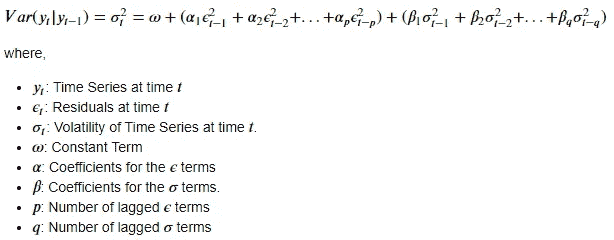
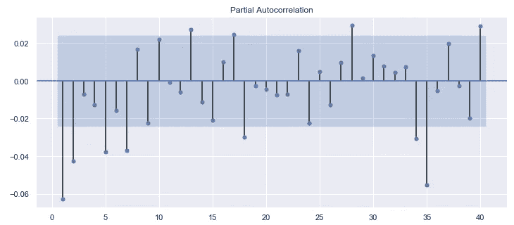
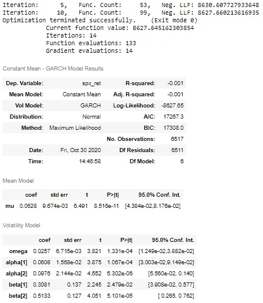
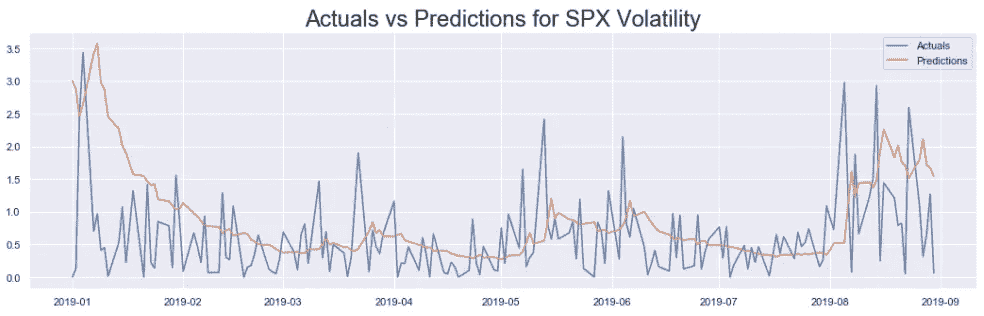

# 时间序列数据的统计预测第 4 部分:用 GARCH 预测波动性

> 原文：<https://pub.towardsai.net/statistical-forecasting-of-time-series-data-part-4-forecasting-volatility-using-garch-1e9ff832f7e5?source=collection_archive---------0----------------------->

## [数据可视化](https://towardsai.net/p/category/data-visualization)

照片由[克里斯·利维拉尼](https://unsplash.com/@chrisliverani?utm_source=medium&utm_medium=referral)在 [Unsplash](https://unsplash.com?utm_source=medium&utm_medium=referral) 上拍摄

在这一系列文章中，标准普尔 500 市场指数使用流行的统计模型进行分析: **SARIMA** (季节性自回归综合移动平均线)，和 **GARCH** (广义自回归条件异方差)。

在第一部分中，该系列从 python 中的`yfinance` API 中废弃。它被清理并用于计算标准普尔 500 的回报率(连续价格的百分比变化)和波动性(回报率的大小)。在第二部分中，使用了一些时间序列探索技术来从数据中获得关于趋势、季节性、平稳性等特征的见解。有了这些认识，在第三部分中，探索了 SARIMA 模型类。

在本文中，GARCH 模型被用来模拟标准普尔 500 收益的波动性。本文中使用的代码来自这个[资源库](https://github.com/yashveersinghsohi/Statistical_Modeling_for_Time_Series_Forecasting)中的**Volatility Models/GARCH for SPX Volatility . ipynb**笔记本

# 目录

1.  导入数据
2.  列车测试分离
3.  GARCH 模型
4.  标准普尔 500 回报的波动性
5.  GARCH 的参数估计
6.  拟合 GARCH 对标准普尔 500 回报
7.  预测波动性
8.  评估绩效
9.  结论
10.  链接到本系列的其他部分
11.  参考

# 导入数据

这里，我们导入在本系列的第 1 部分中被废弃和预处理的数据集。参考第 1 部分准备好数据，或者从这个[库](https://github.com/yashveersinghsohi/Statistical_Modeling_for_Time_Series_Forecasting)下载 **data.csv** 文件。

从本系列的第 1 部分导入标准包和预处理数据集的代码

显示数据集前 5 行的前一个代码单元格的输出

因为这与本系列前面部分中使用的代码相同，所以为了简洁起见，这里不再详细解释每一行。

# 列车测试分离

我们现在将数据分为训练集和测试集。这里所有来自于`2019–01–01`的观测值构成了测试集，之前的所有观测值就是训练集。

将数据分成训练集和测试集的代码

显示训练集和测试集形状的前一个代码单元的输出

# GARCH 模型

GARCH 代表**广义自回归条件异方差。**条件异方差相当于时间序列中的条件方差(或条件波动率)。GARCH 模型使用波动性聚类的概念对一个序列的波动性进行建模。**波动率聚类**本质上意味着今天的波动率，取决于最近时间步的波动率。使用两个参数来指定 GARCH 模型: **GARCH(p，q)** 。GARCH 模型的公式如下所示。

GARCH 如何模拟波动性的数学公式

上面的等式显示了 GARCH 如何对波动性建模。某个时间步长的波动率平方表示为某个常数、一组过去残差项和一组过去波动率项的线性组合。参数 **p 和 q** 分别用于控制上述等式中这些滞后残差和波动项的数量。

# 标准普尔 500 回报的波动性

在这篇文章中，标准普尔 500 收益的波动性是用 GARCH 建模的。为了测试预测的波动性是否与未来收益的波动性匹配，我们计算了标准普尔 500 收益的大小，并将其存储在序列`spx_vol`中。

因此，模型适合于`spx_ret`序列，预测的波动率与`spx_vol`进行比较。

# GARCH 的参数估计

PACF(部分自相关函数)图用于获得 GARCH 模型的参数 p 和 q 的初始估计。该图中显著滞后的数量被用作初始参数。然后使用模型汇总表(在拟合模型后显示)来了解模型中的哪些系数是重要的。在此基础上，对模型进行微调。

现在，标准普尔 500 收益的 PACF 图产生了:

为标准普尔 500 回报生成 PACF 图的代码

标准普尔 500 回归的 PACF 情节

使用`statsmodels.graphics.tsaplots`包中的`plot_pacf()`功能，为`spx_ret`系列生成 PACF 图。在检查该图时，前两个滞后是显著的。因此，GARCH(2，2)模型适用于初始起点。

# 拟合 GARCH 对标准普尔 500 回报

现在，GARCH(2，2)模型适合标准普尔 500 收益序列。

导入并拟合标准普尔 500 收益的 GARCH(2，2)模型的代码

拟合标准普尔 500 收益的 GARCH(2，2)模型简表

`arch`包中的`arch_model()`函数用于实现 GARCH 模型。这里提到的实现是受官方文档[这里](https://arch.readthedocs.io/en/latest/univariate/univariate_volatility_forecasting.html#Fixed-Window-Forecasting)中提到的启发。在拟合模型之前，准备一个新的数据框架。该数据帧由原始数据集中的所有时间步长组成(在训练测试分割之前)。训练时间步长被 S & P 500 的返回占用。这些实际上用于训练 GARCH 模型。测试周期被之前一个时间步观察到的回报所占据。这相当于说，该模型将使用今天观察到的回报来预测明天的回报波动。

使用`arch_model()`方法，定义了模型。该函数将上述数据集作为输入，参数:`p=2`和`q=2`。`vol= “GARCH”`参数指定要使用的模型是 GARCH。模型定义存储在变量`model`中，并对其调用`fit()`方法来训练模型。`last_obs`参数用于确保模型仅根据训练数据进行训练。拟合模型存储在`model_results`变量中，通过调用拟合模型上的`summary()`显示其摘要。

输出图像中汇总表前的前几行显示了通过`fit()`函数每次迭代后显示的拟合信息。`fit()`函数中的`update_freq=5`参数限制该信息在每 5 次迭代后显示。接下来，在汇总表中有 3 个部分:**恒定均值— GARCH 模型结果、均值模型、**和**波动模型。**在波动率模型部分， **P < |Z|** 栏明确表示所有系数在 5%的置信水平下显著。

# 预测波动性

这里，拟合的模型用于预测测试集中标准普尔 500 收益的波动性。

生成 GARCH 模型对标准普尔 500 回报的波动性预测的代码，并根据回报的大小(假设为波动性)绘制预测

显示模型预测的波动率与标准普尔 500 回报时间序列的假设波动率(回报幅度)的关系图。

`forecast()`方法用于拟合模型:`model_results`。这将输出一个`ARCHModelForecast`对象，其中包含均值模型和波动性模型的预测。接下来，调用`residual_variance`属性来获得对波动性的预测。预测存储在数据帧中，周期数与`data`中的相同。对模型进行训练的所有期间都有`NaN`值，并且实际上只填充模型应该生成预测的期间。在这种情况下，测试集的所有周期都有实数值，而训练集的周期有`NaN`。然后根据启发式计算的波动性(回报率的大小)绘制预测。

# 评估绩效

上图显示，每当模型的预测波动率剧烈飙升时，回报的幅度(启发式计算的波动率)也会大幅波动。另一方面，当预测的波动率稳定时，那么收益的大小也相对稳定。因此，我们的模型显然能够识别标准普尔 500 回报的高波动期和低波动期。

该模型的主要目的是识别市场稳定的时期和市场波动的时期，并且该模型成功地捕获了这些信息。因此，没有理由根据像 **RMSE** (均方根误差)这样的误差度量来评估模型

# 结论

本文利用 GARCH 模型对标准普尔 500 收益率的波动性进行了分析和预测。在下一篇文章中，首先，将使用 ARIMA 模型来拟合标准普尔 500 收益。然后，GARCH 模型将用于模拟 ARIMA 的残差。这将允许我们生成比 ARIMA 模型单独生成的置信区间更可靠的置信区间。

# 链接到本系列的其他部分

*   [时间序列数据的统计建模第 1 部分:预处理](https://medium.com/@yashveersinghsohi/statistical-modeling-of-time-series-data-part-1-data-preparation-and-preprocessing-b52f26f6213c)
*   [时间序列数据的统计建模第二部分:探索性数据分析](https://medium.com/@yashveersinghsohi/statistical-modeling-of-time-series-data-part-2-exploratory-data-analysis-5c3aaedc04b7)
*   [时间序列数据的统计建模第三部分:利用 SARIMA 预测平稳时间序列](https://medium.com/@yashveersinghsohi/statistical-modeling-of-time-series-data-part-3-forecasting-stationary-time-series-using-sarima-f0ff1284bebb)
*   时间序列数据的统计建模第 4 部分:用 GARCH 预测波动性
*   时间序列数据的统计建模第五部分:时间序列预测的 ARMA+GARCH 模型。
*   [时间序列数据的统计建模第六部分:用 ARMA 预测非平稳时间序列](https://medium.com/@yashveersinghsohi/statistical-forecasting-for-time-series-data-part-6-forecasting-non-stationary-time-series-using-9acc28c39db9)

# 参考

[1][365 数据科学](https://365datascience.com/courses/time-series-analysis-in-python/)时间序列分析课程

[2] [机器学习掌握](https://machinelearningmastery.com/time-series-forecasting/)关于时间序列分析的博客

[3] [维基百科](https://en.wikipedia.org/wiki/Autoregressive_conditional_heteroskedasticity)关于 GARCH 的文章

[4][ritvikmath](https://www.youtube.com/channel/UCUcpVoi5KkJmnE3bvEhHR0Q)GARCH 模型上的 YouTube 视频。

[5] [arch](https://arch.readthedocs.io/en/latest/univariate/univariate_volatility_forecasting.html#Fixed-Window-Forecasting) 使用 GARCH 模型进行预测的文档。