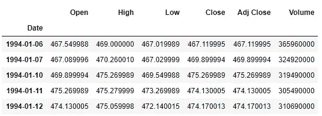
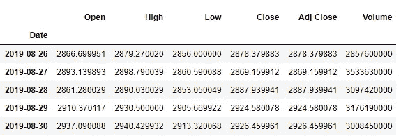
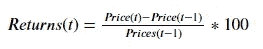
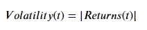
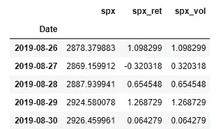

# 时间序列数据的统计建模第 1 部分:数据准备和预处理

> 原文：<https://pub.towardsai.net/statistical-modeling-of-time-series-data-part-1-data-preparation-and-preprocessing-b52f26f6213c?source=collection_archive---------2----------------------->

## [数据可视化](https://towardsai.net/p/category/data-visualization)

克里斯·利维拉尼在 [Unsplash](https://unsplash.com?utm_source=medium&utm_medium=referral) 上的照片

在这一系列文章中，标准普尔 500 市场指数使用流行的统计模型进行分析: **SARIMA** (季节性自回归综合移动平均线)和 **GARCH** (广义自回归条件异方差)。

在这第一部分中，时间序列被废弃、预处理，并用于构建能够表明市场稳定性和盈利性的额外序列。本文中使用的代码来自这个[资源库](https://github.com/yashveersinghsohi/Statistical_Modeling_for_Time_Series_Forecasting)中的 **Preprocessing.ipynb** 笔记本。

# 目录

1.  时间序列数据简介
2.  从雅虎财经下载数据
3.  提取相关系列
4.  处理缺失数据
5.  推导 S&P 回报和波动性
6.  结论
7.  链接到本系列的其他部分
8.  参考

# 时间序列数据简介

如果以规则的时间间隔观察数据点，则称一个序列为**时间序列**。时间序列的一些例子可以是历年的出生率、污染物水平(如二氧化氮、二氧化硫等。)对于每一天，市场指数(例如 S & P 500)的每日收盘价等。

在时间序列分析中，我们使用的模型可以揭示和利用数据与过去版本本身的相关性。以标准普尔 500 价格为例，这些模型试图利用今天的价格与几天前或几周前的价格之间的相关性来预测未来的价格。

# 从雅虎财经下载数据

雅虎财经是用来下载股票价格数据的最受欢迎的网站之一。使用 [pyp](https://pypi.org/project/yfinance/) l 中的 python 库`yfinance`，只需几行代码就可以非常容易地访问和下载任何时间间隔的股票价格数据。

对于这一系列文章，从`1994–01–06`(1994 年 1 月 6 日)到`2019–08–30`(2019 年 8 月 30 日)的标准普尔 500 股票价格通过`yfinance` API 下载。

导入一些有用的库，从 yfinance API 下载数据

在上面的代码单元中，导入了几乎所有数据分析项目中使用的 python 的 2 个标准库:`pandas`和`numpy`。在 python 的绘图库旁边:`matplotlib.pyplot` 和`seaborn`被导入。行`sns.set()`只是在所有后续的情节上应用了一个 seaborn 包装器。除了样式上的一些变化之外，不包含这一行对输出没有任何影响。

接下来，导入`yfinance`库。要下载该文件，请遵循此处的说明[。`yfinance`的`download`函数接受以下参数:`tickers` (Yahoo Finance 中每个时间序列的唯一标识符)、`interval`(连续数据点之间的时间段，在本例中为 1 天或`“1d”`)，以及序列的`start`和`end`日期。然后数据被存储在`pandas` `dataframe`(本例中为`raw_data`)中。](https://pypi.org/project/yfinance/)

`raw_data`的前几行(用`raw_data.head()`显示)和后几行(用`raw_data.tail()`显示)如下:

raw_data 的前 5 行

raw_data 的最后 5 行

# 提取相关系列

在这一系列文章中，分析了标准普尔 500 指数的`Close`价格。在这里，我们提取我们感兴趣的系列:

从 yfinance 提供的集合中提取所需的序列

由于数据是股票市场数据，我们不会观察到周末的任何值。因此，两次连续观测之间的时间间隔是 1 天，即使这两次观测是在星期五然后在星期一记录的。为了将日期转换为工作日格式(一周五天)，我们使用了`pandas`的`asfreq()`方法，并将`“b”`作为参数。

# 处理缺失值

接下来，让我们看看这个数据是否有任何缺失值。这是一个重要的预处理步骤，因为我们填充这些值的方式会对 tend 产生巨大的影响。

检查空值、统计描述和输入系列的空值

cleaning_spx.py 代码块的输出

在上面的代码单元格中，`data.spx.isnull().sum()`获取数据帧(`data`，提取列(`spx`，并对其应用函数`isnull()`。这产生了一个布尔数组，对于遇到的每个`Null`值都有`True`。`sum()`函数获取这些布尔值的总和。由于`True`被表示为`1`，而`False`被表示为`0`，这给出了`spx`系列中缺失值的数量。`describe()`函数给出系列的一些统计测量值。

与观察值(`6459`)相比，空值(`233`)的数量显然非常少。因此，来自`pandas`的一个简单的输入函数对于这种情况就足够了。`fillna()`函数用缺失值之前遇到的值填充缺失值。此行为由传递给`method`参数的`“ffill”`(前端填充)参数控制。点击[此处](https://pandas.pydata.org/pandas-docs/stable/reference/api/pandas.DataFrame.fillna.html)了解关于`method`的其他参数的更多信息。

# 推导 S&P 回报和波动性

现在数据被清理了，它可以用来建立一些其他有用的序列，帮助我们更好地理解市场趋势。分别是:**收益率**和**波动率。**

**回报率:**给定时间内股票价格的百分比变化。在这种情况下，每天的回报被计算并存储在列`spx_ret`中。

**波动率:**市场指数的波动率是指其收益的波动。为了衡量市场的波动或稳定性，有时会选择回报率的大小或回报率的平方。在这个系列中，收益的大小被选为波动性的度量。`spx`的波动性存储在`spx_vol`列中

因此，**回报**是对市场指数的收益(正回报)或损失(负回报)的衡量，而**波动**(回报的幅度)是对指数稳定性的衡量。

市场回报和波动的公式

从标准普尔 500 价格计算回报和波动性。

在上面的代码单元格中，计算了`spx`的收益和波动性。`pct_change()`函数获取系列中当前值和先前值的百分比变化。前一个值应该追溯到多远是由作为该函数的参数给出的数值控制的。因此，`pct_change()`中的`1`参数取当前值和前一步值之间的百分比变化。`mul()`功能仅用于缩放从`0–1`到`0–100`的百分比。一旦计算出回报率，就可以使用检索回报率大小的`abs()`函数来计算波动率。

**注意:**我们正在计算之前一段时间观察到的数据的回报率，以及随后的波动性。这意味着，对于第一次观察，我们将没有任何回报和波动性的值(或`Null/NA`)。对于第一个值(在本例中记录在`1994–01–06`上)，这是显而易见的，我们没有任何以前的值，因此，我们无法计算这里的回报或波动性。

让我们通过使用`head()`和`tail()`函数分别查看数据的前 5 行和后 5 行来最后查看一下我们的数据。

预处理的标准普尔 500 数据的前 5 行

预处理标准普尔 500 数据的最后 5 行

# 结论

在这篇文章中，标准普尔 500 的数据被从 API 中剔除，它被清理并用于推导其他序列，如标准普尔 500 的收益和波动性。在下一部分中，将使用常见的时间序列探索技术对生成的 3 个序列进行可视化。

# 链接到本系列的其他部分

*   时间序列数据的统计建模第 1 部分:预处理
*   [时间序列数据的统计建模第二部分:探索性数据分析](https://medium.com/@yashveersinghsohi/statistical-modeling-of-time-series-data-part-2-exploratory-data-analysis-5c3aaedc04b7)
*   [时间序列数据的统计建模第三部分:利用 SARIMA 预测平稳时间序列](https://medium.com/@yashveersinghsohi/statistical-modeling-of-time-series-data-part-3-forecasting-stationary-time-series-using-sarima-f0ff1284bebb)
*   [时间序列数据的统计建模第四部分:利用 GARCH 预测波动率](https://medium.com/@yashveersinghsohi/statistical-forecasting-of-time-series-data-part-4-forecasting-volatility-using-garch-1e9ff832f7e5)
*   [时间序列数据的统计建模第五部分:时间序列预测的 ARMA+GARCH 模型。](https://medium.com/@yashveersinghsohi/statistical-forecasting-for-time-series-data-part-5-arma-garch-model-for-time-series-forecasting-98beeedcfba8)
*   [时间序列数据的统计建模第六部分:利用 ARMA 预测非平稳时间序列](https://medium.com/@yashveersinghsohi/statistical-forecasting-for-time-series-data-part-6-forecasting-non-stationary-time-series-using-9acc28c39db9)

# 参考

[1][365 数据科学](https://365datascience.com/courses/time-series-analysis-in-python/)时间序列分析课程

[2][machine learning mastery](https://machinelearningmastery.com/time-series-forecasting/)关于时序分析的博客