# 时间序列数据的统计建模第 2 部分:探索性数据分析

> 原文：<https://pub.towardsai.net/statistical-modeling-of-time-series-data-part-2-exploratory-data-analysis-5c3aaedc04b7?source=collection_archive---------1----------------------->

## [数据可视化](https://towardsai.net/p/category/data-visualization)

克里斯·利维拉尼在 [Unsplash](https://unsplash.com?utm_source=medium&utm_medium=referral) 上的照片

在这一系列文章中，标准普尔 500 市场指数使用流行的统计模型进行分析: **SARIMA** (季节性自回归综合移动平均线)和 **GARCH** (广义自回归条件异方差)。

在第一部分中，本系列文章中使用的数据标准普尔 500 价格(可互换地称为`spx`)来自于`yfinance` API。该系列捕捉了从`1994–01–06`到`2020–08–30`的每个工作日。它被清理出来，并被用来导出另外两个用于研究市场的序列:标准普尔 500 回报率(连续观察之间的价格变化百分比)和标准普尔 500 波动率(回报率的大小)。

在第二部分中，对预处理后的时间序列进行可视化和探索，以了解任何趋势、重复模式和/或其他特征，这些特征随后可用于对序列建模和预测未来值(在后续章节中介绍)。本文中使用的代码来自这个[资源库](https://github.com/yashveersinghsohi/Statistical_Modeling_for_Time_Series_Forecasting)中的**可视化和 EDA.ipynb** 笔记本。

# 目录

1.  导入数据
2.  初步线图
3.  将时间序列数据拆分成训练测试集
4.  使用箱线图探索年度趋势
5.  数据分布
6.  数据分解(加法和乘法)
7.  平滑时间序列(移动平均数)
8.  相关图(ACF 和 PACF)
9.  平稳性检查
10.  结论
11.  链接到本系列的其他部分
12.  参考

# 导入数据

在开始探索之前，首先，让我们从最后一部分导入预处理数据。数据是从 python 中的`yfinance` API 中抓取的。它包含了从`1994–01–06`到`2020–08–30`的标准普尔 500 股票价格数据。然后对数据进行清理(填补缺失值)并用于创建两个新系列:回报和波动性。因此，最终数据集有以下 3 列:`spx` (S & P 500 价格)、`spx_ret` (S & P 500 收益)和`spx_vol` (S & P 500 波动率)。参考第 1 部分准备好数据，或者从这个[库](https://github.com/yashveersinghsohi/Statistical_Modeling_for_Time_Series_Forecasting)下载 **data.csv** 文件。

从本系列的第 1 部分导入标准包和预处理数据集的代码

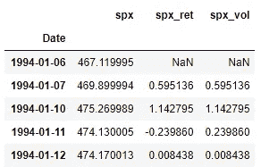

显示数据集前 5 行的前一个代码单元格的输出

首先，我们使用 python 导入几乎所有分析所用的所有标准库。`sns.set()`功能只是给`matplotlib.pyplot`制作的剧情增加一个主题。排除它只会导致一些样式上的改变。

`read_csv()`函数接受文件路径作为参数(本例中为`“data.csv”`)，并将结果存储为一个`pandas` `DataFrame`。由于`Date`列存储为`object`数据类型(或`string`)，因此`pandas`中的`to_datetime()`函数用于将日期转换为`datetime`格式。完成后，我们可以使用`set_index()`函数将该数据帧的日期设置为其索引。这将使索引和切片更加直观。`inplace = True`参数指示`pandas`在同一数据帧上执行该操作，而不是在数据帧的复制版本上。如果没有此参数，更改将不会反映在原始的`data`数据帧中。最后，`data.head()`函数只显示数据帧的前 5 行(如上图所示)。

# 初步线图

简单的折线图是直观显示一段时间内序列趋势的好方法。通常，对于折线图(以及本文中的其他图)，x 轴代表时间，y 轴代表序列。

用于为标准普尔 500 价格、回报和波动性生成折线图的代码

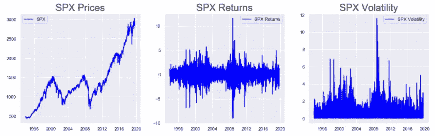

前一个代码单元格的输出显示了标准普尔 500 价格、回报和波动性的所有折线图

`plt.rcParams[“figure.figsize”]`用于设置图形的大小。它需要一个长度和高度如下的元组:(length，height)。`plt.subplots()`用于在一个图形内构建多个地块。图形容器存储在该函数的第一个输出中(本例中为`fig`)，图形的位置存储在第二个输出中(本例中为`ax`)。参数`(1, 3)`指定一行有 3 个支线剧情。3 个支线剧情可以通过索引`ax`变量来访问。因此，`ax[0].plot()`将在第一个子情节中绘制在`plot()`方法中指定的系列，对于`ax[1]`和`ax[2]`也是如此。`set_title()`函数允许我们给一个支线剧情设置一个标题。`legend()`功能使我们能够在图中显示标签。标签中的文本在`plot()`函数中作为`label`参数被提及。最后，`plt.show()`显示没有任何附加 Jupyter 笔记本文本的输出。如果没有这个，在类似 Jupyter 笔记本的环境中，在情节之前可能会有一些可见的文本。

这些图表明，自 1994 年以来，标准普尔 500 价格总体上一直在上涨，在 2004 年和 2008 年出现了两次较大的下跌。回报率相当集中在 0 左右，在 2004 年和 2008 年左右表现出较高的偏差。类似地，波动性也表明市场在这两个时期相当不稳定。一段时期的较高波动性(回报率的大小)表明在此期间存在不稳定的市场。

# 将时间序列数据拆分成训练测试集

在前面部分构建了初步的图表之后，我们最好将数据分成训练集和测试集。这是因为，在大多数现实世界的预测问题中，我们无法获得未来的观测数据。因此，为了模拟现实世界的问题，我们应该只探索我们的数据的一部分，并使用这些发现来建立模型以预测其余的数据。因此，在进行任何探索之前，让我们首先将数据分成**训练**和**测试**组。

训练集将用于构建模型。然后，该模型将用于预测测试数据集中的值，测试数据集中的实际观察结果将用于评估模型的性能。一旦模型达到期望的准确度水平，它就被用于预测看不见的数据(即，训练集和测试集之外的数据)。

**注意:**因为我们使用测试集来评估和微调我们的模型，所以更好、更精确的术语是**交叉验证集。**需要为其生成预测的看不见的数据(在数据中观察到的时间段之后的时间段)将被称为测试集。然而，在这一系列文章中，我们的目标是构建模型，并仅在训练集和交叉验证集上查看它们的适用性。因此，为了简单起见，使用术语训练集和测试集。

现在，我们需要选择如何将现有数据划分为训练集和测试集。在数据科学的其他问题中，如分类或回归，通常我们将数据分成 80-20 份(80%用于训练，20 %用于测试)，这是通过随机打乱数据来完成的。然而，在时间序列分析中，如果我们打乱数据，我们就消除了数据的时间依赖性。因此，首选方法是在某个时间点拆分数据。在这种情况下，我们将数据分成两部分:在`2019–01–01`之前的所有数据都是训练集，在此日期之后的所有数据都是测试集。因此，我们根据截至`2019–01–01`的数据建立模型，并尝试预测自`2019–01–01`以来观察到的数据。

将数据分成训练集和测试集的代码

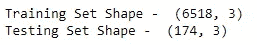

前一个代码单元的输出显示了定型集和测试集的形状

使用`data`数据帧上的`loc`索引操作符访问`2019–01–01`之前的数据。因此，代码`data.loc[:“2018–12–31”]`只提取从起始索引到标记为`“2018–12–31”`的索引的`data`的所有列，而代码`data.loc[“2019–01–01”:]`提取从标记为`“2019–01–01”`的索引到最后一个索引的所有列。`train_df`和`test_df`分别存储训练集和测试集。通过打印这两个数据帧的`shape`,可以看到我们在训练集中有`6518`个观察值，在测试集中有`174`个观察值。

随后，在列车组上完成所有探索:`train_df`

# 使用箱线图探索年度趋势

根据[维基百科](https://en.wikipedia.org/wiki/Box_plot):

> 在描述统计学中，**箱线图**或**箱线图**是一种通过四分位数图形化描述数字数据组的方法。

让我们通过实际观察箱线图来理解这个定义:

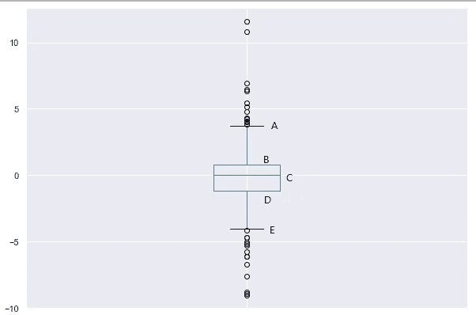

箱形图的示例

一个箱形图由 5 条水平线组成，在上图中标记为 **A** 、 **B** 、 **C** 、 **D、**E。

*   **答:**这条线代表数据集的最大值(排除离群值)
*   B: 这条线代表第 3 个四分位数或第 75 个百分位数。这是数据集上半部分的中位数
*   **C:** 这条线代表数据集的第 2 个四分位数或第 50 个百分位数。换句话说，这是完整数据集的中间值
*   **D:** 这条线代表第 1 个四分位数或第 25 个百分位数。这是数据集下半部分的中位数
*   E: 这条线代表数据集的最小值(不包括离群值)
*   数据的异常值被绘制为最大值和最小值线上方和下方的点(分别为 **A** 和**E**

因此，箱线图简洁地总结了数据的分布及其异常值。让我们在训练数据集中为每年的`spx`、`spx_ret`和`spx_vol`构建箱线图:

为标准普尔 500 价格、回报和波动性创建年度箱线图的代码

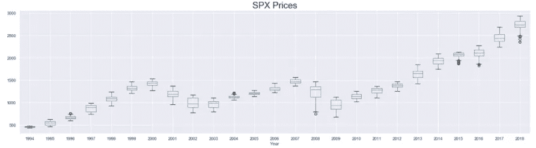

标准普尔 500 价格的年度箱线图

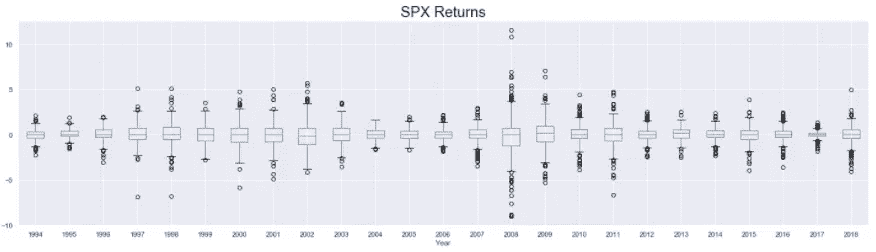

标准普尔 500 收益的年箱线图

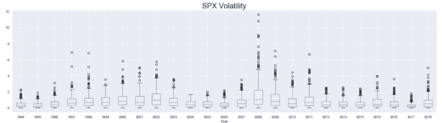

标准普尔 500 波动率的年度箱线图

首先，我们向数据集添加一个新列，存储记录相应观察行的年份。这是使用定义了索引`train_df`的`datetime`对象的`year`属性来完成的。年份列存储在`train_df`中名为`Year`的列中。然后我们设置了 3 个支线剧情，一个在另一个下面，并在其中绘制了`spx` `spx_ret`和`spx_vol`的方块剧情。`pandas`的`boxplot()`功能用于绘制这些图。该函数接受用于在`column`参数中绘制数据的列和用于对在`by`参数中绘制的数据进行分组的列。因此，在这种情况下，我们按年份分割数据(使用`by = “Year”`)，然后为训练数据集中可用的每一年绘制单独的箱线图。

出现较宽的箱线图表明当年观察到的值分布很广。同样，大量异常值的存在也表明，在那一年，数据有较大的波动。基于这些，不难识别市场波动/不稳定程度较高的年份(如 2004 年和 2008 年左右)

# 数据分布

在本节中，我们试图使用**密度曲线**和**直方图来理解标准普尔 500 价格、回报和波动性的分布。**数据的分布将表明比其他值出现更频繁的值的范围，但它将消除时间因素。因此，当我们在数据集中遇到某个值时，仅仅通过查看分布图，我们将无法判断。

生成标准普尔 500 价格、回报和波动性的密度曲线的代码

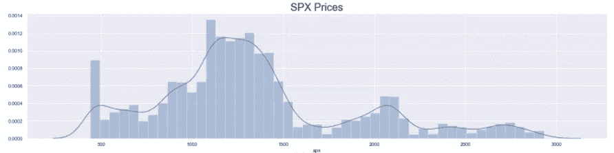

标准普尔 500 价格的密度图

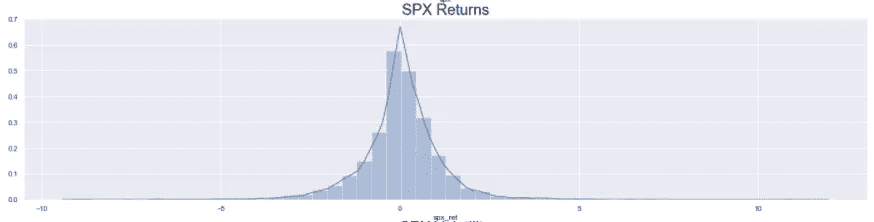

标准普尔 500 回报的密度图

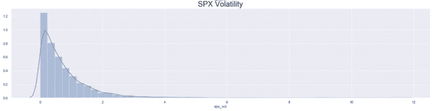

标准普尔 500 波动率的密度图

和之前所有的剧情一样，首先，我们设置人物的大小，定义支线剧情。然后，我们使用`seaborn`的`distplot()`函数在传递到函数中的系列直方图的顶部绘制一条密度曲线。然后我们为每个支线剧情设置标题(使用`set_title()`)并显示它们(使用`plt.show()`)。

标准普尔 500 价格的分布看起来有些正常，后缘有一些大的峰值。然而，标准普尔 500 回报的分布看起来完全正常，几乎与`0`平均。最后，由于波动率永远不会是负的，而只是回报率的大小，标准普尔波动率的分布是严重右偏(长右尾)正态分布。

# 数据分解(加法和乘法)

数据分解是将时间序列分解成 3 个分量的过程:**趋势**、**季节性、**和**噪声**。这样做可以让我们深入了解数据中的重复模式，这些模式可以在模型构建过程中使用。在 python 中，`statsmodels`库用于完成这种分解。该库支持两种类型的分解:**加法**和**乘法。**

在加法分解中，序列被表示为趋势、季节性和噪声的**和**，在乘法分解中，序列被表示为这三个分量的**乘积**。

从数学上讲，这两种类型的分解可以表示为:

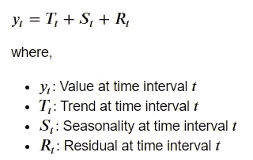

加法分解

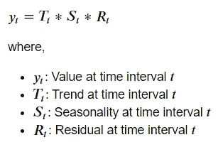

乘法分解

现在让我们来看看如何在 python 中实现这一点。具体来说，下一节将用于对标准普尔 500 价格进行加法分解。

使用加法分解来分解标准普尔 500 价格的代码

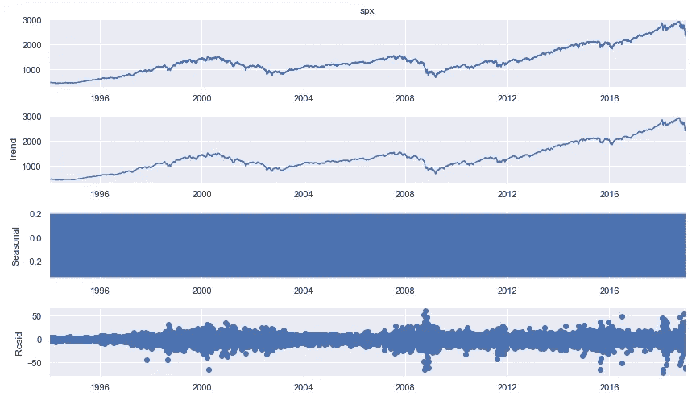

显示标准普尔 500 价格相加分解的前一个代码单元的输出。

首先，我们从`statsmodels.tsa.seasonal`包中导入`seasonal_decompose()`方法。这个函数要求我们将时间序列作为参数传入。然后，我们需要将`model`属性设置为`“additive”`，以将系列分解为相加的组件。该函数的输出存储在`result`变量中，该变量使用`plot()`函数简单绘制。这将绘制 4 个图形:首先是系列本身。第二是趋势。接下来是季节成分，最后一个图是噪音。

在上面的图中，季节性因素看起来很奇怪。所以让我们进一步研究一下。让我们只绘制序列的前 20 个值，而不是绘制完整的季节分量。

根据标准普尔 500 价格的季节性成分绘制前 20 个值的代码。

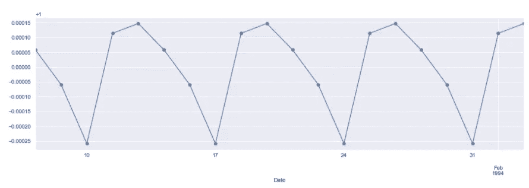

显示标准普尔 500 价格季节性成分的前一个代码单元格的输出

`marker = “o”`参数用于绘制数值，并为更加清晰起见分别标记每个观察值。通过使用`result.seasonal`,我们可以访问分解数据的季节性成分。使用`result.trend`(用于趋势)和`result.resid`(用于噪声或残差)可以类似地访问其他组件。

该图清楚地显示了每 5 个周期的重复循环。这是相当符合逻辑的，因为我们的数据是股票价格数据。我们在每周的每个工作日观察和收集股票价格数据。这意味着数据是每周季节性的，一周是商业周(每周 5 天)。然而，仔细观察，这些值可以忽略不计(从 y 轴的刻度可以看出)。因此，在我们的模型中使用 5 个周期的季节性可能不会产生很好的结果。

为了保持这篇文章简短，分解其他 2 个系列:`spx_ret`和`spx_vol`在这里没有显示。乘法分解也没有显示，但是可以使用上面注释中的代码绘制。

# 平滑时间序列(移动平均数)

平滑是一种用于减少时间序列中不规则波动或尖峰的技术。这样做是为了抑制噪声对系列的影响。平滑时间序列的常用方法是使用**移动平均线。**在这种方法中，给定周期数的平均值(也称为**窗口**)是为系列中的每个时间步长计算的。对于时间步长，大小为 n 的窗口可以用两种方式定义:

*   当前时间步长可能在窗口的末尾。即 n-1 个过去的滞后和 1 个当前的时间步长组成大小为 n 的窗口
*   当前时间步长可以在窗口的中心。即大约一半的 n-1 个滞后是过去的滞后，剩余的是未来的滞后，并且当前时间步长在中心。

**注意:**在这个例子中，我们使用选择窗口的第一种方法。因此，如果窗口大小为 3，那么对于前 2 个值，我们没有足够的滞后来计算移动平均值。因此，对于大小为 n 的窗口，序列的前 n-1 个滞后将导致空值。

为标准普尔 500 价格、回报和波动性生成移动平均图的代码

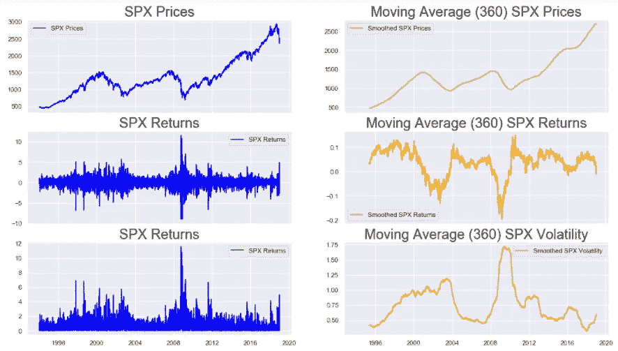

显示标准普尔 500 价格、回报和波动率的移动平均(窗口= 360 个周期)图的前一个代码单元格的输出

像往常一样，我们从设定人物的大小和定义支线剧情开始。然而这一次，我们将参数`sharex`设置为`True`，这允许支线剧情有一个共同的 x 轴。在第一行，我们绘制了标准普尔 500 的实际价格和平滑版本。通过使用`window=360`参数设置的窗口大小为 360°的`spx`系列使用`rolling()`方法进行平滑。在调用`rolling(window = 360)`函数上的`mean()`函数时，我们得到期望的移动平均线。在接下来的 2 行中使用类似的函数来获得`spx_ret`和`spx_vol`系列的图。

在检查结果时，我们可以清楚地看到 3 个系列的趋势。价格和回报都显示出在 2004 年和 2008 年间的大幅下降。在这两个时间段内，波动性增加。所有这些都表明，在上述时间段内，市场不稳定。除了两次下跌，标准普尔 500 价格有明显的上升趋势。除了 2004 年和 2008 年左右，回报率和波动性基本保持不变。

通过改变`rolling()`函数中的`window`参数，我们也可以为其他窗口大小构建这样的图。

# 相关图(ACF 和 PACF)

用于预测时间序列的模型利用序列本身的过去值来预测未来。因此，对于分析师来说，了解该系列对过去版本(或滞后版本)的依赖程度是很重要的。通过计算两个序列之间的**相关性**可以判断两个序列之间的相关性。然而，在这种情况下，2 系列本质上是相同的。一个是另一个的滞后版本。因此，在这种情况下计算的相关性被称为**自相关。**

有两种类型的相关图常用于理解时间序列与其自身的相关性。这些是 **ACF** (自相关函数)和 **PACF** (部分自相关函数)图。

我们已经讨论了什么是自相关。现在让我们理解部分自相关。根据本书[介绍 R 的时间序列](https://amzn.to/2XYS8DD)，

> 滞后 k 处的部分自相关是在去除了由较短滞后处的项引起的任何相关的影响之后得到的相关。

让我们通过一个例子来理解这一点。假设我们在某个星期三观察到标准普尔 500 价格的某个值。这个值取决于几天前(比如星期二和星期一)观察到的值。因此，周三的价格与周二和周一的价格之间的相关性是通过自相关来衡量的。然而，我们知道，就像周三一样，即使是周二的价格也取决于周一的价格。因此，当我们估计周三和周一价格之间的自相关时，我们估计了两种类型的相关性:一种是直接的(周三和周一之间)，另一种是间接的(周三和周二之间，以及周二和周一之间)。利用部分自相关，我们去除这种间接影响，只估计直接相关性。

为标准普尔 500 价格、回报和波动性创建 ACF 和 PACF 图的代码

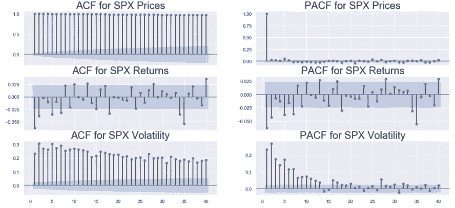

显示标准普尔 500 价格、回报和波动性的 ACF 和 PACF 图的前一个代码单元格的输出

首先，我们导入包含函数`plot_acf()`和`plot_pacf()`的包`statsmodels.graphics.tsaplots`，用于绘制特定时间序列的 ACF 和 PACF 图。像本文中的其他情节一样，我们定义了人物大小和支线剧情(共享 x 轴)。然后，在该图的第一和第二列中，我们分别绘制了 3 个系列(`spx`、`spx_ret`和`spx_vol`)的 ACF 和 PACF。`plot_acf()`和`plot_pacf()`都将时间序列作为它们的自变量。此外，`plot_acf()`(或`plot_pacf()`)函数接受`lags`参数，该参数指示该函数应计算 ACF(或 PACF)到多少滞后。在这种情况下，`lags=40`表示该函数应计算 ACF(或 PACF ),直到历史中有 40 个滞后。`plot_acf()`(或`plot_pacf()`)中的`zero`参数是一个布尔型参数，指示是否应该用其自身的非滞后版本计算系列的 ACF(或 PACF)。从数学上讲，这将始终是 1，因为任何系列都与自身完全相关。因此绘制它并不提供任何额外的信息。

**注意:**作为输入传递给`plot_acf()`和`plot_pacf()`功能的序列中不应出现空值。

图中 x 轴附近的蓝色条带表示显著性水平。高于该范围的滞后被认为是显著的。这些图说明了数据如何依赖于自身的滞后版本。在为这些系列构建模型时，这些信息至关重要。

# 平稳性检查

根据 Rob J Hyndman 和 George Athanasopoulos 的《预测:原则和实践》一书，

> 平稳时间序列的性质不依赖于序列被观察的时间。因此，具有趋势或季节性的时间序列不是静止的，趋势和季节性会影响时间序列在不同时间的值。另一方面，白噪声序列是稳定的——当你观察它时，这并不重要，它在任何时间点看起来都应该差不多。

这里的**属性**指的是**均值、**等统计属性。在建立统计模型来预测给定的时间序列时，确保作为输入给出的序列是平稳的是很重要的。这是因为，只有在平稳序列中，我们才能确定数据的基本分布在将来不会改变。然而，如果我们使用一个非平稳序列，我们永远无法确定基本分布。因此，模型将假设数据的分布在预测期内保持不变，由于在非平稳序列中，这一点没有保证，因此这种情况下的预测很可能很差。

有许多方法可以测试给定序列的平稳性。在本文中，我们来看以下 3 点:

*   **目测:**我们对序列进行绘图，检查序列是否有明显的趋势或季节周期。
*   **绘制汇总统计:**我们绘制不同时间段数据的汇总统计(均值和方差)。
*   **统计检验:**以上 2 种方法得出的结论都是定性的，而不是定量的。因此，为了获得更可靠的定量估计，使用了一种称为**ADF**(Augmented-Dickey Fuller)测试的强大统计测试。

**目视检查:**为此，我们使用本文开始时制作的初步图表。

用于构建标准普尔 500 价格、回报和波动性的简单线图的代码

上述代码单元格的输出显示了标准普尔 500 价格、回报和波动性的折线图

本文的预备线图一节给出了代码的解释。从产量来看，很明显标准普尔 500 价格是非平稳的。这是因为，`spx`系列有一个非常明显的趋势，大部分时间都是向上的(除了 2004 年和 2008 年左右)。另一方面，标准普尔 500 指数的回报率和波动性似乎没有显示出任何强劲的上升或下降趋势。`spx_ret`和`spx_vol`确实包含一些尖锐的尖峰信号，但它们不会以周期性周期出现。让我们用另一种方法来确定它们的平稳性。

**绘制汇总统计数据:**在此方法中，我们将按年划分 3 个系列:`spx`、`spx_ret`和`spx_vol`，并绘制这些数据，以查看汇总统计数据是否会随时间而变化。

用于为标准普尔 500 价格、回报和波动性的年均值和方差生成折线图的代码

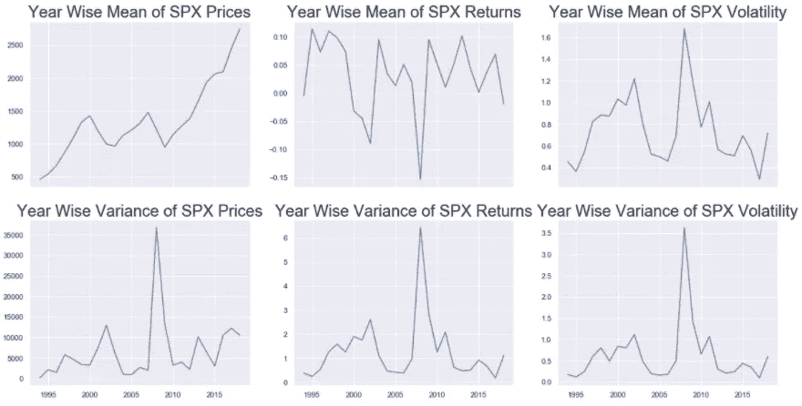

显示标准普尔 500 价格、回报和波动性的年均值和方差的前一个代码单元格的输出

`groupby()`功能用于`train_df`上，根据年份对 3 个系列进行分组。为了从`train_df`的索引中提取年份，我们简单地使用`train_df.index.year`并将其传递给`groupby()`函数中的`by`参数。`mean()`和`var()`功能用于`groupby()`的输出，以获得包含每年 3 个系列的平均值和方差的数据帧。然后，我们绘制 3 个系列的平均值和方差的线图:`spx`、`spx_ret`和`spx_vol`，首先设置图形的大小，然后定义子情节的数量(并且它们使用`sharex = True`共享 x 轴)，然后用适当系列的图填充每个子情节。

像以前一样，标准普尔 500 价格的年均值显示出强劲的趋势。标准普尔 500 回报率和波动性的年均值显示出一些尖峰，但这些尖峰的幅度与序列本身相比非常小。所以这些可以认为是常数。标准普尔 500 价格的年方差不是常数，因此`spx`是非平稳序列。与年均值相似，标准普尔 500 回报率和波动率的年方差显示峰值，但幅度较低，因此这两个序列:`spx_ret`和`spx_vol`看起来确实是平稳的。但是，为了得到更具体(或更定量)的平稳性证明，通常使用统计检验。

**统计检验(ADF):** 这里我们使用流行的**增广的 Dickey Fuller (ADF)** 检验来检查一个序列的平稳性。该测试有以下两个假设:

*   零假设( **H0** ):数列有单位根，或者是**非平稳**。
*   交替假设( **H1** ):数列没有单位根，或者是**平稳**。

单位根的概念在[这篇来自 Analytics Vidhya](https://www.analyticsvidhya.com/blog/2018/09/non-stationary-time-series-python/) 的博客文章中有很好的解释。ADF 测试输出测试统计数据以及统计数据的 p 值。如果统计的 p 值小于置信水平:1% (0.01)，5% (0.05)或 10% (0.10)，那么我们可以拒绝零假设，并呼吁序列平稳。

让我们使用 ADF 测试来检查 3 系列的平稳性。

对标准普尔 500 价格、回报和波动性运行 ADF 测试的代码单元

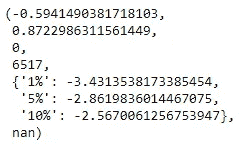

显示标准普尔 500 价格的 ADF 测试结果的前一个代码单元的输出

首先我们从`statsmodels.tsa.stattools`包中导入`adfuller()`函数。然后，我们将应该执行 ADF 测试的系列作为输入参数传递给`adfuller()`测试。在上面的单元格中，我们将`train_df[“spx”]`系列作为输入传入。上面的输出显示了对`spx`系列进行 ADF 测试的结果。第一个值是检验统计量，第二个值是 p 值。接下来的两个是使用的滞后次数和使用的观察次数。下一个字典是 3 个置信水平的统计值。如本例所示，统计的 p 值(~0.8 或 80%)大于所有 3 个置信区间。因此，我们不能拒绝零假设。所以`spx`系列是非静止的。

为了对其他 2 个系列执行此测试，请取消注释上面代码单元格中的相应行。注意，作为输入传递给`adfuller()`函数的序列应该没有任何空值。因此，对于`spx_ret`和`spx_vol`，我们在通过系列之前排除第一个观察值。下图分别显示了对标准普尔 500 回报率和波动率进行 ADF 测试的结果。

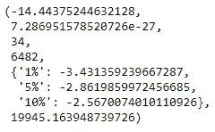

标准普尔 500 返回的 ADF 测试结果

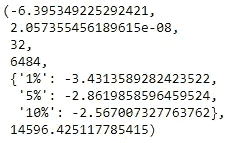

标准普尔 500 波动率的 ADF 测试结果

对于这两个系列，p 值(相应图像中的第二个值)非常接近于零，远小于上述 3 个置信水平。因此，对于这两个系列，我们可以拒绝零假设。因此，根据 ADF 检验，标准普尔 500 收益和标准普尔 500 波动率都是稳定的。

# 结论

对 3 个系列(`spx`、`spx_ret`和`spx_vol`)的详尽研究揭示了数据的一些重要特征。以下几点总结了本文得出的主要见解:

*   **趋势:** `spx`除了围绕`2004`和`2008`的 2 个时间段外，总体呈上升趋势。另一方面，`spx_ret`和`spx_vol`，趋势不变。
*   **季节性:**在分解数据和绘制相关函数时，数据可能具有 5 个周期的季节性。根据一般直觉，股票市场数据是在工作日观察到的，这也是有道理的。(即一周中的 5 天)。换句话说，我们的数据中可能存在每周的季节性。这应该在构建统计模型时进行探索。
*   **平稳性:**`spx`系列不是平稳的。这意味着在将序列用于建模和后续预测之前，需要执行额外的预处理。`spx_ret`和`spx_vol`都是固定的，因此，它们可以直接用于建模。

在本系列的以下部分中，将建立各种统计模型来预测 3 个系列。

# 链接到本系列的其他部分

*   [时间序列数据的统计建模第 1 部分:预处理](https://medium.com/@yashveersinghsohi/statistical-modeling-of-time-series-data-part-1-data-preparation-and-preprocessing-b52f26f6213c)
*   时间序列数据的统计建模第 2 部分:探索性数据分析
*   [时间序列数据的统计建模第三部分:利用 SARIMA 预测平稳时间序列](https://medium.com/@yashveersinghsohi/statistical-modeling-of-time-series-data-part-3-forecasting-stationary-time-series-using-sarima-f0ff1284bebb)
*   [时间序列数据的统计建模第四部分:利用 GARCH 预测波动率](https://medium.com/@yashveersinghsohi/statistical-forecasting-of-time-series-data-part-4-forecasting-volatility-using-garch-1e9ff832f7e5)
*   [时间序列数据的统计建模第五部分:时间序列预测的 ARMA+GARCH 模型。](https://medium.com/@yashveersinghsohi/statistical-forecasting-for-time-series-data-part-5-arma-garch-model-for-time-series-forecasting-98beeedcfba8)
*   [时间序列数据的统计建模第六部分:用 ARMA 预测非平稳时间序列](https://medium.com/@yashveersinghsohi/statistical-forecasting-for-time-series-data-part-6-forecasting-non-stationary-time-series-using-9acc28c39db9)

# 参考

[1][365 数据科学](https://365datascience.com/courses/time-series-analysis-in-python/)时间序列分析课程

[2][machine learning mastery](https://machinelearningmastery.com/time-series-forecasting/)关于时序分析的博客

[3] [维基百科](https://en.wikipedia.org/wiki/Box_plot)关于方框图的文章

[4] [带 R 的介绍性时间序列](https://amzn.to/2XYS8DD)

[5] [Tamara Louie:应用统计建模&机器学习进行时间序列预测](https://www.youtube.com/watch?v=JntA9XaTebs)

罗布·J·海曼和乔治·阿萨纳索普洛斯的《预测:原理与实践》

[7] [用 Python 处理非平稳时间序列的温和介绍](https://www.analyticsvidhya.com/blog/2018/09/non-stationary-time-series-python/)