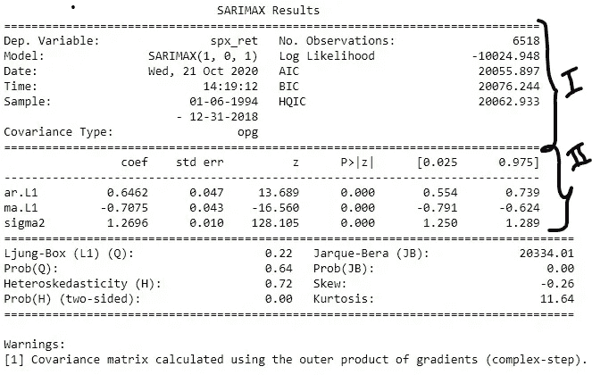
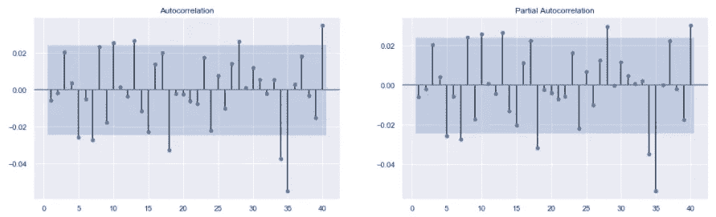
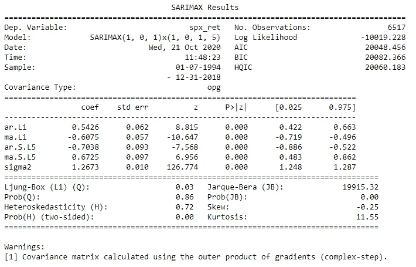
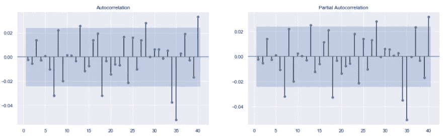
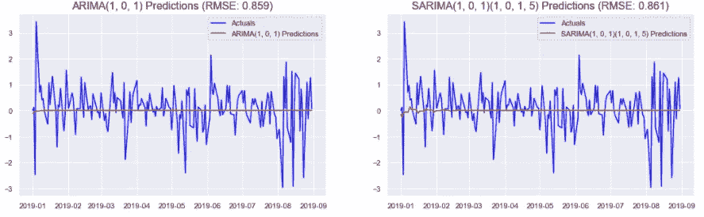
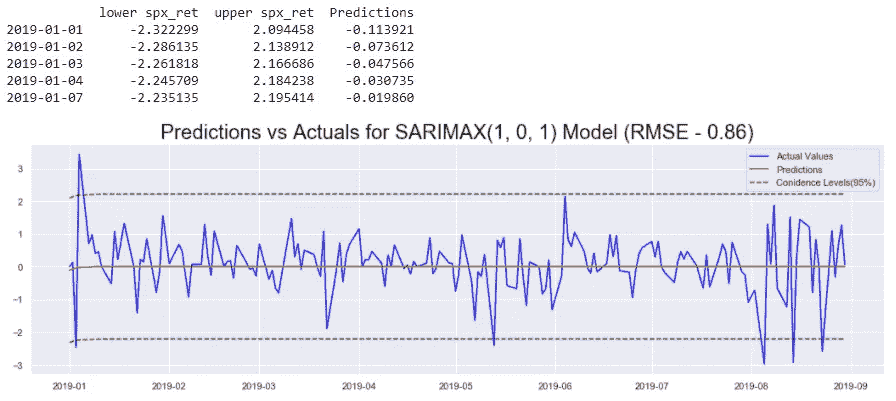

# 时间序列数据的统计建模第 3 部分:用 SARIMA 预测平稳时间序列

> 原文：<https://pub.towardsai.net/statistical-modeling-of-time-series-data-part-3-forecasting-stationary-time-series-using-sarima-f0ff1284bebb?source=collection_archive---------0----------------------->

## [数据可视化](https://towardsai.net/p/category/data-visualization)

照片由[克里斯·利维拉尼](https://unsplash.com/@chrisliverani?utm_source=medium&utm_medium=referral)在 [Unsplash](https://unsplash.com?utm_source=medium&utm_medium=referral) 上拍摄

在这一系列文章中，我们使用流行的统计模型分析了标准普尔 500 市场指数: **SARIMA** (季节性自回归综合移动平均线)和 **GARCH** (广义自回归条件异方差)。

在第一部分中，该系列从 python 中的`yfinance` API 中废弃。它被清理并用于计算标准普尔 500 的回报率(连续价格的百分比变化)和波动性(回报率的大小)。在第二部分中，使用了一些时间序列探索技术来从数据中获得关于趋势、季节性、平稳性等特征的见解。有了这些见解，在本文中，SARIMA 模型类的模型被构建用于预测市场回报。

本文中使用的代码来自这个[存储库](https://github.com/yashveersinghsohi/Statistical_Modeling_for_Time_Series_Forecasting)中的**Returns Models/SARIMA for SPX Returns . ipynb**笔记本

# 目录

1.  导入数据
2.  列车测试分离
3.  关于平稳性的一句话
4.  标准普尔 500 收益的平稳性
5.  非季节性车型(ARIMA)
6.  ARIMA 模型的参数选择
7.  拟合 ARIMA(1，0，1)
8.  季节性款式(SARIMA)
9.  ARIMA 模型的参数选择
10.  拟合 SARIMA(1，0，1)(1，0，1，5)
11.  使用 ARIMA 和萨里玛进行预测
12.  置信区间
13.  结论
14.  链接到本系列的其他部分
15.  参考

# 导入数据

这里，我们导入在本系列的第 1 部分中被废弃和预处理的数据集。参考第 1 部分准备好数据，或者从这个[库](https://github.com/yashveersinghsohi/Statistical_Modeling_for_Time_Series_Forecasting)下载 **data.csv** 文件。

从本系列的第 1 部分导入标准包和预处理数据集的代码

显示数据集前 5 行的前一个代码单元格的输出

因为这与本系列前面部分中使用的代码相同，所以为了简洁起见，这里不再详细解释每一行。

# 列车测试分离

我们现在将数据分为训练集和测试集。这里所有来自于`2019–01–01`的观测值构成了测试集，之前的所有观测值就是训练集。

将数据分成训练集和测试集的代码

显示训练集和测试集形状的前一个代码单元的输出

# 关于平稳的一句话

平稳性，在时间序列分析的背景下，意味着一个序列的统计特性(均值、方差等。)随着时间的推移保持相当稳定。在拟合统计模型时，序列的平稳性是非常理想的。这是因为，如果一个序列是非平稳的，那么它的分布将随时间而变化。因此，用于训练模型的数据分布将不同于需要生成预测的数据分布。因此，预测的质量很可能很差。

为了检查平稳性，我们使用**ADF(Augmented-Dickey Fuller)**测试。它有以下 2 个假设:

*   零假设( **H0** ):数列有单位根，或者是**不平稳**。
*   交替假设( **H1** ):数列没有单位根，或者是**平稳**。

ADF 测试输出测试统计数据以及统计数据的 p 值。如果统计的 p 值小于置信水平:1% (0.01)，5% (0.05)或 10% (0.10)，那么我们可以拒绝零假设，并呼吁序列平稳。

# 标准普尔 500 收益的平稳性

让我们用 python 中的`statsmodels.tsa.stattools`包中的`adfuller()`来检查本文所用序列的平稳性:S & P 500 Returns ( `spx_ret`)。

标准普尔 500 收益的 ADF 检验

显示标准普尔 500 返回的 ADF 测试结果的前一个代码单元的输出

因为 p 值(由`adfuller()`函数返回的元组中的第二个值)远小于任何置信水平，所以我们可以断定该序列是稳定的。因此，我们可以使用这个系列来构建模型，并使用这些模型来预测我们的测试集。

# 非季节性车型:ARIMA

非季节性萨里玛模型:ARIMA 是**自回归综合移动平均模型**的缩写。该模型由 3 个部分组成:

*   **AR(自回归分量):**ARIMA 模型的这一分量用于捕捉当前观测值与过去观测值的相关性。控制该部件的 ARIMA 模型的参数表示为 **p.**
*   **I(综合)**:ARIMA 模型的这一部分用于表示该序列需要与自身滞后版本进行差分的次数。理想情况下，这种差分操作应该一直进行到数列稳定为止。控制该部件的 ARIMA 模型的参数表示为 **d.**
*   **MA(移动平均)**:ARIMA 模型的这个组件用于捕获过去残差对当前观察值的影响。控制该组件的 ARIMA 模型的参数表示为 **q.**

一个 ARIMA 模型通常指定如下: **ARIMA(p，d，q)** 。参数 p、d 和 q 代表上述模型的 AR、I 和 MA 分量。

# **ARIMA 车型的参数选择**

以下规则是为 ARIMA 模型选择初始参数时通常遵循的一般准则。

*   **p (AR 分量)**:数列的 **PACF** 图中的显著滞后数是 AR 分量的一个很好的起始点。
*   **d (I 分量)**:如果序列不是平稳的，需要进行一定次数的微分，以去除趋势和平稳性，那么这个操作进行的次数就成为积分分量的阶数。
*   **q (MA 分量)**:数列的 **ACF** 图中显著滞后的数量是 AR 分量的一个很好的起始点。

让我们从绘制标准普尔 500 收益的 ACF 图和 PACF 图开始建模过程。有了这些图表，我们将估计 ARIMA 模型的最佳参数。

为标准普尔 500 回报绘制 ACF 和 PACF 图的代码。

显示标准普尔 500 回报的 ACF(左)和 PACF(右)图的前一个代码单元的输出

python 中的`statsmodels.graphics.tsaplots`包中的`plot_acf()`和`plot_pacf()`函数用于绘制 ACF 和 PACF 图。这些函数中的`zero = False`参数用于确保不绘制零滞后。这种滞后就是输入序列本身，因此，它将总是完全相关的。因此，包括它不会给出任何新的见解。`lags = 40`参数用于绘制过去 40 个滞后的 ACF 和 PACF 图。

**注意:**`plot_acf()`和`plot_pacf()`功能的输入序列应无任何空值。

输出显示，对于 ACF 和 PACF 图，前两个滞后似乎很明显。显著性水平在前 2 个滞后期后显著下降，从第 5 个滞后期开始上升。因此，ARIMA 参数的合理起点是:

*   p = 1 或 p = 2(来自 PACF 图)
*   d = 0(如 ADF 测试所证明的，该系列已经是稳定的)
*   q = 1 或 q = 2(来自 ACF 图)

因此，我们可以在以下模型中进行选择:ARIMA(1，0，1)、ARIMA(1，0，2)、ARIMA(2，0，1)和 ARIMA(2，0，2)。为了简单起见，ARIMA(1，0，1)是在这个系列中构建的。既然，这里没有积分成分，我们也可以把这个模型叫做 ARMA(1，1)。

# **拟合 ARIMA(1，0，1)**

现在我们将为标准普尔 500 收益拟合一个 ARIMA(1，0，1)模型。拟合模型后，我们将绘制该模型残差的 ACF 和 PACF 图。如果模型是好的，那么残差将类似于随机噪声(或白噪声)。这意味着一个好的模型将产生不可预测的残差，并且没有潜在的模式。就 ACF 和 PACF 图而言，一个好的 ARIMA 模型的残差应该没有明显的滞后。

用于拟合标准普尔 500 收益的 ARIMA(1，0，1)模型，并绘制残差的 ACF 和 PACF 图的代码。

对标准普尔 500 收益拟合 ARIMA(1，0，1)模型后生成的汇总表。

上面使用的 ARIMA(1，0，1)模型残差的 ACF 和 PACF 图。

python 中的`statsmodels.tsa.statespace.sarimax`包中的`SARIMAX()`函数用于构建 ARIMA(1，0，1)模型。训练序列作为第一个参数传递给`SARIMAX()`函数。下一个论点是`order`。这是一个表示模型的`(p, d, q)`顺序的元组。在这种情况下，元组是`(1, 0, 1)`。模型被定义并存储在变量`model`中。对该变量调用`fit()`方法，拟合的模型存储在变量`model_results`中。在`model_results`变量上调用`summary()`方法，用于显示汇总表。接下来，对`model_results`变量调用`resid`方法来获得残差。然后生成`model_results.resid`系列的 ACF 和 PACF 图。

**汇总表:**汇总表中有 3 个不同的部分(如上图所示)。图像中标记了前两个部分。第一部分第二栏**包含一些有用的指标，用于比较不同的 ARIMA 模型。一般来说，具有**更高对数可能性**或**更低 IC (AIC、BIC 或 HQIC)** 的模型是**更好，**反之亦然。**汇总表的第二部分**给出了关于 AR 和 MA 分量的不同系数以及模型中使用的常数的信息。 **coef** 列包含系数的实际值，而 **P > |Z|** 列包含置信水平。该列指示系数是否有效。如果置信度设置为 5%，则该列中的重要系数的值为 **< 0.05** 。因此，在这种情况下，所有系数显然都是重要的。**

**残差:**如果一个模型表现良好，那么该模型产生的残差或误差中一定没有任何潜在的模式。如果是这种情况，那么模型就不能捕捉数据中的所有信息。因此，成功的模型应该产生没有模式的残差，或者在这种情况下产生的残差应该类似于白噪声。这可以通过确保残差的 ACF 和 PACF 图中没有明显的滞后来检查。如上图所示，该模型残差的 ACF 和 PACF 图几乎没有明显的滞后。因此，这个模型很好地捕捉了所有信息。

# 当季款:SARIMA

上面探讨的 ARIMA 模型不能有效地捕捉序列中的季节模式。为此，我们使用 SARIMA 类模型。SARIMA 代表**季节性自回归综合移动平均**模型。一个萨里玛模型指定如下:**萨里玛(P，D，q)(P，D，Q，m)**

**非季节性参数:**

*   **p (AR 成分)**:与 ARIMA 的 AR 成分相同。
*   **d (I 成分)**:与 ARIMA 的 I 成分相同。表示为使序列稳定而执行连续差分运算的次数。
*   **q (MA 成分)**:与 ARIMA 的 MA 成分相同。

**季节性参数:**

*   **m(季节周期)**:这表示系列中的周期数，在此之后，季节模式重复。常见的是该参数也用字母 **s.** 表示
*   **P(季节性 AR 分量)**:该参数捕捉过去滞后对当前观测的影响。与 **p** 不同，过去的滞后与当前的滞后相隔多个 **m** 滞后。例如，如果 **m** =12，并且 **P** =2，则使用来自第 12 个滞后和第 24 个滞后的观测值来估计当前观测值。
*   **D(季节 I 分量)**:这是为了使序列平稳而需要计算季节差异的次数。与 **d** 不同的是，差分是通过连续观察(第一个滞后系列)完成的，这里差分是在系列和第 **m** 个滞后系列之间完成的。
*   **Q(季节性 MA 分量)**:此参数捕捉过去残差对当前观测值的影响。与 **q** 不同，过去的滞后与当前的滞后相隔 **m** 滞后的倍数。例如，如果 **m** =12，并且 **Q** =2，则使用来自第 12 个滞后和第 24 个滞后的残差来估计当前观测值。

# SARIMA 模型的参数估计

使用以下一般准则来估计 SARIMA(p，D，q)(P，D，Q，m)的参数:

*   **p** :绘制系列的 **PACF** 图，并统计显著滞后的数量。
*   **d** :将序列转换为平稳序列所需的连续差分操作的次数。
*   **q** :绘制系列的 **ACF** 图，并统计显著滞后的数量。
*   **m** :观察到某种季节性模式后的滞后次数。
*   **P** :再次绘制 **PACF** 图，观察由**m**的倍数分隔的显著滞后的数量
*   **D** :将数列转换为平稳数列所需的季节差异数。
*   **Q** :再次绘制 **ACF** 图，观察由 **m 的倍数分隔的显著滞后的数量**

我们已经为标准普尔 500 回归系列制作了 ACF 和 PACF 图。为了便于访问，下图显示了相同的图:

标准普尔 500 回归的 ACF 和 PACF 阴谋

**参数估计:**

*   **p = 1，或 p = 2**:PACF 的前两个滞后是显著的。
*   **d = 0** :在 S & P 500 退货系列中没有执行连续差异。
*   **q = 1，或 q = 2**:ACF 的前两个滞后是显著的。
*   **m = 5** :观察是在工作日(每周 5 天)进行的，在本系列第 2 部分所做的系列分解中存在季节性模式。
*   **P = 1**:PACF 地块 5 号滞后显著。
*   **D = 0** :这里没有执行季节差异。
*   **Q = 1，或 Q = 2** :第 5 和第 10 个滞后在 ACF 图中很明显。

使用上述所有参数的排列，我们可以有 8 种不同的模型:

*   萨里玛(1，0，1)(1，0，1，5)
*   萨里玛(1，0，1)(1，0，2，5)
*   萨里玛(1，0，2)(1，0，1，5)
*   萨里玛(1，0，2)(1，0，2，5)
*   萨里玛(2，0，1)(1，0，1，5)
*   萨里玛(2，0，1)(1，0，2，5)
*   萨里玛(2，0，2)(1，0，1，5)
*   萨里玛(2，0，2)(1，0，2，5)

像 ARIMA 一样，让我们使用最简单的一个，即萨里玛(1，0，1)(1，0，1，5)

# 拟合 SARIMA(1，0，1)(1，0，1，5)

与拟合 ARIMA(1，0，1)模型非常相似，我们现在将拟合萨里玛(1，0，1)(1，0，1，5)模型来拟合标准普尔 500 收益。然后使用残差的 ACF 和 PACF 图来评估模型的性能。如果模型能够捕捉数据中的信息，那么残差应该类似于白噪声。换句话说，残差的 ACF 和 PACF 图应该不会导致明显的滞后。

标准普尔 500 收益的 SARIMA(1，0，1)(1，0，1，5)模型的编码

SARIMA(1，0，1)(1，0，1，5)模型的汇总表

萨里玛(1，0，1)(1，0，1，5)残差的 ACF 和 PACF 图

用于拟合萨里玛模型的代码与用于 ARIMA 模型的代码几乎相同。唯一的区别是在`SARIMAX()`函数中增加了`seasonal_order`参数。像 ARIMA 一样，这里也将萨里玛模型拟合到 S & P 500 收益序列，打印出汇总表，并构建残差的 ACF 和 PACF 图。

汇总表显示，所有系数都很重要，基于 ACF 和 PACF 图，残差类似于白噪声。因此，该模型在捕捉系列中的所有信息方面表现良好。

# 使用 ARIMA 和萨里玛进行预测

现在，让我们使用我们在前面几节中训练的模型来预测标准普尔 500 回报率。

为 ARIMA 和萨里玛模型生成预测、计算准确性并绘制预测图的代码

根据实际观测绘制的 ARIMA 和萨里玛模型生成的预测

在拟合的模型上调用`predict()`方法，以生成由函数的`start`和`end`参数指定的时间间隔之间的一系列预测。一旦我们有了预测，来自`sklearn.metrics`的`mean_squared_error()`函数被用来生成预测的 **MSE** (均方差)分数。`sqrt()`，一个来自`numpy`的简单平方根函数，然后被用于生成预测的 **RMSE** (均方根误差)分数。然后根据测试集中的实际观察值绘制预测图，以查看模型的性能。

上图显示，根据 RMSE 评分，ARIMA 模型的标准普尔 500 回报率略高于萨里玛模型。然而，对数似然，AIC 等。表明萨里玛模型优于 ARIMA 模型。RMSE 是根据测试集中的预测计算的。另一方面，AIC 是在训练集上计算的。因此，如果优先级是很好地对训练集建模，那么具有较低 AIC 的模型应该是优选的，并且如果模型应该在测试集上表现良好，那么 RMSE 将具有更大的重要性。在这种情况下，我们需要更好的预测，因此，我们将选择在测试集上表现最好的模型。因此，为标准普尔 500 收益选择的最终模型是 ARIMA(1，0，1)。

# 置信区间

置信区间给出了与预测相关的误差幅度的概念。他们对预测何时稳定以及稳定到什么程度提供了独特的见解。这就是为什么它们在根据预测做出商业决策时很重要。现在让我们从上面为 ARIMA(1，0，1)模型生成置信区间。

代码生成预测，置信区间，并绘制这些对实际观察

显示 forecasts_df 的前几行、预测图以及实际观测值的置信区间的前一个代码单元的输出

首先，我们对拟合的模型使用`get_forecast()`函数:`model_results`，并将输出存储在变量`forecasts`中。该函数接受整数个需要生成预测的期间。在这种情况下，我们指定测试集中的周期数作为参数。接下来，在`forecasts`对象上调用`conf_int()`函数。该函数接受控制置信度的参数`alpha`。`alpha = 0.05`表示我们有`95%`信心观察图像中绿色显示的区间之间的预测。然后，我们像以前一样使用`predict()`方法从模型中生成预测。显示`forecasts_df`的前几行是为了更好地显示数据。最后，根据标准普尔 500 指数收益的实际值绘制预测值和置信区间。

# 结论

在本文中，我们研究了 SARIMA 模型类。我们用这些模型来拟合标准普尔 500 收益序列。然后我们使用这些模型来获得我们预测的置信区间。然而，生成的置信区间是恒定的，并没有对我们的模型预测提供任何重要的见解。

在上图中，很明显，有些区域模型的预测相当准确，而有些区域的预测误差较大。置信区间应该反映预测准确性的这些变化。为此，我们将在本文的 ARIMA 模型之上使用一个 **GARCH** 模型。所以下一篇文章将首先介绍 GARCH 模型，下一篇文章将介绍 ARIMA+GARCH 模型来拟合 S & P 500 收益。

# 链接到本系列的其他部分

*   [时间序列数据的统计建模第 1 部分:预处理](https://medium.com/@yashveersinghsohi/statistical-modeling-of-time-series-data-part-1-data-preparation-and-preprocessing-b52f26f6213c)
*   [时间序列数据的统计建模第二部分:探索性数据分析](https://medium.com/@yashveersinghsohi/statistical-modeling-of-time-series-data-part-2-exploratory-data-analysis-5c3aaedc04b7)
*   时间序列数据的统计建模第 3 部分:用 SARIMA 预测平稳时间序列
*   [时间序列数据的统计建模第四部分:利用 GARCH 预测波动率](https://medium.com/@yashveersinghsohi/statistical-forecasting-of-time-series-data-part-4-forecasting-volatility-using-garch-1e9ff832f7e5)
*   时间序列数据的统计建模第五部分:时间序列预测的 ARMA+GARCH 模型。
*   [时间序列数据的统计建模第六部分:用 ARMA 预测非平稳时间序列](https://medium.com/@yashveersinghsohi/statistical-forecasting-for-time-series-data-part-6-forecasting-non-stationary-time-series-using-9acc28c39db9)

# 参考

[1][365 数据科学](https://365datascience.com/courses/time-series-analysis-in-python/)时间序列分析课程

[2] [机器学习掌握](https://machinelearningmastery.com/time-series-forecasting/)关于时间序列分析的博客

[3] [维基百科](https://en.wikipedia.org/wiki/Autoregressive_integrated_moving_average)关于萨里玛类模特的文章

[4] [Tamara Louie:应用统计建模&机器学习进行时间序列预测](https://www.youtube.com/watch?v=JntA9XaTebs)

Rob J Hyndman 和 George Athanasopoulos 著《预测:原理与实践》

[6] [用 Python 处理非平稳时间序列的简明介绍](https://www.analyticsvidhya.com/blog/2018/09/non-stationary-time-series-python/)来自 Analytics Vidhya