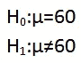
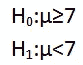
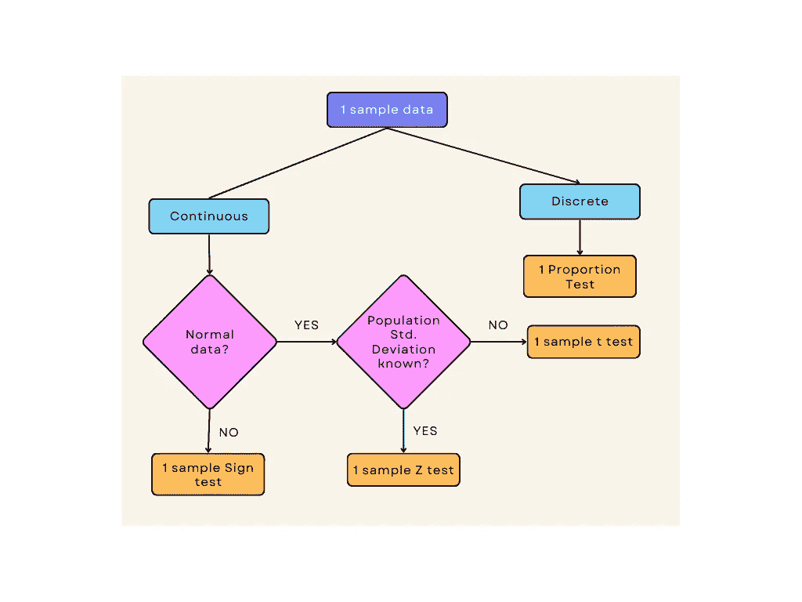
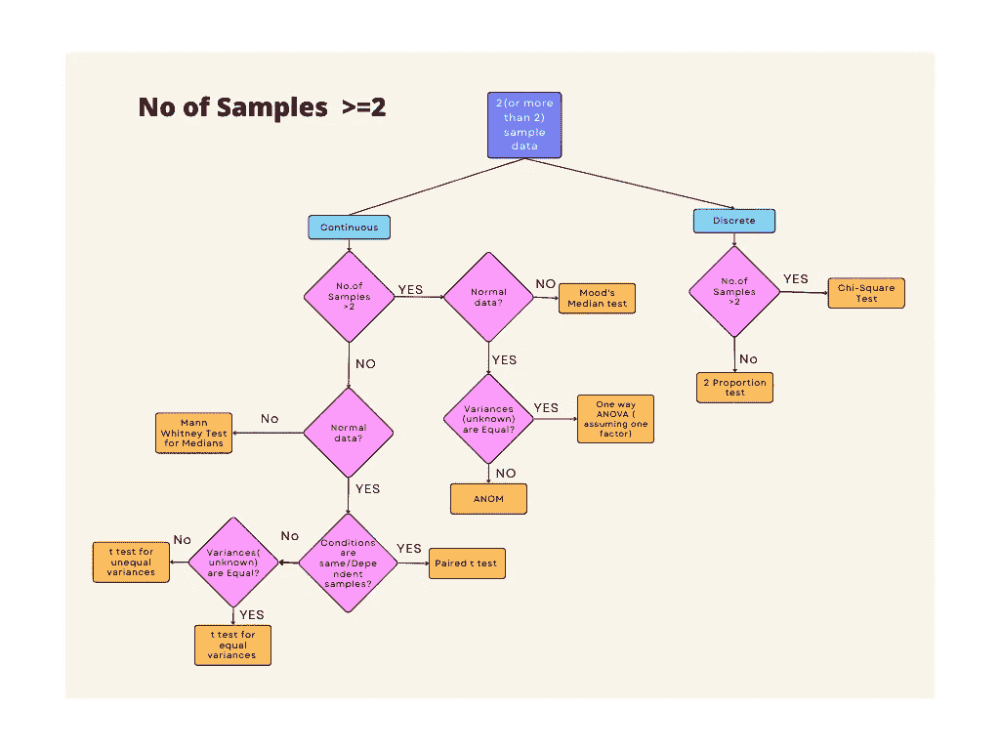

# 统计学 101-第一部分-什么是假设检验，它的类型和过程？

> 原文：<https://pub.towardsai.net/statistics-101-part-1-what-is-hypothesis-testing-dcee95ccc979?source=collection_archive---------1----------------------->

## 假设检验的定义、假设检验的过程、类型和应用

托马斯·T 在 [Unsplash](https://unsplash.com?utm_source=medium&utm_medium=referral) 上的照片

这是统计学 101 系列文章的一部分。在统计学、商业分析和任何其他领域，我们肯定都遇到过假设检验这个术语。本文旨在为进行假设检验提供一个*的分步指南。我们会理解这个术语的含义、关键词、类型和应用。我们还将详细说明重要关键字的含义，如 p 值、显著性值等。*

**内容**

*   定义和重要性
*   假设检验过程
*   应用程序
*   参考

## 让我们开始吧！！！

想象一个场景，一家电动汽车公司的经理声称，最新款的汽车一次充电可以行驶 300 英里。有人将如何测试或验证这一假设？

在这种情况下，假设检验可以帮助我们。

## 定义和重要性

如果我们查阅任何一本词典来寻找一个假设的含义，它都会指向“假设”这个词。例如，[韦氏词典](https://www.merriam-webster.com/dictionary/hypothesis)将一个假设定义为:

“为了得出并测试其逻辑或[经验](https://www.merriam-webster.com/dictionary/empirical)结果而做出的一种尝试性假设”

> 因此，假设检验是陈述一些假设，检验它，并对该假设的总体基础做出一些推断的过程。

对于本文开头所述的电动汽车示例，我们可以在样本上测试假设并评估结果，以推断此类汽车的平均行驶里程，即每次充电是否等于 300 英里。在缺乏假设检验的情况下，对[群体](https://en.wikipedia.org/wiki/Statistical_population)参数做出推断将是一个挑战。

## **假设检验过程**

*步骤 1-决定假设是双尾还是单尾*

*步骤 2——制定零假设和替代假设，并设定显著性水平*

*步骤 3-根据要考虑的分布，计算 p 值*

*步骤 4-将 p 值与显著性水平进行比较，并选择一个无效或替代假设进行推断*

让我们详细介绍一下每个步骤。

**第一步-** *决定假设是双尾还是单尾*

检查以下陈述:

陈述 1-亚洲国家的预期寿命是 60 岁。

这里，这是一个双尾检验的例子，其中假设的总体参数是相等的(=)还是不相等的(！=)设置为某个值。

陈述 2-亚洲国家的预期寿命超过 60 岁。

陈述 3-用户在 YouTube 上观看的视频的平均长度不到 7 分钟。

上述场景是单尾假设检验的情况，其中假设的总体参数被声明为大于或小于某个值。

**步骤 2-** 制定假设-无效假设和替代假设，并设置显著性水平。

一个零假设(H0)是一个假设为真，直到有统计证据“不接受它”。当零假设不被接受时，替代假设(H1)被接受。

对于陈述 1，假设陈述将是:

作者图片

对于语句 3，它将是:

作者图片

如果我们说显著性水平为 0.05，这意味着样本统计值(比如平均值——已经为样本计算出)和假设平均值(陈述 1 为 60)之间的差异有 5%的几率出现。

***步骤 3-*** *根据要考虑的分布，计算 p 值*

可以参考下面的流程来选择用于样本数据的分布。

1 个样本测试的流程(图片由作者提供)

两个或更多样本的流量(图片由作者提供)

*p 值*(概率值)，零假设为真的概率。它也被称为犯第一类错误[的计算概率](https://en.wikipedia.org/wiki/Type_I_and_type_II_errors)。

***步骤 4-*** *比较 p 值与显著性水平，选择零假设或替代假设进行推断*

假设 p 值小于或等于显著性水平；因此，零假设为真的概率并不显著。所以，我们拒绝零假设。如果 p 值大于显著性水平，我们拒绝替代假设。

理解这一点的一个很好的参考是 Minitab 博客。

## **应用**

假设检验适用于我们做出或提出任何假设并对其进行检验的场景。无论是制造、临床试验、营销策略，还是任何其他领域，将假设检验应用到这些应用程序中，只需要业务经理发挥想象力。

## **参考文献**

 [## 假设的定义

### 为了争论而做出的假设或让步；对实际情况或条件的解释…

www.merriam-webster.com](https://www.merriam-webster.com/dictionary/hypothesis)  [## 统计人口-维基百科

### 在统计学中，总体是对某个问题或实验感兴趣的一组相似的项目或事件。一个…

en.wikipedia.org](https://en.wikipedia.org/wiki/Statistical_population)  [## I 型和 II 型错误-维基百科

### 在统计假设检验中，第一类错误是错误地拒绝一个实际上是真的零假设(也…

en.wikipedia.org](https://en.wikipedia.org/wiki/Type_I_and_type_II_errors)  [## 理解假设检验:统计学中的显著性水平(Alpha)和 P 值

### 假设检验中显著性水平和 P 值意味着什么？统计意义到底是什么？在这个…

blog.minitab.com](https://blog.minitab.com/en/adventures-in-statistics-2/understanding-hypothesis-tests-significance-levels-alpha-and-p-values-in-statistics)