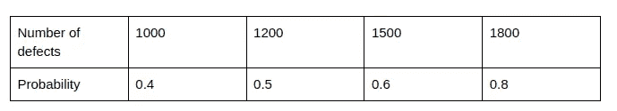
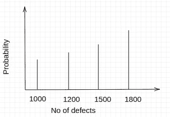
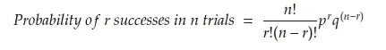
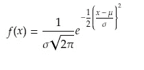
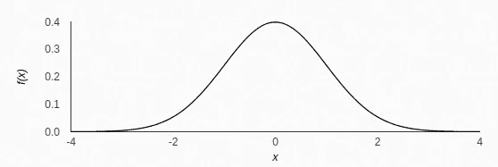
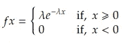
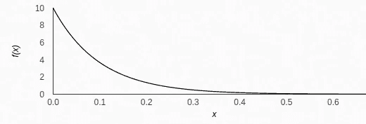

# 统计学 101-第 2 部分-概率分布、类型和应用

> 原文：<https://pub.towardsai.net/statistics-101-part-2-probability-distributions-types-and-applications-cc354ae13700?source=collection_archive---------2----------------------->

## 概率分布的定义，不同类型的分布，它们的解释和应用

纳赛尔·塔米米在 [Unsplash](https://unsplash.com?utm_source=medium&utm_medium=referral) 上的照片

本文是[统计 101-第一部分](/statistics-101-part-1-what-is-hypothesis-testing-dcee95ccc979)文章的延续。在这里，我们将讨论概率分布，它们的类型和应用。概率分布是基于统计分析、机器学习等的商业决策的组成部分。因此，理解与概率分布相关的概念至关重要。

**内容**

*   概率分布定义和重要概念
*   概率分布的类型
*   选择正确的发行版
*   应用程序

**概率分布定义和重要概念**

概率分布与频率分布有关。当实际进行一个实验，观察所有结果的频率时，叫做频率分布。然而，当我们列出一个实验可能发生的所有可能结果的概率时，我们称之为概率分布。

假设我们记录了一些缺陷及其发生概率，如下表所示:

作者图片

上述示例的概率分布如下所示:

作者图片

另一个需要知道的重要概念是随机变量。*随机变量*是基于随机实验被赋予不同值的变量。它随着事件的发生而变化，没有可以预测的模式。

**概率分布的类型**

我们可以把概率分布大致分为两类——离散概率分布和连续概率分布。

**离散概率分布**

如果我们考虑概率分布中的离散变量，那么它将是一个离散的概率分布，所取的值只是几个可能的值。例如，骰子中某个数字的结果概率是一个离散概率，因为结果只能有六个可能值。定义离散概率分布的函数称为*概率质量函数(PMF)* 。

二项式分布是离散随机变量的离散概率分布的一个例子。其定义如下所示:

作者图片

其中 p =成功概率，q = 1-p =失败概率，r =所需成功次数，n=试验次数。使用二项式分布的条件如下:

*   每个试验应该只有两种结果(例如是或否，通过或失败)
*   随着时间的推移，审判结果的概率保持不变。例如，在一次公平的硬币投掷中，正面的概率将是常数，即 0.5
*   这些试验相互独立，即一项试验的结果不依赖于另一项试验的结果。

另一个众所周知的离散概率分布是泊松分布。这种分布按照下面的等式定义:

作者图片

其中λ=每个间隔的平均发生次数

如果我们想知道 x 发生的概率，在泊松分布的情况下，应满足以下条件:

*   在一个时间间隔内恰好出现一次的概率是一个非常小的数字，并且是恒定的
*   在一个时间间隔内出现两次或更多次的概率可以被指定为零值
*   每个间隔发生的次数与时间无关
*   每个时间间隔的发生次数与其他时间间隔的发生次数无关。

离散概率分布的另一个例子是离散均匀分布。

**连续概率分布**

在连续概率分布下考虑的变量可以取值范围内的任何值。例如，一个地区人口身高的概率分布将是一个连续的概率分布，因为一个人的身高可以取任何值。

定义连续概率分布的函数称为*概率密度函数(PDF)* 。众所周知的连续概率分布是高斯分布，也称为正态分布。

作者图片

正态分布的表示(图片由作者提供)

正态分布应具有以下特征:

*   该分布应该是单峰的，即它必须只有一个单峰
*   曲线的平均值应该居中
*   平均值应等于众数和中位数
*   分布的两个尾部应该无限延伸，永远不要接触水平轴

指数分布根据以下等式定义:

作者图片

其中λ被称为速率参数

指数分布的例子(图片由作者提供)

在本系列的[第一篇](/statistics-101-part-1-what-is-hypothesis-testing-dcee95ccc979)中，我们已经看到了 t-分布的案例，也称为*学生分布。*该分布用于样本量小于 30，总体标准差未知的情况。像正态分布一样，这种分布也是对称的，但比正态分布稍微平坦一些。每个可能的样本大小都有不同的 t 分布，这取决于自由度。随着样本量的增加，它变得接近正态分布。

其他连续概率分布的例子有对数正态分布、连续均匀分布、卡方分布等。

**选择合适的发行版**

为应用选择正确的发行版至关重要。我们必须能够分类所使用的分布是离散的还是连续的，以及随后是否满足特定分布的条件。例如，为了能够使用二项式分布，必须满足“概率分布的类型-离散概率分布”一节中列出的条件。同样，如果我们想使用正态分布，必须满足这种分布的条件。

**应用**

概率分布广泛用于各种应用中。我们必须理解用例以及应用特定分布的主要条件，并得出感兴趣事件的概率。

如果业务经理试图从 n 个组件的池中估计 x 个缺陷的概率，这可能是二项式分布的一个用例。

如果诊所的经理想要计算一天中到达的病人数量，泊松分布可以用于这种情况。

一个国家的收入分布可以表示为正态分布，只要满足必要的条件。

我们可以在想要测试两个参数的独立性的情况下使用卡方分布，例如婚姻状况和教育水平，或者性别和工资。

因此，有许多例子表明概率分布可以应用于特定的用途。

关注我( [kumarkaushal.bit](https://medium.com/@kumarkaushal.bit) )了解更多数据科学与统计相关的有趣话题。