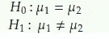
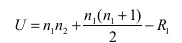
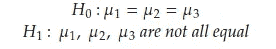
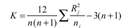
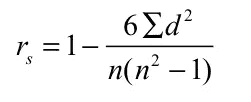

# 统计学 101-第 3 部分-非参数统计，它们的类型和应用

> 原文：<https://pub.towardsai.net/statistics-101-part-3-non-parametric-statistics-their-types-and-applications-e315b24f3179?source=collection_archive---------1----------------------->

## 介绍非参数统计、不同类型的非参数检验及其应用

克里斯·利维拉尼在 [Unsplash](https://unsplash.com?utm_source=medium&utm_medium=referral) 上的照片

这是系列统计 101 的第三部分，其中将详细解释非参数统计的概念。在现实世界中，我们可能并不总是得到一个定义明确的数据分布，如[正态分布](/statistics-101-part-2-probability-distributions-types-and-applications-cc354ae13700)。在这种情况下，我们必须部署非参数统计。

在《统计学 101》系列的第一部分中，提到了对非正态分布样本数据的假设检验将涉及一组不同的分布，如 Mood 的中位数检验——非参数检验的一个例子。

**内容**

*   定义
*   非参数检验的类型
*   应用程序
*   机器学习中的非参数模型

**定义**

当我们谈论[正态](/statistics-101-part-2-probability-distributions-types-and-applications-cc354ae13700)分布时，我们对从中抽取样本的总体做一些假设。与这些假设相反，非参数统计不会对总体分布的形状做出这样的假设。因此，这些也称为无分布统计。除了不做任何分布形状假设的优点之外，这些统计不需要像参数方法那样多的计算工作。

这些方法也有自己的缺点。它们捕获的信息不如参数方法捕获的多。如果我们将 190.2、202.45、345.56 这样的值列表表示为 1、2 和 3，那么我们可能会遗漏一些信息。

**非参数测试的类型**

1.  *符号测试*
2.  *秩和检验*
3.  *一个样品运行测试*
4.  *等级关联*
5.  *科尔莫戈罗夫-斯米尔诺夫试验*

让我们详细介绍这些测试:

1.  **标志测试**

它与一对观察值的方向有关，是正的还是负的，而不是它们的值。例如，如果我们在健身程序之前和之后有一对重量，我们计算程序之前和之后的重量差异为正或负的情况的数量。这里，零假设是权重之间没有差异，另一个假设是权重有差异。请注意计算差异和确定它是正数还是负数的简单性。这里的可以参考[符号测试的实现。](https://en.wikipedia.org/wiki/Sign_test)

**2。秩和检验**

为了进行方差分析，我们假设总体正态分布，方差相等。然而，当这些条件不满足时，我们使用秩和检验。当有两个群体时，使用 Mann-Whitney 检验，当有两个以上群体时，使用 Kruskal-Wallis 检验。在这里，当样本中的每个数据点被分级并计算 U-统计量时，出现术语等级。

以下是曼-惠特尼检验的假设:

作者图片

基于两个人口的情景的 U 统计公式如下所示:

作者图片

其中，n1=样本 1 中的数据点数，n2=样本 2 中的数据点数，R1=样本 1 中每个数据点的等级之和。

对于克鲁斯卡尔-沃利斯检验，以下是假设:

作者图片

在这种情况下，使用 K 统计量:

作者图片

其中，n=所有样本中的数据点数之和，j=样本 j，Rj=样本 j 中所有数据点的等级之和。

**3。一个样本运行测试**

大多数时候，我们假设样本是随机选取的。然而，这并不总是正确的。假设一个场景，我们必须从装满许多球的袋子中抽取红色和绿色球的样本。我们想出了下面的例子(绿色-G，红色-R):

RRR GGG RRR GGG RR GG

上述样本可能不是随机生成的。为了测试样本的随机性，我们进行了测试。

这里，零假设是项目(即，球)被随机混合，替代假设是项目没有被随机混合。

一次运行是相同事件的序列。在上面的例子中，RRR 是一个跑步者，GG 也是一个跑步者。

**4。等级相关性**

等级相关性将相关性和等级的思想结合在一起，它可以根据两组等级之间的相似性来度量它们之间的相关性。

如果我们有一个六个国家的列表，以及它们在 GDP(国内生产总值)和 HDI(人类发展指数)方面的排名，排名相关性计算如下:

作者图片

其中 d =每对国家之间的排名差异，n=成对观察的数量(这里是 6)。值 1 表示两个变量之间的完美关联。这里，零假设表示在总体的排序数据中没有相关性，而替代假设表示在排序数据中有相关性。

**5。科尔莫戈罗夫-斯米尔诺夫(K-S)检验**

Kolmogorov-Smirnov 检验用于我们想要检验两个样本之间是否有显著差异或者观察到的频率分布是否与理论分布相同的情况。这意味着这个测试可以用来衡量拟合优度，非常类似于卡方检验。利用累积分布，它决定了人口的具体分布。

除了上述类型，还有许多其他测试，如柯伊伯测试，图基-杜克沃斯测试，对数秩测试，等等。

**应用**

这些测试可以应用于业务经理或其他任何人必须做出决策或测试某些假设的情况。非参数检验广泛应用于以下情况:与参数检验特定数据相关的假设不满足，样本量很小，数据是名义的或有序的，如排序。

**补充说明:机器学习中的非参数模型**

同样，非参数算法也不对输入和输出数据之间的关系做任何假设。非参数算法没有固定数量的参数，而是取决于训练数据的数量。线性回归是参数算法的一个例子，而 K 近邻算法是非参数算法的一个例子。

关注我( [kumarkaushal.bit](https://medium.com/@kumarkaushal.bit) )了解更多数据科学与统计相关的有趣话题。

**参考文献**

 [## 统计学 101-第一部分-什么是假设检验？

### 假设检验的定义、假设检验的过程、类型和应用

pub.towardsai.net](/statistics-101-part-1-what-is-hypothesis-testing-dcee95ccc979)  [## 符号测试-维基百科

### 符号检验是一种统计方法，用于检验成对观察值之间的一致性差异，例如…

en.wikipedia.org](https://en.wikipedia.org/wiki/Sign_test)  [## 曼·惠特尼 U 检验(Wilcoxon 秩和检验)

### 关于假设检验的模块介绍了检验两个独立样本均值相等的技术。安…

sphweb.bumc.bu.edu](https://sphweb.bumc.bu.edu/otlt/mph-modules/bs/bs704_nonparametric/bs704_nonparametric4.html)  [## 一个样本运行测试

### 单样本游程检验用于检验一系列二元事件是否可以被认为是随机分布的或随机分布的

www.xlstat.com](https://www.xlstat.com/en/solutions/features/one-sample-runs-test)  [## 排名相关性-维基百科

### 在统计学中，秩相关是衡量有序关联的几种统计量中的任何一种

en.wikipedia.org](https://en.wikipedia.org/wiki/Rank_correlation)  [## Kolmogorov-Smirnov 测试-维基百科

### 在统计学中，Kolmogorov-Smirnov 检验(K-S 检验或 KS 检验)是连续变量相等的非参数检验

en.wikipedia.org](https://en.wikipedia.org/wiki/Kolmogorov%E2%80%93Smirnov_test)