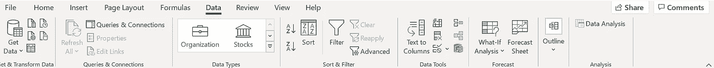
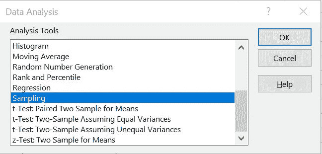
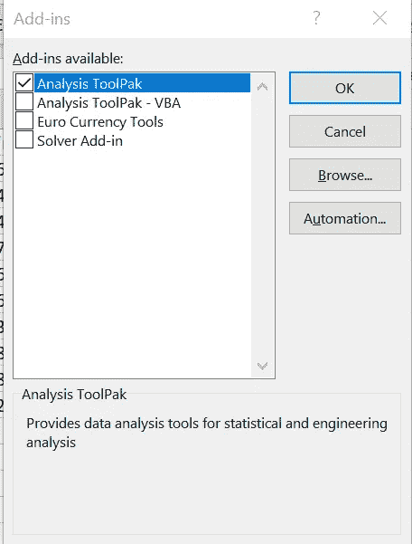

# 什么是采样，为什么它很重要？

> 原文：<https://pub.towardsai.net/statistics-1f9aceec30eb?source=collection_archive---------2----------------------->

## [统计数据](https://towardsai.net/p/category/statistics)

# 介绍

本文将涵盖计量经济学和 OLS 的基本概念，其中包括开始分析前的第一步，即测试 OLS 无偏性的假设。无论你是数据科学家、计量经济学家还是统计学家，知道如何拥有一个正确的普通最小二乘法是你需要承担的首要任务。

# 随意采样

抽样是从总量(总体)中抽取一定比例进行非实验性(非实验室)分析的行为。在统计学中，人口通常用 N 表示，样本用 N 表示。有时我们的人口太多(比如说美国的年轻人),我们不能把他们都作为我们的数据集，所以我们使用抽样方法来获得整个人口的代表。

在本文中，我们将讨论线性回归的抽样。线性回归的核心是 OLS(普通最小二乘法)线，它可以最小化数据集中所有观察值(通过采样获得)的平方之间的方差。为了得到一个无偏见的 OLS，需要满足几个假设。
1。线性关系
2。随机抽样
3。E(u|x)=0 条件误差给定回归量应为 0
4。没有完美的共线性
5。同质性
6。误差应呈正态分布

我们今天会坚持，尤其是第二个假设。我们不能得到其他条件不变的结论，这是不切实际的，也就是说我们的观察不能像苹果对苹果那样有回归、差异和其他因素。因此，为了解决这个问题，我们随机选择样本数据，然后用统计技术进行推断，以便代表所有人群。

想象下一幅图像的取样，它不符合我们的假设，因为很明显，它不是随机取样。


OLS 假设 2 失败

# 在 R 中运行样本

下面是一行 R 代码来自动完成。

```
sample(1:nrow(data), nrow(data)*0.7)
```

sample()函数是一个内置函数，所以你不需要安装其他的包。

每当你需要得到相同的结果时，你需要在代码前添加 set.seed 函数，如下例所示。

```
set.seed(1,sample.kind = "Rejection")
```

不要忘记将代码与 set.seed()和 sample()函数一起运行，否则将会得到不同的结果。

# 用 Python 运行一个示例

很可能，在 Python 中，您可以用 sample()函数做同样的事情。

```
**from** random **import** sampledata **=** [1, 2, 3, 4, 5]print(sample(data,3))
```

# Excel 上的采样

您甚至可以在 excel 上对数据进行采样。为此，您需要使用功能区中数据部分的数据分析工具包。



然后选择采样。



默认情况下，菜单上没有数据分析工具包。要添加它，您需要在搜索栏加载项上键入


然后，您可以选择将数据分析工具包合并到您的菜单中



# 现实生活中的例子

假设你是一所学校的新校长，你很想知道免费餐计划是否影响了学生的平均绩点。幸运的是，你有经济学学位，并且在学生时代上过计量经济学课。现在你要做的是抽取学生样本(你有一个巨大的学校，所以不能全部抽取)。但是你知道不是所有的学生都一样。你还记得计量经济学课和 OLS 无偏性的第二个假设吗？我们走吧，你随机选择 200 名学生，开始你的分析。你检查结果变量和回归变量是否是线性的，你检查是否有异方差，以及误差是否正态分布。好消息是，你所有的假设都是正确的，现在你可以运行回归分析并推断估计值。

*希望你觉得有用。请在评论中分享你对这篇文章的看法和批评。如果你对假设的细节感兴趣，我建议你去看看伍尔德里奇写的《计量经济学导论》。*