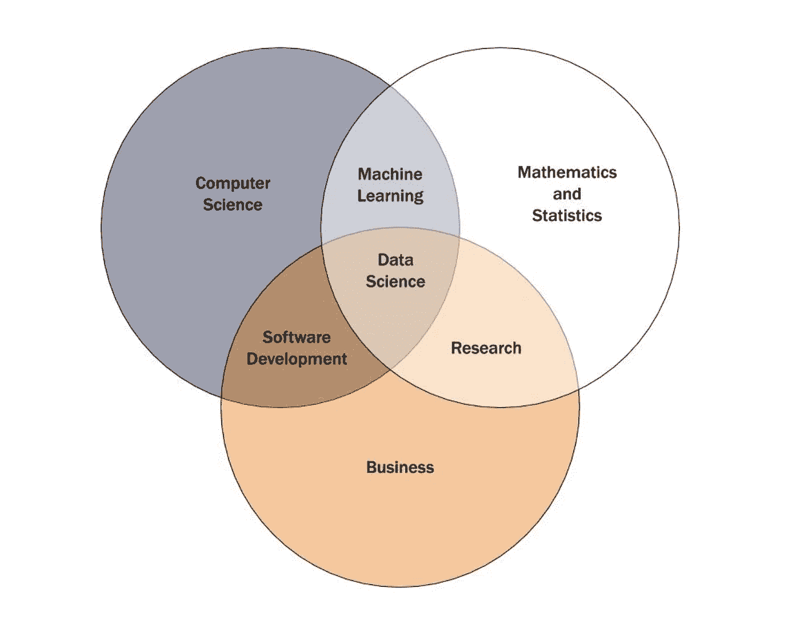
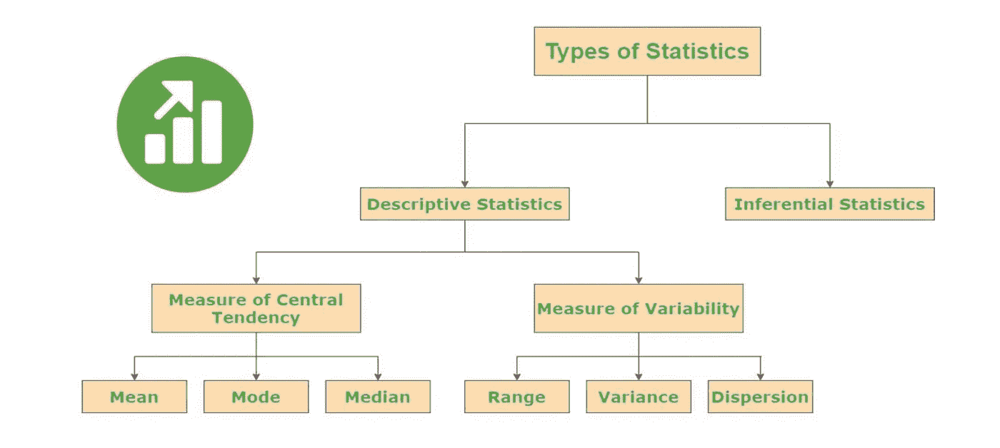
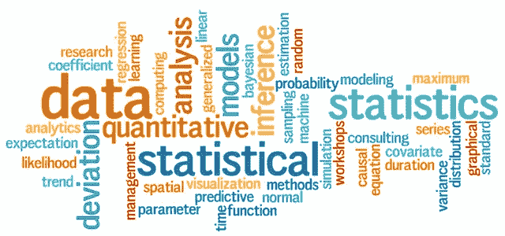
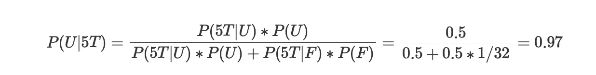
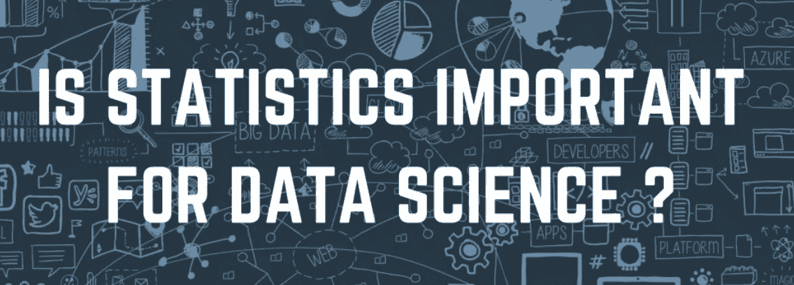

# 数据科学统计学

> 原文：<https://pub.towardsai.net/statistics-for-data-science-79584e7d6d9c?source=collection_archive---------1----------------------->

在这个高度互联的世界中，数据正以前所未有的速度被消耗和产生。尽管我们享受数据的超导性，但它也带来了滥用。数据专业人员必须接受培训，以利用统计方法不仅破译数字，而且揭露这种滥用，使我们免于被误导。很少有数据科学家在[统计](https://datascience.virginia.edu/news/how-much-do-data-scientists-need-know-about-statistics)方面有正式经验。也有一些好的书籍和课程从数据科学的角度展示了这些统计方法。英国数学家卡尔·皮尔逊曾经说过，统计学是科学的语法，对于计算机和信息科学、生物科学和物理科学来说尤其如此。当你开始在数据科学或数据分析领域的[职业生涯时，获取统计知识将鼓励你更好地利用数据洞察力。](https://www.interviewbit.com/data-science-interview-questions/)

我们不能低估统计学在数据科学和数据分析中的重要性。统计学提供了工具和方法来发现结构，并提供更深入的数据见解。数学和统计学都喜欢事实，讨厌猜测。学习这两个重要主题的基础知识将让您在利用数据解决业务问题和执行数据驱动的决策时进行批判性思考并发挥创造力。

在本文中，我们将了解统计在数据科学中的重要性和基础知识。数据科学是一个跨学科、多方面的研究领域。它不仅主宰着数字世界，而且是一些最基本功能的组成部分，如社交媒体订阅、互联网搜索、杂货店备货、政治活动、航线、医院预约等。到处都是。在其他学科中，统计学是数据科学家最重要的学科之一。了解更多数据科学面试问题，为你的面试做好准备。

## 数据科学统计学

在数据科学中，统计学是处理数据及其分析的基础。在进入高级算法之前，必须全面理解特定的核心理论和基础。数据的可视化表示和算法对数据的性能是外行人理解的一个很好的衡量标准。此外，可视化表示有助于识别特定的琐碎模式、异常值和特定的度量汇总，如均值、方差和中值，这有助于解释最中间的值以及异常值如何影响其余数据。与统计相关的数据有多种类型。我们在下面讨论了其中的一些。

*   分类数据描述了人们的属性，包括婚姻状况、性别、他们喜欢的食物等等。它也被认为是“是/否数据”或“定性数据”。它采用数字值，如“1”、“2”，这些数字表示一种或其他类型的属性。这些数字在数学上并不重要，也就是说它们不能相互关联。
*   连续数据处理不可测量和不可计数的数据，基本上是连续形式的值。线性回归的预测是连续的，是一种连续分布，也称为概率密度函数。

有了统计学，你可以通过数据推断和总结对数据有一个全面的理解。谈到这两个术语，统计分为两部分

*   描述统计学
*   推断统计学

1.  描述性统计
    描述性统计或汇总统计用于描述数据。它处理数据的定量汇总，该汇总通过数字或图形表示来执行。要全面理解描述性统计，请学习以下几个关键概念:

*   **正态分布:**在正态分布中，我们在一个图中显示许多数据样本。在正态分布的帮助下，我们以钟形曲线的形式描绘变量的大值，称为高斯曲线。
*   **可变性:**可变性计算分布的中心平均值与数据点之间的距离。可变性有不同的度量，包括标准差、范围、方差和四分位间距。

2.推断统计学

推断统计学是从数据中推断或得出结论的过程。使用推断统计，我们通过对较小的样本执行不同的测试和推断，推断出关于较大总体的结论。例如，在选举调查中，如果你想知道支持一个政党的人数，你只需问每个人的观点。这种方法是不正确的，因为印度有很多人，询问每一个人都是一项繁琐的任务。因此，我们选择一个较小的样本，从该样本中得出结论，并将我们的观察结果归因于较大的总体。推断统计学中有几种适用于数据科学的方法。让我们来看看其中的一些技术:

*   **中心极限定理:**在中心极限定理中，较小样本的平均值类似于较大总体的平均值。因此，得到的标准差等于总体的标准差。中心极限定理的一个关键概念是总体均值的估计。通过将平均值的标准误差乘以置信度百分比的 z 分数，我们可以测量边际误差。
*   **假设检验:**假设检验是假设的方法。运用假设检验，我们将一个较小样本的结果归因于一个较大的群体。有两个假设我们应该互相检验:交替假设和无效假设。零假设显示了理想的情况，而另一个假设通常是相反的，我们试图用它来证明它是错误的。
*   **定性数据分析:**定性数据分析包括两种基本技术，即回归和相关。在回归中，我们确定变量之间的关系。有简单回归和多变量回归。同样，如果函数是非线性的，那么我们有一个非线性回归。相关性是发现双变量数据和随机变量之间关系的方法。

## 数据科学家的统计主题

数据科学家必须掌握几种统计技术。在开始职业生涯时，彻底理解这些原则至关重要，因为知识上的任何差距都会导致数据泄露或错误的结论。

**了解分析类型**

*   描述性分析告诉我们过去发生了什么，并通过提供背景来帮助利益相关者理解信息，鼓励企业了解其表现如何。
*   诊断分析进一步解释描述性数据，并鼓励您了解过去发生的事情的原因。
*   预测分析预测未来最有可能发生的事情，并根据数据为企业提供可操作的见解。说明性分析提供了关于行动的建议，这些行动将利用预测并为解决方案建议必要的行动。

数据科学家每天都要做出许多决策。它们从小到大各不相同，比如调整模型的方法，大到团队的 R&D 策略。这些决策中的许多需要统计学和概率论的坚实基础。

## **集中趋势**

*   **均值**:数据集的平均值。
*   **Median** :有序数据集的中间值。
*   **模式**:数据集中最常出现的值。如果数据有许多最频繁出现的值，我们有一个多模态分布。
*   **偏斜度**:对称性的度量。
*   **峰度**:相对于正态分布，数据是轻尾还是重尾的一种度量

## 概率分布

我们将概率定义为某件事情可能发生的几率，定义为简单的“是”或“否”的百分比。例如，当天气预报显示有 30%的可能性下雨时，这也意味着有 70%的可能性不会下雨。确定分布计算了研究中所有可能值出现的概率。例如，计算未来两天 30%的降雨可能性会发生变化的概率就是概率分布的一个例子。

## 降维

数据科学家通过特征提取(从原始特征的函数中开发新特征)和特征选择(选择相关特征的子集)来缩减所考虑的随机变量的数量。这简化了数据模型并简化了算法中的数据输入。

## 过采样和欠采样

当数据科学家的样本量太少或太多时，就需要采用抽样技术进行分类。根据两个样本组之间的平衡，数据科学家要么抑制多数类的选择，要么构建少数类的副本以支持平等分布。

## 贝叶斯统计

频率统计利用当前数据来计算未来事件的概率。然而，贝叶斯统计将这一概念向前推进了一步，它考虑了我们预期在未来将是真实的因素。例如，考虑预测在接下来的一年中，每周六是否会有至少 100 名用户访问您的咖啡店。频率统计将通过解释上周六的访问数据来证明概率。但贝叶斯统计将通过考虑附近的艺术展来显示概率，该艺术展将于夏季开始，每周六下午举行。这使得贝叶斯统计模型提供了一个更加准确的数字。

## 回归

*   线性回归
*   线性回归的假设
*   线性关系
*   多元正态性
*   没有或很少多重共线性
*   没有或几乎没有自相关
*   同方差性

**线性回归**是一种建立自变量和因变量之间关系的线性方法。因变量是在科学实验中计算的变量。在科学实验中，自变量被用来评估对因变量的影响。

**另一种线性方法**，多元线性回归对两个或多个自变量和因变量之间的关系进行建模。

## 执行线性回归的步骤

**第一步:**了解模型描述、方向性和因果关系。

**步骤 2:** 检查数据、缺失数据、分类数据和异常值

*   离群值是一个与其他观察值有很大不同的数据点。我们可以利用四分位差(IQR)法和标准差法。
*   虚拟变量仅保存值 0 或 1，以显示分类变量的结果。

**第三步:**简单分析——看因变量和自变量比较，自变量和自变量比较的效果

*   利用散点图检查相关性。
*   当两个以上的自变量高度相关时，多重共线性出现。我们可以利用方差膨胀因子(VIF)来检查 VIF > 5 是否高度相关，如果 VIF > 10，那么变量之间肯定存在多重共线性。
*   相互作用项表示从一个值到另一个值的斜率变化。

**第四步**:多元线性回归——分析模型和正确的变量

**第五步:**残差分析

*   监控残差的正态分布和正态性。
*   同方差表示所有独立变量的误差项相似的情况，意味着回归线上的残差相同。

**步骤 6:** 回归输出的解释

*   R-Squared 是一种拟合的统计度量，它显示了自变量对因变量的变化程度。]
*   较高的 R 平方值意味着拟合值和观测数据之间的差异较小。
*   p 值
*   回归方程式

## 统计学术语—数据科学的统计学

参加任何数据科学面试时，都应该了解一些统计术语。在大多数数据科学家面试过程中，最常见的问题来自机器学习、概率统计、编码和算法。我们在下面讨论了这些统计术语:

*   **变量**:可以是一个数，可以是一个特征，也可以是一个可以被计数的量。它也称为数据点。
*   **Population** :它是资源的集合，从那里计算出数据集合。
*   **样本**:基本上，它是用于数据抽样和在推断统计中预测结果的总体的子集。
*   **统计参数**:它只是一个有助于索引一族概率分布的量，如人口的中位数、众数或平均数。这是一个总体参数。
*   **概率分布**:这是一个数学概念，主要提供各种结果发生的概率，通常用于统计学家进行的实验。

## 数据科学面试示例

数据科学**面试准备**对每个人来说都很重要。大多数候选人发现很难通过招聘程序。尽管你已经参加了很多面试，但每次面试都是一次新的学习经历。这可能是一个艰难的局面，因为你必须合理而令人满意地回答这些棘手的问题。

在数据科学面试中，有一些围绕编码、行为问题、机器学习、建模、统计和产品意识的基本问题，候选人必须为此做好准备。先笼统的说一下统计。在数据科学面试中，关于统计概念的问题可能很难处理，因为与产品问题不同，统计问题有明确的正确或错误答案。这意味着你对某些统计学和概率概念的理解将在面试中得到充分的检验。因此，在数据科学面试之前，一定要复习你的统计学知识，做好充分的准备。在数据科学访谈中，至少有三个大的统计学主题是经常被问到的，它们是:

*   中心和扩散的度量(平均值、方差、标准差)
*   推断统计(p 值、置信区间、样本大小、误差范围、假设检验)
*   贝叶斯定理

面试官问的问题一般分为一两类:理论部分和实施部分。那么，你意识到如何提高你的理论和实施知识了吗？从经验上我们可以推荐的是，你必须有几个个人的项目故事。你应该有两到三个故事来深入谈论你过去做过的一个数据科学项目。你应该能够回答这样的问题:

*   你为什么选择这种模式？
*   为了正确使用该模型，您需要验证哪些假设？
*   这种模式的利弊是什么？

如果你能回答这些问题，你就基本上让面试官相信你既了解理论，又在项目中实现了一个模型。因此，您可能需要了解的一些建模技术是:

*   回归
*   随机森林
*   k-最近邻
*   梯度增强等

在下一部分，我们将了解数据科学面试中常见的统计问题。

**10 个常见的统计学面试问题**

## 问题 1:提及正态分布中中位数和均值的关系？

答:在正态分布中，均值等于中位数。

## 问题 2:不包含总体参数的置信区间的比例是多少？

答:α是不包含总体参数的置信区间的概率。
α = 1 — CL
我们通常把α表示成一个比例。例如，如果置信度为 95%，则 alpha 将等于 1–0.95 或 0.05。

## 问题 3:提到计算极差和四分位差的方法？

答:IQR = Q3 — Q1
这里，Q3 是第三个四分位数(75 个百分点)
这里，Q1 是第一个四分位数(25 个百分点)

## 问题 4:置信区间宽度的后果是什么？

答:置信区间用于决策。随着置信水平的上升，置信区间的宽度也上升。随着置信区间宽度的增加，我们似乎也接收到了无用的信息。无用信息—宽 CI 高风险—窄 CI

## 问题 5:使用箱形图有什么好处？

答:箱线图是两个或多个数据集的直观有效的描述，有助于快速比较一组直方图。

## 问题 6:提及一种发现异常值的方法？

回答:找到所有异常值的最有效的方法是使用四分位数间距(IQR)。IQR 包含了大部分的数据，因此一旦知道了 IQR，我们就可以很容易地找到异常值。
广泛使用-位于 1.5 * IQR
下限= Q1-(1.5 * IQR)
上限= Q3 + (1.5 * IQR)之外的任何数据点

## 问题 7:你对自由度的理解是什么？

答:我们将 DF 定义为我们拥有的选项的数量，并且我们将 DF 与 t 分布一起使用，而不是与 Z 分布一起使用
,对于一个系列，DF = n-1(其中 n 是系列中观察的数量)

## 问题 8:什么时候用 t 分布，什么时候用 z 分布？

答:我们必须满足以下条件才能使用 Z 分布我们知道总体标准差吗？样本量> 30 吗？CI = x(巴)— Z*σ/√n 到 x(巴)+ Z*σ/√n
否则我们要用 t 分布 CI = x(巴)— t*s/√n 到 x(巴)+ t*s/√n

## 问题 9:你如何向非技术观众解释置信区间？

答:我们可以在这里应用贝叶斯定理。让 U 代表我们掷不公平硬币的情况，F 代表我们掷公平硬币的情况。由于硬币是随机选择的，我们知道 P(U) = P(F) = 0.5。让 5T 表示我们连续翻转 5 个头的事件。然后，我们对求解 P(U|5T)感兴趣，即，假设我们连续看到 5 条尾巴，我们投掷不公平硬币的概率。我们知道 P(5T|U) = 1，因为根据定义，不公平的硬币总是导致反面。根据公平硬币的定义，我们知道 P(5T|F) = 1/2⁵ = 1/32。根据贝叶斯定理，我们有:

因此，我们选到不公平硬币的概率约为 97%。

## 问题 10:双尾检验的 H0 和 H1 是什么？

答:H0 被认为是零假设。这是正常情况或默认情况。对于一个尾部检验 x<= µ For two-tail test x = µ
, H1 被认为是另一个假设。这是另一种情况。对于单尾测试 x >对于双尾测试 x<

# 统计学对数据科学有多重要？

下面提到的几点说明了统计学对于数据科学的重要性。

## 支持分类和组织

这是一种统计方法，在数据科学和采矿领域以同样的名字使用。分类用于将数据分类成适当的、可观察的分析。这样一个组织对于那些决定利用这些洞察力来进行预测和制定商业计划的公司来说至关重要。此外，这是使大量数据可用的第一步。

## 有助于测量概率分布和估计

这些统计方法是理解机器学习和逻辑回归算法的基础的关键。LOOCV 和交叉验证技术本质上也是统计工具，它们被引入 A/B、基于推理的研究和假设检验的数据分析和机器学习领域。

## 在数据中查找结构

企业经常需要处理来自各种来源的大量数据，一个比一个复杂。统计学可以帮助你发现这些数据中的异常和趋势，这让研究人员可以在非常早期的阶段处理掉不相关的数据，而不是筛选数据，浪费精力、资源和时间。

## 促进统计建模

数据由变量和因素之间一系列复杂的相互作用组成。要把这些框起来或连贯地展示出来，使用网络和图表的统计建模是关键。这也有助于确定和说明层次对全局结构的影响，并将局部模型升级到全局场景。

## 艾滋病数据可视化

数据可视化是以交互、有效和逻辑的格式对发现的结构、见解和模型进行描绘和分析。这些格式易于更新也很重要。这样，每当数据出现波动时，都不必进行大规模的检修。除此之外，数据分析表示还利用与统计数据相同的显示格式—直方图、图表和饼图。这不仅使数据更具可读性，而且使识别趋势或错误以及根据需要抵消或增强它们变得更加简单。

## 在基于模型的数据分析中提高对分布的认识

统计有助于发现数据中的聚类，甚至是依赖于时间、空间和其他可变因素的其他结构。在没有统计分布方法的情况下报告网络和值可能会导致不考虑可变性的测量，这可能会影响或破坏您的结果。

# 结论

每家公司都致力于成为数据驱动型企业。因此，我们注意到对数据科学家和分析师的需求正在上升。现在，为了处理问题，回答问题，制定策略，我们需要理解这些数据。幸运的是，统计提供了一堆工具来产生这些见解。我们了解了数据科学的各种统计要求。我们研究了数据科学如何依赖于统计学，以及描述性和推断性统计学如何形成其核心。简而言之，我们的结论是，数据科学的统计学是掌握它的强制性要求。希望现在你已经清楚了数据科学中与统计学相关的所有理论。是时候检验一下这个概念将如何帮助你在数据科学领域的第一份工作中胜出了。