# 机器学习统计学 A-Z

> 原文：<https://pub.towardsai.net/statistics-for-machine-learning-a-z-66a82fbf2622?source=collection_archive---------0----------------------->

简要说明

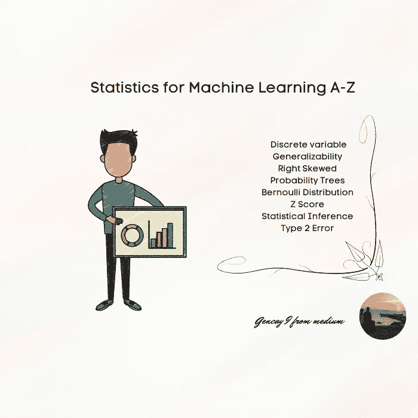

作者图片

```
Contents· [Introduction](#1eb4)
  ∘ [Numerical Variable](#5d5a)
  ∘ [Categorical Variable](#981d)
  ∘ [Continuous Variable](#20c8)
  ∘ [Discrete variable](#3008)
  ∘ [Dependent Variable](#53bf)
  ∘ [Independent Variable](#fa47)
  ∘ [Observational Studies](#c678)
  ∘ [Experimental Studies](#de06)
  ∘ [Simple Random Sample](#ce8a)
  ∘ [Stratified Sample](#55d4)
  ∘ [Placebo Effeect](#7330)
  ∘ [Generalizability](#5b7b)
  ∘ [Histogram](#b4e9)
  ∘ [Dotplot](#d106)
  ∘ [Boxplot](#9eda)
  ∘ [IQR](#aaa6)
  ∘ [Q3](#6b6d)
  ∘ [Q1](#d67b)
  ∘ [Left skewed](#30ab)
  ∘ [Right Skewed](#bf31)
  ∘ [Symmetric](#d888)
  ∘ [Mean](#a61e)
  ∘ [Median](#fee5)
  ∘ [Average](#148c)
  ∘ [Variance](#600a)
  ∘ [Standard deviation](#31a4)
  ∘ [Mode](#c8b8)
  ∘ [Null Hypothesis](#c056)
  ∘ [Alternative Hypothesis](#3745)
  ∘ [P-Value](#31c0)
  ∘ [Law of Large Numbers](#d118)
  ∘ [Mutually Exclusive ( Disjoint)](#4559)
  ∘ [Non-disjoint](#bcf0)
  ∘ [Probability Trees](#633b)
  ∘ [Normal Distribution](#9974)
  ∘ [Binomial Distribution](#3531)
  ∘ [Bernoulli Distribution](#3388)
  ∘ [PDF (Probability Density Function)](#7851)
  ∘ [Z Score](#7efe)
  ∘ [Percentiles](#a7fd)
  ∘ [Sampling Variability](#dc4e)
  ∘ [Central Limit Theorem](#9f24)
  ∘ [Confidence Interval](#ff55)
  ∘ [Significance Level](#dda2)
  ∘ [Power](#d038)
  ∘ [Accuracy](#75c3)
  ∘ [Precision](#f0ff)
  ∘ [Statistical Inference](#0b21)
  ∘ [Type 1 Error](#50c8)
  ∘ [Type 2 Error](#9964)
  ∘ [T Distribution](#a31d)
  ∘ [Degrees of Freedom](#feaf)
  ∘ [Distribution](#74d2)
· [Conclusion](#4708)
```

# 介绍

编程，统计，微积分。

如果你想参与机器学习，这是你应该熟悉的三件事。


作者图片

虽然市场上有太多的课程，但我喜欢写那种文章来提醒自己这些术语。

这有助于我刷新记忆和重复。

> 重复是学习之母，行动之父，这使它成为成就的建筑师。“金克拉

无论你是处于数据科学或机器学习职业生涯的开始，还是经验丰富，那篇文章都将帮助你在头脑中创建一条关于统计的神经路径。

条款

## 数字变量

*包含整数的值。*

## 分类变量

*包含类别而不是数字，如人体形状等；瘦的，胖的，还是肌肉发达的。*

## 连续变量

*1，2，3，4，5，6，7……取给定范围内的若干个值。*

## 离散变量

*1，5，8，11，35。特定的一组值。*

## 因变量

*这两个变量，当一个发生变化时，如果另一个也会发生变化，就会成为因变量。*

## 自变量

*如果别人不会改变，独立。*

## 观察研究

研究人员不会指定这些方法。例如，当他们问你减肥的方法时，他们不会给你提供诸如节食或运动之类的方法，你可以说任何你想说的。

## 实验研究

*现在选择有限，饮食和运动选一个。*

## 简单随机样本

你可以选择任何东西。

## 分层取样

*将群体分成几个群，然后从每个群中随机取样。*

## 安慰剂效应

*你会用假关心。*

## 普遍性

我们能从人口数据中得出结论吗？

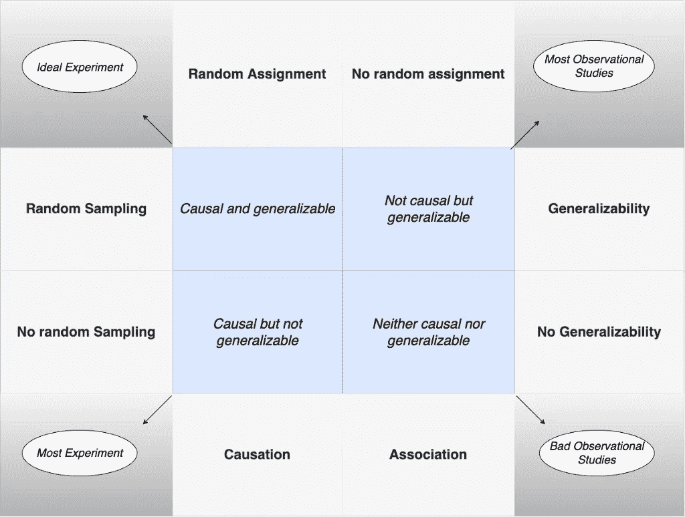

作者图片

## 柱状图

*它提供了一个有用的数据密度视图。*

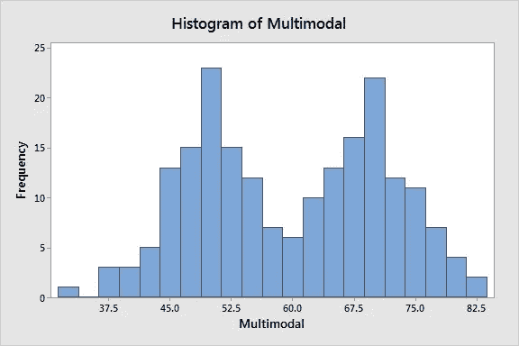

[参考](https://statisticsbyjim.com/basics/histograms/)

## 点图

*如果您的样本量较小，并且您想要查看单个数据点。*

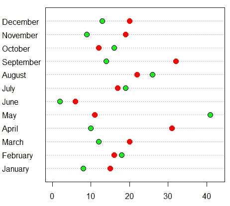

[参考](https://r-coder.com/dot-plot-r/)

## 箱线图

*很高兴看到统计值，如 IQR 和中位数。*

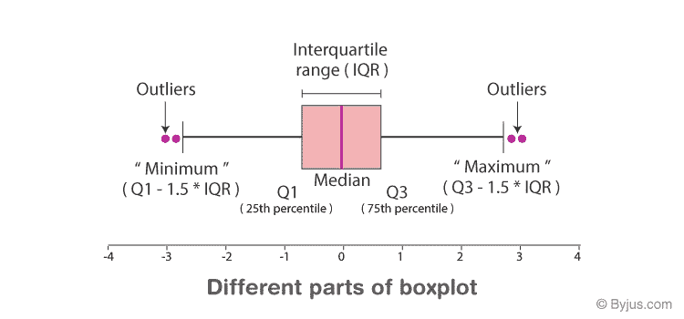

[参考](https://byjus.com/maths/box-plot/)

## IQR

四分位间距，中间 50 %的间距，Q3-Q1。

## Q3

*第 75 百分位。*

## 雌三醇环戊醚

*第 25 百分位。*

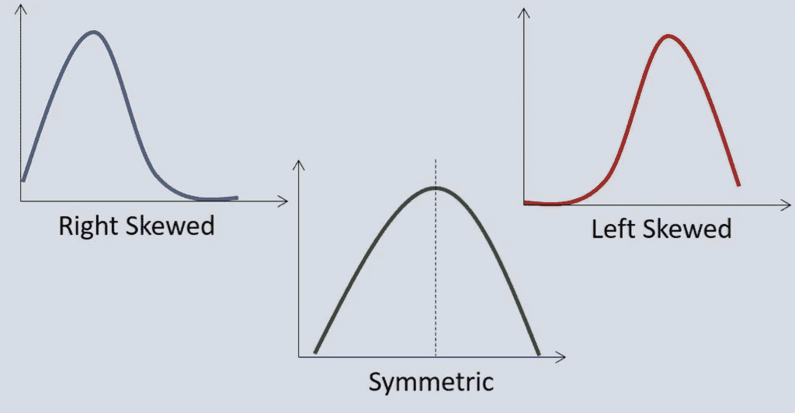

[参考](https://www.sigmamagic.com/blogs/how-to-interpret-skewness-and-kurtosis/)

## 向左倾斜

*尾部将在右侧，密度，意味着<中位数。*

## 向右倾斜

*尾巴会在右边，意思是>中间值。*

## 对称的

*平均值和中位数很接近。*

## **的意思是**

*算术平均。*

## **中值**

*是存在于中间的数。*

*1，5，7，中位数:5*

## **平均值**

S *um 并除以整数个数，*

*a+b/2，a+b+c/3*

## **差异**

*平均平方偏差* ***与*** *的平均值。*

```
n: number of sampleVariance = (Number1-mean)**2 + (number2 -mean) ** 2 …. + (number n-mean) **2 / (n-1)
```

## **标准偏差**

*方差的平方根。*

```
Standard deviation : (Variance) ** 1/2
```

## **模式**

*最常出现的数字。*

*1，4，4，7，模式:4*

## **零假设**

*什么都没发生，一切都应该是一样的。*

## **替代假设**

*有些事情正在发生，有些事情应该改变。*

## **P 值**

你的零假设可能是真的。

*如果 p 值< 0.05，你会拒绝零假设，而接受备选项:*

*如果 p 值>为 0.05，你会拒绝替代假设。*

## **大数定律**

*随着样本量的增加，均值会更接近总体均值。*

## **互斥(不相交)**

*不可能同时发生的情况。*

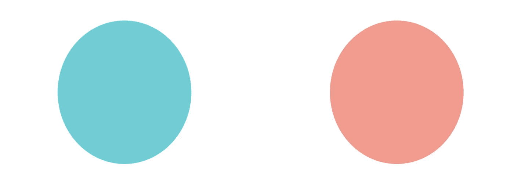

作者图片

## **非不相交**

可能在同一时间发生的案件。

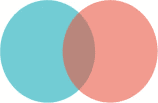

作者图片

## **概率树**

持续可能性之树。

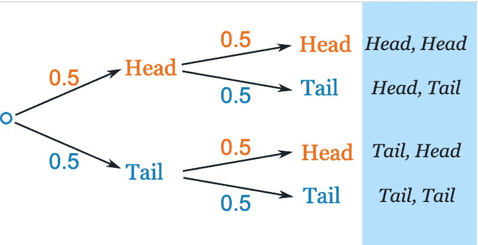

[https://www . maths isfun . com/data/probability-tree-diagrams . html](https://www.mathsisfun.com/data/probability-tree-diagrams.html)

## **正态分布**

这是一种概率分布，其形状围绕平均值对称。

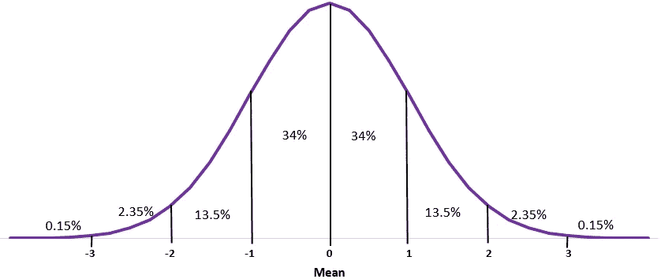

[https://www.statology.org/the-normal-distribution/](https://www.statology.org/the-normal-distribution/)

## **二项分布**

成功或失败的概率(两种可能的结果，如正面或反面。)

## **伯努利分布**

这是一个离散分布，我们仍然有两个可能的结果，0 或 1。

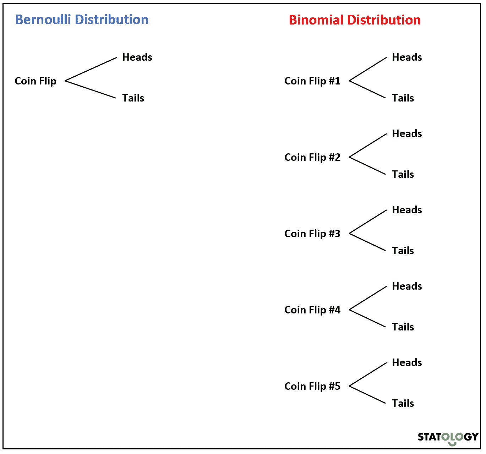

[https://www.statology.org/bernoulli-vs-binomial/](https://www.statology.org/bernoulli-vs-binomial/)

## **PDF(概率密度函数)**

*该函数提供了一个随机变量的值将在预定义范围内的可能性。*

## **Z 得分**

*(观察值-平均值)/标清*

*Z 得分的平均值为零。*

## **百分位数**

有时图像比文字更能描述事物。

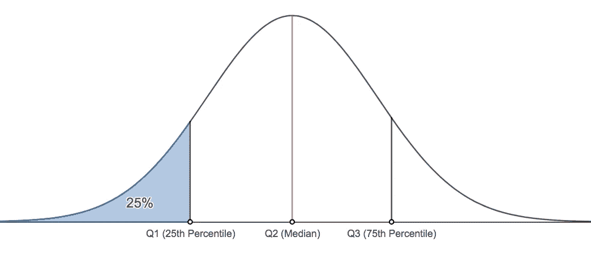

[https://online.stat.psu.edu/stat800/book/export/html/741](https://online.stat.psu.edu/stat800/book/export/html/741)

## **采样可变性**

*不可能从整个群体中收集数据，我们将从不同的样本中收集信息，并通过这种方式对它们进行采样。*

## **中心极限定理**

*描述满足一定条件时采样分布的形状、中心和分布。(接近正常人口)(中间值)(扩散值)*

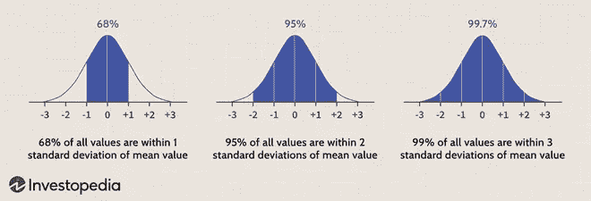

[https://www . investopedia . com/terms/c/central _ limit _ theorem . ASP](https://www.investopedia.com/terms/c/central_limit_theorem.asp)

## **置信区间**

总体参数的合理取值范围称为置信区间。

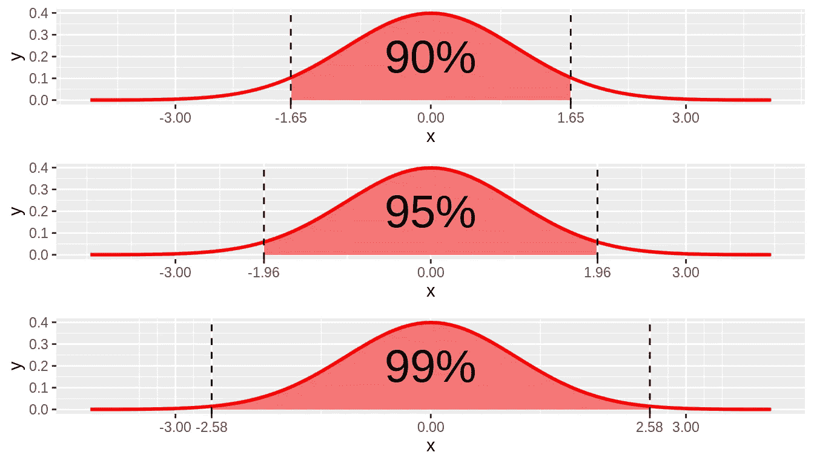

[https://nulib.github.io/moderndive_book/10-CIs.html](https://nulib.github.io/moderndive_book/10-CIs.html)

*%90 对“*估计值的信心 1.65∫SE(估计值)”

*%95 确信"*估计 1.96∫SE(估计)=*(x-1.96σ/√n，x+1.96σ/√n)*

*% 99 自信的“*估计 2.58∫SE(估计值)”

## **显著性水平**

*在不该做的时候拒绝 Ho 的概率。*

## **力量**

*在应该拒绝的时候拒绝零假设的可能性。*

## **精度**

你的估计值与真实值有多接近？

## **精度**

这是一个质量测量，你的两个测量值有多接近。

## **统计推断**

利用统计学从你的数据中找出结论。

## **类型 1 错误**

它发生在拒绝一个无效假设的时候，但它不应该被拒绝。

## **类型 2 错误**

当无效假设应该被拒绝，但你没有拒绝时，就会发生这种情况。

## **T 分配**

*标准差未知时的比较手段。*

## **自由度**

*决定尾巴的厚度。*

*随着自由度的增加，t 分布的形状接近正态分布。*

## 分配

假设你掷骰子，根据结果画出一个分布。

所以你总共得到 7 个数%16.6 的可能性。

然而，总数为 12，只占 2.7%或 1/36。

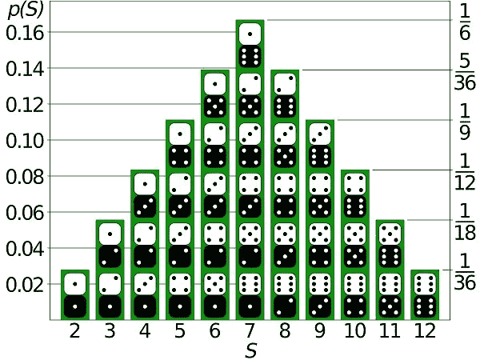

[https://studious guy . com/real-life-examples-normal-distribution/](https://studiousguy.com/real-life-examples-normal-distribution/)

# 结论

有太多的条款存在，我可能会在不久的将来写另一篇文章。

那既取决于那篇文章的统计数据，也取决于我的道路。

***那篇文章的第二部分；***

[](https://medium.com/@geencay/statistics-for-machine-learning-a-z-part-2-fef63089b09d) [## 机器学习统计学 A-Z 第 2 部分

### 简要说明

medium.com](https://medium.com/@geencay/statistics-for-machine-learning-a-z-part-2-fef63089b09d) 

如果你想在那篇文章之后再写一篇文章，不要忘记“竖起大拇指”并跟我来。

[https://giphy.com/clips/ralph-8CYD7zQOYECt2UolVp](https://giphy.com/clips/ralph-8CYD7zQOYECt2UolVp)

再次感谢。

现在，如果你想继续阅读这类文章，并且不想把自己限制在每月 3 篇，你可以点击下面的链接。如果您使用以下链接，我将收取您的一部分会员费，无需您支付额外费用。

[](https://medium.com/@geencay/membership) [## 通过我的推荐链接加入 Medium-gen cay I。

### 阅读 Gencay I 的每一个故事(以及媒体上成千上万的其他作家)。您的会员费直接支持…

medium.com](https://medium.com/@geencay/membership) 

为我订阅类似的文章、免费的 Numpy 备忘单以及更多内容。

查看我的其他 A-Z 机器学习文章。

[](/regression-a-z-briefly-explained-618e5d5c89f8) [## 回归 A-Z 简要说明

### 快速和提醒的备忘单，用于刷新

pub.towardsai.net](/regression-a-z-briefly-explained-618e5d5c89f8) [](/machine-learning-a-z-briefly-explained-4ff86bd81e3a) [## 机器学习 A-Z 简要说明

### 在这篇文章中，我试着向你简单解释一下机器学习 A-Z。

pub.towardsai.net](/machine-learning-a-z-briefly-explained-4ff86bd81e3a) 

> “机器学习是人类需要做出的最后一项发明。”尼克·博斯特罗姆