# 机器学习统计学 A-Z 第 2 部分

> 原文：<https://pub.towardsai.net/statistics-for-machine-learning-a-z-part-2-fef63089b09d?source=collection_archive---------0----------------------->

## 简要说明

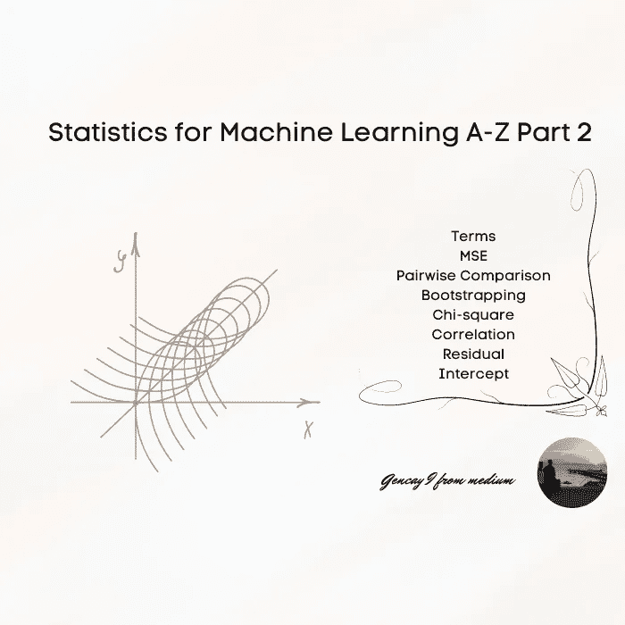

作者图片

**内容**

```
· [Introduction](#7aec)
· [ Terms](#79a6)
  ∘ [Mean Square Error](#8af1)
  ∘ [Pairwise Comparison](#a8b9)
  ∘ [Bootstrapping](#abe3)
  ∘ [Chi-square](#8c07)
  ∘ [Correlation](#9612)
  ∘ [Residual](#0390)
  ∘ [Intercept](#a7bb)
  ∘ [Slope](#dffb)
  ∘ [Extrapolate](#3e69)
  ∘ [Interpolate](#6674)
  ∘ [Linearity](#e585)
  ∘ [Nearly Normal Residuals](#f30e)
  ∘ [Constant Variability](#5f36)
  ∘ [Explanatory Variable](#2fd1)
  ∘ [Responsible Variable](#fcaa)
  ∘ [Collinearity](#0adb)
  ∘ [Parsimony](#82d1)
  ∘ [Backward Elimination](#aee2)
  ∘ [Forward Selection](#877d)
  ∘ [Outliers](#9a5d)
  ∘ [Precision](#cc78)
  ∘ [Recall](#c47d)
  ∘ [F1 score](#5b2a) 
  ∘ [Sum of Squares Total](#921a)
  ∘ [Population](#82a2)
  ∘ [Sample](#cc02)
  ∘ [A/B Testing](#6f8c)
· [Conclusion](#79ca)
```

# 介绍

让我从这篇文章的第一部分开始。

我相信机器学习是编程、统计和微积分这三个术语的交集。


作者图片

由于我的陈述，显而易见，如果你想成为 ***机器学习*** 中的 ***机器*** ，你应该对这些话题有广泛的了解。

如果你是那篇文章的读者之一，我想，你已经选修了其中一两门课程。

然而，有时你会觉得你需要不断重复，让这些信息在你的脑海中永久存在。

> 重复是学习之母，行动之父，这使它成为成就的建筑师。“金克拉

我发现中型文章对此非常有用。

由于那篇文章的第一部分得到了积极的反馈，我现在将试着发表那篇文章的续篇。

即使那篇文章的第一部分已经非常令人满意了，但是在一些应用中，还存在一些可能与 ***机器学习*** 相关的其他术语。

如果你还没有读过我的第一篇文章，这里

[](/statistics-for-machine-learning-a-z-66a82fbf2622) [## 机器学习统计学 A-Z

### 简要说明

pub.towardsai.net](/statistics-for-machine-learning-a-z-66a82fbf2622) 

现在让我们深入研究术语。

[https://giphy.com/gifs/afv-funny-fail-lol-26FPnj46RYsIWgYLe](https://giphy.com/gifs/afv-funny-fail-lol-26FPnj46RYsIWgYLe)

# 条款

## **均方误差**

最常用于线性回归，它是一个评估指标。


**均方差-作者图片**

## **两两比较**

统计方法，成对比较多个平均值，以确定它们之间是否存在显著差异。也被称为科普兰方法。

## **自举**

这是一种统计方法，在数据集较小时非常有用，它对数据集进行重新采样以创建足够的模拟。

## **卡方**

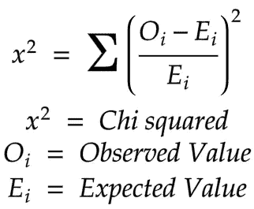

**卡方——作者图片**

## **相关性**

它描述了两个变量相互依赖的程度。

比如你改变一个，另一个会改变多少。

## **剩余**

这意味着你的预测和实际值之间的差异。

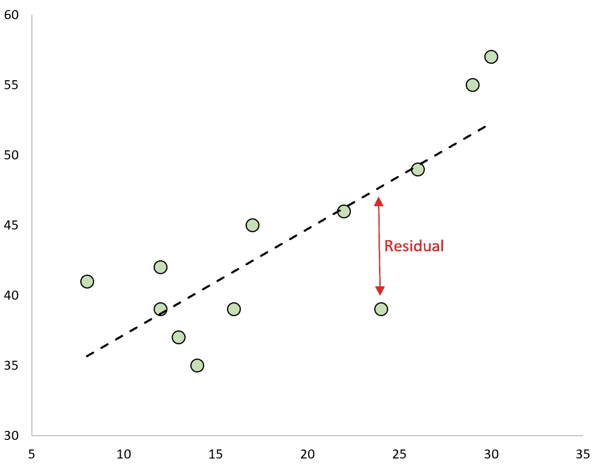

[https://www.statology.org/standardized-residuals-python/](https://www.statology.org/standardized-residuals-python/)

## **拦截**

数学上，当 x=0 时，这就是截距。

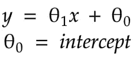

作者图片

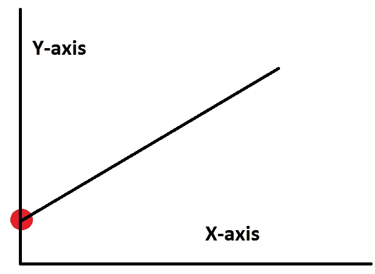

[https://statisticsbyjim . com/regression/interpret-constant-y-intercept-regression/](https://statisticsbyjim.com/regression/interpret-constant-y-intercept-regression/)

## **斜坡**

假设你的函数是；

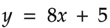

图片作者-斜率。

当...的时候

*   x = 1 你的 y = 13
*   x = 2 你的 y = 21

这意味着当你增加 x 1 时，你的 y 改变 8。

你的 ***斜率*** 是 8 而 ***截距*** 是 5。

下面这个，试着预测一下。

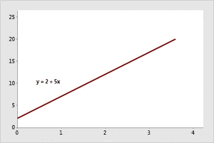

[参考](https://support.minitab.com/en-us/minitab-express/1/help-and-how-to/modeling-statistics/regression/supporting-topics/regression-models/slope-and-intercept-of-the-regression-line/)

## **外推**

如果要预测超出线性模型范围的值。

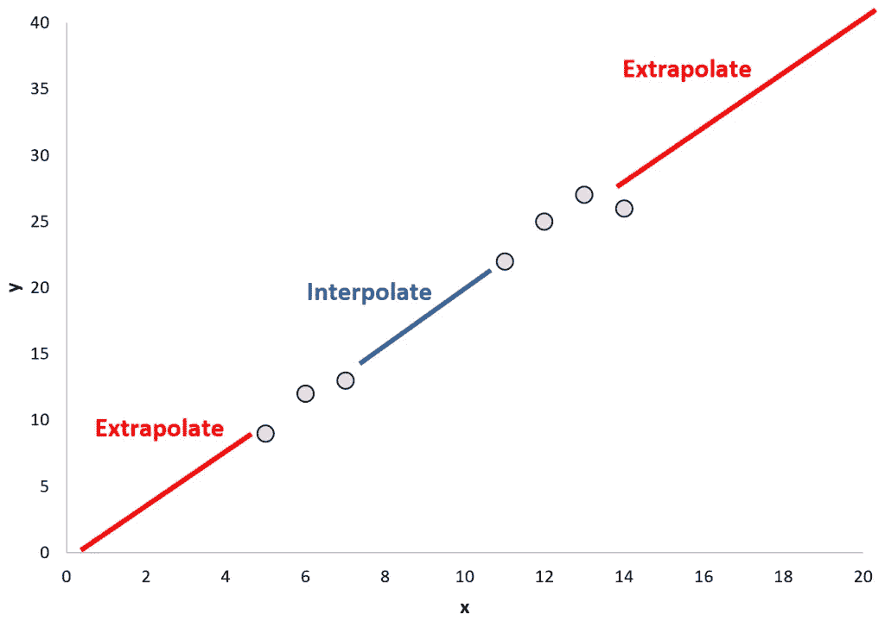

[https://www.statology.org/interpolation-vs-extrapolation/](https://www.statology.org/interpolation-vs-extrapolation/)

## 插入

如果要预测线性模型范围内的值。

## **线性度**

如果你能用直线解释你的数据点。

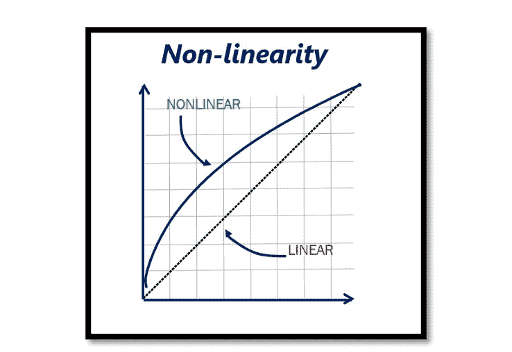

https://rahsoft . com/2021/04/23/非线性及其对射频系统的影响/

## **接近正常残差**

当你的残差服从正态分布时。

## **恒定可变性**

在做了一个预测，并绘制出你的预测与实际数字相差多少之后，数据点的误差应该在范围之内。

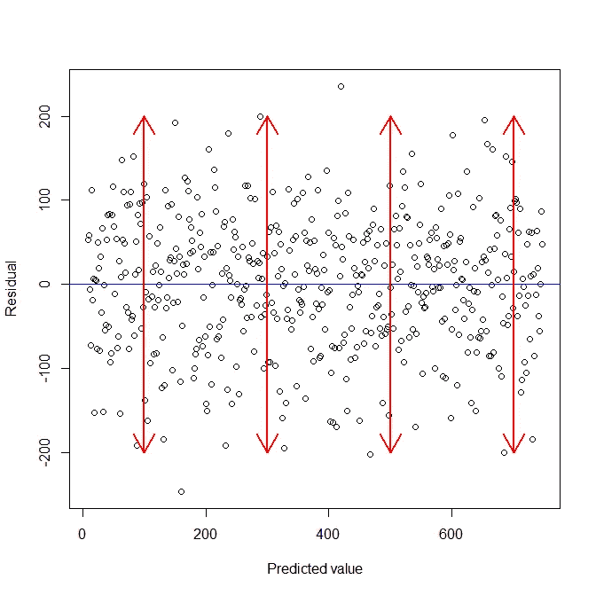

[https://stats . stack exchange . com/questions/52089/what-having-constant-variance-in-a-a-linear-regression-model-mean](https://stats.stackexchange.com/questions/52089/what-does-having-constant-variance-in-a-linear-regression-model-mean)

## 说明变数

为了预测 y，我们将使用 x 的，责任变量= x

## 责任变量

我们想要预测的 y。

## 共线性

解释变量之间的相关性。

## 吝啬

单纯；简单的模型会表现得更好。

## 反向消除

进行预测时，选择所有解释变量，并观察解释变量和响应变量之间的关系。把对解释责任变量影响较低的一个一个掉。

## 预选

从零个变量开始，根据负责变量之间关系添加变量。

## **离群值**

如果你的数据点是< from Q1 -1.5 x IQR &

> Q3 + 1.5 x IQR

那么它可以被定义为异常值。

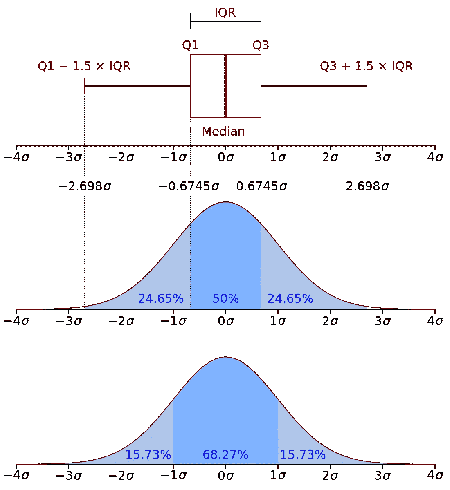

[https://commons.wikimedia.org/wiki/File:Boxplot_vs_PDF.svg](https://commons.wikimedia.org/wiki/File:Boxplot_vs_PDF.svg)

顺便说一下，IQR 的意思是四分位范围，这已经在文章的第一部分解释过了

[](/statistics-for-machine-learning-a-z-66a82fbf2622) [## 机器学习统计学 A-Z

### 简要说明

pub.towardsai.net](/statistics-for-machine-learning-a-z-66a82fbf2622) 

## **精度**

分类算法的评估指标。

简单地计算预测中的阳性率，无论它是否应该是真的阳性。

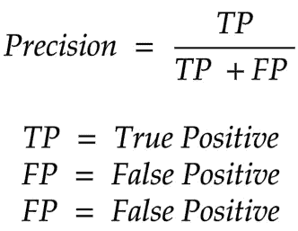

**作者提供的精确图片**

## **回忆**

灵敏度/ **真阳性率。**

这是分类算法的另一个评价标准。

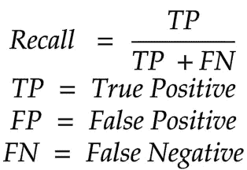

**回忆-作者图片**

## **F1 得分**

精确度和召回率的算术平均值。

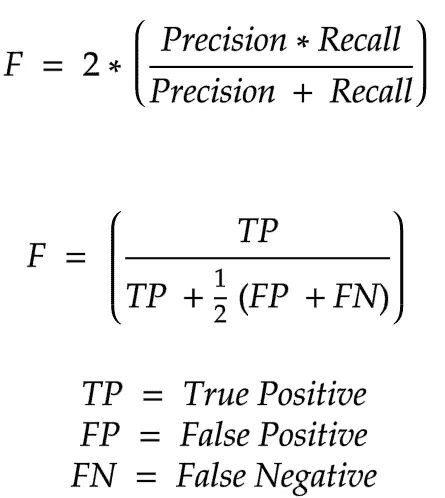

**F1 得分-作者图片**

## **平方和总计**

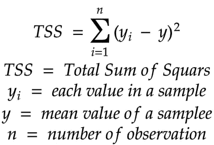

**平方和总计-作者图片**

## 人口

在你将要做统计分析的题目中，聚集的个体。

## 样品

其中一个人。

## **A/B 测试**

如果你申请了一份机器学习的工作，你肯定会看到这一点。

A/B 测试是指对不同机器学习模型的评估。

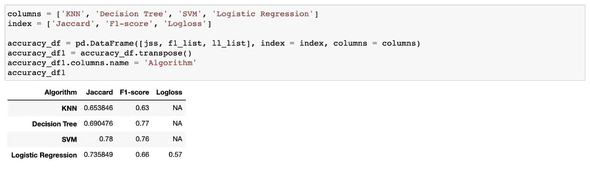

作者图片

上述 A/B 测试在以下文章中进行。

[](https://medium.com/@geencay/past-loan-data-75710e4552ed) [## 将分类算法应用于过去的贷款数据

### 在这个数据集中，我将对过去的贷款数据进行分类机器学习分析，这些数据是；

medium.com](https://medium.com/@geencay/past-loan-data-75710e4552ed) 

# 结论

我希望那篇文章对你有所帮助。

如果你想继续阅读那种教育类文章，大概大多是关于 ***机器学习*** 和 ***编程*** ，最特别的是 ***Python、*** 别忘了关注和发鼓掌。

[https://gi phy . com/gifs/NBA-dance-Stephen-curry-x8bdfafealz 8 tkkuwn](https://giphy.com/gifs/nba-dance-stephen-curry-X8bDfAfeALz8tkkUWN)

感谢阅读。

现在，如果你想继续阅读这类文章，并且不想把自己限制在每月 3 篇，你可以点击下面的链接。如果您使用以下链接，我将收取您的一部分会员费，无需您支付额外费用。

[](https://medium.com/@geencay/membership) [## 通过我的推荐链接加入 Medium-gen cay I。

### 阅读 Gencay I 的每一个故事(以及媒体上成千上万的其他作家)。您的会员费直接支持…

medium.com](https://medium.com/@geencay/membership) 

为我订阅阅读那样的文章，免费的 Numpy 备忘单，以及更多。

***更新***

查看我的其他 A-Z 机器学习文章。

[](/machine-learning-a-z-briefly-explained-4ff86bd81e3a) [## 机器学习 A-Z 简要说明

### 在这篇文章中，我试着向你简单解释一下机器学习 A-Z。

pub.towardsai.net](/machine-learning-a-z-briefly-explained-4ff86bd81e3a) [](/regression-a-z-briefly-explained-618e5d5c89f8) [## 回归 A-Z 简要说明

### 快速和提醒的备忘单，用于刷新

pub.towardsai.net](/regression-a-z-briefly-explained-618e5d5c89f8) 

> “机器学习是人类需要创造的最后一项发明。”尼克·博斯特罗姆

为我订阅更多；

[](https://medium.com/subscribe/@geencay) [## 每当 Gencay I .发表文章时都收到电子邮件。

### 每当 Gencay I .发表文章时都收到电子邮件。通过注册，您将创建一个中型帐户，如果您还没有…

medium.com](https://medium.com/subscribe/@geencay)