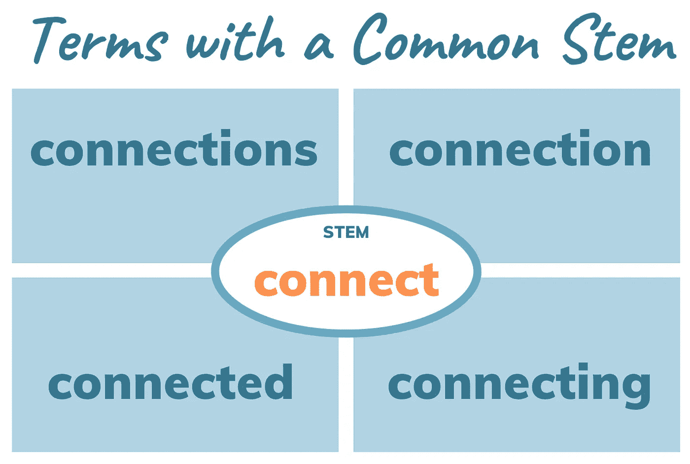

# 词干:波特对斯诺鲍对兰卡斯特

> 原文：<https://pub.towardsai.net/stemming-porter-vs-snowball-vs-lancaster-90b57f5639bc?source=collection_archive---------3----------------------->

## 了解不同的流行词干分析器是如何工作的，以及词干分析与词汇化有何不同

来源:图片来自 [Canva](https://www.canva.com/) ，由作者自由编辑的可用图片。

# **简介**

自然语言处理(NLP)的一个常见应用是信息检索(IR)。IR 系统处理从这些资源的大集合中获取与搜索查询相关的相关资源。假设我们想要检索单词“connect”的资源。出于语法上的原因，同一个单词会有不同的形式，如“连接的”、“连接的”或“连接的”*。所有这些单词都有相同的意思，但根据使用它们的上下文，它们在拼写或结尾上都有所不同。仅使用一个单词来表示相关单词的向量以搜索与搜索查询相关的一组相关资源是有意义的。*

为什么要用单个词来表示一个相关词的向量？

*   使用单个单词来表示相关单词的向量通常会提高 IR 系统的性能。
*   减少字数也将减少整体大小，从而降低系统中总数据的复杂性。

# **什么是词干？**

词干提取是通过替换或删除单词后缀来识别词根形式(也称为单词的基本形式)的过程。研究员 J.B. Lovins 在她的文章《[词干算法的开发](http://people.scs.carleton.ca/~armyunis/projects/KAPI/Lovins.pdf)》中，将词干定义为:

> ***“词干算法是一种计算过程，它将所有具有相同词根的单词简化为一种通用形式，通常是通过剥离每个单词的派生后缀和屈折后缀来实现的。”***

例如，“boat”是单词的词根:“boats”、“boater”或“boating”。

在 stem 中，单词的词根叫做*词干*。所以，在我们的例子中，‘船’叫做干。为了让我们的概念更强，我们再来理解另一个例子；connect 是下列单词的词干:connect、connecting、connection、connections 或 connected。

前缀剥离没有广泛用于词干化；然而，它在某些学科中可能是有用的，例如化学。

## 这是否意味着词干提取总是会产生一个有效的词根？

不。例如，如果我们通过波特词干分析器处理单词“transpar”*，我们得到的词根是“transpar”*。同样，如果我们通过兰开斯特词干分析器处理同一个单词，那么我们得到的词根是“transp”。C.D. Paice 在“[另一个斯特梅尔](https://dl.acm.org/doi/abs/10.1145/101306.101310)”中提到，通常情况下，信息检索系统将相关单词映射到同一个词干就足够了；然而，词根不需要有效。**

> *****“……该过程旨在为检索目的进行映射，词干不必是语言学上正确的词条或词根。”*****

****词干错误:****

*   **词干过长:当两个或更多不相关的单词导致同一个词干时，就会出现这种情况。**
*   **词干不足:当两个或更多的相关单词产生不同的词干时，就会出现这种情况。**

**让我们看看三个最受欢迎的词干分析器:波特、斯诺鲍和兰开斯特。**

**N**

## ****搬运工斯特梅尔****

**它是最常用的词干分析器之一，由 M.F. Porter 于 1980 年开发。波特的词干分析器由五个不同的阶段组成。这些阶段按顺序应用。在每个阶段中，都有一些选择规则的惯例。整个波特算法很小，因此快速而简单。这个词干分析器的缺点是它只支持英语，而且得到的词干在语言学上可能正确，也可能不正确。**

**上面所示的代码片段会产生: *wa* ，*发现*，*老鼠*，*跑*，*跑*，*跑***

**注意根据波特算法，was 的词干是 wa，这在语言学上是无效的。**

## ****雪球斯特梅尔****

**M.F .波特还开发了雪球茎干机。Snowball 是一种字符串处理语言，主要用于创建词干算法。它是由波特创建的，是对他以前创建的波特算法的改进。它支持多种语言，包括英语、俄语、丹麦语、法语、芬兰语、德语、意大利语、匈牙利语、葡萄牙语、挪威语、瑞典语和西班牙语。呈现英语词干分析器的雪球词干分析器叫做 *Porter2* 。**

**上面显示的代码片段会产生:*被*，*发现*，*老鼠*，*跑*，*跑*，*跑***

**根据 M.F. Porter 的说法，像' be ' to ' be*'*这样的停用词的词干是没有用的，因为它们没有任何共同的意思，尽管这两个词之间可能有语法联系。雪球提供了另一个名为 *ignore_stopwords* 的参数，默认设置为 false。如果设置为 true，那么 snowball 将不执行停用词的词干提取。**

**上面显示的代码片段将产生:*是***

**如果 *ignore_stopwords* 设置为 false，那么相同的代码片段将输出:' be' *。*自己试试。**

## ****兰卡斯特斯特梅尔****

**兰开斯特茎干机也被称为派斯或果壳茎干机。它是由兰开斯特大学的 C.D. Paice 于 1990 年开发的。它使用迭代方法，这使它成为本文描述的三种词干分析器中最激进的算法。由于其迭代方法，它可能会导致词干过多，这可能会导致语言学上不正确的词根。它不如搬运工或雪球茎干工效率高。此外，它只支持英语。**

**上面显示的代码片段会产生:*被*，*发现*， *mic* ， *run* ， *run* ， *ran***

**由于兰卡斯特词干师使用了一种更具侵略性的方法，单词“mice*”*被简化为“mic*”*。**

# ****什么是词汇化？它和词干有什么不同？****

**正如我们到目前为止所看到的，词干提取算法可能会也可能不会返回有效的词干。这对于红外系统来说不是问题；然而，这种无效的词干可以用在语言建模中吗？在语言建模中，正确的形式是至关重要的。我们可能不能。为了克服词干提取的这一缺点，我们使用了词汇化，将我们返回到语言学上正确的词根。词汇化识别单词的变形形式，并返回其语言学上正确的词根。在“[信息检索简介](https://nlp.stanford.edu/IR-book/pdf/irbookonlinereading.pdf)”一书中，他们将术语化定义为:**

****💡一个词的屈折形式有变化的拼写或结尾。****

****词的词根在引理化中称为引理。所以，对于像‘跑’，‘跑’*，*，‘跑’，或者‘跑’这样的词；“奔跑”是引理。对于像‘老鼠’这样的词，引理是‘老鼠*’*。****

****使用最多的一个 lemmatizers 是 NLTK 提供的 **WordNet** 。为了得到精确的引理，我们必须提供一个合适的词性(pos)标签。默认情况下，每个单词都被视为名词(n)。我们将把动词(v)作为列表中所有单词的值传递给 pos 参数。****

****上面所示的代码片段会产生: *be* ， *find* ，*mouse*， *run* ， *run* ， *run*****

****在这里，我们观察到' was '，' found '，' run '，' running '和' ran '是动词，所以我们得到的输出是精确的。但是,“鼠标”的输出是“鼠标”。为什么？发生这种情况是因为单词“mice”是一个名词，所以将 pos 标签改为名词会得到输出为“mouse”。你自己试试。****

# ******结论******

****我们看到了词干化和词汇化是如何不同的，以及不同的词干分析器是如何工作的。除了本文提到的之外，还有许多不同的词干分析器和词尾分析器可供使用。总结整篇文章，先回答两个问题。****

****首先，我们应该为预处理步骤选择词干化还是词汇化？这取决于正在创建的应用程序。与词干化相比，词干化速度更快。此外，词干化可能会也可能不会返回有效的词干或词根，而词汇化将返回语言学上正确的词根。因此，在速度很重要的应用中，比如搜索和检索系统，词干可能是首选；在有效根很重要的应用程序中，比如在语言建模中，词汇化可能是首选。请记住，关于预处理步骤应该使用什么的最终决定总是取决于正在创建的应用程序和应用程序创建者。试着用这两种方法做实验，看看结果有什么不同。****

****其次，词干是不是只在 IR 系统中使用？不会。词干分析可以用于需要将单词的形态形式转换为其词根的应用程序中。这意味着词干提取可以在文本摘要甚至文本分类中进行。****

****如果您已经使用或尝试过这些词干分析器或词尾分析器，请在评论部分告诉我，它们对您有多大好处！****

> *****你可以通过*[*LinkedIn*](http://www.linkedin.com/in/kaustubhbhavsar)联系我。****