# 一个完整的基于端到端机器学习的推荐项目

> 原文：<https://pub.towardsai.net/step-by-step-approach-to-building-a-recommendation-system-a65be5a54045?source=collection_archive---------1----------------------->

## 基于协同过滤和流行度过滤的机器学习推荐方案

图片来自 Unsplash，由 Toa Heftiba 上传

## 什么是推荐系统？

每当我们去购物中心购买一双新鞋或衣服时，我们都会找到一个专注的人，他会根据我们的喜好帮助我们选择应该购买的产品，并让我们的工作变得更简单。简单来说，他就是一个推荐系统。但在这个现代世界，一切都是在线的，互联网上有如此多的内容，Youtube 上有大量的视频，亚马逊上有大量的产品，这让用户很难选择。推荐系统出现了，它通过推荐下一个要观看的视频或要购买的类似产品，让用户的生活变得简单。

推荐系统是一段足够智能的代码，可以理解用户的偏好，并根据他/她的兴趣推荐东西，目标是增加利润。例如，Youtube 和网飞希望你在他们的平台上花更多的时间，所以他们根据用户的喜好推荐视频。亚马逊希望你从他们的网站上购买产品，这样他们可以获得更多利润。

 [## 用 Python 编写复杂模式的简单方法，仅需 4 分钟。

### 用 python 编写复杂模式程序的简单方法

medium.com](https://medium.com/@gowthamsr37/pattern-programming-in-python-23d5af04211e) 

## 推荐系统的类型:

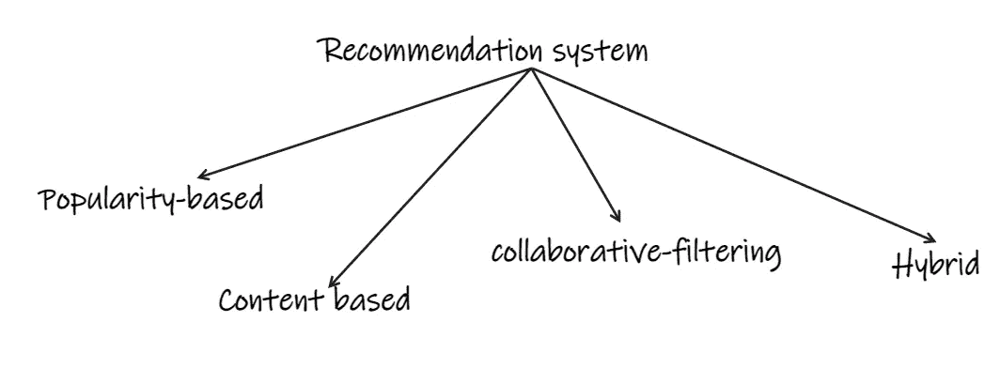

作者图片

**基于人气的**:向每个用户推荐他们网站上的顶级产品。这种方法不会考虑用户的兴趣。例如，Youtube 上的趋势部分，IMDB 250 大电影。

**基于内容的**:

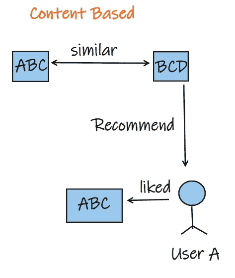

作者图片

这是基于产品之间的相似性。例如，如果用户已经观看了一部电影并且喜欢它，他可能喜欢在将来观看类似的电影。这可以基于类型、男演员、女演员或导演。

 [## 基于内容的推荐系统的实际实现

### 一个完整的端到端的基于内容的推荐系统，根据用户的输入推荐相似的电影。

medium.com](https://medium.com/@gowthamsr37/how-to-build-a-content-based-recommendation-system-f7d881a53e9a) 

**协同过滤**:

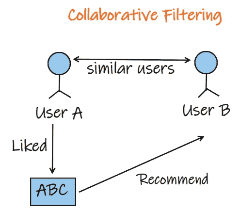

作者图片

这是基于用户的相似性。例如，如果人 A 和 B 已经观看并喜欢电影 M，接下来如果人 A 观看了电影 Z 并喜欢它，我们可以向人 B 推荐电影 Z，因为 A 和 B 是相似的用户。

**混合滤波**:利用上述全部或部分方法形成混合模型。

# **建立图书推荐系统:**

让我们看看如何建立一个基于流行度和基于协同过滤的图书推荐系统。

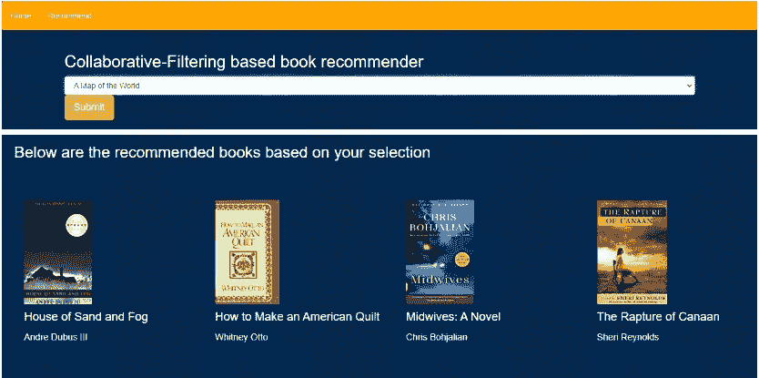

作者图片

**基于流行度的过滤**:

让我们导入基本库，读取数据集并创建数据框。数据集可以从这个链接下载— [数据集](https://www.kaggle.com/datasets/arashnic/book-recommendation-dataset)。

书籍-“书籍”数据框有两列 ISBN(每本书的唯一 ID)和书名。

用户—“用户”数据框有 3 列用户 ID、位置和年龄。

评级——“评级”数据框有 3 列:用户 ID、ISBN 和图书评级。

让我们看看每个数据帧的前 5 行。

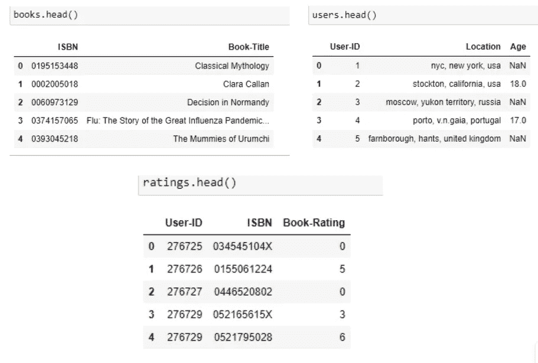

作者图片

下一步是合并‘ISBN’列上的图书和评级，合并‘USER-ID’列上的用户和评级。

作者图片

让我们制作两个新的数据帧，它们将具有每本书的多个评级和平均评级，并将它们命名为 **book_num_ratings** 和 **book_avg_ratings** 。

**final_rating** 数据帧通过合并两个数据帧 book_avg_ratings 和 book_num_ratings 创建

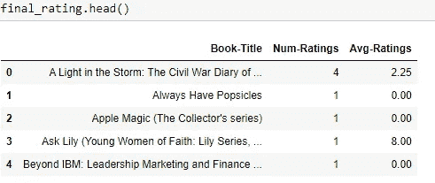

作者图片

为了实现基于流行度的过滤，让我们只选择那些评级超过 250 的书籍，

现在，我们已经成功地构建了一个基于流行度的推荐系统，从我们的数据集中筛选出了前 50 本书。

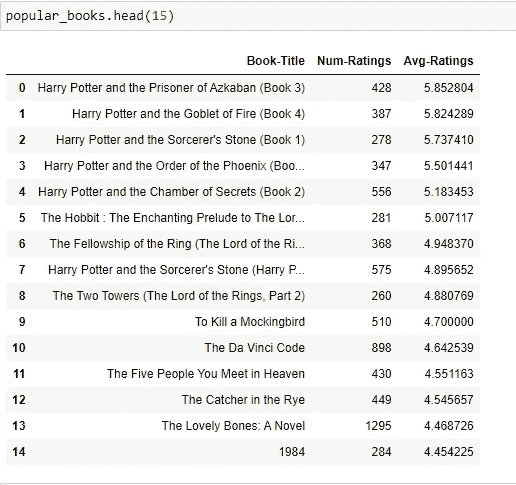

作者图片

**协同过滤:**

为了建立一个基于协同过滤的推荐系统，我们将只考虑那些对超过 200 本书评分的用户和那些至少有 50 本评分的书。

我们有一个最终的数据框架，其中只有那些至少有 50 个评级的书籍和至少有 200 个评级的用户。

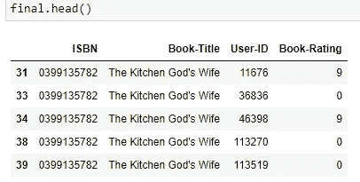

作者图片

下一步是创建一个数据透视表，将“Book-Title”作为索引，“User-ID”作为列，“Book-Rating”作为值。

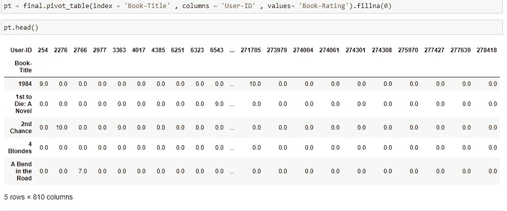

作者图片

我们将使用 cosine_similarity 函数计算每本书之间的相似性得分。相似度得分最高的 5 本书将被推荐如下图。

下面是基于我们的推荐模型的一些结果。

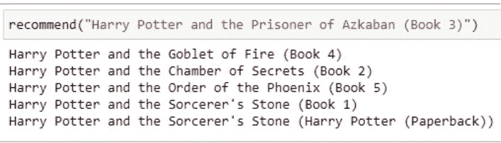

作者图片

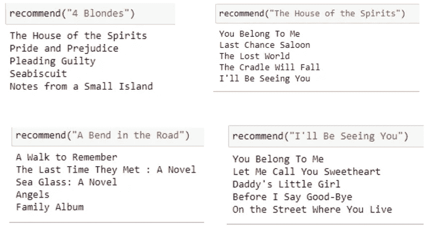

作者图片

现在我们已经成功构建了一个基于流行度和基于协同过滤的推荐系统。让我们使用 flask 部署这些模型。

**部署模型:**

让我们使用 flask 框架来部署模型。我们需要创建一个 python 文件 app.py，它将链接到 HTML 文件。

我们应该创建一个名为模板的文件夹，HTML 文件 index.html 和 recommend.html 将被放置在那里。

我们需要在项目文件夹中放置 pickle 文件 popularity.pkl，similarity.pkl，books.pkl，pt.pkl。

完整的代码可以在 [GitHub 页面](https://github.com/gowthamsr37/Book-Recommendation-system)上找到

基于流行度的过滤:我们的应用程序的主页将显示我们的数据集中的前 50 本书，以及封面、作者、平均评级和总投票数。

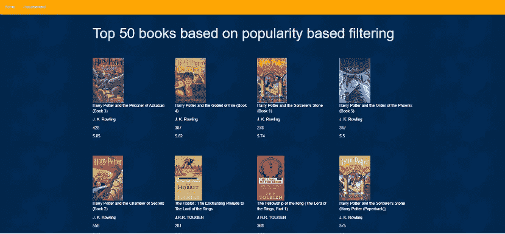

作者图片

协同过滤:当用户点击推荐图标时，他将被提示到下面的页面，用户可以选择他需要推荐的书，一旦提交，类似的书以及封面和作者将被显示。

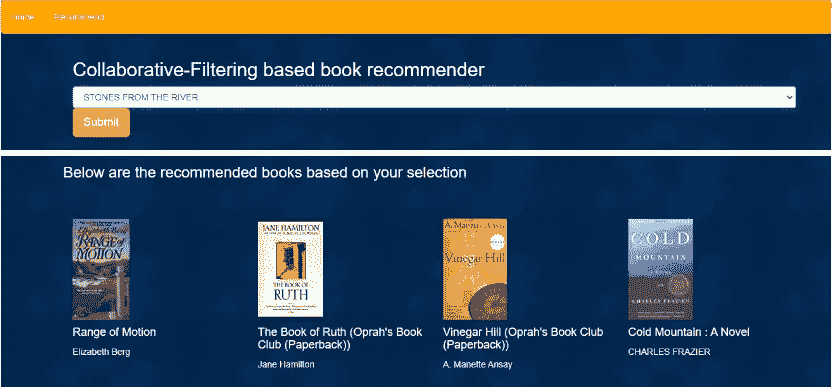

作者图片

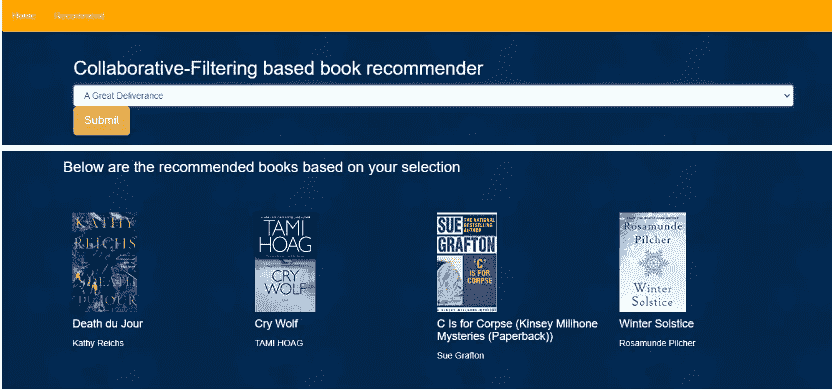

作者图片

因此，我们已经成功完成了部署部分。你可以试着在这个周末实施这个项目。

谢谢你。

 [## 为什么多重共线性是一个问题？

### 什么是多重共线性？为什么我们要在创建机器学习模型之前处理多重共线性？

medium.com](https://medium.com/@gowthamsr37/why-multicollinearity-is-a-problem-4c273d1d1f2e)  [## 标准化与规范化相比，哪种扩展技术更有特色

### 特征缩放是强制性的吗？什么时候使用标准化？何时使用规范化？会发生什么……

pub.towardsai.net](/which-feature-scaling-technique-to-use-standardization-vs-normalization-9dcf8eafdf8c)