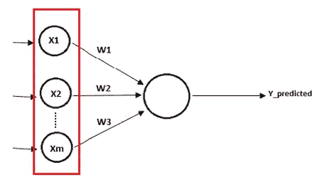
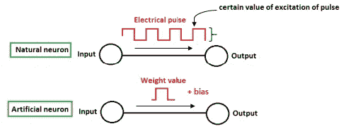
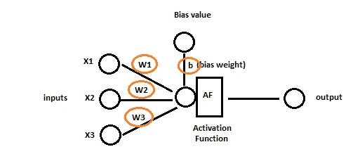
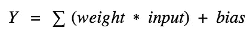
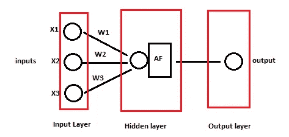
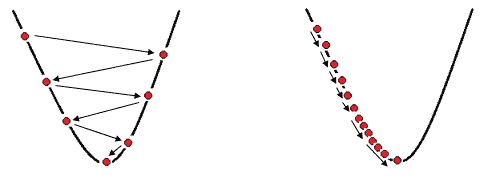

# 使用 Python 中的 Keras 逐步基本了解神经网络

> 原文：<https://pub.towardsai.net/step-by-step-basic-understanding-of-neural-networks-with-keras-in-python-94f4afd026e5?source=collection_archive---------0----------------------->

## [深度学习](https://towardsai.net/p/category/machine-learning/deep-learning)

## 具有定义的神经网络的学习


人工神经网络。作者的照片

在本文中，我们将讨论简单的神经网络及其定义与 Keras 的例子。在传统机器学习的基础上使用神经网络，以获得更高的准确性和更大的复杂数据。

## 涵盖的主题:

1.  神经网络导论
2.  权重和偏差
3.  不同类型的层
4.  激活功能
5.  梯度下降和随机梯度下降
6.  反向传播
7.  使用 python 的 Keras 示例

[](/become-a-data-scientist-in-2021-with-these-following-steps-5bf70a0fe0a1) [## 按照以下步骤，在 2021 年成为一名数据科学家

### 走上数据科学家之路需要具备的基本点

pub.towardsai.net](/become-a-data-scientist-in-2021-with-these-following-steps-5bf70a0fe0a1) 

> ***神经网络简介***

神经网络正在全球各行业蓬勃发展。是关于回归、分类、聚类等传统的机器学习算法。当我们得到大量复杂的数据时，准确性、过度拟合以及测试和训练的时间都会出现问题。

神经网络的基本类型

*   人工神经网络
*   卷积神经网络
*   递归神经网络

对于易于处理的非线性数据，神经网络是非常好的算法。

术语 ***感知器*** 是弗兰克·罗森布拉特在 1957 年创造的。在机器学习中，感知器是二进制状态的线性分类器，在深度学习中，感知器是人工神经元。

神经元的概念来源于人脑中的神经元，并试图通过人工神经元模仿自然神经元的动作来适应和学习周围环境。



人造神经元。作者的照片

对于深度学习中的任何模型，都必须有输入和输出神经元。

> ***权重和偏差***

权重和偏差是神经网络中的两个学习参数，信息通过它们传递到下一层。

在天然神经元中，信息通过电脉冲从一端传递到另一端，而在人工神经元中，信息是借助重量传递的。

偏差值用于使数据更灵活，更接近实际动作。



信息从输入到输出的传递。作者的照片

一个简单的带权重和偏差的神经网络模型



作者的照片

有输入的权重和偏差公式。



> ***不同类型的图层***

在神经网络中，层由神经元定义，信息通过神经元传递到下一层神经元。三层描述如下:

*   输入层:这一层根据我们数据集中独立特征的数量包含神经元的数量。
*   隐藏层:该层位于输入层和输出层之间。它也称为计算层，采用带权重和偏差的非线性输入，并使用激活函数将其计算到下一层。
*   输出层:这一层包含分类问题的输出。它可能有一个节点或神经元或多个神经元。



神经网络中层的类型。作者的照片

> ***激活功能***

神经网络中的激活函数对来自输入层的输出进行比较计算，并决定某个阈值进行分类。

神经网络中使用了许多激活函数，如下所示:

1.  阈值函数:简单来说就是阶跃函数或者说二元函数。在多类问题中就没那么有用了。
2.  线性激活函数:这个函数非常适合回归类问题。这个函数的问题是不要在反向传播中使用，因为导数是相同的。
3.  非线性函数:它们适用于非线性数据，其中一些如下所示:

*   ***Sigmoid 函数:*** 对渐变很有帮助但对高低值不好。计算的过程也很高。范围在 0 到 1 之间。
*   ***双曲正切(tanh):*** 它有点像 sigmoid，但不同的是，它在负值时也表现良好。范围在-1 到 1 之间。
*   ***整流线性(ReLu):*** 收敛良好，适用于非线性。但是它在反向传播的学习中不是很有用，并且对于负值或达到零值，梯度变为零。
*   ***漏 ReLu:*** 这克服了反向传播中的 ReLu 问题，但预测精度较低。
*   ***参数 ReLu:*** 这个非常适合做反向传播，学习负值的东西。
*   ***Softmax 函数:*** 它对输入的许多类别进行分类非常有用，所以，它用在输出层。
*   ***Swish 函数:*** 这是一种新方法，比 ReLu 好，准确率提高了 0.5%。

[](/fully-explained-k-nearest-neighbors-with-python-ebbe27f93ba9) [## 用 Python 完整解释 K 近邻

### 数据科学中解决真实案例的机器学习分类算法研究。

pub.towardsai.net](/fully-explained-k-nearest-neighbors-with-python-ebbe27f93ba9) 

> ***梯度下降和*** 随机梯度下降

梯度下降的主要目的是最小化成本(损失)。当我们用实际结果评估我们的模型结果时，损失就来了。这里，权重的更新过程从模型中所有层和节点的反向开始。权重的改变依赖于对 w.r.t .权重的偏导数来找到全局最小值。

在梯度下降之前，我们可以使用许多权重值的蛮力来找到损失最小的位置。但是，这个过程非常昂贵和耗时。

在本主题中，我们将讨论如下所示的两种优化方法:

*   梯度下降:在这种方法中，梯度(斜率)用于知道正负方向。在全局最小值处，斜率变为零，这意味着这是精确权重值的点。梯度下降法的问题是，当有多个局部极小值时，它不能找到全局极小值，因此，我们不能得到适当优化的权重。梯度下降将所有输入作为一个批次进行分析。
*   随机梯度下降:为了克服得不到全局最小值的问题，SGD 出现了。在这种方法中，输入中的行逐行获取，并逐行更新权重。它也被称为小批量梯度下降法。



神经网络中的学习速率。作者的照片

*这是一个借助梯度下降法更新模型中权重的过程。*

> ****用 python 举例****

*这是一个银行数据集流失分析的例子。*

*导入必要的库*

```
*import numpy as np 
import pandas as pd pd.read_csv)
import matplotlib.pyplot as plt*
```

*现在，使用 pandas read 方法导入数据集，并将数据分为独立特征和从属特征。*

```
*dataset = pd.read_csv('Churn_Modelling.csv')X = dataset.iloc[:,3:13].values 
y = dataset.iloc[:, 13].values 
print(X.shape)
print(y.shape)#output:
(10000, 10)
(10000,)*
```

*我们在数据中有两个类别特征，即国家和性别。所以，我们将使用一个标签编码器来使它们成为数字浮点数据。标签编码后，我们将使用一键编码来创建我们在国家和性别特征中标记编码的新特征列。*

```
*from sklearn.preprocessing import LabelEncoder, OneHotEncoder

labelencoder_X_1 = LabelEncoder()
X[:, 1] = labelencoder_X_1.fit_transform(X[:, 1])
labelencoder_X_2 = LabelEncoder()
X[:, 2] = labelencoder_X_2.fit_transform(X[:, 2])

onehotencoder = OneHotEncoder(categorical_features=[1])
X = onehotencoder.fit_transform(X).toarray()X = X[:, 1:]  #new updated independent features after encoding*
```

*现在，我们将把独立数据和相关数据分成训练集和测试集。*

```
*from sklearn.model_selection import train_test_split

X_train, X_test, y_train, y_test = train_test_split(X, y, test_size=0.2, random_state=0)*
```

*拆分后，我们将使用标准化，以便高值和低值数据的变化在一定范围内成为标准。*

```
*from sklearn.preprocessing import StandardScaler

sc = StandardScaler()
X_train = sc.fit_transform(X_train)
X_test = sc.transform(X_test)*
```

*在另一篇文章中，我讲述了 ***fit_transform*** 和***transform****的区别，链接如下。**

**[](/fully-explained-svm-classification-with-python-eda124997bcd) [## 用 Python 全面解释了 SVM 分类

### 如何用一个真实的例子解决分类问题。

pub.towardsai.net](/fully-explained-svm-classification-with-python-eda124997bcd) 

现在，我们的数据已经准备好作为人工神经网络的输入。我们将使用 Keras 框架构建 ANN。

为 ANN 导入库

```
import Keras
from keras.models import Sequential
from keras.layers import Dense
```

顺序用于初始化人工神经网络，密集用于添加人工神经网络中的层。

初始化人工神经网络

```
classifier = Sequential()
```

在 ANN 中添加层

```
classifier.add(Dense(input_dim = 11, activation = 'relu', units=6, kernel_initializer='uniform'))
```

这里，我们初始化输入神经元和隐藏层神经元的数量，即分别为 11 和 6。

现在增加一个隐藏的 6 层神经元。

```
classifier.add(Dense(activation = 'relu', units=6, kernel_initializer='uniform'))
```

现在添加输出层。

```
classifier.add(Dense(activation = 'sigmoid', units=1, kernel_initializer='uniform'))
```

是时候用优化器和损耗参数来编译我们的 ANN 了。由于我们的输出层具有 sigmoid 函数，因此我们应该选择与之相关的损耗值。

```
classifier.compile(optimizer='adam', loss = 'binary_crossentropy', metrics=['accuracy'])
```

现在，我们将使用批量大小和纪元数量来拟合我们的模型。

```
classifier.fit(X_train, y_train, batch_size=10, epochs=100)
```

经过 100 个周期后，我们得到了接近 86%的准确率。


是时候为测试集预测我们的模型了。

```
y_pred = classifier.predict(X_test)#we will use a threshold to know the exactly true and false values.
y_pred = (y_pred > 0.5)#output:
[[False]
 [False]
 [False]
 ...
 [False]
 [False]
 [False]]
```

> ***结论:***

它是关于人工神经网络的介绍性文章，给出了方法的概述。深度学习类型的模型非常庞大，速度也更快。

[](/become-a-data-scientist-in-2021-with-these-following-steps-5bf70a0fe0a1) [## 按照以下步骤，在 2021 年成为一名数据科学家

### 走上数据科学家之路需要具备的基本点

pub.towardsai.net](/become-a-data-scientist-in-2021-with-these-following-steps-5bf70a0fe0a1) 

我希望你喜欢这篇文章。通过我的 [LinkedIn](https://www.linkedin.com/in/data-scientist-95040a1ab/) 和 [twitter](https://twitter.com/amitprius) 联系我。

# 推荐文章

[1。NLP —零到英雄与 Python](https://medium.com/towards-artificial-intelligence/nlp-zero-to-hero-with-python-2df6fcebff6e?sk=2231d868766e96b13d1e9d7db6064df1)
2。 [Python 数据结构数据类型和对象](https://medium.com/towards-artificial-intelligence/python-data-structures-data-types-and-objects-244d0a86c3cf?sk=42f4b462499f3fc3a160b21e2c94dba6)3 .[数据预处理概念同 Python](/data-preprocessing-concepts-with-python-b93c63f14bb6?source=friends_link&sk=5cc4ac66c6c02a6f02077fd43df9681a)
4。[用 Python 进行主成分分析降维](/principal-component-analysis-in-dimensionality-reduction-with-python-1a613006d531?source=friends_link&sk=3ed0671fdc04ba395dd36478bcea8a55)
5。[用 Python 全面讲解 K-means 聚类](https://medium.com/towards-artificial-intelligence/fully-explained-k-means-clustering-with-python-e7caa573176a?source=friends_link&sk=9c5c613ceb10f2d203712634f3b6fb28)
6。[用 Python](https://medium.com/towards-artificial-intelligence/fully-explained-linear-regression-with-python-fe2b313f32f3?source=friends_link&sk=53c91a2a51347ec2d93f8222c0e06402)
7 全面讲解了线性回归。[用 Python](https://medium.com/towards-artificial-intelligence/fully-explained-logistic-regression-with-python-f4a16413ddcd?source=friends_link&sk=528181f15a44e48ea38fdd9579241a78)
充分解释了 Logistic 回归 8。[用 Python 实现时间序列的基础知识](https://medium.com/towards-artificial-intelligence/basic-of-time-series-with-python-a2f7cb451a76?source=friends_link&sk=09d77be2d6b8779973e41ab54ebcf6c5)
9。[与 Python 的数据角力—第一部分](/data-wrangling-with-python-part-1-969e3cc81d69?source=friends_link&sk=9c3649cf20f31a5c9ead51c50c89ba0b)
10。[机器学习中的混淆矩阵](https://medium.com/analytics-vidhya/confusion-matrix-in-machine-learning-91b6e2b3f9af?source=friends_link&sk=11c6531da0bab7b504d518d02746d4cc)**