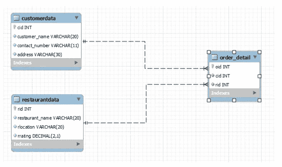
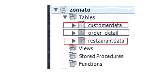
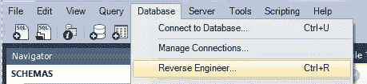
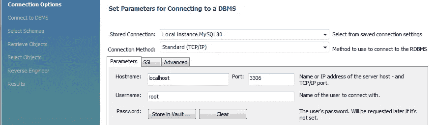
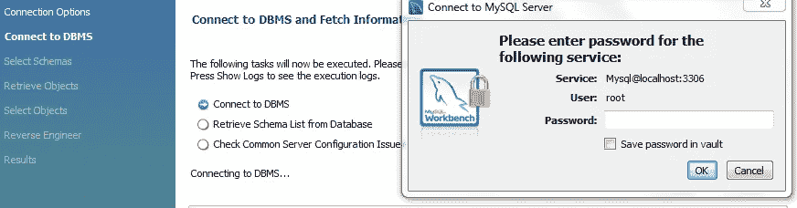
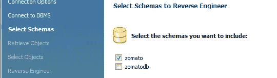
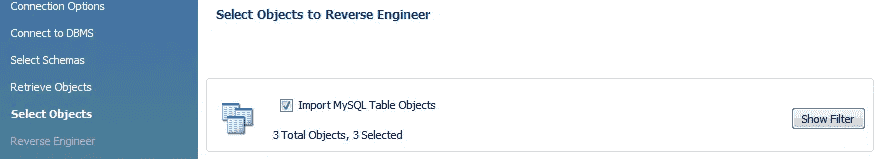
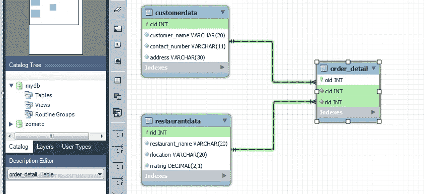

# MySQL 中增强实体关系(EER)的分步设计

> 原文：<https://pub.towardsai.net/step-by-step-design-of-enhanced-entity-relationship-eer-in-mysql-1e0f8b9fe5d4?source=collection_archive---------1----------------------->

## [编程](https://towardsai.net/p/category/programming)

## 表的数据库模式关系



EER 模型。作者的照片

本文将清楚地理解相互关联的表的可视化表示。EER 是 MySQL workbench 中的一个建模接口。

## 涵盖的主题:

```
1\. Table creation
2\. EER creation
```

> ***表创作***

在本例中，我们将制作三个表格来了解 EER 设计。我们将获取包含客户详细信息、餐厅详细信息和订单详细信息的食品零售表。

我们将创建的第一个表是客户数据表，如下所示:

```
#Table 1drop table if exists customerdata;create table customerdata(
 cid int(4) not null,
 customer_name varchar(20) not null,
 contact_number varchar(11) not null,
 address varchar(30) not null,
 constraint pk_customerdata primary key (cid)
);#inserting values of table 1 columnsinsert into customerdata(cid,customer_name,contact_number,address) VALUES
(1001,'Amit','1234567801','mumbai'),
(1002,'Shubendu','1234567802','delhi'),
(1003,'Seasia','1234567803','mohali'),
(1004,'Kokan','1234567804','pune'),
(1005,'Ajay','1234567805','bhopal');
```

我们将创建的第二个表是餐馆数据表，如下所示:

```
#Table 2drop table if exists restaurantdata;create table restaurantdata(
 rid int(3) not null,
 restaurant_name varchar(20) not null,
 rlocation varchar(20) not null,
 rrating decimal(2,1) not null,
 constraint pk_customerdata primary key (rid)
);#inserting values of table 2 columnsinsert into restaurantdata(rid,restaurant_name,rlocation,rrating) VALUES
(101, 'hydrabadi spice', 'delhi', '4.5'),
(102, 'hotel green park', 'bhopal', '4.1'),
(103, 'saffron', 'pune', '3.9'),
(104, 'thomson restro', 'delhi', '3.6'),
(105, 'laa unico', 'mumbai', '4.3');
```

我们将创建的第三个表是订单 Id 数据表，如下所示:

```
#Table 3drop table if exists order_detail;create table order_detail(
 oid int(4) not null primary key,
 cid int(4) not null,
 rid int(3) not null,
 constraint fk_customerdata foreign key (cid) references customerdata(cid),
 constraint fk_restaurantdata foreign key (rid) references restaurantdata(rid)
);#inserting values of table 3columnsinsert into order_detail(oid, cid, rid) 
values
(7711, 1001, 101),
(7712, 1002, 102),
(7713, 1003, 103),
(7714, 1004, 104),
(7715, 1005, 105);
```

执行完命令后，我们在数据库 zomato 中得到三个表



创建和更新表格。作者的照片

如果你是 MySQL 的新手，需要复习 MySQL 的命令，你可以点击下面的链接。

[](/mysql-zero-to-hero-with-syntax-of-all-topics-92e700762c7b) [## MySQL:零到英雄，包含所有主题的语法

### 数据库查询语言手册

pub.towardsai.net](/mysql-zero-to-hero-with-syntax-of-all-topics-92e700762c7b) 

> ***增强实体关系(EER)创建***

在创建所有表并用它们的外键和主键相互连接之后。在这一步中，我们将制作 EER 接口。

*   我们需要点击数据库工具栏，然后在逆向工程选项。



作者的照片

*   完成所有空白参数框后，点击下一步。



作者的照片

*   它将询问您的工作台主机的密码，然后单击 next。



作者的照片

*   以上步骤选择模式数据库后。因此，我们将选择 zomato 模式，然后单击 next。



选择所需的数据库。作者的照片

*   然后它将从 zomato 数据库中导出所有的表和对象，然后单击 execute。



已选择数据库表。作者的照片

*   完成所有步骤后,**增强实体关系图**就会出现。



EER 模型。作者的照片

> **结论:**

本文将让您对 MySQL workbench 中的表创建和 EER 接口建模有一个基本的了解。

我希望你喜欢这篇文章。通过我的 [LinkedIn](https://www.linkedin.com/in/data-scientist-95040a1ab/) 和 [twitter](https://twitter.com/amitprius) 联系我。

# 推荐文章

[1。NLP —零到英雄与 Python](https://medium.com/towards-artificial-intelligence/nlp-zero-to-hero-with-python-2df6fcebff6e?sk=2231d868766e96b13d1e9d7db6064df1)
2。 [Python 数据结构数据类型和对象](https://medium.com/towards-artificial-intelligence/python-data-structures-data-types-and-objects-244d0a86c3cf?sk=42f4b462499f3fc3a160b21e2c94dba6)3 .[Python 中的异常处理概念](/exception-handling-concepts-in-python-4d5116decac3?source=friends_link&sk=a0ed49d9fdeaa67925eac34ecb55ea30)
4。[用 Python 进行主成分分析降维](/principal-component-analysis-in-dimensionality-reduction-with-python-1a613006d531?source=friends_link&sk=3ed0671fdc04ba395dd36478bcea8a55)
5。[用 Python 全面讲解 K-means 聚类](https://medium.com/towards-artificial-intelligence/fully-explained-k-means-clustering-with-python-e7caa573176a?source=friends_link&sk=9c5c613ceb10f2d203712634f3b6fb28)
6。[用 Python](https://medium.com/towards-artificial-intelligence/fully-explained-linear-regression-with-python-fe2b313f32f3?source=friends_link&sk=53c91a2a51347ec2d93f8222c0e06402)
7 全面讲解了线性回归。[用 Python](https://medium.com/towards-artificial-intelligence/fully-explained-logistic-regression-with-python-f4a16413ddcd?source=friends_link&sk=528181f15a44e48ea38fdd9579241a78)
充分解释了 Logistic 回归 8。[用 Python 实现时间序列的基础知识](https://medium.com/towards-artificial-intelligence/basic-of-time-series-with-python-a2f7cb451a76?source=friends_link&sk=09d77be2d6b8779973e41ab54ebcf6c5)
9。[与 Python 的数据角力—第一部分](/data-wrangling-with-python-part-1-969e3cc81d69?source=friends_link&sk=9c3649cf20f31a5c9ead51c50c89ba0b)
10。[机器学习中的混淆矩阵](https://medium.com/analytics-vidhya/confusion-matrix-in-machine-learning-91b6e2b3f9af?source=friends_link&sk=11c6531da0bab7b504d518d02746d4cc)