# 一步一步引导你创建自己的情感识别系统

> 原文：<https://pub.towardsai.net/step-by-step-guide-in-creating-your-own-emotion-recognition-system-b8aba98134c8?source=collection_archive---------1----------------------->

## [计算机视觉](https://towardsai.net/p/category/computer-vision)，[深度学习](https://towardsai.net/p/category/machine-learning/deep-learning)


情感识别模型

你是对深度学习感到兴奋的人之一吗？你有没有想过创造一种可以探测人类情感的东西？
嗯，如果是这样，那你就来对地方了。

在这篇文章中，我将一步一步地向你介绍我的情感识别模型，以及我发现的一些见解。

为了方便你浏览我的博客，我将列出这篇文章将要讨论的要点。

1.  了解数据集
2.  创建助手功能
3.  将数据转换成所需的格式
4.  获取您的基本模型
5.  准备微调模型
6.  绘制洞察力
7.  重构微调模型
8.  从谷歌拍摄的图像中做出预测

因此，如果你对此感到兴奋，那就让我们开始吧！

# 了解数据集

面部情感识别的数据集可以从 Kaggle 这里[下载](https://www.kaggle.com/c/challenges-in-representation-learning-facial-expression-recognition-challenge/data)。如果无法从那里下载数据，您可以使用此驱动器[链接](https://drive.google.com/file/d/1q1KazCL9W9cQYsM09s3FzQjyUSct3YxV/view?usp=sharing)下载数据集。

现在你已经有了数据集，你就可以跟着做了。
那么，事不宜迟，让我们开始加载数据集。由于在本地机器上处理图像需要大量的时间和资源，因此我将使用 colab 的 GPU 来训练我的模型。因此，如果你没有自己的 GPU，确保你切换到 colab 跟随。

## 导入必要的库

```
# Loading dataset
data = pd.read_csv('fer2013.csv')
```

加载完数据集后，让我们尝试探索我们的数据。数据集由 **3 列**组成，即**情感**(目标变量)、**像素、**和**用法**。
来自数据['情感']。unique()，我们可以发现我们的数据集中存在多少种类型的情绪。

> 在这种情况下，这里有 6 种情绪被映射如下:
> *0 - >愤怒
> 1 - >厌恶
> 2 - >恐惧
> 3 - >快乐
> 4 - >悲伤
> 5 - >惊喜
> 6 - >中性*

## 探索“用法”栏

```
# exploring values in Usage column
data['Usage].value_counts//========= Output ================//
Training       28709 
PublicTest      3589 
PrivateTest     3589 
Name: Usage, dtype: int64
```

上面的代码告诉我们，数据集由“Training”、“PublicTest”和“PrivateTest”组成。现在我们必须决定哪种类型的数据用于训练、验证和测试。

我决定使用标记为“Training”的整个数据集作为训练集，PublicTest 作为验证/开发集，PrivateTest 作为测试集。我已经将数据集分为训练、验证和测试，并将其保存为单独的 CSV 文件。

我选择的原因是我们希望我们的模型最终在测试数据上表现良好，因此公共测试数据似乎是我的最佳选择，因为它将描述我们的私有测试。因此，如果我们在验证集上推广得好，我们在测试数据上也会做得好。您可以从下面的链接下载 CSV 文件。
[训练数据](https://drive.google.com/file/d/1--39x9DupUs3-Jfhf3rWEATMN4pe2uu7/view?usp=sharing)，[验证数据](https://drive.google.com/file/d/1-HqdhlYhF6nUYNOcCrnsYKNhyK8sZNiF/view?usp=sharing)，以及[测试数据](https://drive.google.com/file/d/1-BkQFmtIHbfAJHcR5icfaDuwDQ_SSMIL/view?usp=sharing)

到现在为止，我们已经加载并理解了一些我们的数据是关于什么的，以及我们将要预测什么。现在让我们**开始为我们的模型创建助手函数。**

# 助手功能

现在，我们将定义一些函数来帮助我们从数据集中提取特征和目标，并将它们存储在单独的列表中以备后用。

## 提取特征

上面的函数解析整个文件并分离出特征和目标。因为我们的目标情感是在第一列中找到的，所以我们使用 row[0]对其进行切片，并将其附加到我们的列表‘Y’中，而其余的特征被附加到列表‘X’中。

让我们检查一下数据的形状。

```
# Checking shape of our dataprint(train_X.shape)
print(train_Y.shape)
print(val_X.shape)
print(val_Y.shape)
print(test_X.shape)
print(test_Y.shape)############# Output ############
(28709, 2304) // training-data
(28709,) 
(3589, 2304) //validtaion-data 
(3589,) 
(3589, 2304) //testing-data 
(3589,)
```

## 绘图功能

上面的绘图函数用于分析我们的模型如何随着历元数的增加而执行。为了使用相同的功能，我引入了一个历史参数。因此，给定任何模型的历史，它将沿着 x 轴显示其精度和损耗图，以及历元数。

## 情感分析

我们的下一个助手功能是绘制条形图来分析预测的情绪。该函数将构建一个条形图，并显示由我们的模型预测的每种情绪的置信水平。通过这种方式，我们可以跟踪我们的模型是如何执行的，以及什么使我们的模型变得混乱。

## 显示预测

我们的最后一个辅助函数用于在我们自己的图像上绘制预测。在下面的函数中，我们简单地利用 TensorFlow 图像预处理库，并在进行预测之前将其转换为所需的格式。

# 将数据转换成所需的格式

检查完助手函数后，现在我们可以调用 extract_features 函数，将数据转换成所需的格式。
我们的模型需要 shape(N，d，d，1)的数据，其中 N 等于训练样本的数量，d 等于维数。我已经将我的数据保存在不同的文件中，所以我将加载数据并将其转换成我们的模型所期望的格式。

# 定义基础模型

最后，经过所有的预处理，我们现在可以构建我们的基本模型。
我选择了具有多个卷积层的传统基本模型，在两个卷积层之后是最大池层。
然而，这种架构的结果相对较差。
在 30 个时期内，验证精度停留在 0.25 左右，没有任何提高。
下面是我用于基本模型的模型架构。

```
def base_model():#1st convolution layer
model = Sequential()
model.add(Conv2D(64, kernel_size=(3, 3), activation='relu', input_shape=(X_train.shape[1:])))
model.add(Conv2D(64,kernel_size= (3, 3), activation='relu'))
model.add(MaxPooling2D(pool_size=(2,2), strides=(2, 2)))
model.add(Dropout(0.5))#2nd convolution layer
model.add(Conv2D(64, (3, 3), activation='relu'))
model.add(Conv2D(64, (3, 3), activation='relu'))
model.add(MaxPooling2D(pool_size=(2,2), strides=(2, 2)))
model.add(Dropout(0.5))#3rd convolution layer
model.add(Conv2D(128, (3, 3), activation='relu'))
model.add(Conv2D(128, (3, 3), activation='relu'))
model.add(MaxPooling2D(pool_size=(2,2), strides=(2, 2)))model.add(Flatten())#fully connected neural networks
model.add(Dense(1024, activation='relu'))
model.add(Dropout(0.2))
model.add(Dense(1024, activation='relu'))
model.add(Dropout(0.2))
model.add(Dense(num_labels, activation='softmax'))return model
```

30 个周期后的输出精度如下。

```
Epoch 30/30449/449 [==============================] - 8s 17ms/step - loss: 1.8105 - accuracy: 0.2513 - val_loss: 1.8126 - val_accuracy: 0.2494
```

正如你所看到的，我们之前的模型的结果很差，因为我们的训练和验证准确性没有真正提高。

这里出现的问题是，在我们的下一个模型架构中，我们会带来什么变化？

我计划在我的下一个模型架构中做如下的改变，包括:
-增加一个批处理规范化层。
-使用 128 个节点的密集层，
-使用正则化子，
-学习率 0.001

## 调优模型架构

基于我所考虑的因素，我定义了另一个模型架构。
你可以从[这里](https://www.youtube.com/watch?v=nUUqwaxLnWs)了解 BatchNormalization 如何工作并改进我们的模型。

## 过度拟合模型

让我们将我们的模型用于过度拟合，然后对这种情况下的最佳超参数集进行一些分析。

在 80 个时期结束时，我们可以清楚地看到，我们的模型已经过度拟合，因为我们的训练精度不断提高，而验证精度却停滞在 0.65 左右。

```
Epoch 80/80 449/449 [==============================] - 33s 73ms/step - loss: 0.2126 - accuracy: 0.9244 - val_loss: 1.6008 - val_accuracy: 0.6503# Let's save this model for further testing
  model_1.save('base_model(fer).h5')
```

现在是时候调用我们的一个助手函数来绘制图表，以查看我们的模型在 80 个时期内的进度。

```
# Lets plot the graph and see what it tell us
  plot(history) # This will display the accuracy and loss graphs.
```

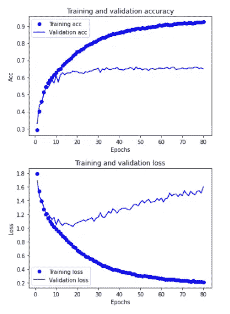

用于培训和验证的准确性和损失图

# 绘制洞察力

图表清楚地证实了我们应该在 10 个时期左右停止训练，因为在 10 个时期之后，我们的模型没有真正的改善。
因此，过度拟合模型的主要收获是训练大约 10-12 个时期并评估结果。这正是我们接下来要做的！
但是在运行另一个模型之前，让我们从过度拟合的模型中进行一些预测，以将其与我们稍后将创建的模型进行比较。

## 根据过度拟合的模型进行预测

我从谷歌上随机下载了不同情绪的图片，然后用我的过度拟合模型进行了测试。
下面显示的是我从谷歌获得的随机图片的输出图片。

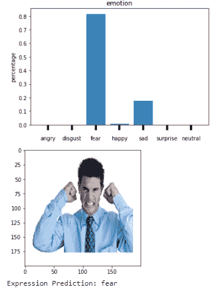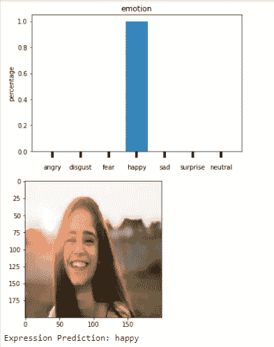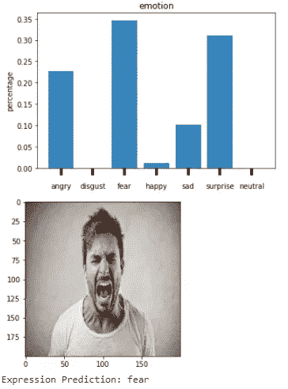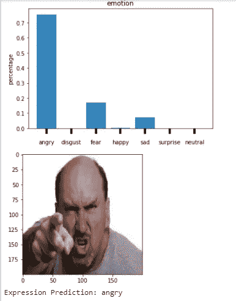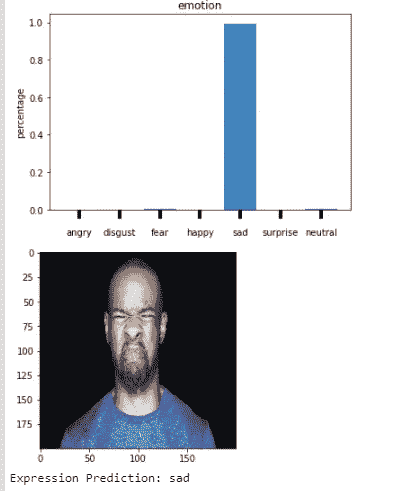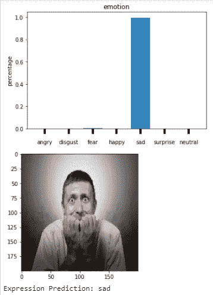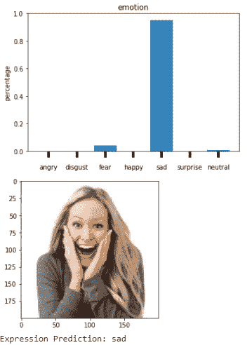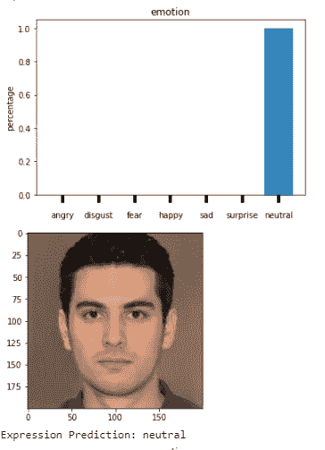

模型预测

如你所见，我们的模型没有准确预测所有的情绪。
在第一幅和第三幅图像中，它被错误地归类为**恐惧。** 我尝试了很多**厌恶**的图像，但是没有一个图像能归为一类。我认为数据还不足以进行分类，所以我们可以删除这些行，以便稍后进行实验，但是现在，我们不会删除它。
条形图还有助于我们分析模型最容易混淆的地方。根据我的发现，它很难检测出**愤怒**、**惊讶、**和**恐惧**的情绪，因为由于相同的地标，它不能很好地区分这些情绪。

现在让我们运行 12 个时期的模型，并根据该模型进行预测，以进一步加强我们的分析。

# 重新运行 12 个时期的优化模型

```
# Running model for 12 epochs
model_2 = base_model()
hist_2 = model_2.fit(train_X, Y_train,
batch_size=64,
epochs=12,
verbose=1,
validation_data=(val_X, Y_val),
shuffle=True,)
```

这是我们在 12 个时代结束时得到的结果。

```
Epoch 12/12 449/449 [==============================] - 33s 73ms/step - loss: 0.9368 - accuracy: 0.6493 - val_loss: 1.0876 - val_accuracy: 0.5932
```

现在让**绘制它**

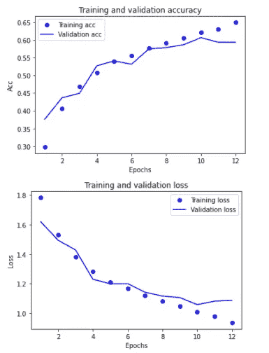

所以，现在我们已经摆脱了过度拟合。验证精度约为 0.59，这在正常情况下较低，但在这个数据集上，我认为是足够的精度。

让我们保存模型，并在从 google 下载的相同图像上绘制预测。

## 从模型中得出预测

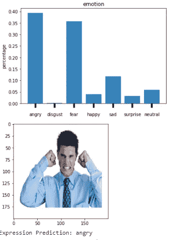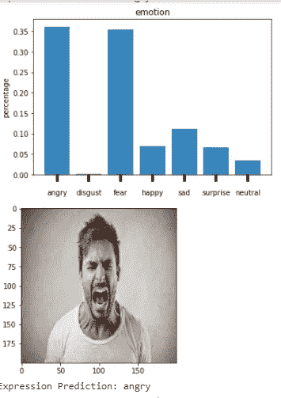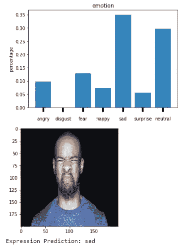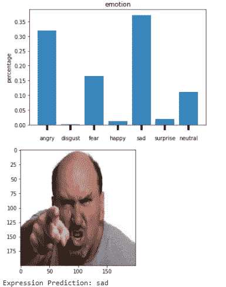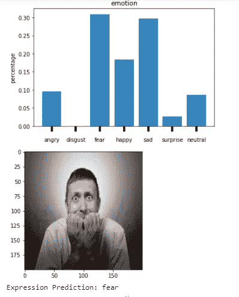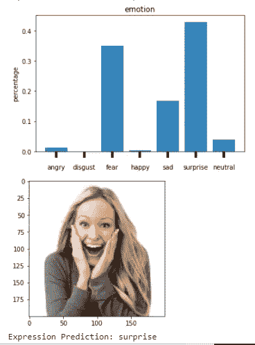

**宾果**！我们的最终模型似乎能很好地区分不同的情绪。
正如你在上面的预测中看到的，它现在能够识别愤怒情绪，而以前它认为这是恐惧。此外，它还能够预测最后一张图片中的惊喜情绪。

尽管模型精度有所提高，但仍然不够精确，更好的模型结构肯定会有所帮助。

# 要点和未来改进

如果我们仔细分析预测信心，我们可以清楚地看到，我们的模型似乎仍然混淆在愤怒，惊讶和恐惧之间。
还应该注意的是**厌恶**情绪从来没有被预测过，所以移除这些行不会有什么坏处。

对未来工作的另一个建议可以是从互联网上收集不同人类情绪的图像，并为这些情绪制作不同的目录。我们可以利用 TensorFlow 的图像生成器库来扩充图像并创建我们自己的数据集。
最后，我们可以使用迁移学习或预训练网络，并在底部附加我们的卷积和分类器，并进行预测。

# 结论

非常感谢你对我和这篇文章坚持了这么长时间。我知道这太长了，但是，我认为分享我的宝贵见解可能会帮助一些深度学习爱好者对手头的任务产生更好的直觉。

这篇文章的完整代码可以在这里找到[。](https://github.com/Nabeel110/Emotion-Recognition)

最后，我期待您对这篇文章的反馈。