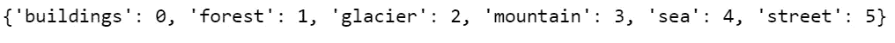
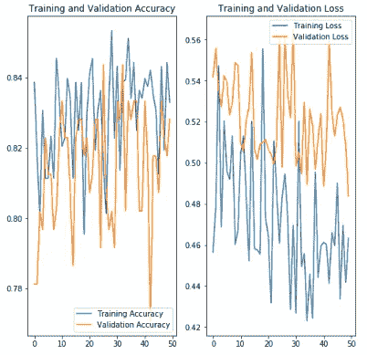
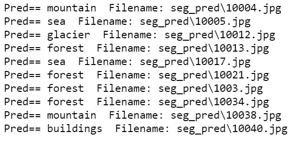
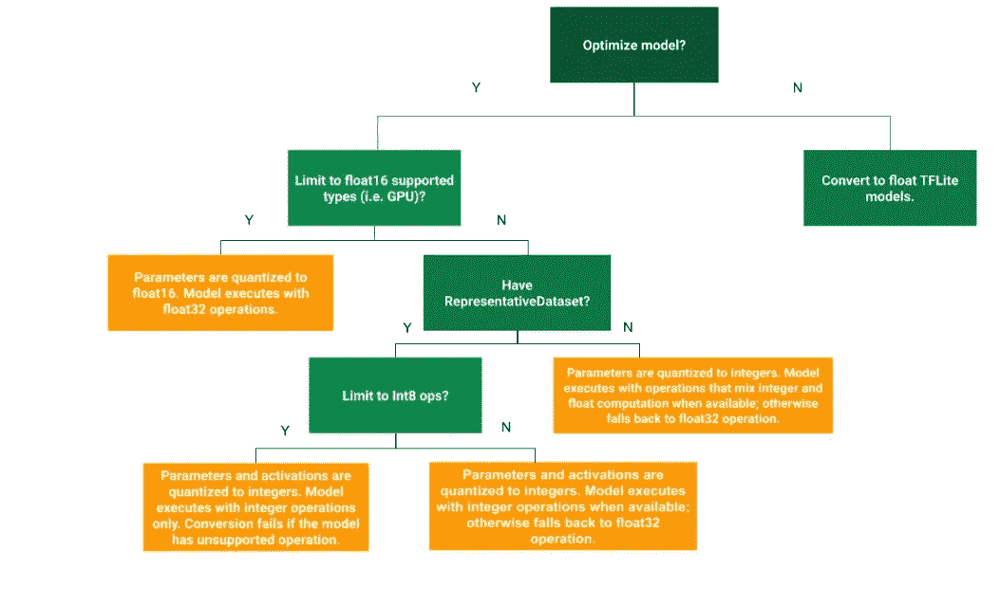
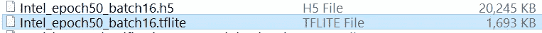
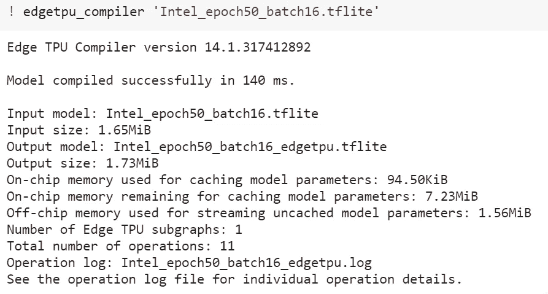
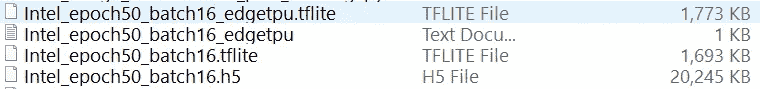
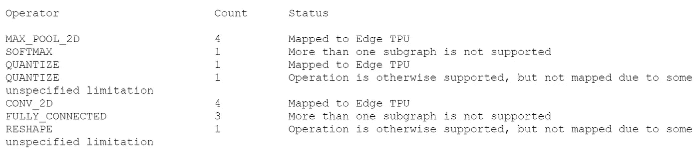
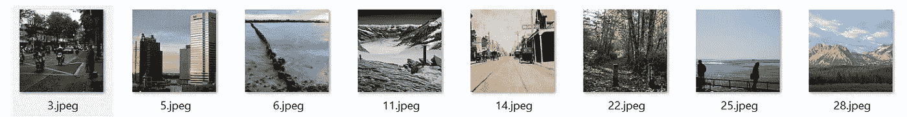
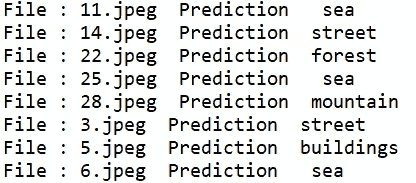

# 一步一步的指导在边缘深度学习中举一反三

> 原文：<https://pub.towardsai.net/step-by-step-guide-to-make-inferences-from-a-deep-learning-at-the-edge-c1b18ee8ba2c?source=collection_archive---------3----------------------->

## [深度学习](https://towardsai.net/p/category/machine-learning/deep-learning)

## 了解使用 TPU USB 加速器在边缘部署深度学习模型的步骤

***在本文中，您将学习在 Tensorflow 中创建深度学习模型，创建一个训练后量化的 tflite 模型，然后为一个 Edge TPU 设备进行编译。***

随着工厂或社区中使用的物联网设备的出现，我们正处于一个以信息为中心的时代。从这些物联网设备生成的数据成倍增加了对计算能力和近实时推理的需求。

[**边缘计算**](https://towardsdatascience.com/edge-computation-101-2c1823656940) **直接在生成数据的设备上完成，这降低了对网络的依赖性，从而减少了延迟。数据也是安全的，因为它不会传输到其他设备或网络进行处理。**

这里使用的数据集是来自 Kaggle 的[英特尔图像分类](https://www.kaggle.com/puneet6060/intel-image-classification/version/2)

数据集有 6 类:**建筑、森林、冰川、山脉、海洋和街道**

简而言之，我们将按照这些**步骤在边缘 TPU 设备**上部署模型


1.  **创建模型**
2.  **训练模型**
3.  **保存模型**
4.  **应用培训后量化**
5.  **将模型转换为 TensorFlow Lite 版本**
6.  **使用 edge TPU 编译器编译 tflite 模型，用于 Coral Dev board 等 Edge TPU 设备到 TPU USB 加速器**
7.  **在边缘部署模型进行推理**

**通过两个选项可以对 TPU 进行边缘推断**

1.  **边缘 TPU API 或**
2.  **TensorFlow Lite API**

****

## **第一步:使用 TensorFlow 1.15 或更高版本创建深度学习模型。**

**导入所需的库**

```
from numpy.random import seed
import random**import numpy as np
import pandas as pd
import os 
import glob
import shutil****from PIL import Image
import tensorflow as tf
from tensorflow.keras.models import Sequential
from tensorflow.keras.layers import Dense, Conv2D, Flatten, Dropout, MaxPooling2D, BatchNormalization
from tensorflow.keras.preprocessing.image import ImageDataGenerator, img_to_array, load_img, array_to_img
from tensorflow.keras.models import load_model
from tensorflow.keras import optimizers, callbacks
import tensorflow_model_optimization as tfmot**
```

**创建训练和验证数据集**

```
#setting the train, test and val directories
**train_dir = r'\Intel_Images\seg_train\seg_train'
test_dir = r'\Intel_Images\seg_pred'
val_dir = r'\Intel_Images\seg_test\seg_test'**#setting basic parameters for the model
**IMG_WIDTH=100
IMG_HEIGHT=100
IMG_DIM = (IMG_HEIGHT, IMG_WIDTH)
input_shape = (IMG_HEIGHT, IMG_WIDTH ,3)
batch_size = 4
epochs = 25**#Apply image Augmentation to the Training dataset
#will generate batches of tensor image data with real-time data augmentation
**image_gen_train = ImageDataGenerator(rescale=1./255,                                     zoom_range=0.3, rotation_range=25,                                    shear_range=0.1,featurewise_std_normalization=False)****train_data_gen = image_gen_train.flow_from_directory(batch_size=batch_size,                                                     directory=train_dir,                                                     shuffle=True,                                                     target_size=IMG_DIM,                                                     class_mode='sparse')**#Generate the validation dataset
**image_gen_val = ImageDataGenerator(rescale=1./255)****val_data_gen = image_gen_val.flow_from_directory(batch_size=batch_size,
directory=val_dir,                                                 target_size=IMG_DIM,                                                 class_mode='sparse')**
```

打印类名和类索引

```
**class_names = list(train_data_gen.class_indices.keys())
print(train_data_gen.class_indices)**
```



## 步骤 2:创建模型，编译和训练模型

```
#Create the deep learning model for 6 classes **model = Sequential()
model.add(Conv2D(16, kernel_size=(3, 3), activation='relu', 
                 input_shape=(IMG_HEIGHT, IMG_WIDTH ,3)))
model.add(MaxPooling2D(pool_size=(2, 2)))
model.add(Conv2D(64, kernel_size=(3, 3), activation='relu'))
model.add(MaxPooling2D(pool_size=(2, 2)))
model.add(Dropout(0.2))
model.add(Conv2D(128, kernel_size=(3, 3), activation='relu'))
model.add(MaxPooling2D(pool_size=(2, 2)))
model.add(Flatten())
model.add(Dense(128, activation='relu'))
model.add(Dropout(0.2))
model.add(Dense(6, activation='softmax'))**#Compile the model using Adam optimizer
**model.compile(optimizer=optimizers.Adam(lr=0.0001),
              loss='sparse_categorical_crossentropy',
              metrics=['accuracy'])**# Train the model
**history = model.fit_generator(
    train_data_gen,
    steps_per_epoch=len(train_data_gen)/batch_size,
    epochs=10,
    validation_data=val_data_gen,
    validation_steps=len(val_data_gen)/batch_size
)**
```

我已经训练这个模型 50 个纪元了。

可视化 50 个时期的训练和验证数据集的准确性。

```
**acc = history.history['acc']
val_acc = history.history['val_acc']****loss = history.history['loss']
val_loss = history.history['val_loss']****epochs_range = range(epochs)****plt.figure(figsize=(8, 8))
plt.subplot(1, 2, 1)
plt.plot(epochs_range, acc, label='Training Accuracy')
plt.plot(epochs_range, val_acc, label='Validation Accuracy')
plt.legend(loc='lower right')
plt.title('Training and Validation Accuracy')**
```



**使用测试数据集测试模型，使用一些随机图像**

```
#printing class names
**class_names = list(train_data_gen.class_indices.keys())**# Creating the test dataset
**test_data_gen = image_gen_val.flow_from_directory(batch_size=1,
                                                 directory=test_dir,
                                               target_size=IMG_DIM,
                                               class_mode='sparse')**
```

**预测来自测试数据生成器的前 10 幅图像**

```
**#predicting 10 images from test_data_gen
nb_samples = 10
predict = model.predict_generator(test_data_gen,steps = nb_samples)****pred_idx = []
for index, result in enumerate(predict, 0):
    pred_idx.append(class_names[np.argmax(predict[index])])
    print("Pred==",class_names[np.argmax(predict[index])] + "  Filename: " + test_data_gen.filenames[index])**
```



## **第三步:保存模型**

保存的模型在单个文件中序列化模型的架构、权重和偏差以及训练配置。保存的模型可以很容易地用于共享或部署模型。

```
**model.save('Intel_epoch50_batch16.h5')**
```

**步骤 4:应用训练后量化**

我们将量化应用于模型，因为边缘的模型需要轻量级以实现低延迟。轻量级模型减少了进行推理所需的计算量。

**TFlite 量化模型**

*   **在边缘设备上占用更少空间。**
*   **在带宽较低的网络上下载速度较快**
*   **占用更少的内存，让模型更快地做出推论**

****

TensorFlow 保存的模型存储了包含计算操作、激活函数、权重和偏差的图表。激活函数、权重和偏差是 32 位浮点。

**量化将用于表示张量流模型不同参数的数字的精度从 float 32(32 位浮点)降低到 int(8 位)，这使得模型变得轻量级**

**权重和激活都可以通过转换为整数来量化，这将提供低延迟、更小的尺寸和降低的功耗。**

下面的决策树将指导您了解哪种培训后量化最适合您的用例



来源:[https://www . tensor flow . org/lite/performance/post _ training _ quantization # full _ integer _ quantization _ of _ weights _ and _ activations](https://www.tensorflow.org/lite/performance/post_training_quantization#full_integer_quantization_of_weights_and_activations)

我们将创建一个代表性数据集，并对输入和输出实施全整数量化。

代表性数据集有助于获得准确的激活动态范围。为了支持多个输入，每个代表性数据点都是一个列表，列表中的每个元素都根据其索引提供给模型

```
**def representative_data_gen():
  dataset_list = tf.data.Dataset.list_files(test_dir + '\\*')
  for i in range(100):
    image = next(iter(dataset_list))
    image = tf.io.read_file(image)
    image = tf.io.decode_jpeg(image, channels=3)
    image = tf.image.resize(image, (100,100))
    image = tf.cast(image / 255., tf.float32)
    image = tf.expand_dims(image, 0)**# Model has only one input so each data point has one element
    **yield [image]**
```

## 步骤 5:转换为 Tflite 版本

```
**keras_model='Intel_epoch50_batch16.h5'**#For loading the saved model and tf.compat.v1 is for compatibility with TF1.15 **converter=tf.compat.v1.lite.TFLiteConverter.from_keras_model_file(keras_model)** # This enables quantization
**converter.optimizations = [tf.lite.Optimize.DEFAULT]**# This ensures that if any ops can't be quantized, the converter throws an error
**converter.target_spec.supported_ops = [tf.lite.OpsSet.TFLITE_BUILTINS_INT8]**# Set the input and output tensors to uint8
**converter.inference_input_type = tf.uint8
converter.inference_output_type = tf.uint8**# set the representative dataset for the converter so we can quantize the activations
**converter.representative_dataset = representative_data_gen
tflite_model = converter.convert()**#write the quantized tflite model to a file
**with open('Intel_class.tflite', 'wb') as f:
  f.write(tflite_model)**with open('Intel_epoch50_batch16.tflite', 'wb') as f:
  f.write(tflite_model)
```



您可以看到保存的 Keras 模型和 tflite 模型之间巨大的大小差异

## 步骤 6:使用 edge TPU 编译器编译 tflite 模型

为了给 [Edge TPU](https://coral.ai/docs/edgetpu/api-intro/#install-the-library-and-examples) 编译 Tflite 模型，我们需要完成以下安装。

```
# Install compiler
**! curl https://packages.cloud.google.com/apt/doc/apt-key.gpg | sudo apt-key add -****! echo "deb https://packages.cloud.google.com/apt coral-edgetpu-stable main" | sudo tee /etc/apt/sources.list.d/coral-edgetpu.list****! sudo apt-get update****! sudo apt-get install edgetpu-compiler**
```

然后使用 Edge TPU 编译器编译 TFlite 模型



这将生成两个文件，一个 Edgetpu tflite 和一个日志文件。



日志文件将提到有多少操作将在 TPU 上执行，有多少操作将在 CPU 上运行。



Edgetpu 日志文件

**步骤 7:在边缘部署模型进行推理**

```
**import tflite_runtime.interpreter as tflite
from tflite_runtime.interpreter import Interpreter
from tflite_runtime.interpreter import load_delegate**
 **compute='TPU'
test_dir=r'\images'
intel_class=['buildings', 'forest', 'glacier', 'mountain', ' sea', 'street']****def set_input_tensor(interpreter, input):
  input_details = interpreter.get_input_details()[0]
  tensor_index = input_details['index']
  input_tensor = interpreter.tensor(tensor_index)()[0]
  scale, zero_point = input_details['quantization']
  input_tensor[:, :] = np.uint8(input / scale + zero_point)**

**def classify_image(interpreter, input):
  set_input_tensor(interpreter, input)
  interpreter.invoke()
  output_details = interpreter.get_output_details()[0]
  output = interpreter.get_tensor(output_details['index'])
  # Outputs from the TFLite model are uint8, so we dequantize the results:
  scale, zero_point = output_details['quantization']
  output = scale * (output - zero_point)
  top_1 = np.argmax(output)
  return top_1, output****for file in os.listdir(test_dir):

    image_file = os.path.join(test_dir,  file)
    test_imgs=img_to_array(load_img(image_file, target_size=(100,100,3)))
    test_imgs = np.array(test_imgs)
    test_imgs = test_imgs.astype('float32')
    test_imgs = tf.cast(test_imgs / 255., tf.float32)    
    #test_imgs = tf.expand_dims(test_imgs, 0)

    if compute=='TPU': 
       interpreter = tflite.Interpreter('Intel_epoch50_batch16_edgetpu.tflite',
                                 experimental_delegates=[tflite.load_delegate('edgetpu.dll')])
    else:
        interpreter = tflite.Interpreter('Intel_epoch50_batch16.tflite')
    interpreter.allocate_tensors()
    interpreter.get_input_details()
    prediction, results = classify_image(interpreter,test_imgs )
    print("File :", file, " Prediction ", intel_class[prediction])**
```



输入图像



来自边缘 TPU 的预测

## 参考资料:

[](https://www.tensorflow.org/model_optimization/guide/quantization/post_training) [## 训练后量化|张量流模型优化

### 训练后量化包括一般技术，以减少 CPU 和硬件加速器的延迟，处理…

www.tensorflow.org](https://www.tensorflow.org/model_optimization/guide/quantization/post_training) [](https://www.tensorflow.org/lite/performance/post_training_integer_quant) [## 训练后整数量化| TensorFlow Lite

### TensorFlow Lite 现在支持在转换时将所有模型值(权重和激活)转换为 8 位整数…

www.tensorflow.org](https://www.tensorflow.org/lite/performance/post_training_integer_quant) [](https://coral.ai/docs/edgetpu/api-intro/#install-the-library-and-examples) [## 边缘 TPU Python API 概述| Coral

### 目前，我们提供了两种在边缘 TPU 上执行推理的独立方式:使用边缘 TPU API 或使用…

coral.ai](https://coral.ai/docs/edgetpu/api-intro/#install-the-library-and-examples) 

[https://colab . research . Google . com/github/Google-coral/tutorials/blob/master/retrain _ classification _ ptq _ tf2 . ipynb # scroll to = w9 ydamhghuzl](https://colab.research.google.com/github/google-coral/tutorials/blob/master/retrain_classification_ptq_tf2.ipynb#scrollTo=w9ydAmHGHUZl)