# PyTorch 中定制图像数据的 GANs 的逐步实现:第 2 部分

> 原文：<https://pub.towardsai.net/step-by-step-implementation-of-gans-on-custom-image-data-in-pytorch-part-2-182f2fa16114?source=collection_archive---------1----------------------->

## [深度学习](https://towardsai.net/p/category/machine-learning/deep-learning)

## 了解 GAN 架构中的不同层，调试一些常见的运行时错误，并深入了解用 PyTorch 编写代码背后的直觉。


图片来自[com break](https://pixabay.com/users/comfreak-51581/?utm_source=link-attribution&utm_medium=referral&utm_campaign=image&utm_content=1947878)来自 [Pixabay](https://pixabay.com/?utm_source=link-attribution&utm_medium=referral&utm_campaign=image&utm_content=1947878)

在关于 GANs 的第 1 部分 中，我们开始建立直觉，关于 GANs 是什么，为什么我们需要它们，以及训练 GANs 背后的整个要点是如何创建一个生成器模型，该模型知道如何将随机噪声向量转换成(漂亮的)*几乎*真实的图像。因为我们已经在第 1 部分中深入讨论了伪代码，所以一定要检查一下，因为会有很多对它的引用！

如果你想继续下去，这里有 [**Github 笔记本**](https://github.com/V-Sher/GANs_Pytorch) 包含使用 PyTorch 框架训练 GANs 的源代码。

> 训练 GAN 网络背后的整个思想是获得生成器网络(具有最优的模型权重和层等)。)很擅长吐出看起来像真的假货！

*注:我想花一点时间来真正欣赏 Nathan Inkawhich，他写了一篇精彩的文章* *，解释了 DCGANs 的内部工作原理，以及 Pytorch 的官方库*[***Github***](https://github.com/pytorch/examples/tree/master/dcgan)*，帮助我实现代码，特别是生成器和鉴别器的网络架构。希望我在这篇文章中给出的解释能够帮助你获得关于 GANs 的更进一步的清晰(比前面提到的博客中已经给出的更清晰),并在你自己的用例中更好地实现它们！*

# 准备图像数据集

我开始写这篇文章的主要原因之一是因为我想尝试在自定义图像数据集上编码 GANs。我遇到的大多数教程都使用了一个流行的数据集(如 MNIST、CIFAR-10、Celeb-A 等),这些数据集预装在框架中，可以开箱即用。相反，我们将使用 Kaggle 上的[人脸数据集](https://www.kaggle.com/ashwingupta3012/human-faces)，它包含大约 7k 张图片——有各种各样的侧面/正面姿势、年龄组、性别等——这些图片都是从网上搜集来的。

将图像文件夹(名为`Humans`)解压并加载到当前工作目录后，让我们开始在 Jupyter 笔记本中编写代码:

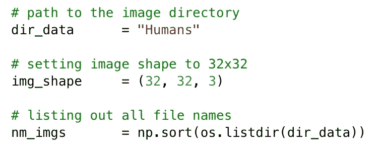

为了便于处理，我们将高清图像缩小到了更小的分辨率，即 32x32。一旦您完成了本教程，您就可以在更改了`img_shape`参数和其他一些东西(我们将在文章末尾讨论)之后重新运行代码。

接下来，我们将把所有的图像转换成 NumPy 数组，并把它们一起存储到`X_train`中。同样，显式地将图像转换成 RGB 格式总是一个好主意(以防某些图像*看起来*是灰度级，但实际上不是！).

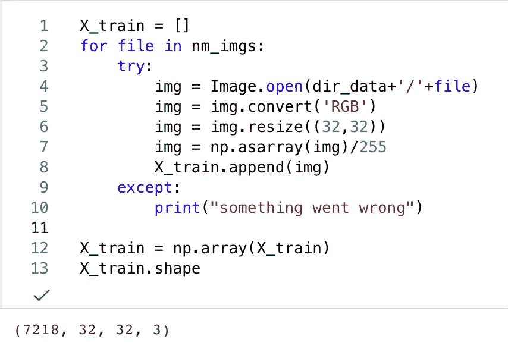

注意:有些文件名不包含任何图像(或者肯定是损坏的)，这就是为什么我在编码时倾向于使用 try-except 块。

*注意:将图像转换为各自的 NumPy 格式可能需要一段时间。因此，最好将* `*X_train*` *作为* `*.npy*` *文件存储在本地以备将来使用。为此:*

```
from numpy import asarray
from numpy import savez_compressed*# save to npy file*
savez_compressed('kaggle_images_32x32.npz', X_train)
```

要在以后重新加载文件:

```
*# load dict of arrays* dict_data = np.load('kaggle_images_32x32.npz')*# extract the first array* data = dict_data['arr_0']*# print the array* print(data)
```

# 导入库

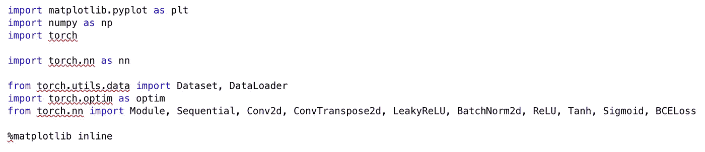

# 设置 GPU 支持

虽然我们今天正在编写的代码可以在 CPU 和 GPU 上运行，但是检查可用性并尽可能使用后者总是明智的。

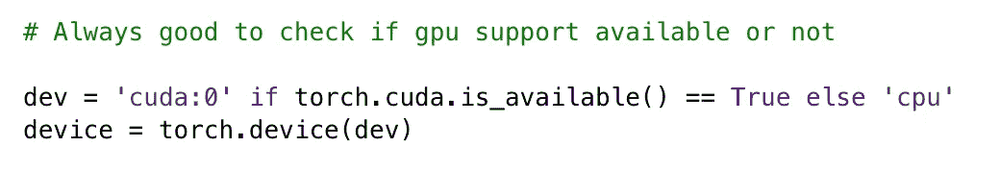

使用`torch.cuda.is_available()`检查 GPU 是否可用，如果可用，使用`torch.device`功能将其设置为设备。

# 定义助手功能

我们主要需要一个助手函数`plot_images()`，它接受一个 NumPy 图像数组作为输入，并在一个 5x5 的网格中显示图像。

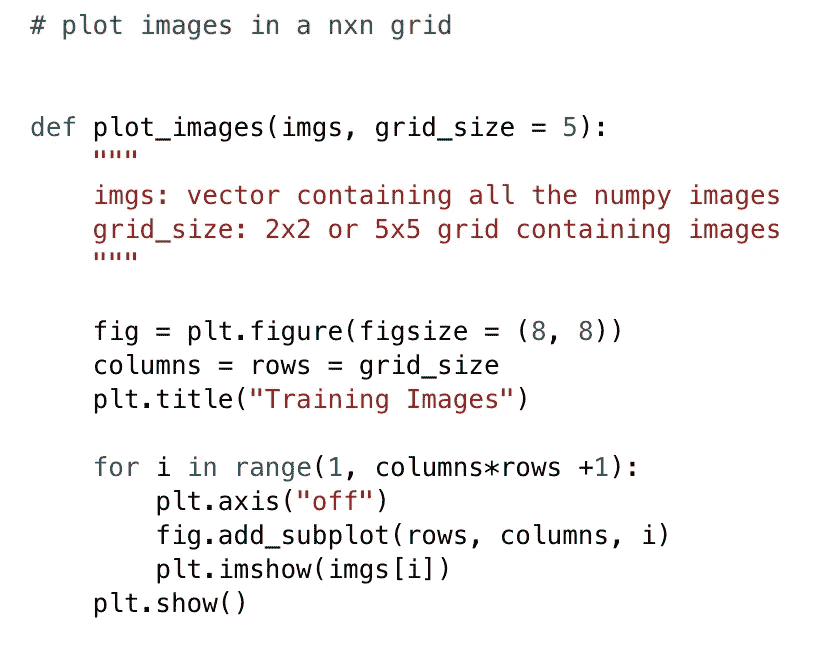

为了以网格网络的形式布局图像，我们为每个要显示的图像在绘图区域添加了一个子绘图。使用`fig.add_subplot`，子情节将在具有`r`行和`*c*`列的网格上占据具有位置的*。最后，可以使用`plt.show()`显示整个网格。*

为了查看我们的功能是否如预期的那样工作，我们可以显示一些来自我们的训练集的图像:

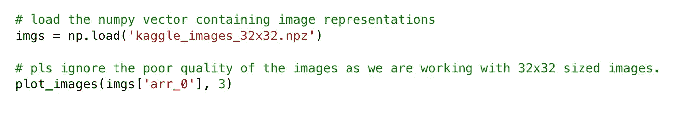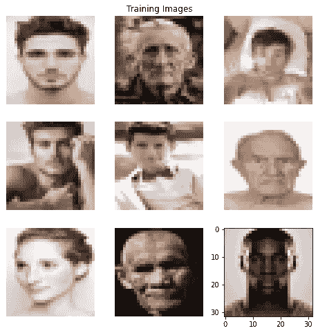

*注意:请忽略失真的质量(与我们在 Kaggle 上看到的原始数据相比)，因为我们使用的是 32x32 的图像，而不是高分辨率的图像！*

# 正在准备自定义数据集类

我知道你在想什么— *为什么我需要为我的数据集创建一个特殊的类？按原样使用我的数据集有什么问题？*

嗯，简单的答案是 PyTorch 就是这么喜欢它的！要获得详细的答案，你可以在这里阅读这篇文章，它很好地解释了如何使用 PyTorch 中的`torch.utils.data.Dataset`类为任何数据集创建一个定制的`Dataset`对象。

> 在非常基础的层面上，你为自己的数据集扩展的`Dataset`类应该有`__init__`、`__len__()`和`__getitem__` 方法。

如果您需要进一步帮助创建数据集类，请查看 PyTorch 文档[这里](https://pytorch.org/tutorials/beginner/data_loading_tutorial.html#dataset-class)。

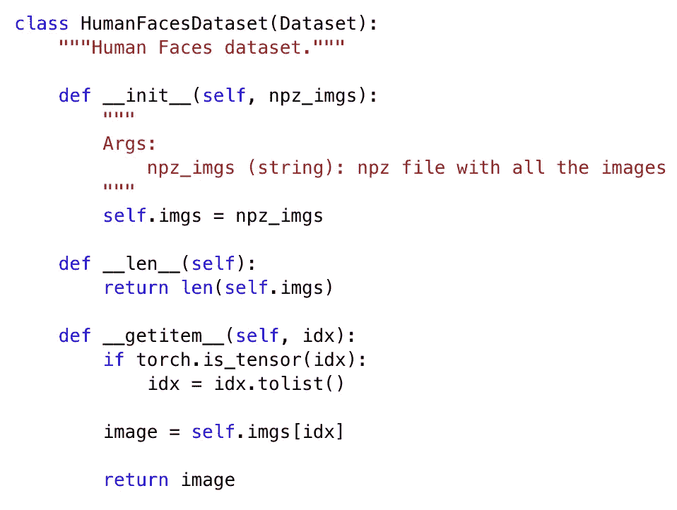

# 创建数据加载器以加载图像

再说一遍— *我到底为什么需要数据加载器？*

在[文档](https://pytorch.org/docs/stable/data.html#module-torch.utils.data)页面列出的许多原因中，例如定制数据加载顺序和自动内存锁定——数据加载器对于创建作为模型输入发送的批次(用于训练和测试集)非常有用。

PyTorch 中定义数据加载器的方式如下:

```
dataloader = DataLoader(dataset = dset, batch_size = batch_size, shuffle = shuffle)
```

`dset`基本上是我们之前创建的`HumanFacesDataset`类的一个对象。让我们定义它，以及我们的`batch_size`和`shuffle`变量。

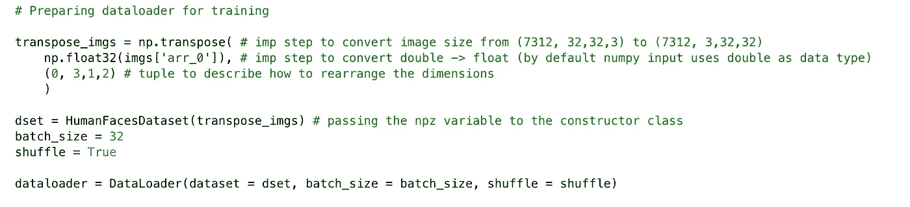

需要注意的重要一点是，在为类创建构造函数时，我们并不是简单地将图像数组传递给它。相反，我们传递对原始图像数组执行了一些计算的`transpose_imgs`。主要是，我们将

*   (a)使用`np.float32()`显式地将图像表示设置为 float 这是因为默认情况下 NumPy 输入使用 double 作为数据类型(您可以使用`imgs['arr_0'][0].dtype`对单个图像验证这一点，输出将是`float64`)并且我们将创建的模型将具有权重为`float32`；和
*   (b)我们使用`np.tranpose()`将每个图像的尺寸从(32 x 32 x 3)重新排序为(3 x 32 x 32 ),因为这是 PyTorch 模型中的图层预期的尺寸。

最后，我们选择一个小的`batch_size`，并将`shuffle`设为`True`，以排除在数据收集时出现任何偏差的可能性。

# 定义生成器类

正如在第 1 部分中所讨论的，生成器是一个神经网络，它试图产生(希望)逼真的图像。为此，它将一个随机噪声向量 *z* 作为输入(比如一个大小为 100 的向量；其中 100 的选择是任意的)，使其通过网络中的几个隐藏层，并最终输出与训练图像大小相同的 RGB 图像，即形状张量(3，32，32)。

坦率地说，我花了一段时间来掌握应该放入我的生成器类的层(以及相关参数值)的精确排列和组合。简单地说，我们将只使用以下几层:

*   ConvTranspose2d 是 MVP，它将帮助您对随机噪声进行上采样，以创建图像，即从 100x1x1 到 3x32x32。
    从[文档](https://pytorch.org/docs/stable/generated/torch.nn.ConvTranspose2d.html)中，可以看到它采用了以下形式:

```
ConvTranspose2d(in_channels, out_channels, kernel_size, stride, padding, bias)
```

*   顾名思义，BatchNorm2d 层用于对输入应用批处理规范化。根据[文档](https://pytorch.org/docs/stable/generated/torch.nn.BatchNorm2d.html)，它将特征的数量或`num_features`作为输入，这可以根据前一层的输出形状很容易地计算出来。主要是，如果期望输入的大小为(N，C，H，W) ，i **ts 值为 *C* 。例如，如果前一层的输出形状是`batch_size, 512, 4, 4)`，那么就是`num_features = 512`。**
*   ReLU 或整流线性单元是发电机网络中使用的激活功能。简单来说，这一层如果是正的就直接输出输入，否则输出零。
*   Tanh 是另一个激活函数，应用于发电机网络的最末端，将输入转换到[-1，1]范围。

最后，具有上述所有层的生成器类看起来会像这样。如果你需要一个关于如何在 Pytorch 中创建网络的初学者指南，请点击这里查看这篇文章。

> 在一个非常基本的层面上，你为自己的网络模型扩展的`*Module*`类应该有`*__init__*`和`*forward*` 方法。

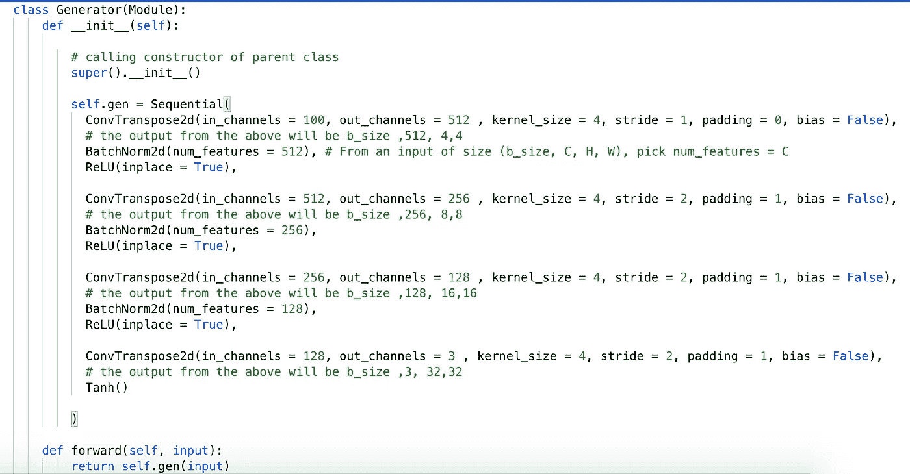

*注意:了解该网络内部的情况非常重要，因为如果您想要处理图像，比如大小为 64x64 或 128x128 的图像，则必须更新该架构(主要是相关参数)!*

首先，我们正在创建一个连续的模型，它是一个线性的层叠。也就是说，每一层的输出充当下一层的输入。

在第一个卷积中，我们从花费 100 `input_channels`的`ConvTranspose2d`层开始。为什么是 100？你可能会问。这是因为发生器网络的输入将是类似于`batch_size, 100, 1, 1`的东西，根据 PyTorch 的说法，这大致相当于 100 个通道的 1x1 图像。因此，这许多通道将进入`ConvTranspose2d`层，因此，`in_channels = 100`。

将`out_channels`设置为 512 背后的逻辑完全是任意的，这是我从一开始提到的教程/博客中获得的。这个想法是在开始的时候为`out_channels`选择一个大的数字，随后，为每个`ConvTranspose2d`层减少这个数字(减少 2 倍),直到你到达可以设置`out_channels = 3`的最后一层，这是我们生成 32x32 大小的 RGB 图像所需的精确通道数。

现在，该层的输出将具有空间大小`b_size, out_channels, height, width)`，其中高度和宽度可以根据[文档](https://pytorch.org/docs/stable/generated/torch.nn.ConvTranspose2d.html)页面上给出的公式进行计算。

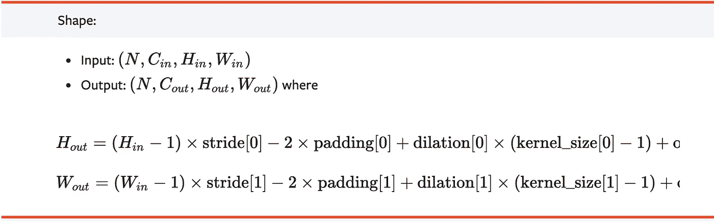

[来源](https://pytorch.org/docs/stable/generated/torch.nn.ConvTranspose2d.html)

在上面的公式中代入各自的值，我们得到:

*H _ out =(1–1)* 1–2 * 0+1 *(4–1)+0+1；和
W _ out =(1–1)* 1–2 * 0+1 *(4–1)+0+1*

或者，
*H _ out = 4
W _ out = 4*

这就是你所看到的空间大小(如上面代码中的注释所示):

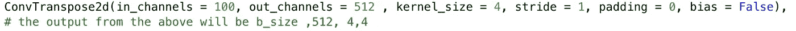

现在，如果你不是一个数学奇才或觉得有点懒做上述计算，你甚至可以通过简单地创建一个虚拟生成器网络，并传递给它任何随机输入来检查层的输出。

例如，我们将创建一个只有第一个卷积层的虚拟网络:

```
class ExampleGenerator(Module): def __init__(self):
          # calling constructor of parent class
          super().__init__()
          self.gen = Sequential(
              ConvTranspose2d(
              in_channels = 100, 
              out_channels = 512 , 
              kernel_size = 4, 
              stride = 1, 
              padding = 0, 
              bias = False)
              ) def forward(self, input):
           return self.gen(input)*# defining class object*
ex_gen = ExampleGenerator() *# defining random input for the model: b_size = 2 here
t = torch.randn(2, 100, 1, 1)**# checking the shape of the output from model
ex_gen(t).shape****************** OUTPUT ***********
(2, 512 , 4 , 4)
```

我们遇到的下一层是`BatchNorm2d`。现在，如果你已经仔细阅读了教程，你应该很清楚为什么`num_features`被设置为 512。概括地说，这是因为前一层的输出具有空间大小`(b_size, 512, 4 , 4)`。

最后，我们以 ReLU 激活来结束第一个(四个)卷积。

其余的三个回旋或多或少遵循相同的模式。我强烈建议您手动测试这些计算，看看输入的空间大小在通过图层时是如何变化的。这将有助于您在处理不同大小的图像数据集(即 32x32x3 以外的图像)时，正确设置发生器和鉴别器网络中的`in_channels`、`out_channels`、`stride`、`kernel`等的值。

这里需要注意的重要一点是，`BatchNorm2d`、`ReLU`和`Tanh`层不会改变输入的空间大小，这就是网络中第二个`ConvTranspose2d`层从`in_channels = 512`开始的原因。

# 定义鉴别器类

正如在第 1 部分中所讨论的，鉴别器本质上是一个二进制分类网络，它将图像作为输入，并返回输出是真实的(而不是虚假的)的标量概率。

鉴频器网络中涉及的主要层如下:

*   Conv2d:与有助于放大图像的`ConvTranspose2d`层相反，`Conv2d`层有助于缩小图像，例如，将图像尺寸从 32x32 缩小到 16x16 再缩小到 8x8 等等..一直继续下去，直到剩下 1×1，即一个标量值。
*   LeakyReLU:使用`LeakyReLU`超过`ReLU`层的一个主要优点是它解决了[消失渐变问题](https://www.youtube.com/watch?v=qO_NLVjD6zE)。更简单地说，当输入为负时，`ReLU`层将输出 0，而`LeakyReLU`将输出非零值。因此，当输入为负时，`LeakyReLU`将有助于小梯度更新(而不是零梯度),因此模型可以继续学习和更新。

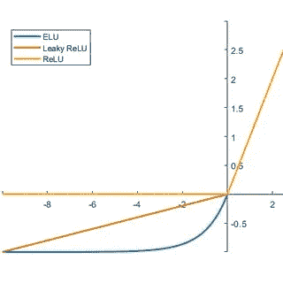

泄漏 Relu vs Relu [ [来源](https://www.google.com/url?sa=i&url=https%3A%2F%2Fwww.researchgate.net%2Ffigure%2FIllustration-of-output-of-ELU-vs-ReLU-vs-Leaky-ReLU-function-with-varying-input-values_fig8_334389306&psig=AOvVaw23dYxYPclBhjtVuFBFTu_5&ust=1610101312589000&source=images&cd=vfe&ved=0CAIQjRxqFwoTCOjBhvjMie4CFQAAAAAdAAAAABAU)

*   Sigmoid:这是另一个激活层，我们通过它传递输入，在[0，1]范围内转换数据。

最后，这是 discriminator 类的样子:

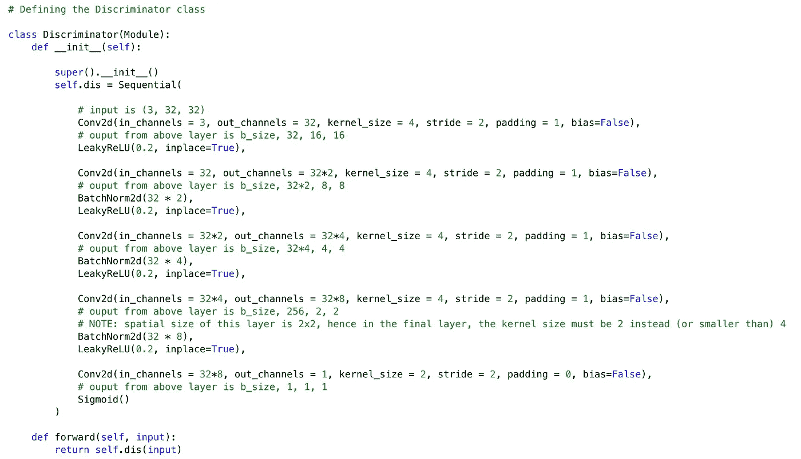

它可能看起来非常类似于发电机网络，在某种意义上确实如此。也就是说，我们再次使用包含四个步长卷积的顺序网络。但是，我们现在处理的是`Conv2d`层，而不是`ConvTranspose2d`层。在每一个图像中，我们设置`out_channels`最初取一个小值，然后逐渐增加 2 倍，直到达到我们想要的 1×1 图像(即*H _ out*=*W _ out*= 1)，此时我们设置`out_channels = 1`。

这里需要注意的一点是，进入最后一个卷积层的输入的形状是`(b_size, 256, 2, 2)`。因为`kernel_size`必须始终小于输入的空间大小(在本例中为 2x2)，所以我们必须为最后一层设置`kernel_size = 2`(与前几层的`kernle_size = 4`相反)。否则将导致运行时错误！

您可能想知道，作为鉴别器输出的标量值发生了什么，而我们这里有一个形状为`b_size, 1, 1, 1`的张量(即最后一层的输出)。好消息是，我们可以使用`view(-1)`很容易地将其转换成包含`b_size`值的单个向量。例如，`t.view(-1)`将形状`(2,1,1,1)`的四维张量`t`重新整形为只有两个值的一维张量。我们将在后面的章节中看到它的实际应用！

现在我们已经为两个网络定义了类，我们可以为它们初始化一个对象。

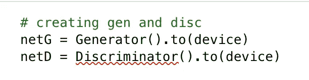

# 初始化权重和偏差

用随机权重初始化神经网络而不是让它们都为 0 是很重要的。这是因为具有相同初始权重的所有神经元将在训练期间学习相同的特征，即在后续迭代期间权重将是相同的。简而言之，模型没有任何改进！

根据我看到的几篇博文，`ConvTranspose2d`层的权重将从均值=0，标准差=0.02 的正态分布中随机初始化。对于`BatchNorm2d`层，分布的平均值和标准偏差将分别为 1 和 0.02。这适用于发生器和鉴别器网络。

要同时初始化网络中的所有不同层，我们需要:

(a)定义将模型作为输入的函数

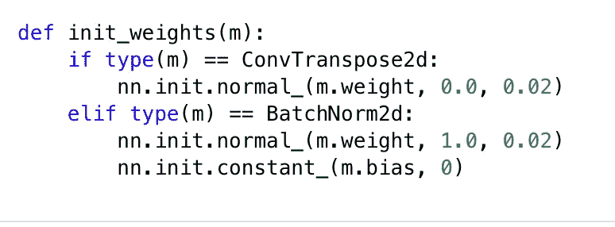

(b)然后使用`.apply()`递归初始化所有层

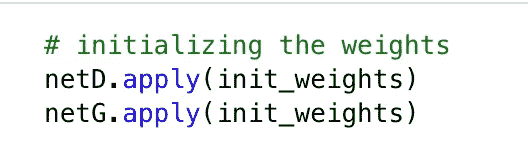

# 为生成器和鉴别器设置优化器

优化器对于使用`optimizer.step`方法在网络中执行参数更新很有用。

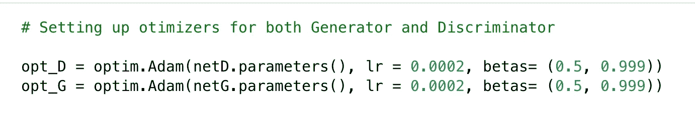

# 设置损失函数

为了检查一幅图像的预测标签离真实标签有多远，我们将使用`BCELoss`。

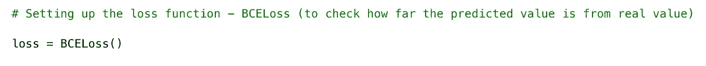

# 训练甘斯

## 伪代码

在第 1 部分中，我们讨论了训练 GAN 的主要步骤。为了刷新我们的记忆，下面是**伪代码(**使用 PyTorch 提供的[开源](https://github.com/pytorch/examples/tree/master/dcgan)代码生成):

```
for each epoch:   
     for each batch b of input images:

       *######################################*
       *## Part 1: Update Discriminator - D ##
       ######################################       
       # loss on real images*
       clear gradients of D
       pred_labels_real = pass b through D to compute outputs
       true_labels_real = [1,1,1....1]
       calculate loss(pred_labels_real, true_labels_real) 
       calculate gradients using this loss

       *# loss on fake images*
       generate batch of size b of fake images (b_fake) using G
       pred_labels_fake = pass b_fake through D
       true_labels_fake = [0,0,....0] 
       calculate loss(pred_labels_fake, true_labels_fake)
       calculate gradients using this loss       
       update weights of D
 *######################################*
       *#### Part 2: Update Generator - G ####
       ######################################*       
       clear gradients of G
       pred_labels = pass b_fake through D
       true_labels = [1,1,....1]
       calculate loss(pred_labels, true_labels)
       calculate gradient using this loss
       update weights of G *################################################*
       *### Part 3: Plot a batch of Generator images ###
       ################################################*
```

现在记住这一点，让我们开始一步一步地构建我们的训练函数。代码将分为三个部分——第 1 部分专门用于更新鉴别器，第 2 部分用于更新生成器，以及(可选的)第 3 部分用于使用我们在文章开头定义的助手函数绘制一批生成器图像。

## **第 1 部分:** U **更新鉴别器**

该过程包括计算真实和虚假图像的损失。

**计算真实图像损失的代码**

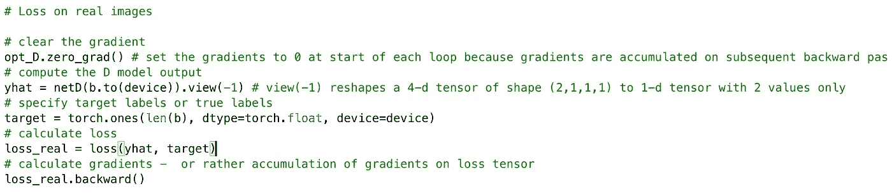

我们首先使用`zero_grad()`清除鉴别器的梯度。有必要在每次循环开始时将梯度设置为 0，因为梯度是在随后的反向路径中累积的(即当`loss.backward()`被调用时)。接下来，当输入一批真实图像(即来自我们的训练集的图像)时，我们存储来自鉴别器模型的输出。记住，`b`的形状是(32，3，32，32)。

值得注意的是，我们不是简单地将图像作为`netD(b)`传递到网络，而是在批处理中首先使用`b.to(device)`。这是因为我们必须把图像张量和模型放在同一个设备上。虽然在 CPU 上运行代码可能没什么关系，但不这样做可能会在 GPU 上引发运行时错误。

最后，如前所述，我们对模型的输出使用`view(-1)`来将 4-d 张量整形为 1-d 张量，1-d 张量包含图像是真实的可能性。

我们将实像的真实标签或`targets`定义为大小为`b`的张量，包含所有的 1。我们显式地将它设置为`float32`，以便它与批处理`b`中的图像类型相匹配。最后，我们确保目标标签也在与模型相同的设备上。

接下来，使用预测值计算`BCELoss`，并且使用`backward()`计算和累积目标标签和梯度。

**计算伪图像损失的代码**

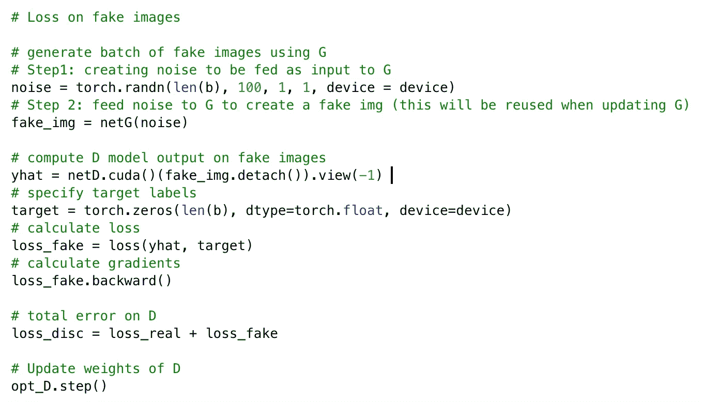

为了生成一批假图像，我们首先需要一批随机噪声矢量`noise`，将其馈送给生成器以创建`fake_img`。接下来，我们计算鉴别器对这些假图像的输出，并将其存储在`yhat`中。如果我们的输入(即`fake_img`在 GPU 上，而模型不在 GPU 上，那么`cuda()`是必不可少的，在这种情况下会抛出运行时错误。

需要注意的重要一点是，我们在那批假图像上使用了`detach()`。这样做的原因是，虽然我们希望*使用生成器的*服务，**但是**我们还不想*更新*(一旦我们完成了对鉴别器的更新，我们就会这样做)。

> 为什么要用`detach()`？基本上，我们必须在我们的发电机优化器**上跟踪步骤，只有在训练发电机时**，**不是**鉴别器。

根据第 1 部分的解释，这种情况下的目标标签将是一个长度为`b`的张量，包含所有的零。其余步骤与前面的代码片段相同。

## **第 2 部分:更新发电机**

步骤与鉴别器的情况大致相同。主要的区别是，现在目标标签被设置为 1(而不是 0)，即使它们是假图像。第 1 部分详细解释了我们为什么要这样做。简而言之:

> 生成器希望鉴别器**认为** 正在生成真实图像，因此它在训练期间使用真实标签 1。

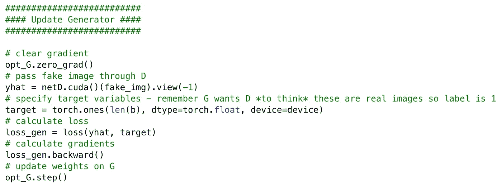

## 第 3 部分:从生成器中绘制一批图像

为了查看我们的生成器在每个时期的表现，我们将使用助手函数`plot_images()`每 10 次迭代绘制一组图像。

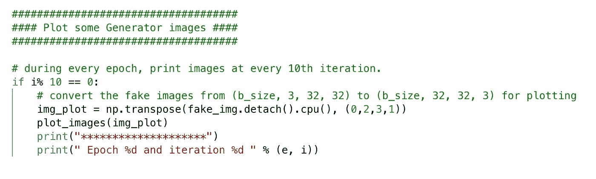

现在你可能会注意到在传递给绘图函数`plot_images()`之前，`fake_img`中的尺寸使用`np.transpose()`重新排序。这是因为，`plt.imshow()`方法(在`plot_images()`中使用)要求传递给它的图像是`(height, width, channels)`形式，然而生成器输出的图像形状是 PyTorch 中的标准`(channels, height, width)`形式。为了解决这个问题，我们必须改变假图像的尺寸，这样我们就有了类似于`b_size, 32, 32, 3)`的图像。

另一件要记住的事情是，调用`.detach().cpu()`对于在我们开始将`fake_img`张量传递给绘图函数之前，首先将它复制到主机内存是很重要的。

这是训练 GAN 的最后一个代码块——包括第 1 部分、第 2 部分和第 3 部分——的样子:

现在，我们已经使用自定义图像数据集从头开始实现了一个普通的 GAN！喔喔喔…

为了让您对我们的 GAN 生成的图像质量有一个大致的估计:

纪元 0(第 160 次迭代):很高兴看到生成器发现了人脸存在于图像中心的事实。

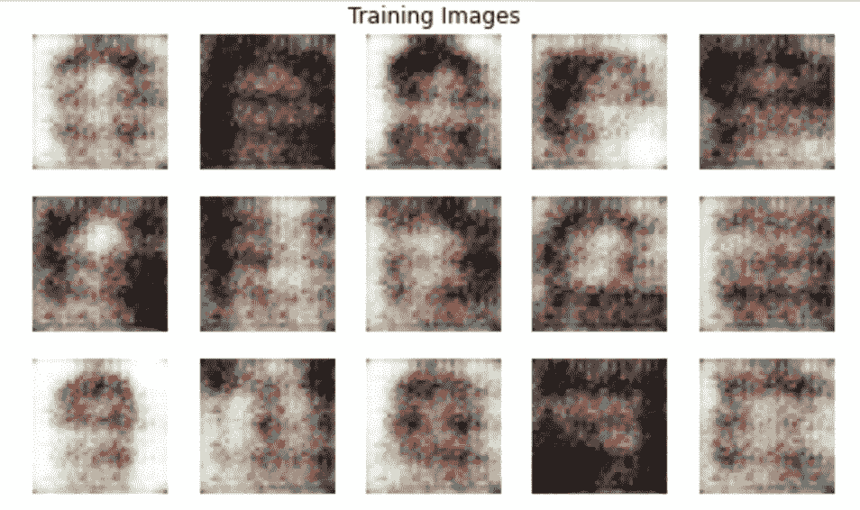

第 5 个纪元(第 10 次迭代):与上一批相比有一些明显的改进。

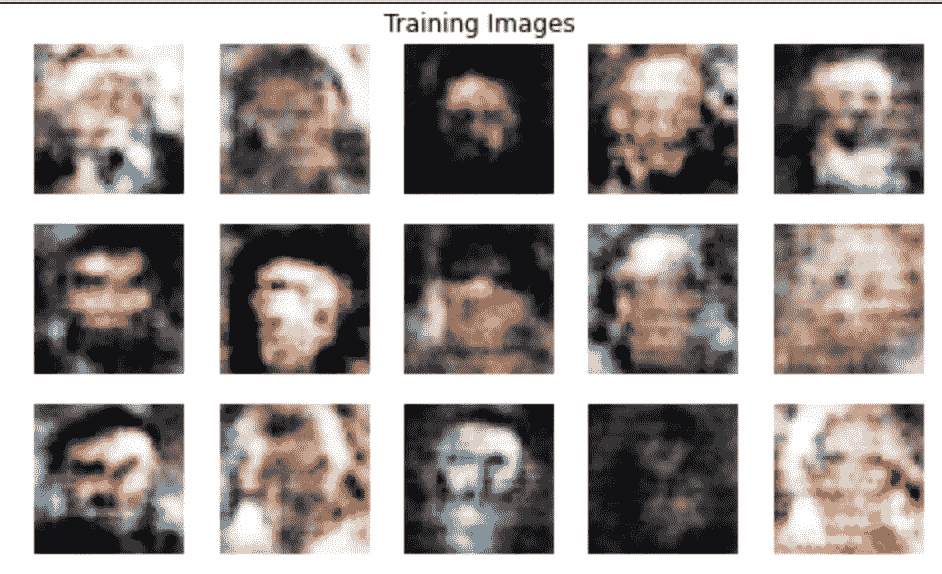

# **常见运行时错误**

虽然我在 Github 笔记本中与您分享的代码没有错误，但我想花点时间讨论一下我在从头开始学习训练 GANs 时遇到的一些运行时错误。

*   *输入类型(torch.cuda.DoubleTensor)和权重类型(torch.cuda.FloatTensor)应该相同*

这里，权重类型通常是指您的模型中的权重，如果您还记得的话，我们将其明确设置为类型`float32`。您可能看到此错误的原因是，您正在向您的模型输入可能是`float64`而不是`float32`的东西，即类型不匹配问题。

在我的例子中，当我试图通过 dataloader 将一批图像传递给鉴别器模型*而没有首先使用`np.float32`显式地将它们转换为 float 时，我遇到了这个错误。*

*   *输入类型(火炬。FloatTensor)和重量类型(torch.cuda.FloatTensor)应该相同*

如果仔细观察输入类型(即 *torch ),错误本身是不言自明的。FloatTensor)* 和重量类型(即*torch . cuda . float tensor)*——其中只有一个包含单词“ *cuda* ”。这意味着你的模型在 GPU 上，而输入数据仍然在 CPU 上。要纠正这个错误，只需使用`.to(device)`在 GPU 上发送您的输入数据张量。

我在 GAN 培训的第 1 部分遇到了这个错误，当时我正在使用`yhat = netD(b).view(-1)`(用于计算真实图像上的鉴别器损耗)计算一批输入图像的模型输出。解决方法很简单:`yhat = netD(b.to(device)).view(-1)`。

恭喜你走到这一步。希望本教程(以及第一部分)是一个非常有用但非常复杂的深度学习概念的热情介绍。既然您已经介绍了编码 GAN，我强烈建议您尝试更多的 GAN 风格，如 PGGAN、StyleGAN、StyleGAN2 等。鉴于相关的研究论文有时会因其封装的大量算法智慧而变得有点令人不知所措，我写了一篇文章，解密了一些反复出现的[关键词/概念，这些是你在开始阅读关于 GANs](https://towardsdatascience.com/keywords-to-know-before-you-start-reading-papers-on-gans-8a08a665b40c) 的论文之前应该知道的。快乐阅读！

直到下次:)

[](https://towardsdatascience.com/keywords-to-know-before-you-start-reading-papers-on-gans-8a08a665b40c) [## 在你开始阅读关于 GANs 的论文之前要知道的关键词

### 用简单的英语解释重要的重复出现的关键词/概念。

towardsdatascience.com](https://towardsdatascience.com/keywords-to-know-before-you-start-reading-papers-on-gans-8a08a665b40c) [](https://medium.com/analytics-vidhya/how-to-use-autokeras-to-build-image-classification-models-using-one-line-of-code-c35b0c36e66e) [## 如何使用 AutoKeras 用一行代码建立图像分类模型？

### 甚至不需要知道 Conv2d、Maxpool 或批处理规范化层是做什么的！

medium.com](https://medium.com/analytics-vidhya/how-to-use-autokeras-to-build-image-classification-models-using-one-line-of-code-c35b0c36e66e) [](https://towardsdatascience.com/interviewers-favorite-question-how-would-you-scale-your-ml-model-56e4fa40071b) [## 面试官最喜欢的问题-你会如何“扩展你的 ML 模型？”

### 您正在构建一个生产就绪的 ML 模型吗？

towardsdatascience.com](https://towardsdatascience.com/interviewers-favorite-question-how-would-you-scale-your-ml-model-56e4fa40071b)