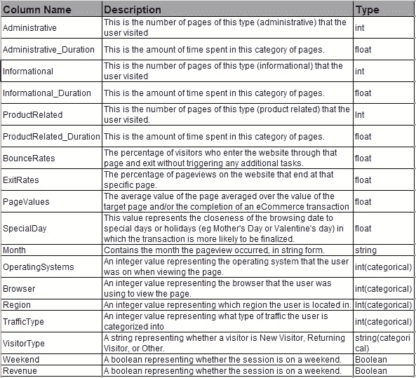

# 使用 tf.data 为结构化数据构建输入数据管道的步骤

> 原文：<https://pub.towardsai.net/steps-to-build-an-input-data-pipeline-using-tf-data-for-structured-data-9bdca1bae117?source=collection_archive---------1----------------------->

## [机器学习](https://towardsai.net/p/category/machine-learning)

*在这篇文章中，您将学习如何使用****TF . data . dataset****为使用特性列的结构化数据集创建高效的数据输入管道。*


马库斯·温克勒在 [Unsplash](https://unsplash.com/s/photos/structured-data?utm_source=unsplash&utm_medium=referral&utm_content=creditCopyText) 上拍摄的照片

使用的数据集是[在线购物者行为预测](https://www.kaggle.com/annettecatherinepaul/online-shoppers-behavior-prediction)。

该数据集将使用在线客户的行为洞察进行有针对性的广告宣传，以增加销售额，从而增加收入。

## 数据集描述



机器学习的输入数据管道包括提取数据、转换数据，然后加载数据以供模型训练和预测(ETL)。

*   **从数据源提取数据**
*   **将数据转换或处理成模型使用的格式**
*   **加载模型数据进行训练和预测**

## 从数据源中提取数据

我们将 CSV 文件中的数据读入熊猫数据帧。

```
**import tensorflow as tf
import pandas as pd
import numpy as np****df = pd.read_csv('online_shoppers_intention.csv', index_col=None)**
```

## 转换数据

这里，我们将布尔数据转换为数字数据，因为机器学习模型只能理解数字数据。

```
**df['Weekend']=df['Weekend'].astype(int)
df['Revenue']=df['Revenue'].astype(int)**
```

在这里，您将使用特性列

> 要素列是将 Pandas 数据框中的列映射到模型可用于训练的要素的桥梁。

Tensorflow 有多种类型的要素列

*   **数字列**:表示实值特征。模型将从数据框中接收列值并保持不变。

***将数据集中的实值特征转换为数值列***

```
**feature_columns = []**# numeric cols
**for header in ['Administrative', 'Administrative_Duration', 'Informational', 'Informational_Duration', 'ProductRelated', 'ProductRelated_Duration', 'BounceRates', 'ExitRates', 'PageValues', 'SpecialDay']:
  feature_columns.append(feature_column.numeric_column(header))**
```

*   **分类列**:表示字符串特征或类别。这些特征不能直接提供给模型，而应该转换成数值。 ***分类词汇列*** 帮助将字符串表示为一个热向量，并使用 [***分类 _ 列 _ 带 _ 词汇 _ 列表***](https://www.tensorflow.org/api_docs/python/tf/feature_column/categorical_column_with_vocabulary_list) 作为列表传递，或者使用 [***分类 _ 列 _ 带 _ 词汇 _ 文件***](https://www.tensorflow.org/api_docs/python/tf/feature_column/categorical_column_with_vocabulary_file) 从文件加载。

***根据词汇表将分类数据转换为数值***

```
# categorical columns
**indicator_column_names = [ 'Month', 'OperatingSystems', 'Browser', 'Region', 'TrafficType', 'VisitorType', 'Weekend' ]**
for col_name in indicator_column_names:
  **categorical_column = feature_column.*categorical_column_with_vocabulary_list*(
      col_name, df[col_name].unique())**
  **indicator_column = feature_column.indicator_column(categorical_column)
  feature_columns.append(indicator_column)**
```

*   **散列特征列**:也代表**字符串特征或类别，但类别中有大量的值**。特性列**计算类别值的哈希值，以编码字符串**。您不需要提供词汇表，但是可以提供哈希桶的数量
*   **分桶列**:可使用**根据数值范围将数值分成不同的类别。例如，年龄可以分为不同的范围。**
*   **嵌入列**:它也用于**处理类别**中有数千个值的分类数据。当一个类别有一千多个值时，创建一个独热编码向量是一个挑战；解决方法是生成**编码列。这些编码列是一个较低维度的密集向量，包含一个不一定是 0 或 1 的数字，也可以是一个数字。**
*   **交叉特征栏**:也称为**特征交叉**，其中 y **ou 可以将一个或多个特征组合成一个特征**。*举个例子，在预测房子* ***的价格时，可以将纬度和经度组合成一个单一的特征。*** 特征交叉不为源列的所有可能组合创建数据；但是，您可以根据***hashed _ column***参数指定大小。**特征十字表示非线性关系**。

使用 ***密集特征*** 层为特征列创建一个特征层，该特征层将用作我们的 Keras 模型的密集层的输入。

```
**feature_layer = tf.keras.layers.DenseFeatures(feature_columns)**
```

## 加载数据集

通过将数据帧作为字典 ***、*** 发送，使用***from _ tensor _ slice***为输入张量的每一行创建数据集，混洗数据集，然后创建批次。

Shuffle()将创建一个指定大小的缓冲区，然后根据 batch_size 将数据集的连续元素批处理为单个元素。

```
# A utility method to create a tf.data dataset from a Pandas Dataframe
**def df_to_dataset(dataframe, label,shuffle=True, batch_size=32, ):
  df = dataframe.copy()
  labels = df.pop(label)
  ds = tf.data.Dataset.from_tensor_slices((dict(df), labels))
  if shuffle:
    ds = ds.shuffle(buffer_size=len(df)-100)
  ds = ds.batch(batch_size)
  return ds**
```

创建训练、测试和验证数据集

```
**train, test = train_test_split(df, test_size=0.2)
train, val = train_test_split(train, test_size=0.2)**
```

根据 pandas 数据框创建 tf.data 数据集

```
**batch_size = 32
train_ds = df_to_dataset(train,'Revenue', batch_size=batch_size)
val_ds = df_to_dataset(val, 'Revenue', shuffle=False, batch_size=batch_size)
test_ds = df_to_dataset(test, 'Revenue',shuffle=False, batch_size=batch_size)**
```

## 创建深度学习模型并进行训练

```
**# create the model
model = tf.keras.Sequential([
  *feature_layer*,
  layers.Dense(128, activation='relu'),
  layers.Dense(256, activation='relu'),
  layers.Dropout(.3),
  layers.Dense(64, activation='relu'),
  layers.Dropout(.3),
  layers.Dense(1)
])**#Compile the model
**optimizer = optimizers.Adam(lr=0.0005, beta_1=0.7, beta_2=0.999, amsgrad=True)
model.compile(optimizer=optimizer,
              loss=tf.keras.losses.BinaryCrossentropy(from_logits=True),
              metrics=['accuracy'])**#Train the model**model.fit(train_ds,
          validation_data=val_ds,
          epochs=50)**
```

## 结论:

提取数据，使用 tf.data 中可用的不同特征列将不同类型的数据转换为数值，然后加载数据，洗牌并创建批处理，以针对任何结构化数据训练深度学习模型

## 参考资料:

[](https://colab.research.google.com/github/tensorflow/docs/blob/master/site/en/tutorials/structured_data/feature_columns.ipynb#scrollTo=DJ6QnSHkPtOC) [## 谷歌联合实验室

### 编辑描述

colab.research.google.com](https://colab.research.google.com/github/tensorflow/docs/blob/master/site/en/tutorials/structured_data/feature_columns.ipynb#scrollTo=DJ6QnSHkPtOC) 

[https://www.tensorflow.org/guide/data#simple_batching](https://www.tensorflow.org/guide/data#simple_batching)