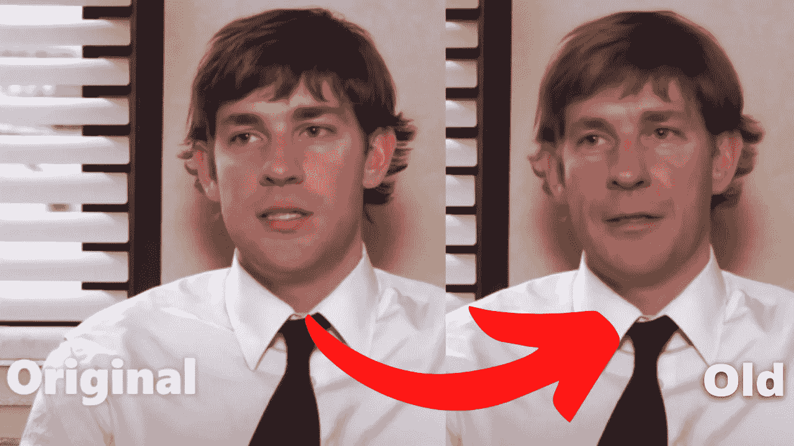
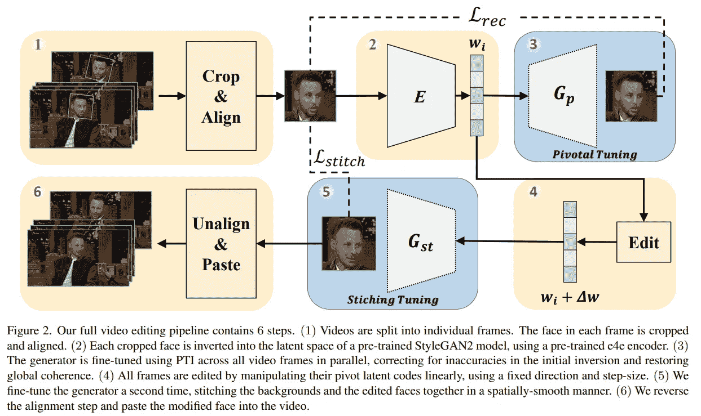
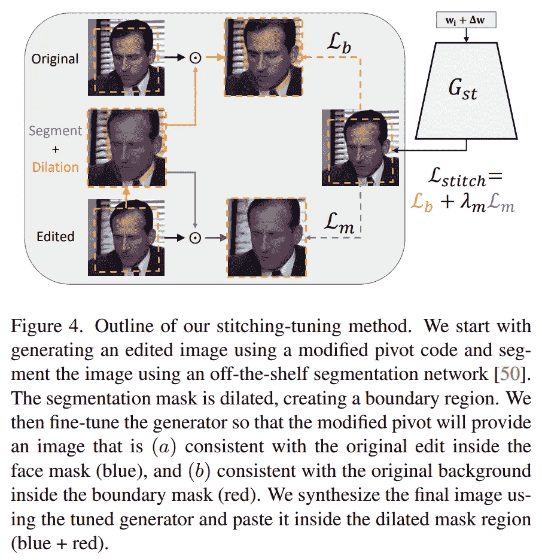

# 及时缝合:真实视频的面部编辑

> 原文：<https://pub.towardsai.net/stitch-it-in-time-facial-editing-of-real-videos-741f0f653c16?source=collection_archive---------2----------------------->

## [人工智能](https://towardsai.net/p/category/artificial-intelligence)

## 基于人工智能的高质量头部视频人脸操作

> 原载于 [louisbouchard.ai](https://www.louisbouchard.ai/stitch-it-in-time/) ，前两天在[我的博客](https://www.louisbouchard.ai/stitch-it-in-time/)上看到的！

## 观看视频

你肯定看过像最近的《惊奇队长》或《双子杀手》这样的电影，在这些电影中，塞谬尔·杰克森和威尔·史密斯看起来要年轻得多。这需要专业人员花费数百甚至数千个小时来手工编辑他出现的场景。相反，你可以用一个简单的人工智能在几分钟内完成。

“老套”的例子。图片来自[纸](https://arxiv.org/abs/2201.08361)。

事实上，许多技术允许你添加微笑，让你看起来更年轻或更老，所有这些都是自动使用基于人工智能的算法。它们大多应用于图像，因为这要容易得多，但是同样的技术稍加调整也可以应用于视频，正如你可能怀疑的那样，这对于电影业来说是很有前途的。顺便说一下，您看到的结果都是使用我将在本文中讨论的技术制作的。

结果示例。图片来自[论文](https://arxiv.org/abs/2201.08361)。

主要的问题是，目前，这些生成的“旧版本”编辑图像不仅看起来很奇怪，而且当用于视频时，会有瑕疵和伪像，这肯定不是你在一部百万美元的电影中想要的。这是因为获得人的视频比图片要困难得多，这使得训练这样的人工智能模型更加困难，这些模型需要如此多不同的例子来理解要做什么。这种强烈的数据依赖性是当前 AI 与人类智能相差甚远的原因之一。这就是为什么像 Rotem Tzaban 和来自特拉维夫大学的合作者这样的研究人员努力提高自动 AI 视频编辑的质量，而不需要那么多视频示例。或者，更准确地说，使用经过图像训练的模型，在高质量的谈话头部视频中改进基于人工智能的面部操作。除了你要编辑的单个视频之外，它不需要任何东西，你可以添加一个微笑，让你看起来更年轻或更老。它甚至适用于动画视频！

动画视频中的人脸编辑。图片来自[论文](https://arxiv.org/abs/2201.08361)。

这太酷了，但更棒的是他们是如何做到的…

当然，它使用了 GANs 或生成性对抗网络。我不会深入研究 GAN 的内部工作原理，因为我已经在[一篇文章](/how-ai-generates-new-images-gans-put-simply-674e413bc22a)中介绍过了，你可以在这里阅读，但是我们会看到它与基本的 GAN 架构有什么不同。如果你不熟悉 GANs，就花一分钟读一下[的文章](/how-ai-generates-new-images-gans-put-simply-674e413bc22a)，然后回来，我仍然会在那里等你，我没有夸张。这篇文章花了一分钟的时间来概述什么是 gan！

如果可能，我们将只刷新具有生成模型的零件，该模型获取图像，或者图像的编码版本，并更改此代码以生成修改特定方面的图像的新版本。控制生成是具有挑战性的部分，因为它有如此多的参数，很难找到哪个参数负责什么，也很难理清一切，只编辑你想要的。

GAN 网络的发生器如何工作。

所以它使用任何基于生成的架构，比如本例中的 [StyleGAN](https://github.com/NVlabs/stylegan) 。这只是一个强大的 GAN 架构，用于 NVIDIA 几年前发布的人脸图像，结果仍然非常令人印象深刻，而且版本更新。但是生成模型本身并不重要，因为它可以与你能找到的任何强大的 GAN 架构一起工作。

而且没错，就算这些模型都是为了图像而训练的，他们也会用它们来进行视频剪辑！假设您要发送的视频是真实的并且已经是一致的，他们将只专注于保持真实性，而不是像我们在视频合成工作中所做的那样创建一个真正一致的视频，
我们在视频合成工作中创建新的视频。

因此，每张图像将被单独处理，而不是发送一个完整的视频，并期待一个新的视频作为回报。这种假设使任务变得更简单，但需要面对更多的挑战，比如保持这样一个逼真的视频，每一帧都流畅地进入下一帧，没有明显的故障。

模型概述。图片来自[论文](https://arxiv.org/abs/2201.08361)。

在这里，他们将视频的每一帧作为输入图像，仅提取面部并对齐(1)以保持一致性，这是我们将看到的重要步骤，使用他们预先训练的编码器(2)和生成器(3)对帧进行编码，并为每个帧生成新版本。不幸的是，这并不能解决现实主义的问题，当从一帧到另一帧时，新的面孔可能看起来很奇怪或不合适，还有奇怪的灯光错误和背景差异。

为了解决这个问题，他们将进一步训练初始生成器(3 ),并使用它来帮助所有帧的生成更加相似和全局一致。他们还引入了另外两个步骤，一个编辑步骤和一个他们称之为“拼接-调谐”的新操作。

编辑步骤(4)将简单地获取图像的编码版本，并对其进行一些更改。在这种情况下，这是它将学会改变它的部分，使这个人看起来更老。因此，该模型将被训练以理解移动哪些参数，以及对图像的正确特征进行多大程度的修改，以使该人看起来更老。比如加一些白发，加皱纹等等。

详细步骤 5:拼接-调音法。图片来自[论文](https://arxiv.org/abs/2201.08361)。

然后，这种拼接-调整方法(5)将采用您在此处看到的编码图像，并经过训练，从最适合背景和其他帧的编辑代码中生成图像。它将通过获取新生成的图像，将其与原始图像进行比较，并找到使用遮罩仅替换面部并保持裁剪图像的其余部分不变的最佳方式来实现这一点。

最后，我们将修改后的面粘贴回框架上(6)。这个过程非常聪明，可以制作出真正高质量的视频，因为你只需要模型中经过裁剪和对齐的面部，这极大地降低了计算需求和任务的复杂性。因此，即使人脸需要很小，比如说 200 像素的平方，正如你在这里看到的，如果它只是图像的五分之一，你就可以保持相当高分辨率的视频。

瞧！这些伟大的研究人员就是这样在视频中进行高质量的人脸操纵的！

感谢您的阅读，观看[视频](https://youtu.be/mqItu9XoUgk)获取更多示例！

如果你喜欢我的工作，并想了解人工智能的最新动态，你绝对应该关注我的其他社交媒体账户( [LinkedIn](https://www.linkedin.com/in/whats-ai/) ， [Twitter](https://twitter.com/Whats_AI) )，并订阅我的每周人工智能 [**简讯**](http://eepurl.com/huGLT5) ！

## 支持我:

*   支持我的最好方式是成为这个网站的会员，或者如果你喜欢视频格式，在 **YouTube** 上订阅我的频道。
*   跟着我上 [**中**](https://whats-ai.medium.com/)
*   想进入 AI 或者提升技能，[看这个](https://www.louisbouchard.ai/learnai/)！

## 参考

*   什么是甘？短视频介绍:[https://youtu.be/rt-J9YJVvv4](https://youtu.be/rt-J9YJVvv4)
*   Tzaban，r .，Mokady，r .，Gal，r .，Bermano，A.H .和 Cohen-Or，d .，2022。实时拼接:基于 GAN 的真实视频面部编辑。[https://arxiv.org/abs/2201.08361](https://arxiv.org/abs/2201.08361)
*   项目链接:[https://stitch-time.github.io/](https://stitch-time.github.io/)
*   代号:[https://github.com/rotemtzaban/STIT](https://github.com/rotemtzaban/STIT)