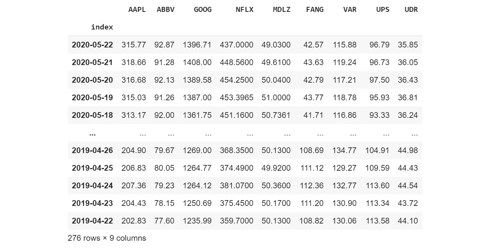
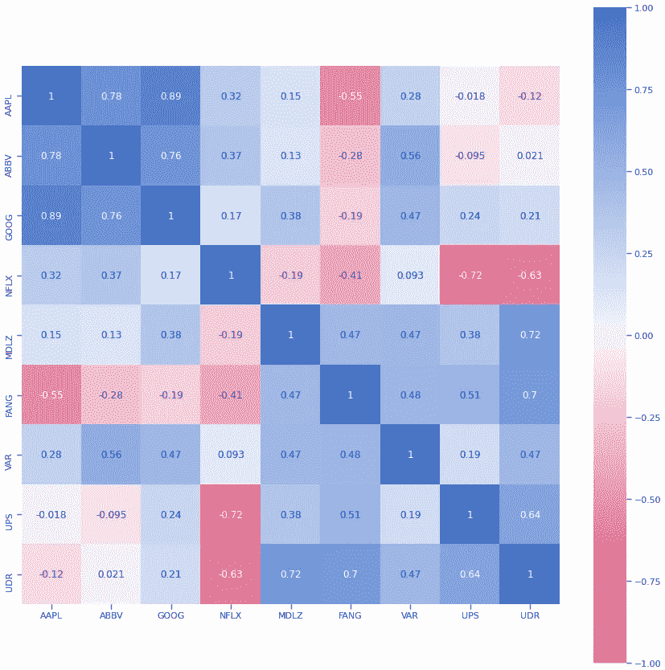
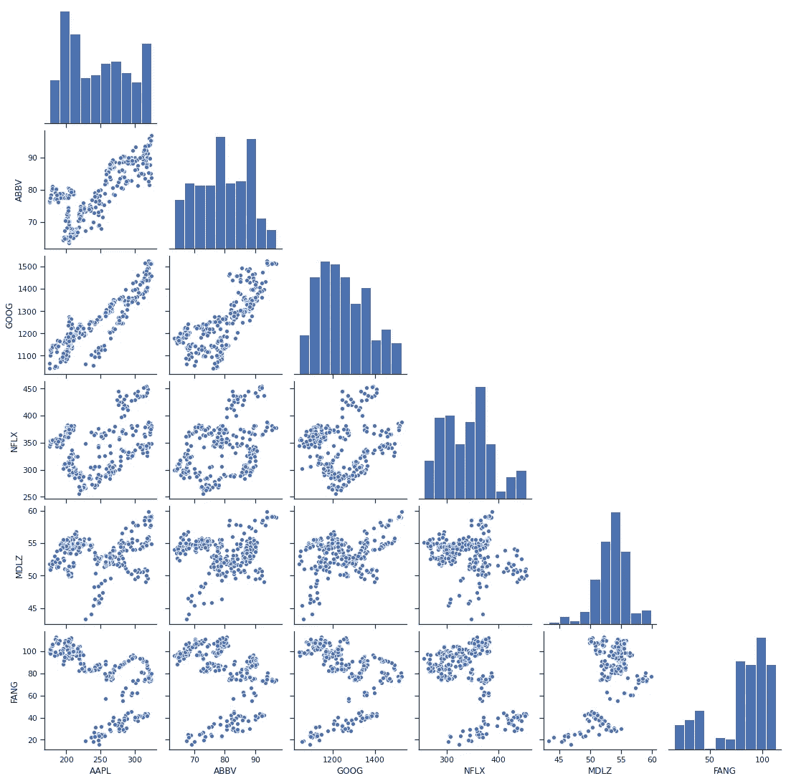

# Alpha Vantage 股票下载 API

> 原文：<https://pub.towardsai.net/stock-downloader-api-a9e95c913363?source=collection_archive---------2----------------------->

## 金融

## 下载过去 20 年的历史股票数据

[我的 GitHub 库上有完整的代码](https://github.com/arditoibryan/Projects/tree/master/20200524_Stock_Downloader)。

在过去的几周里，我在网上搜寻下载历史股票价格的可靠方法。不幸的是，很难找到一个有效且可靠的工具来下载金融数据:

*   是最新的
*   提供了一个尚未被弃用的工作 API
*   免费(至少对于一些小容量数据)
*   没有过多的请求限制

对于不知道 API 是什么意思的人来说，它只是一个工具，允许程序员使用算法连接到数据库，而不是手动干预下载数据。如果您只需要分析几千行数据，这并没有太大的区别。如果你需要同时分析数以千计的股票，你需要自动化这个过程。

## 我的不幸

不幸的是，在互联网上搜寻可靠的 API 后，我发现:

*   雅虎财经；反对
*   谷歌金融；反对

即使仍在运行，这些也不是下载数据的最佳工具。

*   Quandl 似乎没有发布所有最新的股票信息。
*   Quantopian 你只能使用他们的 IDE 来下载数据
*   Finnhub 您只能下载每日或最近的信息

我需要的是至少去年的历史数据。

# 阿尔法优势

在这些工具中，我找到了 Alpha Vantage。我的代码已经过修改，可以使用他们的 API 集合下载数据。

## 你需要什么:

*   [你的 API 键](https://www.alphavantage.co/)
*   运行代码的笔记本(如果您是专家，也可以放在本地机器上)

下载限制是可管理的:每分钟 5 个请求，每天 500 个请求。

# 设置算法

您需要安装 alpha 包。因为我使用的是 Google Collaboratory notebook，所以我可以通过使用下面的代码行来简单地做到这一点。如果你在本地工作，你可能需要尝试不同的方法。

```
!pip install alpha_vantage
```

## 创建连接

使用 download_stock 函数，我创建了你可以连接到数据库，下载过去 20 年的所有股票数据。注意正确使用输出尺寸:

*   outputsize='compact ':仅下载最近 100 天的单只股票的价格
*   outputsize='full ':下载一只股票在过去 20 年的价格

我将使用股票标签来标识我想要下载的股票，“GOOG”就是一个例子:

```
from alpha_vantage.timeseries import TimeSeriesempty = pd.DataFrame()
def download_stock(tag):
  key = ‘your key’
  ts = TimeSeries(key)
  stock, meta = ts.get_daily(symbol=tag, outputsize=’full’)
  return stock, meta
```

## 创建数据帧

因为我已经下载了过去 20 年价格的股票数组，所以根据我的需要，我需要修改:

*   仅保存最后 365 天
*   将所有数据从字符串(信息最初编码的类型)转换为浮点型

```
import pandas as pd
import time#converting array to DataFrame
def stock(tag, df_to_add):
  df_, _ = download_stock(tag)
  df_ = pd.DataFrame(df_)
  df_ = df_.transpose()
  df_ = df_.loc[‘2020–05–22’:’2019–04–22']
  df_ = df_[‘1\. open’]
  df_ = pd.DataFrame(df_)
  df_.columns = [tag]
  df_ = df_[tag].values.astype(float)
  df_ = pd.concat([df_to_add, pd.DataFrame(df_)], axis=1)
  return df_
```

当我需要将日期索引重新附加到一个惟一的股票集合时，我将最后使用这个算法。csv 文件。

```
def get_index(tag):
  df_, _ = download_stock(tag)
  df_ = pd.DataFrame(df_)
  df_ = df_.transpose()
  df_ = df_.loc[‘2020–05–22’:’2019–04–22']
  df_ = df_[‘1\. open’]
  df_ = pd.DataFrame(df_)
  #extract index and return it as series
  df_ = df_.reset_index()
  return df_[‘index’]
```

## 下载股票列表

要同时下载多只股票，我将使用它们的标签收集在一个列表中:

```
tag_list = [‘AAPL’, ‘ABBV’, ‘GOOG’, ‘NFLX’, ‘MDLZ’, ‘FANG’, ‘VAR’, ‘UPS’, ‘UDR’]
```

# 下载算法

我们终于可以开始下载数据了。我将把下载算法分解成几个部分，分别进行解释。

## 索引

首先，我将简单地运行 get_index，将整个时间序列保存在一列中。合并股票价格后，我将指数应用于数据框架:

```
#index
index = get_index(tag_list[0])
index = pd.DataFrame(index) #conta come 1 richiesta
```

## 下载第一只股票

因为我们需要创建一个 DataFrame 来附加其他列，所以我们将使用在 post 开始时创建的一个空 DataFrame，称为 empty。使用这段代码，我们下载了第一列价格，并将其放入名为 df 的数据帧中。

```
#csv of stocks
df = pd.DataFrame()#csv of remaining stocks
#we run the first one once
df = stock(tag_list[0], empty)
```

## 下载剩下的股票

对于剩余的每一只股票，我们只需要将它们作为附加列添加到原始 df 中。因为我们每分钟不能发出超过 5 个请求，所以我们将遍历列表，对于每 4 个请求，我们将暂停 70 秒。

```
for k in range(1, len(tag_list)):
  print(k, tag_list[k])
  df = stock(tag_list[k], df)
  if k%4 == 0:
  time.sleep(70)
```

算法运行后，我们将看到以下输出:

```
ABBV 
GOOG 
NFLX 
MDLZ 
FANG 
VAR 
UPS 
UDR
```

第一个标签丢失了，因为我们已经单独下载了它。所有剩余的股票都已添加到 df 中。

我现在将制作一份副本，以避免从头重新加载数据，以防编辑错误:

```
df1 = df.copy()
```

## 重命名列

```
#rename columns
df1.columns = tag_list
df1
```

## 创建日期索引

```
#reattach index
total = pd.concat([index, df1], axis=1)
total = total.set_index(‘index’)
total
```



如你所见，这是最终结果:对于每一列，我们有不同的股票价格时间序列。我们可以使用它们进行多种目的的分析。出于视觉目的，我将概述其中最重要的几个。

# 相关矩阵

```
import matplotlib.pyplot as plt
import seaborn as snscorr = total.corr()
fig, ax = plt.subplots(figsize=(15,15))ax = sns.heatmap(
corr,
vmin=-1, vmax=1, center=0,
cmap=sns.diverging_palette(0, 256, n=200),
square=True,
ax=ax,
annot=True
)
```



我们的股票列表的相关矩阵

## 两只股票之间的单一相关性

如果我们不想通过图形来可视化数据，我们总是可以用下面的代码找出两组数据之间的相关性:

```
#single correlation
import numpy as np
print(np.corrcoef(total[‘GOOG’], total[‘AAPL’]))
[[1\.         0.88737511]  
[0.88737511 1\.        ]]
```

# 配对图

配对图似乎没有太多的分析价值。然而，它允许我们可视化股票价格之间的协方差，并理解为什么一些组合的相关性如此之高，而另一些组合的相关性却如此之低。

```
import seaborn as sns
import matplotlib.pyplot as pltsns.pairplot(total, corner=True)
#they are scaled automatically
```



我们的股票列表的配对图矩阵

# 结论

你对 Alpha Vantage 工具满意吗？有没有推荐其他更可靠的 API？