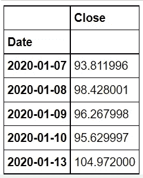
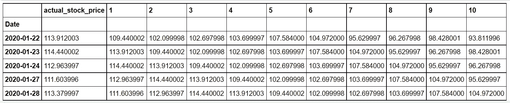
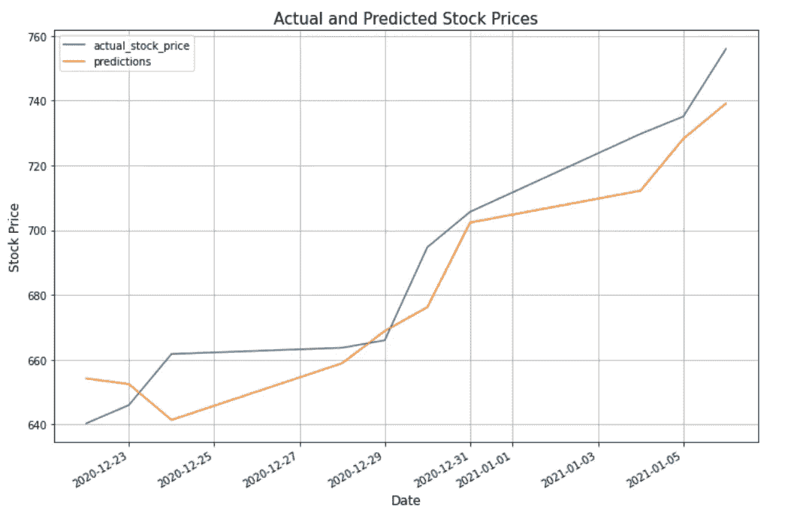

# 基于机器学习的股市预测

> 原文：<https://pub.towardsai.net/stock-market-prediction-using-machine-learning-dd064a7561f1?source=collection_archive---------1----------------------->

## [机器学习](https://towardsai.net/p/category/machine-learning)

*“对历史有一个好的视角，我们可以更好地理解过去和现在，从而对未来有一个清晰的愿景。”*

—卡洛斯·斯利姆·埃卢


照片由 [Aditya Vyas](https://unsplash.com/@aditya1702?utm_source=unsplash&utm_medium=referral&utm_content=creditCopyText) 在 [Unsplash](https://unsplash.com/s/photos/stock-market?utm_source=unsplash&utm_medium=referral&utm_content=creditCopyText) 拍摄

**简介**

股市分析和预测是很难完成的任务。有许多变量会影响股票价格的价值，包括但不限于媒体出版物、内部购买、股息通知、股票分割、季度财务报告和管理层的财务预测。这些变量使得任何股市专业人士都极难准确预测股价的涨跌。

随着机器学习及其许多高级算法的引入，最近的市场研究和股票市场预测进步已经开始将机器学习方法包括在分析股票市场数据和预测未来股票价格中。成功预测一只股票的未来价格可以产生可观的投资回报。

*免责声明:本文无意提供交易和投资建议。不保证模型的准确性。建议读者在做出任何投资决定之前，先做好自己的研究。*

**路线图**

本文的其余部分将介绍一个程序，该程序将尝试使用机器学习根据以前的收盘价来预测未来的股票价格。我们将使用线性回归模型。将使用 Python 执行以下步骤。

1.导入所需的库。

2.将数据集导入数据框架。

3.分析数据。

4.重构数据。

5.将数据分为训练数据集和测试数据集。

6.根据训练数据训练模型。

7.根据测试数据进行预测。

5.可视化股票价格预测。

**程序**

这个程序的目标是根据一个公司股票以前的收盘价预测未来的股票价格。在这种情况下，我们将使用特斯拉。

**导入所需的库**

```
# Install yfinance and cartopy packages.
!pip install yfinance
!pip install cartopy

# Import the libraries.
**import** **cartopy**
**import** **pandas** **as** **pd**
**import** **yfinance** **as** **yf**
**import** **datetime**
**import** **numpy** **as** **np**
**import** **matplotlib.pyplot** **as** **plt**
```

**访问并导入数据集**

我们将获得从 2020 年 1 月 7 日到 2021 年 1 月 7 日期间特斯拉的股票数据。

```
# We will use the Yahoo! Finance Market Downloader to get data for  # Tesla stock.
tesla = yf.download('TSLA',start='2020-01-07',  end='2021-01-07',progress=**False**)[['Close']]
```

**数据分析**

我们来看看数据。

```
# Print the first 5 rows.
tesla.head(5)
```



```
# Show information about the data. 
tesla.info()<class 'pandas.core.frame.DataFrame'>
DatetimeIndex: 253 entries, 2020-01-07 to 2021-01-06
Data columns (total 1 columns):
 #   Column  Non-Null Count  Dtype  
---  ------  --------------  -----  
 0   Close   253 non-null    float64
dtypes: float64(1)
memory usage: 4.0 KB
```

在指定的时间段内有 253 条特斯拉的股票记录。有一个日期列和一个名为 Close 的数据类型为 float 的列。数据集不包含空值。

**重组数据**

我们需要转换数据，以便将它们输入到机器学习模型中。我们将重组我们的数据，以便每行包含一天的实际股票价格，后面是前 10 天的收盘价。例如，从第 11 行开始，我们将获得前 10 个收盘价，并将其用于特性。Pandas shift 函数将用于获取前 10 行数据中每一行的接近值。这一过程将对每行数据重复进行。

```
# Restructure the data.
tesla = pd.concat([tesla, tesla.shift(), tesla.shift(2),tesla.shift(3),tesla.shift(4),tesla.shift(5),
           tesla.shift(6),tesla.shift(7),tesla.shift(8),tesla.shift(9),tesla.shift(10)], axis=1).dropna() 
tesla.columns = list(range(0,11))
tesla.rename(columns={0:'actual_stock_price'},inplace=**True**)
tesla.head()
```

以下是重组后的数据集。



**将数据分成训练和测试数据集**

```
# Split the data into training and test data sets. 
train = tesla.head(len(tesla)-10)
test = tesla.tail(10)
```

**训练模型并对测试数据进行预测**

我们将使用线性回归模型进行训练，并对测试数据进行预测。线性回归是一种受监督的机器学习模型，其中该模型在自变量和因变量之间找到最佳拟合线性线。

```
# Import the Linear Regression model from scikit-learn.
**from** **sklearn.linear_model** **import** LinearRegression# Create the model object.
LR = LinearRegression()

# Train the model on the training data.
LR.fit(train[list(range(1,11))],train['actual_stock_price'])

# Make predictions on the test data.
test['predictions'] = LR.predict(test[list(range(1,11))])
```

**可视化实际和预测的股票价格**

让我们将实际股价和预测股价在一段时间内进行可视化比较。

```
# Visualize the actual stock price and the predicted stock price    # over the time period.
plt.figure(figsize=(12,7))
ax = test[['actual_stock_price','predictions']].plot(figsize=(12,8))
plt.xlabel('Date', fontsize=12)
plt.ylabel('Stock Price', fontsize=12)
plt.title('Actual and Predicted Stock Prices', fontsize=15)
plt.grid()
plt.show()
```



结论:在这段时间内，预测的股票价格和实际的股票价格非常接近。看起来预测的股票价格比实际收盘股票价格略低。

非常感谢你阅读我的文章！如果您有任何意见或反馈，请在下面添加。

如果你喜欢阅读这样的故事，并想支持我成为一名作家，可以考虑报名成为一名媒体成员。会员资格让你可以无限制地接触媒体上的故事。你可以通过这个链接注册[https://medium.com/@dniggl/membership](https://medium.com/@dniggl/membership)