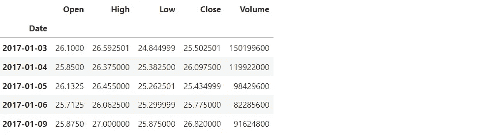
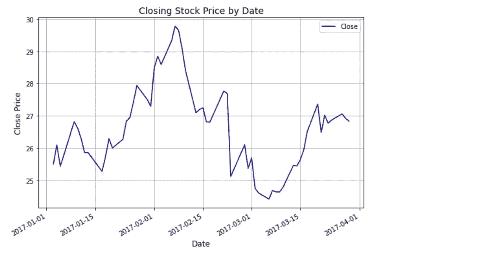
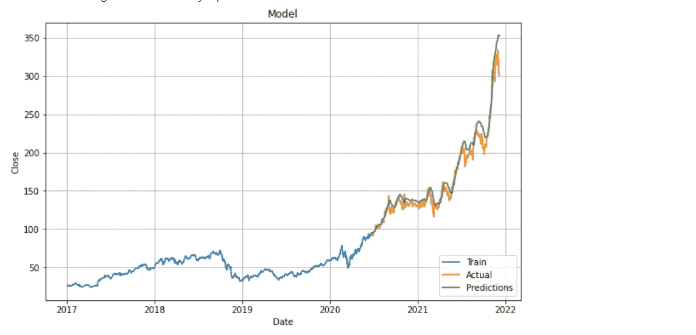
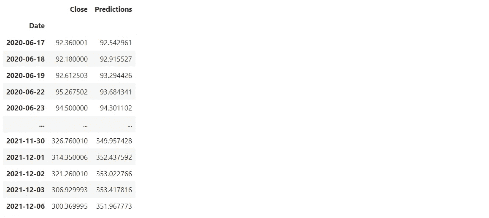

# 使用深度学习的股市预测

> 原文：<https://pub.towardsai.net/stock-market-predictions-using-deep-learning-9e471d9cbdb?source=collection_archive---------1----------------------->

## [深度学习](https://towardsai.net/p/category/machine-learning/deep-learning)

“有了对历史的良好视角，我们可以更好地了解过去和现在，从而对未来有一个清晰的愿景。”

—卡洛斯·斯利姆·埃卢


[尼克·钟](https://unsplash.com/@nick604?utm_source=medium&utm_medium=referral)在 [Unsplash](https://unsplash.com?utm_source=medium&utm_medium=referral) 上的照片

**简介**

股市分析和预测是很难完成的任务。有许多变量会影响股票价格的价值，包括但不限于媒体出版物、内部购买、股息、季度财务报告和管理层的财务预测。这些变量使得任何股市专业人士都极难准确预测股价的涨跌。

随着机器学习及其许多高级算法的引入，最近的市场研究和股票市场预测进步已经开始将机器学习方法包括在分析股票市场数据和预测未来股票价格中。

**路线图**

本文的其余部分将介绍一个程序，该程序将尝试使用机器学习根据以前的收盘价来预测未来的股票价格。我们将使用长短期记忆(LSTM)模型。将使用 Python 执行以下步骤。

1.导入所需的软件库。

2.访问和存储数据。

3.数据分析和探索。

4.数据准备。

5.建立 LSTM 模型。

6.编译和训练 LSTM 模型。

7.创建测试数据。

8.根据测试数据进行预测。

9.评估模型的性能。

10.可视化股票价格预测。

**程序**

这个程序的目标是预测未来的股票价格的基础上，以前的收盘价为一家公司的股票。

**安装 yfinance 和 cartopy 包。**

```
!pip install yfinance
!pip install cartopy
```

**导入所需的软件库**

```
**import** numpy **as** np
**import** pandas **as** pd
**import** matplotlib.pyplot **as** plt
**from** matplotlib.pyplot **import** figure 
**import** matplotlib.dates **as** mdates
**from** keras.models **import** Sequential
**from** keras.layers **import** Dense, LSTM
**import** math
**from** sklearn.preprocessing **import** MinMaxScaler
```

**访问和存储数据**

```
# We will use the Yahoo! Finance Market Downloader to get the data for Nvidia stock.
**import** yfinance **as** yf
company **=** yf**.**download('NVDA',start**=**'2017-01-01',  end**=**'2021-12-07',progress**=False**)[['Open', 'High', 'Low', 'Close', 'Volume']]# Print the first 5 rows.
company**.**head()
```



这个数据集是从雅虎财经获得的，包括 Nvidia 公司 5 年的股票数据。Nvidia 为游戏和专业市场设计图形处理单元，并为移动计算和汽车市场设计片上系统单元。

下面描述了这些列和定义。

1.  日期—格式为:年-月-日。
2.  开盘——股票在市场开盘时的价格(以美元计)。
3.  高-当天达到的最高价格。
4.  低-当天达到的最低价格。
5.  当天的收盘价格。
6.  成交量——当天交易的股票数量。

**数据分析和探索**

显示有关数据列的信息。

```
company**.**info()<class 'pandas.core.frame.DataFrame'>
DatetimeIndex: 990 entries, 2018-01-02 to 2021-12-06
Data columns (total 5 columns):
 #   Column  Non-Null Count  Dtype  
---  ------  --------------  -----  
 0   Open    990 non-null    float64
 1   High    990 non-null    float64
 2   Low     990 non-null    float64
 3   Close   990 non-null    float64
 4   Volume  990 non-null    int64  
dtypes: float64(4), int64(1)
memory usage: 46.4 KB
```

有 990 个股票记录和 5 列。所有要素都具有数字数据类型。数据集中没有空值或缺失值。

可视化前 60 天的收盘价。

```
# Extract only the top 60 rows.
company_60 **=** company**.**head(60)
company_60**.**reset_index(inplace**=True**)

#  Plot closing stock price by date.
plt**.**rcParams['figure.figsize'] **=** [9, 6]
company_60**.**plot('Date','Close', color**=**"darkblue")
plt**.**xlabel('Date', fontsize**=**12)
plt**.**ylabel('Close Price', fontsize**=**12)
plt**.**title('Closing Stock Price by Date', fontsize**=**14)
plt**.**grid()
plt**.**show()
```



**数据准备**

我们将创建一个只包含收盘价的数据集，并将数据转换成一个数组。

```
close_data **=** company['Close']
close_array **=** close_data**.**values**.**reshape(**-**1, 1)
```

归一化要素数据集。我们将使用 MinMax Scaler 来转换数据，使其分布的平均值为 0，标准差为 1。

```
scaler **=** MinMaxScaler(feature_range**=**(0, 1))
scaled_data **=** scaler**.**fit_transform(close_array
```

创建一个包含 70%数据的训练数据集。

```
training_data_len **=** math**.**ceil(len(close_array) *****.70)
train_data **=** scaled_data[0:training_data_len  , : ]
```

我们需要转换数据，以便将它们输入到机器学习模型中。我们将重新构建数据，对包含 60 天收盘价的数据进行训练，并对第 61 天的收盘价进行预测。

x train 数据集将包含 60 个值，第一列将包含第 0 行到第 59 行的收盘价，第二列将包含第 1 行到第 60 行的收盘价，其余数据将重复这一模式。

y 训练数据集将在第一列中包含第 61 个值，在第二列中包含第 62 个值，并且该模式将对其余数据重复。

我们将把 x 和 y 训练数据转换成 NumPy 数组，以便它们可以用于训练 LSTM 模型。

LSTM 模型需要三维数据集中的数据。我们将使用 shape()函数将数据整形为三维形式。

```
# Separate the data into x and y data sets.
x_train_data**=**[]
y_train_data **=**[]
**for** i **in** range(60,len(train_data)):
    x_train_data**=**list(x_train_data)
    y_train_data**=**list(y_train_data)
    x_train_data**.**append(train_data[i**-**60:i,0])
    y_train_data**.**append(train_data[i,0])

    # Convert the x and y training values into numpy arrays. 
    x_train_data1, y_train_data1 **=** np**.**array(x_train_data), np**.**array(y_train_data) 

    # Reshaping training data for calculations.
    x_train_data2 **=** np**.**reshape(x_train_data1, (x_train_data1**.**shape[0],x_train_data1**.**shape[1],1))
```

我们将使用长短期记忆(LSTM)模型对数据进行训练。LSTM 是一种特殊的递归神经网络(RNN ),能够学习数据的长期相关性。LSTM 有一种叫做“门”的内部机制，可以控制信息的流动。这些门可以了解序列中哪些数据是重要的，应该保留或丢弃。通过这样做，它可以将相关信息传递到长长的序列链中进行预测。如果你想了解更多关于 LSTM 的信息，点击此链接 [LSTM](https://www.youtube.com/watch?v=LfnrRPFhkuY)

**建造 LSTM 模型**

LSTM 模型将具有两个具有 50 个神经元的 LSTM 层和两个密集层，一个具有 25 个神经元，另一个具有一个神经元。

```
model **=** Sequential()
model**.**add(LSTM(units**=**50, return_sequences**=True**,input_shape**=**(x_train_data2**.**shape[1],1)))
model**.**add(LSTM(units**=**50, return_sequences**=False**))
model**.**add(Dense(units**=**25))
model**.**add(Dense(units**=**1))
```

**编译和训练 LSTM 模型**

使用 adam 优化器和均方误差(MSE)损失函数来编译 LSTM 模型。我们将使用 fit()函数对数据集进行训练。这些参数包括:

*   批次大小是单个批次中训练样本的总数。
*   时期是整个数据集通过神经网络向前和向后传递时的迭代次数。

```
# Compile the LSTM model.
model**.**compile(optimizer**=**'adam', loss**=**'mean_squared_error')
# Train the model on the training data.
model**.**fit(x_train_data2, y_train_data1, batch_size**=**1, epochs**=**1)
```

**创建测试数据**

```
test_data **=** scaled_data[training_data_len **-** 60: , : ]
x_test **=** []
y_test **=** close_array[training_data_len : , : ]
**for** i **in** range(60,len(test_data)):
    x_test**.**append(test_data[i**-**60:i,0])# Convert the testing data into arrays for easier computation.
x_test **=** np**.**array(x_test)
x_test **=** np**.**reshape(x_test, (x_test**.**shape[0],x_test**.**shape[1],1))
```

**对测试数据进行预测**

```
predictions **=** model**.**predict(x_test)
predictions **=** scaler**.**inverse_transform(predictions)
```

**评估模型的性能**

我们将使用均方根误差(RMSE)来衡量模型的性能。“根”表示平方误差是一种度量标准，它显示了模型的预测值与数据集中的实际值之间的平均距离。通过计算每个数据点的残差(预测值和真实值之间的差值)，计算每个数据点的残差的范数，计算残差的平均值，然后求该平均值的平方根，可以得到 RMSE。该值越低，模型的性能越好。

```
# Show the root mean squared error (RMSE) for the LSTM model.
rmse**=**np**.**sqrt(np**.**mean(((predictions **-** y_test)******2)))
print(rmse)
```

10.65793956845391

RMSE 显示，LSTM 模型的典型预测误差为 10.65，相当不错。

我们现在将计算该模型的 95%置信区间，这将显示误差可以波动多少。95%置信区间是您可以 95%确定包含总体真实均值的值范围。

```
**from** scipy **import** stats
confidence **=** 0.95
squared_errors **=** (predictions **-** y_test) ****** 2
np**.**sqrt(stats**.**t**.**interval(confidence, len(squared_errors) **-** 1,
                         loc **=** squared_errors**.**mean(),
                         scale **=** stats**.**sem(squared_errors)))
```

数组([[ 9.3788687 ]，
，[11.79915987]])

这表明预测误差可以在 9.37 到 11.79 之间的任何地方波动。置信区间缺口在 2.42 美元左右。

**可视化实际收盘价和预测收盘价。**

```
train **=** company[:training_data_len]
valid **=** company[training_data_len:]

valid['Predictions'] **=** predictions
plt**.**figure(figsize**=**(10,6)) 
plt**.**title('Model')
plt**.**xlabel('Date')
plt**.**ylabel('Close')

plt**.**plot(train['Close'])
plt**.**plot(valid[['Close', 'Predictions']])
*# ax.set_xticklabels(ax.get_xticklabels(),rotation = 90, size = 10)*

plt**.**legend(['Train', 'Actual', 'Predictions'], loc**=**'lower right')
plt**.**grid() 
plt**.**show()
```



股票的预测收盘价和实际收盘价相当接近。

按日期显示股票的实际收盘价和预测收盘价。

```
valid[['Close', 'Predictions']]
```



结论:长短期记忆(LSTM)模型的平均预测误差为 10.65，非常好。这意味着模型预测的收盘价和实际收盘价之间的平均美元金额差异为 10.65 美元。股票的预测收盘价与实际收盘价非常接近，显示出高度的准确性。这个模型可以用来预测在纽约证券交易所或纳斯达克上市的其他公司的股票价格。可以通过调整模型的一些参数来提高模型的精度。

非常感谢你阅读我的文章！如果您有任何意见或反馈，请在下面添加。

如果你喜欢阅读这样的故事，并想支持我成为一名作家，可以考虑报名成为一名媒体成员。会员资格让你可以无限制地接触媒体上的故事。你可以通过这个链接注册[https://medium.com/@dniggl/membership](https://medium.com/@dniggl/membership)