# 基于时间序列的股票价格变化预测:SARIMAX

> 原文：<https://pub.towardsai.net/stock-price-change-forecasting-with-time-series-sarimax-4f5ca053d464?source=collection_archive---------2----------------------->

## [机器学习](https://towardsai.net/p/category/machine-learning)，[统计](https://towardsai.net/p/category/statistics)

## 对时间序列、平稳性、季节性、预测和 SARIMAX 建模有较高的理解

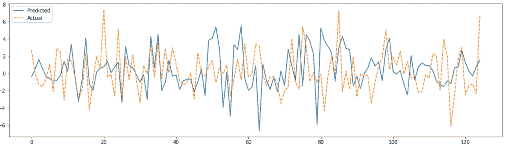

时间序列建模是对依赖于时间的序列数据(可能是有限的或无限的)的统计研究。虽然我们说时间。但是，这里的时间可能是一个逻辑标识符。时间序列数据中可能没有任何物理时间信息。在本文中，我们将讨论如何用时间序列和一些高层次的概念来建模股票价格变化预测问题。

## 问题陈述

我们将从 UCI 机器学习库中获取[道琼斯指数数据集](https://archive.ics.uci.edu/ml/datasets/Dow+Jones+Index)。它包含两个季度的股票价格信息。让我们先来探索一下数据集:

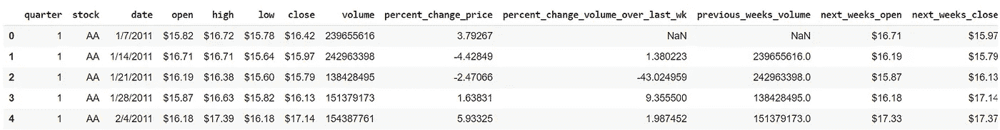

我们只能看到一些属性。但是也有其他的。其中一个是“*percent _ change _ next _ weeks _ price*”。这是我们的目标。鉴于我们有当前周的数据，我们需要预测随后几周的数据。“日期”属性的值指示时序信息的存在。在进入解决方案之前，我们将在高层次上讨论一些时间序列的概念，以便我们理解。

# 时间序列的定义

时间序列建模有不同的技术。其中之一就是*自回归过程(AR)。*在这里，时间序列问题可以表示为递归回归问题，其中因变量是目标变量本身在不同时刻的值*。*假设 Yt 是我们的目标变量，在不同的时刻有一系列的值 Y1，Y2，…那么，

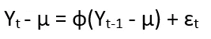

对于所有时间实例 t. Parameter 是过程的平均值。我们可以解释这个术语

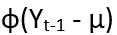

将过去的“记忆”或“反馈”转化为过程的当前值。参数ф确定反馈量，ɛt 是在时间 t 出现的信息，可以作为额外的信息添加。当然，这里的“过程”，我们指的是一个变量在不同时刻的值的无限或有限序列。如果我们扩展上述递归关系，那么我们得到:

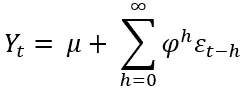

它被称为 AR(1)过程。 *h* 被称为*滞后*。

> *滞后*是一个逻辑/抽象时间单位。它可以是小时、天、周、年等等。它使定义更加通用。

如果我们考虑 p 个先前值，而不是只有一个单一的先前值，那么它就变成 AR(p)过程，同样可以表示为:

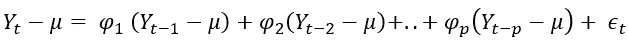

因此，有许多反馈因子，如ф1、ф2、..фp 为 AR(p)工艺。它是所有过去值的加权平均值。

还有另一种称为 MA(q)过程或*移动平均过程*的模型，它只考虑新的信息ɛ，可以类似地表示为加权平均:

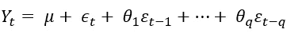

## 平稳性和差分

从上面所有的方程中，我们可以看到，如果ф或θ < 1 then the value of Yt converges to µ i.e., a fixed value. It means that if we take the average Y value from any two-interval, then it will always be close to µ, i.e., closeness will be statistically significant. This type of series is known as *时间序列平稳*。另一方面，ф > 1 给出了爆炸性的行为，并且该序列变得*非平稳。*

时间序列建模的基本假设在本质上是平稳的。这就是为什么我们必须通过*差分*将非平稳序列降低到平稳状态。它被定义为:

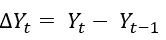

然后，我们可以将 Yt 再次建模为时间序列。如上所述，它有助于消除爆炸性。这种差异可以做几次，因为不能保证只做一次就能使序列稳定。

## ARIMA 过程

ARIMA 是用 *AR(p)* 、*MA(q)*和 *d* 倍差的 join 过程建模。所以，这里 Yt 包含了 AR(p)和 MA(q)的所有项。它说，如果一个 ARIMA(p，d，q)过程被微分 d 次，那么它就变得稳定。

## 季节性和萨里玛

时间序列可能会受到季节性因素的影响，例如一周、几个月、一年中的几个季度或十年中的几年。在这些固定的时间跨度内，在目标变量中观察到不同于其他变量的不同行为。需要单独建模。事实上，季节性成分可以从原始序列中提取出来，并按照前面所说的不同方式建模。它被定义为:

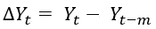

其中 m 是季节的长度，即季节性的程度。

> 萨里玛是季节性与 ARIMA 模型混合的过程建模。

SARIMA 由(P，D，q)(P，D，Q)定义，其中 P，D，Q 是季节分量的顺序。

## 萨里马克斯和阿里马克斯

到目前为止，我们已经讨论了只使用目标变量 Y 对序列进行建模。我们还没有考虑数据集中存在的其他属性。

> ARIMAX 还考虑在回归模型中添加其他特征变量。

这里 X 代表*外源。*它就像一个普通的回归模型，其中递归目标变量和其他特征都在那里。参考我们的问题陈述，我们可以设计一个 ARIMAX 模型，其目标变量*percent _ change _ next _ weeks _ price*处于不同的滞后期，并具有其他特征，如*成交量*、*低点*、*收盘、*等。但是，与目标变量不同的是，其他要素被认为是固定的，没有滞后相关值。ARIMAX 的季节性版本被称为 SARIMAX。

# 数据分析

我们将从分析数据开始。我们还将学习其他一些时间序列的概念。

让我们首先使用 *statsmodel* 库绘制自相关函数(ACF)和部分自相关函数(PACF ):

```
import statsmodels.graphics.tsaplots as tsa_plotstsa_plots.plot_pacf(df['percent_change_next_weeks_price'])
```


然后是 ACF:

```
tsa_plots.plot_acf(df['percent_change_next_weeks_price'])
```

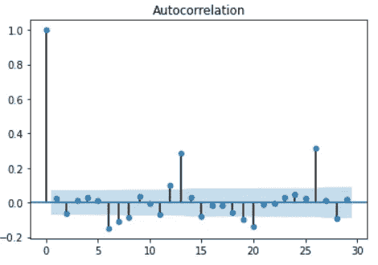

ACF 给出了不同滞后的 Y 值之间的相关性。数学上，这种协方差可以定义为:

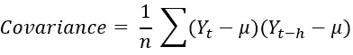

ACF 图中的分界点表示 y 的滞后值之间没有足够的关系。它也是 *MA(q)* 过程的 q 阶指示器。从 ACF 图中，我们可以看到 ACF 仅在零处截止。所以，q 应该为零。

PACF 是 Y 值之间的偏相关，即以 Yt+1 为条件的 Yt 和 Yt+k 之间的相关，..，Yt+k-1。像 ACF 一样，PACF 的截止表示 *AR(p)* 过程的顺序 p。在我们的用例中，我们可以看到 p 是零。

## 分解组件

我们现在就来看看，时间序列中有多少成分。

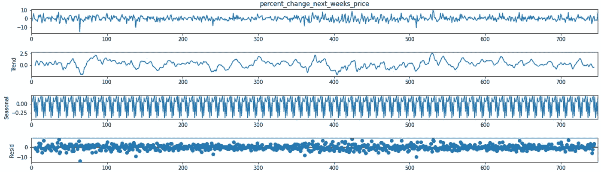

第一张图显示了实际情况，第二张图显示了趋势。我们可以看到*percentage _ change _ next _ weeks _ price*变量没有具体的趋势(上升/下降)。但是季节图揭示了季节成分的存在，因为它显示了起伏的波动。

## 平稳性检查— ADF 测试

AR(p)过程的特征方程由下式给出:

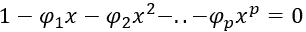

从我们前面的讨论中，我们可以说 AR(1)过程是平稳的，如果ф < 1 and for AR(p), it should be ф1 + ф2+..+фp <1\. So the if the solution of the characteristic equation is of the form:

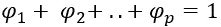

i.e, if it has unit-roots, then the time series is not stationary.

We can formally test this with Augmented Dicky-Fuller test like below:

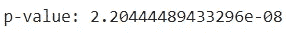

As the p-value is less than 0.05, so the series is stationary.

# Building the model

We will start building the model.

## Pre-processing

We will do some pre-processing like converting categorical variable *股票*为数值型，从价格属性中去掉前缀' $ '，并用零填充所有空值。

我们还将分离出目标和特征变量。

我们将数据集分为训练和测试。

*TimeSeriesSplit* 以交叉验证的方式递增拆分数据。我们必须使用最后的 X_train，X_test 集合。

## 自动建模

我们将使用来自 *pmdarima* 库中的 *auto_arima* 。

它使用不同的 SARIMAX(p，D，q)(P，D，Q)模型进行试验，并选择最佳模型。我们使用 X_train 作为*外生*变量，季节开始订单 m 作为 2(即从 m 开始尝试不同的季节订单)。

我们得到的输出如下:

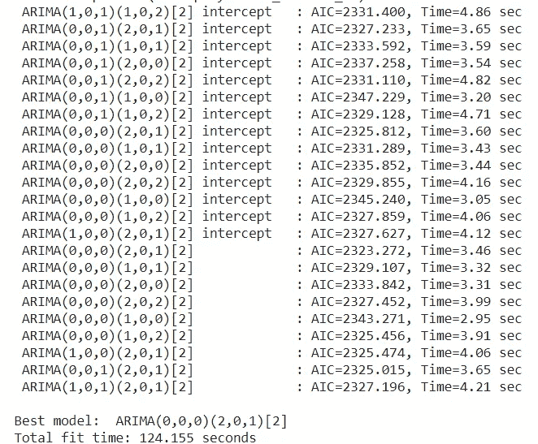

因此，我们在*数据分析*部分分析的结果是正确的。

> auto_arima *检查*平稳性、季节性、趋势*一切*。

最佳模型具有 p=0，q=0，并且由于模型是静止的，d=0。但是，正如我们看到的，它有一些季节性成分，它的顺序是(2，0，1)。

我们将使用 *statsmodels* 和训练数据集构建模型

模型细节(剪辑):


它显示所有特征可变权重。

## 预测

在测试模型之前，我们需要讨论预测和预报之间的区别。在正常的回归/分类问题中，我们经常使用术语*预测*。但是，时间序列有点不同。*预测*总是考虑滞后。这里，为了预测 Yt 的值，我们需要 Yt-1 的值。当然，Yt-1 也是一个预测值。所以，这是一个顺序的&递归过程而不是随机的。

数学上，对于 AR(2)过程，

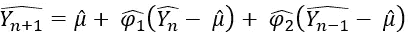

^Yn 和^Yn-1 是之前的预测值。这样链条继续。在 ARIMAX 的情况下，特征值不依赖于时间，因此当我们进行预测时，我们将以前的 Y 值与相同的特征 X 值一起输入。

现在，是时候测试这个模型了:

```
from sklearn.metrics import mean_squared_errormean_squared_error(result, Y_test)
```

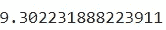

我们将绘制实际结果与预测结果的对比图。

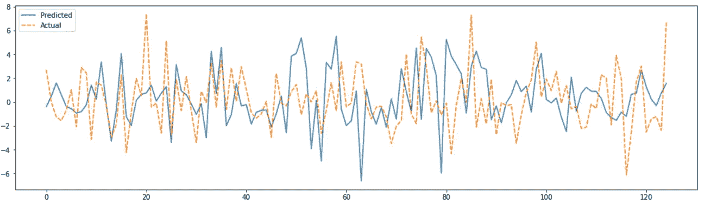

我们还可以看到误差分布。

```
model.plot_diagnostics()
plt.tight_layout()
plt.show()
```

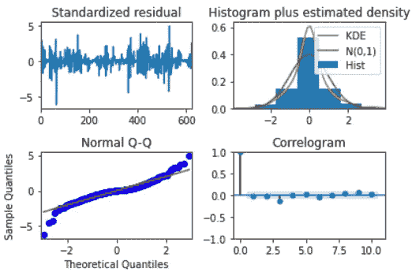

误差正态分布，均值为零，方差不变，这是一个好现象。

Jupyter 笔记本可以在这里找到:

[](https://github.com/avisheknag17/public_ml_models/blob/master/time_series_SARIMAX_stock_change_forecasting/time_series_SARIMAX.ipynb) [## avisheknag17/public_ml_models

### permalink dissolve GitHub 是超过 5000 万开发人员的家园，他们一起工作来托管和审查代码，管理…

github.com](https://github.com/avisheknag17/public_ml_models/blob/master/time_series_SARIMAX_stock_change_forecasting/time_series_SARIMAX.ipynb) 

> 最近，我写了一本关于 ML([https://twitter.com/bpbonline/status/1256146448346988546](https://twitter.com/bpbonline/status/1256146448346988546))的书