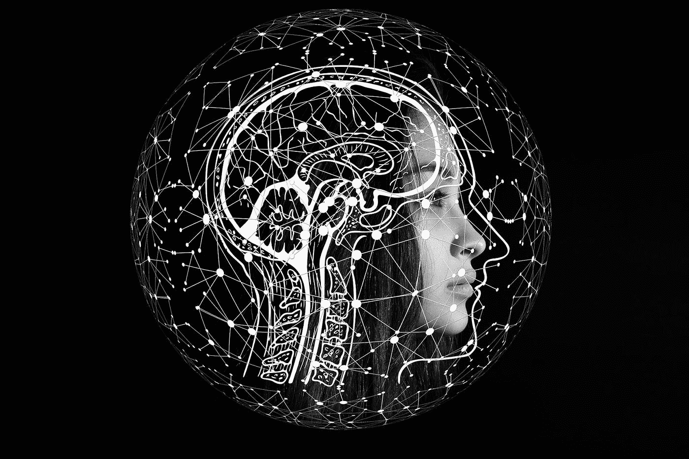
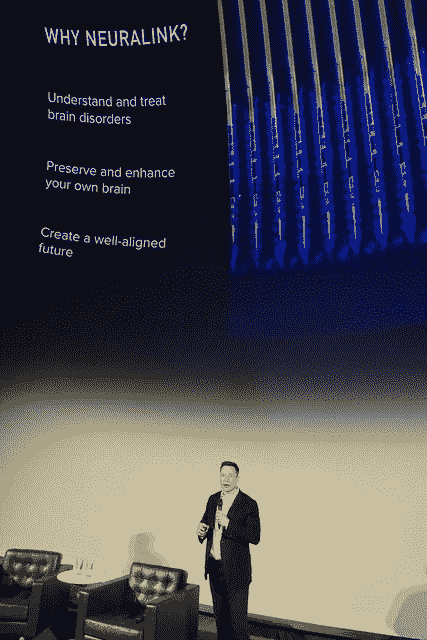

# 停止称自动化为人工智能…以及智能机器的自然发展

> 原文：<https://pub.towardsai.net/stop-calling-automation-ai-and-the-natural-progression-of-intelligent-machines-41aa17ff657c?source=collection_archive---------1----------------------->

## 定义自动化和人工智能| [走向人工智能](https://towardsai.net)

图片来源:图片由[格尔德·奥特曼](https://pixabay.com/users/geralt-9301/?utm_source=link-attribution&utm_medium=referral&utm_campaign=image&utm_content=4389372)提供

在过去的几年里，我注意到许多 C 级高管在他们的主题演讲和电视露面中使用人工智能。他们吹嘘自己的公司开拓了新的领域，在技术上取得了进步。他们谈论为自己和客户简化流程。这也不仅限于 C 级高管。很多经理也在这么做。也许这一切都是由抽象概念的需要所驱动的，以便于与上层管理人员的交流。尽管人工智能已经存在了相当一段时间，但它似乎已经成为了一个新的热门词汇。

计算机科学家有更好的想法: ***不要叫自动化 AI！*** 两者差别很大，不属于一个范畴。自动化和人工智能完全属于不同的领域。

# AI 还是单纯的自动化？

当提到人工智能或自动化时，必须遵循适当的术语。将人工智能误解为自动化的趋势已经不受控制地增长，这主要是由于语音识别系统如 Alexa、谷歌助手和 Siri 的最新发展。这些技术使搜索过程自动化，而这些过程到目前为止都是人工完成的，而且它们已经自动化到这样一种程度，这种自动化开始被认为是司空见惯的。对于一个非技术人员来说，这些机器甚至看起来像是在“思考”。然而，事实并非如此。远非如此！这些产品只是简单地遵循算法、公式或预编程路径。一些路径实际上非常详细，以至于它们覆盖了超过 90%的现实生活用例，给人一种技术是“智能”的印象。

首席执行官们显然不想落后于竞争对手。他们要求自己的公司进入 AI，这个时髦的新词，却不明白它的真正含义，否则就有被竞争对手超越的风险。现实情况是，大多数时候，公司最终会自动执行一个流程来为最终用户简化 it。然后营销机器转过去，试图把它当成“AI”来卖。这对他们的投资者和客户都是一种误导。

让我们仔细看看自动化和人工智能之间的区别:

> **自动化** —机器(软件、硬件或两者的组合)在没有人类干预的情况下执行任务的能力。
> 
> AI 代表人工智能，它的目标是建造一台模仿人类行为、思维过程和决策的机器。有些人可能会认为机器学习(ML)等同于人工智能。他们不是。ML 是 AI 的一部分。学习是人类的自然过程之一。

从定义中可以明显看出，自动化并不需要智能。复杂的算法也不能归类为智能。人工智能可能包含自动化作为其过程的一部分，但这些概念不能互换使用。

一般来说，人工智能必须涉及某种网络，能够在给定问题的情况下做出类似人类的决定。这些通常是[神经网络](https://en.wikipedia.org/wiki/Neural_network)，但不是必须的。神经网络必须不断地被训练才能工作。它甚至可以在现实世界中使用数据作为反馈回路。另一方面，自动化不需要这个网络来做决策。这些决定是基于编程到软件中的特定规则。机器永远不会学习和知道如何做任何超出预编程用例的事情。

我清楚地记得我大学时的计算机科学课。那时候，一切都是关于*翻译*。目标是将纸质和 Excel 工件转化为软件驱动的流程。大量的纸质流程需要一段时间才能完成在线转换。简化和改造旧流程需要时间，这样人们就可以在计算机上做他们过去手工做的事情。如今，这种情况已不复存在。当然，偶尔会有个人/团队仍然使用 Excel 或纸张作为他们的主要工具，但大多数人依赖于在线优先的方法。一切都在网上完成——存储、备份、可搜索性等。这使得每个人都更容易在一个中心“位置”工作，从世界上的任何地方都可以访问。那时候，在我大学的早期，人工智能还处于起步阶段，神经网络库还不够健壮，不足以用来解决现实世界的问题。

相比之下，如今，一切都与*流程自动化*有关，就像当年一切都与*流程翻译*有关一样。流程自动化阶段将比翻译纸质工件花费更长的时间。这是自然的。在翻译期间，目标是明确的。当然，在这个过程中也引入了一些改进。然而，大多数时候，需求是明确的——让计算机允许我们做我们在纸上可以做的事情。有了自动化，情况就不一样了。没有明确的要求。自动化的核心是让机器在重复或平凡的任务中取代人类，尽可能改进流程。问题是，无论一项任务是多么重复和明确的，总会有偏差。总有一些路径需要实时决策。

图片来源:【Visualhunt.com】/[上](http://creativecommons.org/licenses/by/2.0/)下抄送

人工智能是这个过程中自然而然的下一步。它将让我们完成我们的技术旅程:从*翻译*到*自动化*再到 *AI* 。AI 之后会怎样，还有待观察。

有人说，下一件大事是人工智能和人类的融合。像 [Neuralink](https://www.neuralink.com/) 这样的项目(更多信息参见[埃隆·马斯克&团队 YouTube Nuralink 演示](https://youtu.be/lA77zsJ31nA))最近取得了惊人的成果。我相信 Neuralink 不是 AI 之后的下一个进展。在技术进化的时间线上，我会把它放在自动化和人工智能之间的某个地方，这样进展看起来会更像这样:*翻译*到*自动化*到*神经链接*到*人工智能*。只有时间能证明是否会是这样。

目前的技术非常有限。它不适合建造全功能的智能机器。可能有一些行业领域正在使用人工智能来完成任务，但这仅限于特定的用例(自动驾驶汽车、小部件制造机器人、语音识别等)。).虽然仍处于起步阶段，但这些项目似乎受到问题的困扰，需要不断的人工干预和调整。在公众看来，人工智能不仅是不存在的，而且我敢说以目前的技术是不可能的。我们需要在软件和硬件方面取得突破性的进展，才能考虑制造这样的机器。对于那些认为[量子计算](https://www.research.ibm.com/ibm-q/learn/what-is-quantum-computing/)就是答案的人，我不同意，尤其是考虑到这种计算机的已知局限性。但我希望我是错的。

所以请不要再用 AI 这样的流行语来形容任何看似“智能”的东西了。它贬低了这个领域，给人一种已经实现人工智能的错误印象。在我们开始考虑将人工智能用于现实世界之前，这个领域还需要做更多的研究。