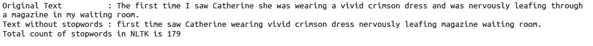
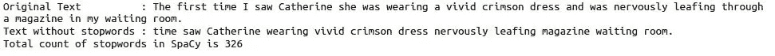
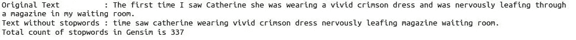
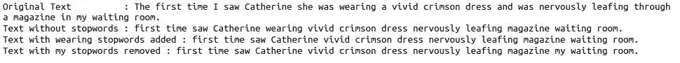

# 使用不同的 Python 库停止停用词

> 原文：<https://pub.towardsai.net/stop-the-stopwords-using-different-python-libraries-ffa6df941653?source=collection_archive---------0----------------------->


资料来源:Pixabay.com

字母表字母是英语单词的组成部分。这些词按照语法规则组合在一起构成一个句子。因为语法原因，有些词出现的频率比其他词高。这些单词的主要目的是连接一个句子中的不同单词。这些词被称为停用词。通常，停用词没有词典意义。

自然语言处理(NLP)中常用的停用词。在为 NLP 任务处理数据之前，请尝试删除停用词。

不同的图书馆在它们的停用词集合中有不同的词计数。没有标准跟踪停用词的集合。这导致图书馆收集停用词。

在本文中，我们将浏览这些库。

# 1.自然语言工具包(NLTK)

NLTK 是用于文本预处理的领先 python 工具。使用 NLTK 库删除停用词。

```
from nltk.corpus import stopwordsnltk_stopwords = set(stopwords.words(‘english’))text = f”The first time I saw Catherine she was wearing a vivid crimson dress and was nervously “ \
       f”leafing through a magazine in my waiting room.”text_without_stopword = [word for word in text.split() if word.lower() not in nltk_stopwords]print(f”Original Text : {text}”)
print(f”Text without stopwords : {‘ ‘.join(text_without_stopword)}”)
print(f”Total count of stopwords in NLTK is {len(nltk_stopwords)}”)
```



NLTK 库在停用词集合中有 179 个词。正如你所观察到的，像 was、the 和 I 这样最常见的词从句子中删除了。

注意:默认库的停用词表中的所有单词都是小写的。为了获得更好的效果，请将文档/句子中的单词转换成小写。否则，停用词不会从数据中删除。

# 2.空间

Spacy 也在 NLP 中广泛使用库。使用 spaCy 库删除停用词。

```
import spacysp = spacy.load(‘en_core_web_sm’)
spacy_stopwords = sp.Defaults.stop_wordstext = f”The first time I saw Catherine she was wearing a vivid crimson dress and was nervously “ \
       f”leafing through a magazine in my waiting room.”text_without_stopword = [word for word in text.split() if word not in spacy_stopwords]print(f”Original Text : {text}”)
print(f”Text without stopwords : {‘ ‘.join(text_without_stopword)}”)
print(f”Total count of stopwords in SpaCy is {len(spacy_stopwords)}”)
```



SpaCy 的停用词集合中有 326 个词，是 NLTK 停用词的两倍。Spacy 和 NLTK 显示了删除停止字后的不同输出。其结果是，图书馆有自己的停用词定义，这决定了停用词的字数。它们包括第一、第二、第十二等。数字单词。他们的列表还包括经常出现的动词，如 go、find 等。

# 3.根西姆

使用 genism 库删除停用词。

```
from gensim.parsing.preprocessing import remove_stopwords
import gensimgensim_stopwords = gensim.parsing.preprocessing.STOPWORDStext = f”The first time I saw Catherine she was wearing a vivid crimson dress and was nervously “ \
       f”leafing through a magazine in my waiting room.”print(f”Original Text : {text}”)
print(f”Text without stopwords : {remove_stopwords(text.lower())}”)
print(f”Total count of stopwords in Gensim is {len(list(gensim_stopwords))}”)
```



Gensim 的停用词集合中有 337 个词。他们的停用词集合类似于 Spacy。remove_stopwords 函数直接从句子中删除停用词。

# 4.sci kit-学习

Scikit-learn 在数据建模中非常流行。使用 Scikit-learn 库删除停用词。

```
from sklearn.feature_extraction.text import ENGLISH_STOP_WORDStext = f”The first time I saw Catherine she was wearing a vivid crimson dress and was nervously “ \
       f”leafing through a magazine in my waiting room.”text_without_stopword = [word for word in text.split() if word not in ENGLISH_STOP_WORDS]print(f”Original Text : {text}”)
print(f”Text without stopwords : {‘ ‘.join(text_without_stopword)}”)
print(f”Total count of stopwords in Sklearn is {len(ENGLISH_STOP_WORDS)}”)
```


Scikit-learn 的停用词集合中有 318 个词。他们的停用词集合类似于 Spacy 和 Gensim。

注意:有时，可以归类为停用词的词在上述库的默认停用词列表中不可用。您可以根据自己的选择修改现有的停用词集合。使用 append 添加或 remove 从停用字词集合中删除字词。

修改图书馆的默认停用词表。

```
from nltk.corpus import stopwords
nltk_stopwords = stopwords.words(‘english’)text = f”The first time I saw Catherine she was wearing a vivid crimson dress and was nervously “ \
       f”leafing through a magazine in my waiting room.”text_without_stopword = [word for word in text.split() if word.lower() not in nltk_stopwords]print(f”Original Text : {text}”)
print(f”Text without stopwords : {‘ ‘.join(text_without_stopword)}”)# ‘wearing’ added as a stopwords in nltk stopwords collectionnltk_stopwords.append(‘wearing’)
text_without_stopword = [word for word in text.split() if  word.lower() not in nltk_stopwords]print(f”Text with wearing stopwords added : {‘ ‘.join(text_without_stopword)}”)# ‘my’ removed as a stopwords in nltk stopwords collectionnltk_stopwords.remove(‘my’)text_without_stopword = [word for word in text.split() if word.lower() not in nltk_stopwords]print(f”Text with my stopwords removed : {‘ ‘.join(text_without_stopword)}”)
```



# 结论

为停用词选择 python 库完全取决于 NLP 任务。如果使用 NLTK 库进行文本处理，那么不建议使用 Gensim 库来处理停用词。停用字词删除减少了处理时间和磁盘空间，并提高了准确性。因此，在训练模型之前，请使用停用字词删除来清理数据。

希望这篇文章能帮助你解决 NLP 模型和问题。

**作者的其他文章**

1.  [EDA 的第一步:描述性统计分析](https://medium.com/analytics-vidhya/first-step-in-eda-descriptive-statistics-analysis-f49ca309da15)
2.  [Reddit Post:text blob 和 VADER](https://towardsdatascience.com/automate-sentiment-analysis-process-for-reddit-post-textblob-and-vader-8a79c269522f) 的自动化情感分析流程
3.  [使用罗伯塔模型发现 Reddit 子群的情绪](https://towardsdatascience.com/discover-the-sentiment-of-reddit-subgroup-using-roberta-model-10ab9a8271b8)