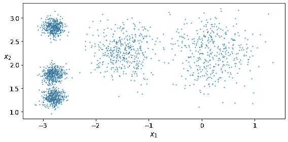
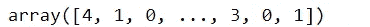
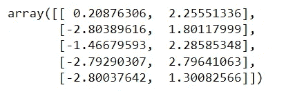
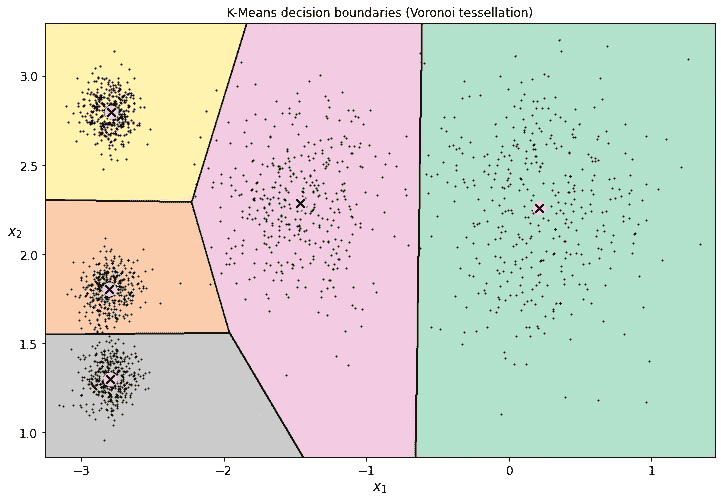
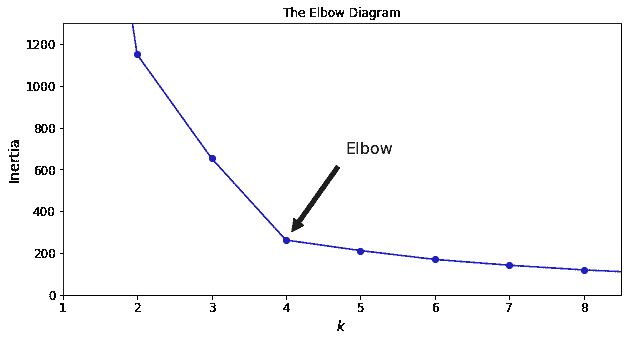
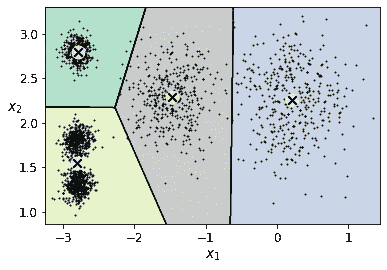
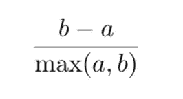
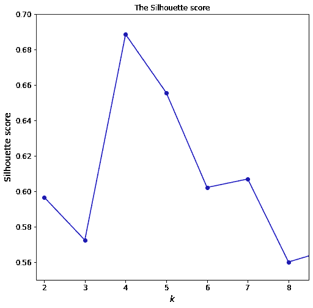
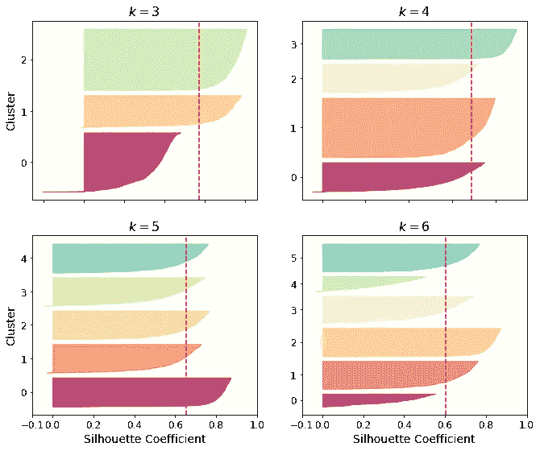

# 停止使用肘图来寻找最佳 K 值，而使用这个

> 原文：<https://pub.towardsai.net/stop-using-elbow-diagram-to-find-best-k-value-and-use-this-instead-568b13d77561?source=collection_archive---------0----------------------->

K -Means 是最重要的聚类算法之一，通常由数据科学家和机器学习实践者在无监督学习任务中使用。需要小心处理的该算法的参数之一是聚类数 K。找到 K 的最佳值的最流行的方法是肘图，然而，它不是这样做的最有效的方法。在本文中，我们将探索更有效的方法来寻找 K-Means 聚类算法的最佳 K 值。

照片由[博戈米尔·米哈伊洛夫](https://unsplash.com/@bogomi?utm_source=medium&utm_medium=referral)在 [Unsplash](https://unsplash.com?utm_source=medium&utm_medium=referral) 上拍摄

## 目录:

1.  **K 均值聚类简介**
2.  **使用肘图查找 K 值**
3.  **寻找 K 值的剪影分数**
4.  **参考文献**

## **本文中使用的源代码和生成的图可以在这个 GitHub 存储库中找到:**

 [## GitHub-youssefHosni/机器学习-实用指南

### 在 GitHub 上创建一个帐户，为 youssefHosni/Machine-Learning-Practical-Guide 开发做贡献。

github.com](https://github.com/youssefHosni/Machine-Learning-Practical-Guide) 

**如果你想免费学习数据科学和机器学习，看看这些资源:**

*   免费互动路线图，自学数据科学和机器学习。从这里开始:[https://aigents.co/learn/roadmaps/intro](https://aigents.co/learn/roadmaps/intro)
*   数据科学学习资源搜索引擎(免费)。将你最喜欢的资源加入书签，将文章标记为完整，并添加学习笔记。[https://aigents.co/learn](https://aigents.co/learn)
*   想要在导师和学习社区的支持下从头开始学习数据科学吗？免费加入这个学习圈:[https://community.aigents.co/spaces/9010170/](https://community.aigents.co/spaces/9010170/)

如果你想在数据科学&人工智能领域开始职业生涯，但你不知道如何开始。我提供数据科学指导课程和长期职业指导:

*   长期指导:[https://lnkd.in/dtdUYBrM](https://lnkd.in/dtdUYBrM)
*   辅导会议:[https://lnkd.in/dXeg3KPW](https://lnkd.in/dXeg3KPW)

***加入*** [***中等会员***](https://youssefraafat57.medium.com/membership) ***计划，只需 5 美元，继续无限制学习。如果你使用下面的链接，我会收到一小部分会员费，不需要你额外付费。***

 [## 加入我的介绍链接媒体-优素福胡斯尼

### 阅读 Youssef Hosni(以及媒体上成千上万的其他作家)的每一个故事。您的会员费直接支持…

youssefraafat57.medium.com](https://youssefraafat57.medium.com/membership) 

# 1.K-均值聚类简介

K-Means 是一种聚类算法，由 Stuart Lloyd 于 1957 年在贝尔实验室提出，作为一种脉冲编码调制技术，但它只是在 1982 年在公司外部发表在一篇题为“PCM 中的最小平方量化”的论文中。到那时，在 1965 年，Edward W. Forgy 已经发表了几乎相同的算法，所以 K-Means 有时被称为 Lloyd- Forgy。考虑图 1 所示的未标记数据集，使用以下代码绘制:

图一。未标记的数据由 5 组数据组成。

我们可以清楚地观察到 5 组实例。K-Means 算法是一种简单的算法，能够非常快速有效地对这种数据集进行聚类，通常只需几次迭代。

让我们在这个数据集上训练一个 K-Means 聚类算法。它将尝试找到每个 blob 的中心，并使用下面的代码将每个实例分配给最近的 blob:

请注意，您必须指定算法必须找到的聚类数 k。对于这个数据集，从数据中可以很明显地看出 k 应该设置为 5，但一般来说，这并不容易，需要做大量的工作才能有效地做到这一点。让我们看看每个数据点的聚类标签以及每个聚类的质心:

这显示了每个数据点被分配到的集群。

这显示了每个簇的质心的尺寸。现在，让我们使用下面的绘图函数来绘制集群:

图二。k-均值决策边界(Voronoi 镶嵌)

正如您所看到的，我们已经将集群的数量设置为 5，因为仅从数据来看这是非常明显的。然而，一般来说，它不会那么明显，如果我们选择了错误的 K 值，就会导致非常糟糕的聚类模型。考虑这个例子，如果我们选择较低或较高的 K 值，将导致非常错误的数据聚类，如图 3 所示。

图 3。对集群数量的错误选择

如您所见，选择较低的 K 值(在本例中为 3)会导致将数据分配给错误的集群，如图 3(左)所示。而选择较高的 K 值将导致将相同的聚类分成较小的聚类，如图 3(右)所示。因此，重要的是找到一种方法来估计 K 的最佳值，这将避免低估和高估其值，因为在这两种情况下，都会导致糟糕的聚类模型。我们将讨论寻找 K 的最佳值的两种方法:**肘图**和**轮廓系数。**

# 2.用肘图求 K 值

下图是基于计算每个 k 值的**区间**并绘制出来的。 **interia** 是每个实例与其最近质心之间的均方距离。因此，数据点越靠近质心，interia 就越小。然而，仅依赖于这种测量有一个缺点，即随着集群数量的增加，interia 将减少，这就产生了肘形图的重要性，因为我们可以选择最合适的 k 值。

让我们首先使用下面的代码绘制肘图:

图 4。用肘图求 K 的最佳值。

正如我们所看到的，当 k 增加到 4 时，惯性下降得非常快，但当 k 继续增加时，惯性下降得更慢。

这条曲线大致具有手臂的形状，并且在 k=4 处有一个“**肘**”，所以如果我们不知道更好的情况，它将是 K 值的一个好选择:任何更低的值都将是戏剧性的，而任何更高的值都不会有太大帮助，并且我们可能只是在没有重要原因的情况下将非常好的簇分成两半。

我们可以检查 k =4 的聚类决策边界。正如我们在图 5 中看到的，当选择 k = 4 时，有两个群集被检测为仅仅一个群集。

图 5。k-表示 k=4 时的决策边界。

然而，有时它有时会变得令人困惑。我们应该将 4、5 还是 6 作为最佳的聚类数？此外，它不像本例中那样精确，我们知道 K 的最佳值是 5，但是，从这个肘形图中估计的最佳值是 4。一种更精确的方法(但计算成本也更高)是使用**轮廓分数。**

# 3.**寻找 K 值的剪影分数**

**轮廓分数**是所有实例的平均轮廓系数。实例的轮廓系数等于 **(b — a) / max(a，b)** ，其中 a 是到同一聚类中其他实例的平均距离(它是平均聚类内距离)，b 是平均最近聚类距离，它是到下一个最近聚类的实例的平均距离(定义为最小化 b 的那个，不包括实例自己的聚类)。

轮廓系数可以在-1 和+1 之间变化:接近+1 的系数意味着该实例在它自己的聚类内，并且远离其他聚类，而接近 0 的系数意味着它接近聚类边界，最后接近-1 的系数意味着该实例可能被分配到错误的聚类。

要计算剪影得分，可以使用 Scikit-Learn 的 silhouette_score()函数，给它数据集中的所有实例以及它们被分配的标签:

图 6。使用轮廓分数选择最佳数量的聚类 k。

如您所见，这个可视化比肘图丰富得多。虽然它证实了 k=4 是一个非常好的选择，但它也强调了这样一个事实，即 k=5 也很好，比 k=6 或 7 好得多。这在比较惯性值时是不可见的。

当您绘制每个实例的轮廓系数时，可以获得更丰富的可视化信息，这些系数按照它们被分配到的簇和系数的值进行排序。这被称为轮廓图，如图 7 所示。

图 7。K = (3，4，5，6)值的轮廓图。

垂直虚线表示每个聚类数的轮廓分数，每个条的宽度表示每个聚类的数据大小，每个聚类的长度表示其轮廓系数。

当一个聚类中的大多数实例具有比这个分数更低的系数时(即，如果许多实例条在虚线之前停止，在虚线的左侧结束)，那么该聚类相当差，因为这意味着它的实例太靠近其他聚类。

我们可以看到，当 k=3 和 k=6 时，我们得到的是坏簇。但是当 k=4 或 k=5 时，群集看起来相当不错，因为大多数实例都向右延伸到虚线之外，更接近 1.0。

当 k=4 时，索引 1 处的聚类(从上往下数第三个)相当大，而当 k=5 时，所有聚类都具有相似的大小，因此即使 k=4 的总体轮廓分数略大于 k=5 的，使用 k=5 来获得相似大小的聚类似乎是个好主意。

# 4.参考

1.  [使用 Scikit-Learn、Keras 和 Tensorflow 进行机器实践学习:构建智能系统的概念、工具和技术](https://www.amazon.com.br/Hands-Machine-Learning-Scikit-Learn-TensorFlow/dp/1492032646)

***喜爱文章？成为*** [***中等会员***](https://youssefraafat57.medium.com/membership) ***继续无限制学习。如果你免费使用下面的链接，我会收到一小部分会员费。***

 [## 加入我的介绍链接媒体-优素福胡斯尼

### 阅读 Youssef Hosni(以及媒体上成千上万的其他作家)的每一个故事。您的会员费直接支持…

youssefraafat57.medium.com](https://youssefraafat57.medium.com/membership) 

***感谢阅读！如果喜欢文章，一定要鼓掌(最多 50！)并在***[***LinkedIn***](https://www.linkedin.com/in/youssef-hosni-b2960b135/)***上与我联系，并在*** [***上关注我，以便随时更新我的新文章。***](https://youssefraafat57.medium.com/)