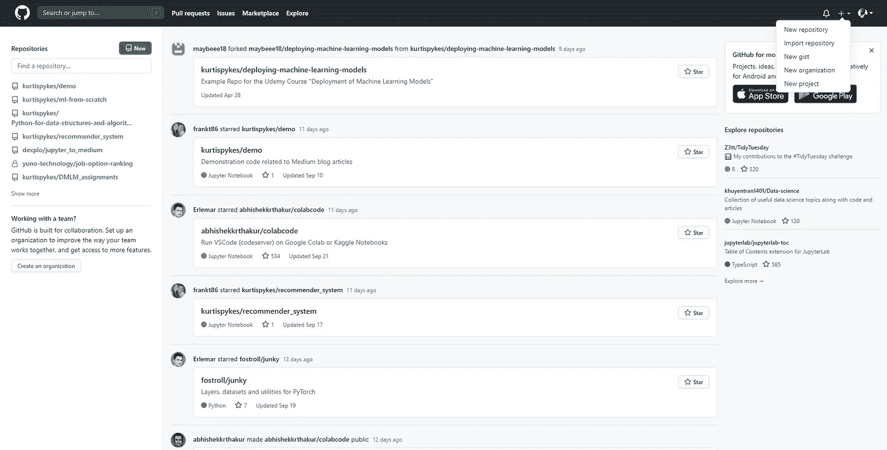

# 不要在你的技术文章中使用中等代码单元格

> 原文：<https://pub.towardsai.net/stop-using-medium-code-cells-for-your-technical-post-c331736dea5d?source=collection_archive---------4----------------------->

## [意见](https://towardsai.net/p/category/opinion)，[编程](https://towardsai.net/p/category/programming)

## 用 Github Gists 让你的代码更清晰


照片由[谢恩](https://unsplash.com/@theyshane?utm_source=medium&utm_medium=referral)在 [Unsplash](https://unsplash.com?utm_source=medium&utm_medium=referral) 拍摄

## 详述问题

对于那些正在阅读这篇文章并在过去关注过我的文章的人来说，你可能会说我是一个伪君子。但是，如果你不知道我在说什么，那么你可以看看我的算法从零开始系列中的任何一篇文章:

[](https://towardsdatascience.com/tagged/algorithms-from-scratch) [## 从零开始的算法——走向数据科学

### 阅读《走向数据科学》中关于算法的文章。分享概念、想法和…

towardsdatascience.com](https://towardsdatascience.com/tagged/algorithms-from-scratch) 

我正在阅读一篇文章，这篇文章使用了 Medium 的代码单元的编码示例。我很沮丧！我最终将代码复制并粘贴到我的 visual studio 环境中，即使这样也不足以保存代码——没有缩进，所以我基本上必须自己清理代码。

如果我不急着理解这个话题，我可能会关掉那篇文章，去找一篇新的。至少可以说，这是一次可怕的经历。

```
**def** plot_svm():
    *# https://scikit-learn.org/stable/auto_examples/svm/plot_separating_hyperplane.html*
    *# getting the decision function*
    plt.figure(figsize=(10, 5))
    decision_function = svc.decision_function(X)
    support_vector_indices = np.where((2 * y - 1) * decision_function <= 1)[0]
    support_vectors = X.iloc[support_vector_indices]

    *# plot observations*
    plt.scatter(X.iloc[:, 0], X.iloc[:, 1], c=y, cmap=plt.cm.Paired)

    *# plot the decision function*
    ax = plt.gca()
    xlim = ax.get_xlim()
    ylim = ax.get_ylim()

    *# creating the grid to evaluate the model*
    xx, yy = np.meshgrid(np.linspace(xlim[0], xlim[1], 50),
                         np.linspace(ylim[0], ylim[1], 50))
    Z = svc.decision_function(np.c_[xx.ravel(), yy.ravel()])
    Z = Z.reshape(xx.shape)

    *# plot decision boundaries and margins*
    plt.contour(xx, yy, Z, colors='k', levels=[-1, 0, 1], alpha=0.5,
                linestyles=['--', '-', '--'])

    *# plot support vectors*
    plt.scatter(support_vectors.iloc[:, 0], support_vectors.iloc[:, 1], s=100,
                linewidth=1, facecolors='none', edgecolors='k')

    plt.title("Linear SVM (Hard Margin Classification)")
    plt.tight_layout()
    plt.show()
```

我不知道是不是只有我，但我觉得这非常难读。有一种方法可以格式化 Medium 的代码单元格中的代码，使它看起来更易读，就像我下面做的那样…

```
**def** gradient_descent(X, y, params, alpha, n_iter): 
    *"""*
 *Gradient descent to minimize cost function*
 *__________________* 
 *Input(s)*
 *X: Training data*
 *y: Labels*
 *params: Dictionary contatining random coefficients*
 *alpha: Model learning rate*
 *__________________*
 *Output(s)*
 *params: Dictionary containing optimized coefficients*
 *"""*
    W = params["W"] 
    b = params["b"]
    m = X.shape[0] *# number of training instances* 

    **for** _ **in** range(n_iter): 
        *# prediction with random weights*
        y_pred = np.dot(X, W) + b
        *# taking the partial derivative of coefficients*
        dW = (2/m) * np.dot(X.T, (y_pred - y)) 
        db = (2/m) * np.sum(y_pred -  y)
        *# updates to coefficients*
        W -= alpha * dW
        b -= alpha * db 

    params["W"] = W
    params["b"] = b
    **return** params
```

如果你注意到了，我已经手动用粗体突出显示了 Python 内置，并且我缩进了所有内容，以便非常易读——我那天一定有时间，因为如果你正在写一个完整的技术博客，就像我为这个博客所做的那样，对你写的每一段代码都这样做是非常、非常、非常长的。

## 详述解决方案

更好的策略是使用 Github Gist——对于这里的老手来说，你会知道这远不是什么革命性的发现。我将使用第一个代码单元(带有难以阅读的代码)并创建一个 Github Gist。

我不是数学天才，但我相信我们都同意，这比我们之前看到的中间代码单元要清晰 3000 倍。而且说实话，很有道理，为什么…

> Medium 不是为写代码优化的，是为写手优化的！

**如何创建要点并在媒体上分享**

> **注意**:你需要一个 Github 账号！

*步骤 1* :点击屏幕右上角附近的加号，向下滚动至新要点。



图 1:在屏幕右上角显示下拉列表。

第二步:给你的文件起个名字，从你的 IDE(或者你使用的任何东西)中复制并粘贴你的代码——你也可以添加一个文件，但是我从来没有这样做过(没有特别的原因)。然后选择你希望你的要点是秘密的还是公开的，当你决定后，就创建要点。


*第三步*:现在你的要点已经形成了。要在 Medium 中获取，只需将要点的 URL 复制并粘贴到 Medium 中。


那都是乡亲们！

## 外卖食品

*   中等代码单元使你的代码难以阅读
*   如果你真的想使用中等代码单元，花时间让你的代码看起来整洁
*   Github Gist 是一个更容易、更快捷的选择。

让我们保持联系…

[](https://www.linkedin.com/in/kurtispykes/) [## Kurtis Pykes -人工智能作家-走向数据科学| LinkedIn

### 在世界上最大的职业社区 LinkedIn 上查看 Kurtis Pykes 的个人资料。Kurtis 有两个工作列在他们的…

www.linkedin.com](https://www.linkedin.com/in/kurtispykes/)