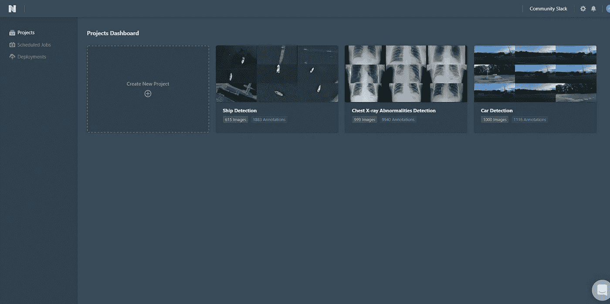
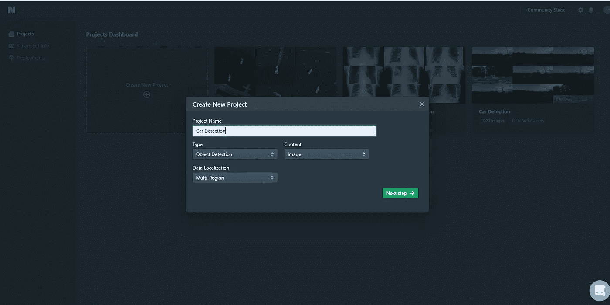
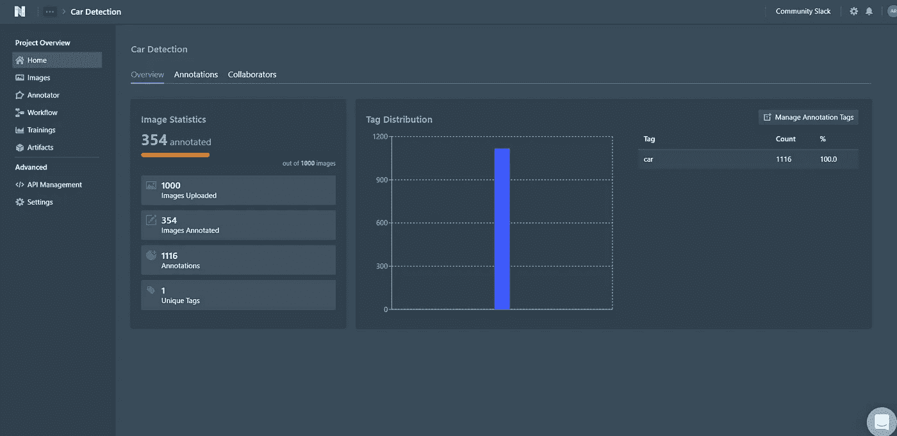
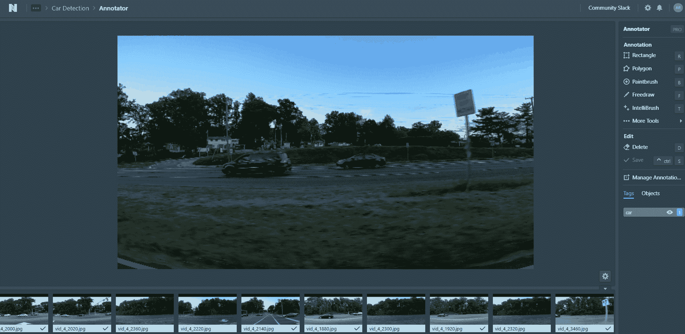
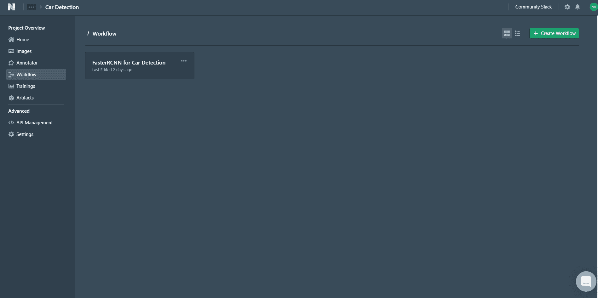
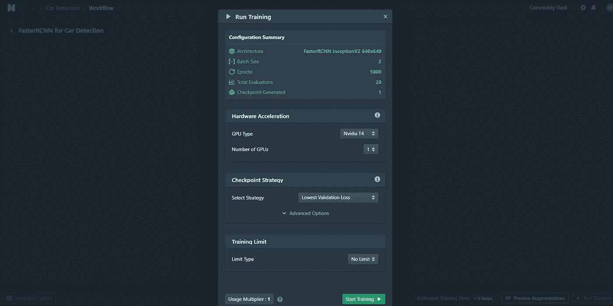
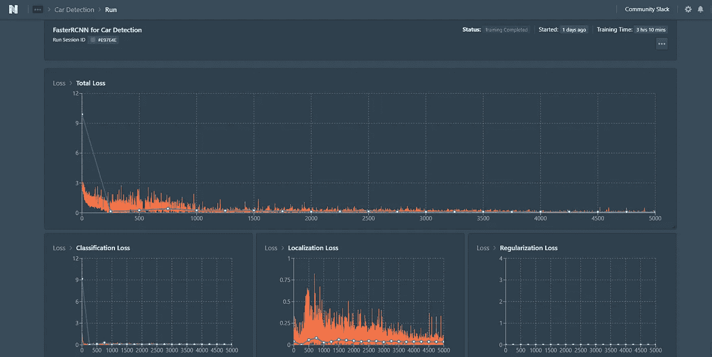
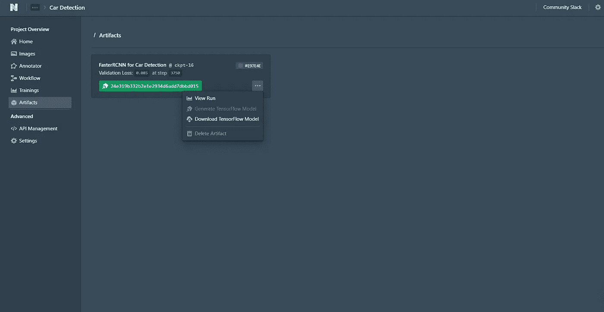
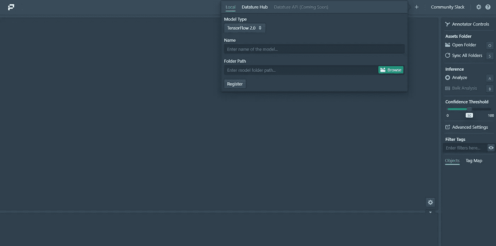
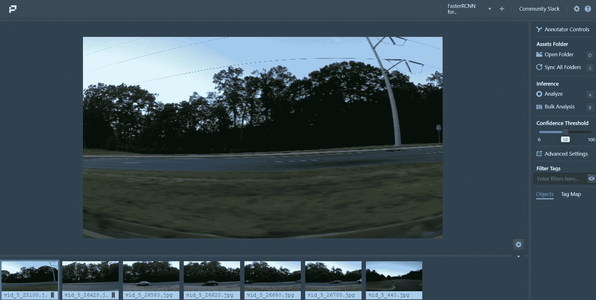

# 利用端到端 MLOps 平台简化您的计算机视觉堆栈

> 原文：<https://pub.towardsai.net/streamline-your-computer-vision-stack-with-an-end-to-end-mlops-platform-bd44d4fec823?source=collection_archive---------1----------------------->

## [机器学习](https://towardsai.net/p/category/machine-learning)

## 我希望我能更早找到这个解决方案

照片由 [Rawpixel](https://www.freepik.com/photos/technology) 在 [Freepik](http://freepik.com) 上拍摄

我过去成功地建立过计算机视觉项目，老实说，这并不容易。不，我不是说其余的人工智能项目很容易，因为它们同样具有挑战性，但 CV 项目将它带到了一个不同的水平。

给你一点更多的背景，我是一家人工智能初创公司的机器学习工程师，虽然我在计算机视觉方面有过有益的经历，但我也有过令人沮丧的经历。

我曾经接到过一个客户说“不”的电话部署我们解决方案的成本太高了。在花了大量时间构建一个解决方案的原型后，听到这个消息感觉很失望，但这就是这个行业的工作方式。

首先，收集定制数据并不容易。如果你能找到一个公开可用的数据集，你是幸运的。如果没有，你将不得不走上道路([或大海](https://www.youtube.com/watch?v=XQqsjfFN2Z4))，录制视频并手动注释。有时候我们整个 ML 团队只是在给图像加标签。

在跨远程团队工作时，想象一下将所有资产(训练过的重量、图像和实验)集中在一个地方？虽然我列出了我们面临的一些问题，但更大的潜在问题很明显:我们需要一劳永逸地简化我们的计算机视觉堆栈。

现在我不打算害怕你从事计算机视觉项目，因为我们都喜欢从事这方面的工作。很有收获。相反，我想为我所面临的这些问题提出一个更直接的解决方案，并通过一个例子告诉你我是如何解决这些问题的。

我们开始吧，好吗？

# 拯救的纽带

我希望我能更早地找到这个解决方案。

Nexus 是一个无代码平台，可以帮助 AI 从业者从标记、生成增强、神经网络模型训练到企业级部署。这是一个 MLOps 平台，使得构建计算机视觉应用*看起来很容易。*

如果承诺是真实的，这是巨大的。

Nexus 平台主页(作者截图)

几天后，在免费注释图像、创建工作流程、训练模型并对其进行推理之后，我构建了一个计算机视觉模型*。*

不，我没开玩笑。否则我不会写这个。

参与项目是获得经验的最好方式。我希望我能给你看一个我在这个行业工作过的实际项目，但是你知道保密和所有这些。因此，我将为真实世界的汽车检测用例构建一个类似的模型。

正如我所说，Nexus 有一个免费层，你可以[创建一个账户](https://nexus.datature.io/)来关注我将免费向你展示的内容(剧透:你会喜欢它的！).

# 真实世界的例子:汽车检测

多家公司已经在研究自动驾驶汽车有一段时间了，谁知道呢，我们很快就会看到价格合理的强大汽车，可以在最少的人力投入下自动驾驶。

这些自动驾驶汽车必须检测路上的其他车辆，以避免路上发生任何事故。这是一个研究人员正在积极努力改进现有解决方案的问题。这对你的投资组合来说是一个很好的补充，所以为什么不和我一起呢？

我们将使用的数据最初来自于 [TJHSST 机器学习](https://github.com/tjmachinelearning/tjmachinelearning)并且可以从 ka ggle[下载。](https://www.kaggle.com/sshikamaru/car-object-detection)该数据包含道路上的汽车和其他车辆的图像，分为训练和测试数据集。

## 步骤 1:数据注释

假设您已经登录了 Nexus 平台，我将列出几个步骤。

项目主页。(作者截图)

*   在主页上，点击`create a project`并给它一个名字，类似于“汽车检测”
*   选择`type`为“物体检测”，选择`content`为“图像”这有助于平台根据需要配置项目存储库。
*   然后点击侧边栏中的`image`图标，上传所有训练图像。(注意:我删除了最后一个训练图像，因为自由层有 1000 个图像的上传限制，但这对训练我们的模型来说绰绰有余。)

由于我们的数据集带有注释，我在选择“边界框 CSV 四角检测”格式后，使用`Annotations`选项卡将它们上传到平台。请查看[这一特定页面](https://docs.datature.io/nexus/annotations/uploading-annotations#csv-four-corner-bounding-box)了解如何格式化您的 CSV 文件。(注意:在我们的例子中，我添加了一个额外的“标签”列，并相应地编辑了标题。)

项目概述和注释页面(作者截图)

该平台为您提供了一个概要视图，我们注意到只有 354/1000 的图像被标注，我们必须标注其余的。使用左侧的`Annotator`选项卡逐个检查图像并快速绘制标签。在我们的例子中，当检查时，没有注释的图像根本没有汽车。

给图像加注释就是这么简单。(作者截屏)

不要担心，即使一开始看起来很耗时，到我的第三个项目时，我不到 5 分钟就完成了我的注释。谈谈如何快速设置数据集*。*

## 第二步:模特训练

既然我们已经准备好了数据，是时候创建我们的培训渠道了。以下是我遵循的步骤:

*   单击左侧的`workflow`选项卡创建一个空的工作流页面。
*   右键单击空白页面并添加块。整个工作流程应包含三个主要模块:数据集、扩充和模型。按顺序拖动并连接它们，使其成为管道

构建工作流。(作者截屏)

*   通过点击块来调整参数。我尝试了一些来解决 FasterRCNN InceptionV2 640x640 模型，批量大小为 2，5000 个历元，训练测试分割为 0.2，以及一些水平翻转、垂直翻转、中心裁剪作为增强。
*   在通过点击`Preview Augmentations`进行训练之前，我比较了不同的增强技术和产生的图像，这帮助我确定了我想要使用的特定增强技术。
*   点击右下角按钮`Run Training`，开始训练。我使用了 1 个验证损失最低的英伟达 T4 GPU 作为选择策略。我们的配置总结如下。

训练配置参数。(作者截图)

*   我花了大约 3 个小时完成培训，并提供了一个集成的 TensorBoard 来分析常见的评估指标。看着它，我们可以告诉我们的模型已经收敛和训练良好。

TensorBoard 仪表盘(作者截图)

最后，点击`artifacts`选项卡，选择与已经完成的培训相关的工件。右键单击它并将 TensorFlow 模型下载到您的本地机器上。

下载张量流模型。(作者截图)

我们将模型下载到本地机器上，这样我们就可以使用一个叫做 Portal 的开源可视化平台在本地进行预测。

## 第三步:推理

我们将使用[最近发布的开源引擎 Portal，](https://github.com/datature/portal)它与 Nexus 集成得非常好，可以进行预测。门户是加载和可视化深度学习模型的最快方式。

你可以按照 [GitHub](https://github.com/datature/portal) 上的说明或者下载[最新版本的可执行文件，将它安装在你的本地机器上。](https://github.com/datature/portal/releases/tag/v0.5.5)

注册模型的门户主页。(作者截图)

使用主页上的“+”图标，我通过指定文件夹路径在本地注册了 TensorFlow 模型。再次单击注册的模型加载负载(注意:任何时候只能加载一个模型。)

使用 Assets 文件夹选项卡下的`Open Folder`选项，我加载了我们下载图像时得到的测试图像。我们可以对图像逐一进行推断，也可以进行批量操作。我选择了`Bulk Analysis`选项，让模型对图像进行实时预测。

测试图像的整体分析。(作者截屏)

正如你从上面的视频中看到的，对于一个只花了我几天时间就建立起来的项目来说，它表现得非常好。

正如你现在所意识到的，我故意保持这个例子简单，使用 Nexus 和 Portal 平台引导你浏览整个 CV 栈；但是，这些平台上的可能性更多。

# 帮助你摆脱困境的资源

虽然这个平台很有前途，但我还是实话实说；当我在项目中遇到问题时，我确实陷入了困境，你可能也是。我是这样做的:

*   我只是在网站上聊天，问了很多问题。团队非常乐于助人，耐心地回答了我所有的问题。
*   如果您在我列出的任何一个步骤上遇到困难，请参考[这份全面的文档。这对我的确很有帮助。](http://docs.datature.io)
*   我在 YouTube 上跟随[这个教程](https://www.youtube.com/watch?v=KA4RGtnabDk&t=1s)视频。
*   加入 [slack 社区](https://joindatature.slack.com/join/shared_invite/zt-hv9xv84h-WYDFnU1clNM0eGW4SfQGGg#/shared-invite/email)直接与开发团队交流并提出反馈意见。

在与团队聊天时，我了解到该团队将在下一季度加入更多功能，比如智能注释和 API 部署。作为一个热爱计算机视觉工作的人，我兴奋地期待着这些功能。

# 总结想法

在这篇文章中，我们研究了人工智能从业者和数据科学家在处理计算机视觉问题时面临的一些紧迫问题。虽然有时会令人沮丧，但是使用正确的工具和平台，处理这样的问题是非常有益的。

我们采用公开可用的数据集，使用现有的和新的注释，扩充数据集，训练数据集，并对模型进行推理。我们无需编写任何代码就完成了所有这些工作。是不是很神奇？

就我个人而言，我发现对该平台进行试验非常有用，我真诚地希望您能从这篇文章中发现价值。请随意与我联系，并留下任何反馈。

你不局限于这一个例子，而是更多的例子来建立你的投资组合。如果你在这个行业，你的团队经常从事简历项目，那么这个平台是你必须尝试的。