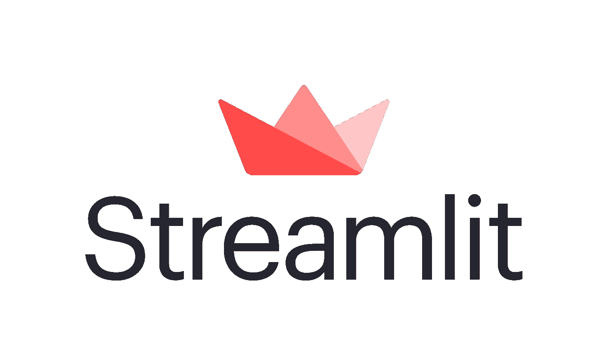
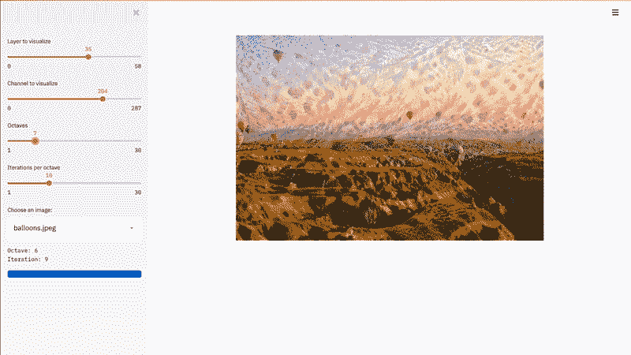
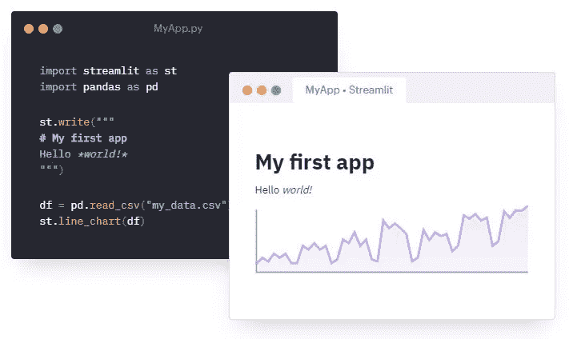
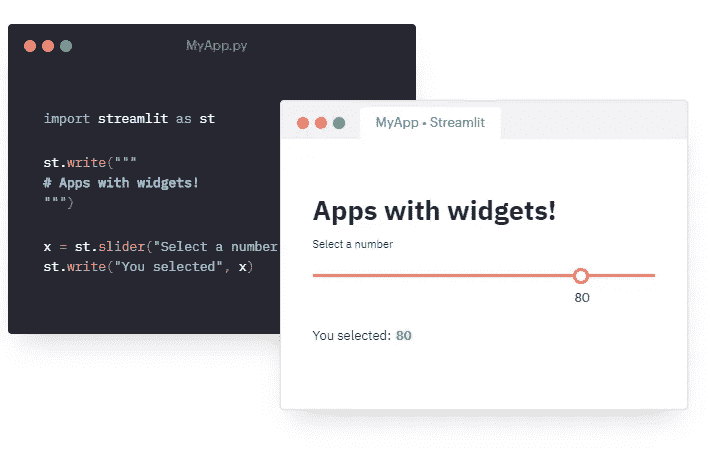
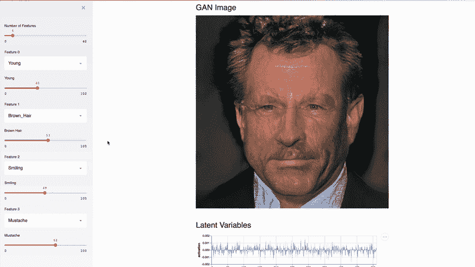

# 简化 it——革命性的数据应用创建

> 原文：<https://pub.towardsai.net/streamlit-revolutionizing-data-app-creation-e269177d9112?source=collection_archive---------1----------------------->

## [数据科学](https://towardsai.net/p/category/data-science)，[编程](https://towardsai.net/p/category/programming)

## 一个优雅高效的框架，可在几分钟内构建和共享数据应用。

在开始之前，让我们先弄清楚一个事实——并非每个数据科学家都是优秀的前端工程师。但是在“*”的世界里，你的项目的美学和它背后的技术一样重要。当你有一个惊人的数据应用程序，但没有前端专业知识来呈现给更多的观众时，你能做什么？*

## *快去救援！*

*Streamlit 是一个开源 python 库，能够在几分钟内将数据脚本转换为可共享的 web 应用程序。它使得用最少的努力和对前端设计框架的零知识来构建定制的 web 应用程序变得非常容易。这是为您的数据项目创建简单而优雅的交互式用户界面的好方法。*

> *S treamlit 将酷炫的机器学习模型包装成闪亮的包，以便作为**应用**呈现给更多观众。*

**

*基于简化 it 的应用程序正在运行…*

## *入门指南*

*Streamlit 是 PyPI 上的一个标准 python 库，可以根据 python 环境使用 pip 或 conda 轻松安装。以下是安装 Streamlit 的命令:*

**

*要检查 Streamlit 是否安装正确，请在您的终端中运行以下简单命令:*

**

## *为什么使 Streamlit 独一无二？*

> *streamlit 背后的想法是让数据应用程序的创建像编写 python 脚本一样简单。*

*在很短的时间内，它已经创建了一个由来自世界各地的 ML 工程师和数据科学家组成的繁荣社区，使论坛保持活跃和更新，这样您就不必浪费时间来调试问题或为您的应用程序添加新功能。streamlit 的其他主要功能如下:*

*   ***拥抱 Python 脚本:** Streamlit 应用实际上只是自顶向下运行的脚本。没有隐藏状态，你可以用函数调用来分解你的代码。如果你知道如何编写 Python 脚本，你就可以创建很酷的 Streamlit 应用程序了。让我们来看一个实际例子:*

**

*简单的简化应用程序*

*   ***交互派上用场:** Streamlit 将小部件视为变量，因此添加小部件就像声明变量一样简单。不需要编写后端代码、定义路由、处理 HTTP 请求等。每次交互只是从头到尾重新运行脚本。这种方法产生了真正干净的代码:*

**

*互动的 Streamlit 应用程序正在运行…*

*   ***即时部署:** Streamlit 还提供了一个平台，可以通过网络毫不费力地将您的应用分享给更多用户。它提供了简单的 GitHub 集成，允许您以最少的工作直接从 GitHub 库部署代码。*

*通过 3 个简单的步骤简化共享…*

## *一些非常酷的例子*

*Streamlit 是一个相信开源的社区，所以大多数成员创建的项目都是开源的。现在，我们将介绍一些用 Streamlit 创建的非常酷的项目:*

*   ***实时物体检测系统:**这个应用程序是使用 Udacity 的自动驾驶汽车数据集构建的。它能够实时检测目标，后端使用 [YOLO 目标检测](https://pjreddie.com/darknet/yolo)算法，前端使用 Streamlit。*

**

*[源代码](https://github.com/streamlit/demo-self-driving)*

*   ***人脸 GAN Explorer:** 该应用程序能够生成逼真的人脸，并基于 TensorFlow 构建，使用 Nvidia 的[渐进生长 GAN](https://research.nvidia.com/publication/2017-10_Progressive-Growing-of)和关的[透明潜在空间 GAN](https://blog.insightdatascience.com/generating-custom-photo-realistic-faces-using-ai-d170b1b59255) 方法来调整输出人脸的特征。*

**

*[源代码](https://github.com/streamlit/demo-face-gan/)*

*   ***适用于纽约市的地理数据浏览器:**该应用程序使用纽约市的优步皮卡数据来交互式地可视化优步皮卡和乘客在纽约市的旅程。*

**

*[源代码](https://github.com/streamlit/demo-uber-nyc-pickups)*

# *结论*

*如今，Streamlit 正成为数据科学家和 ML 工程师的一个事实上的选择，他们可以在一个美观的交互式环境中快速构建并与更多受众共享概念证明，而不是被困在二维 Jupiter 笔记本环境的网络中。Streamlit 是用户友好的，已经熟悉 python 脚本的人可以轻松学会。*

> *另外 **+1** 感谢 Streamlit 团队准备的精彩文档！*

*如果你想了解更多，或者想让我写更多关于这个主题的东西，请随时联系…*

*我的社交链接:[LinkedIn](https://www.linkedin.com/in/shubhamsaboo/)|[Twitter](https://twitter.com/Saboo_Shubham_)|[Github](https://github.com/Shubhamsaboo)*

*如果你喜欢这篇文章或觉得它有帮助，请花一分钟按一下拍手按钮，它增加了文章对其他媒体用户的可见性。*