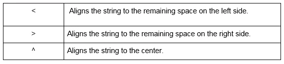
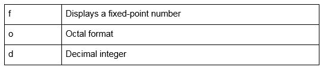
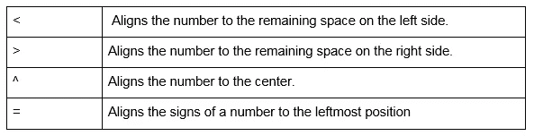

# Python 中 5 个有用的字符串格式()函数

> 原文：<https://pub.towardsai.net/string-format-function-in-python-58629726e91d?source=collection_archive---------3----------------------->

## [编程](https://towardsai.net/p/category/programming)

## 更有效地控制和处理复杂的字符串格式


由[杰佛森·桑多斯](https://unsplash.com/@jefflssantos?utm_source=medium&utm_medium=referral)在 [Unsplash](https://unsplash.com?utm_source=medium&utm_medium=referral) 上拍摄的照片

> ***什么是格式化，为什么要用？***

在 python 中，有几种呈现输出的方式。使用 python 进行字符串格式化就是这样一种方法，它允许用户比简单地打印空格分隔的值更有效地控制和处理复杂的字符串格式化。

有许多类型的字符串格式，如填充和对齐，使用字典等。格式化技术的使用不仅仅局限于字符串。它还可以格式化日期、数字、带符号的数字等。

> ***格式的结构()方法***

让我们来看看如何在字符串格式的基本结构中编写方法。

```
**Syntax**: ‘String {} value’.format(value)Let us look at an example:
‘Welcome to the {} world.’.format(“python”)
```

这里，我们定义了一个带有占位符({})的字符串(')，并将参数的实参指定为“python”在执行程序时，该值将被分配给占位符，输出显示为:

> ***格式化方法***

为了在 python 中格式化字符串，我们使用字符串格式参数。通常，format()方法接受任意数量的参数作为输出返回。这些参数只是呈现输出的不同方式。

现在，让我们用一个简单的例子来看看这两种类型的参数:

1.  **位置参数**

位置参数使用函数定义的位置调用。

代码示例如下所示:

```
**print(“This {0} is bright in {1}”.format(“pen”, “color”))**
```

在这行代码中，我们可以看到参数包含一个值({0}和{1})。这些只是在 format 方法中传递的参数的索引值。因此，当代码执行时，输出如下所示:

```
**#output:
This pen is bright in color**
```

**2。关键字参数**

关键字参数使用函数定义的名称调用。

现在，让我们看看在上述方法中使用的同一个例子:

```
**print(“This {name} is bright in {des}”.format(name = “pen”, des =
                                                           “color))**
```

您可以看到，与前面的示例相比，代码中有微小的变化。这里我们使用了键值参数。参数(name = "pen ")采用键-值格式，键的值由参数引用，输出如下:

```
**#output:
This pen is bright in color**
```

> ***基本格式化方法示例***

使用这两种方法，现在让我们看看使用 python 格式化的不同方式。

*   **默认参数**

```
**Code:** print(“The {} is half {}.”.format(“glass”, “full”))**Output:** The glass is half full.
```

*   **立场论点**

```
**Code:** print(“There are {0} {1}.”.format(4, “apples”))**Output** : There are 4 apples.
```

*   **关键字参数**

```
**Code:** print(“The {} apples are {}.”.format(a = 4, b = “old”))**Output :** The 4 apples are old.
```

*   **混合论点**

```
**Code:** print(“These {0} trucks are {name}.”.format(2, name =“old”))**Output :** These 2 trucks are old.
```

[](/python-zero-to-hero-with-examples-c7a5dedb968b) [## Python:从零到英雄(带示例)

### python 初学者手册指南

pub.towardsai.net](/python-zero-to-hero-with-examples-c7a5dedb968b) [](/numpy-zero-to-hero-with-python-d135f57d6082) [## NumPy:用 Python 从零到英雄

### python 的 NumPy 基本操作手册

pub.towardsai.net](/numpy-zero-to-hero-with-python-d135f57d6082) 

> ***字符串格式化***

从上面的例子中，我们看到了字符串是如何格式化的。让我们更深入地研究不同类型的字符串格式:

## **使用 format()对齐和填充**

有不同的操作符，当被赋予一定的宽度时，可以用于对齐。下面是对齐和填充中使用的运算符。



让我们看看每个运算符的一个示例:

*   **左对齐的字符串填充**

```
**Code**: print(“Lazy {:❤}.”.format(“dog”))**Output**: Lazydog.
```

**解释**:在语句中，“{:❤}”表示字符串的宽度被赋值为 3。并且该字符串被移动到左边的剩余空间。

*   **右对齐的字符串填充**

```
**Code**: print(“Lazy {:>3}.”.format(“dog”))**Output**: Lazy dog.
```

**解释**:在语句中，{: > 3}声明字符串被赋予宽度 3。该字符串向右对齐。

*   **居中对齐的字符串填充**

```
**Code**: print(“Lazy {:³}.”.format(“dog”))**Output**: Lazy dog
```

**解释**:在语句中，{: }声明字符串被赋予宽度 3。该字符串与中心对齐。

*   **使用字符的字符串填充**

```
**Code**: print(“Lazy {:*3}.”.format(“dog”))**Output**: Lazy *dog*
```

**解释**:在语句中，{:*3}声明字符串被赋予宽度 3。该字符串用特殊符号填充。“*”在两边。

## **使用 format()截断字符串**

现在让我们看一个如何使用 format()将字符串截短为 5 个字母的示例。

```
**Code**: print(“The {:.5} looks beautiful.”.format(“shellfish”))**Output**: The shell looks beautiful.
```

**解释:**参数{:.5}声明，实参中的值必须只返回实参的前五个字母作为输出。

[](/method-overloading-and-method-overriding-in-python-2acf154b7548) [## Python 中的方法重载和方法覆盖

### python 中的一个概念

pub.towardsai.net](/method-overloading-and-method-overriding-in-python-2acf154b7548) [](/why-map-filter-and-reduce-functions-are-so-famous-4c8e42fd0755) [## 为什么 Map()、Filter()和 Reduce()函数这么出名？

### python 中避免循环和分支的函数式编程

pub.towardsai.net](/why-map-filter-and-reduce-functions-are-so-famous-4c8e42fd0755) 

> ***数字格式***

1.  **格式说明符**

在输入和输出过程中使用了说明符。使用它是为了让编译器能够理解变量中的数据类型。让我们来看看其中的一些说明符:



**示例**:

```
print(“The decimal number : {:d}”).format(223.63))**Output:** The decimal number: 223.63
```

除了字符串之外，数字格式中还有几个运算符。这些运算符的表现与字符串完全一样。但是数字可以有不同的形式。它们可以是整数、小数、有符号、无符号等形式。让我们来看看其中的一些运算符:



让我们看看每个运算符的一个示例:

*   **带填充的整数数字格式**

```
**Code:** print(“{:5d}”.format(20))print(“{:4d}”.format(12345))print(“{:05d}”.format(20))**Output:** | 20
**|**12345
**|**00020
```

**解释:**

在第一条语句中，{:5d}声明它接受一个整数参数，并指定宽度为 5。并且它向右对齐，因为在参数中没有指定对齐方式。

在第二条语句中，{:4d}声明它接受一个整数参数，并指定宽度为 4。但是由于“4”小于数字 12345，它既不会分配空格，也不会截断数字。

在第三个语句中，“{:05d}”声明它将左边的剩余空间填充为“0”。并且字符串根据宽度大小向右对齐。

*   **带填充的浮点数的数字格式**

```
**Code:** print(“{:8.2f}”.format(23.2354))print(“{:08.2f}”.format(23.2654))**Output:** | 23.24
|0023.24
```

**解说:**

在第一条语句中，{:8.2f}声明它将小数部分截断为两部分，并对最后两位进行四舍五入。参数的总宽度为 8。即左边空出两个位置。

在第二条语句中，执行相同的操作。唯一不同的是左边的空格变成了“0”。

*   **带符号数字的数字格式**

```
#to show the positive sign **Code:** print(“The numbers:{:+d} {:+d}”.format(-10, 16))#to show space for pos sign
print(“The numbers:{: f} {: f}”.format(10.5, -6.6))**Output:** |-10 +16
| 10.5 -6.6
```

**解释:**

在第一条语句中，{:+d} {:+d}接受一个整数参数，并将一个“+”号赋给该正整数

在第二个语句中，{: f} {: f}接受一个十进制值，并且只将空格分配给正值。

*   **左对齐、右对齐和居中对齐的数字格式**

```
**Code:** print(“{:<05d}”.format(22))print(“{:¹⁰.3f}”.format(23.2346))print(“{:=10.3f}”.format(-23.2346))**Output:** |22000
| 23.235
|- 23.235
```

**说明:**

在第一条语句中，{: <05d} states that the argument is assigned a width of 5 aligned to the left. And the remaining space is filled with the value “0”.

· In the second statement, {:¹⁰.3f} states that it truncates the decimal part to 3, rounding off the last digit. And the argument takes a total width of 10 and aligns to the center.

· The third statement, {:=10.3f} is similar to the second statement. The only difference is that the sign gets pushed to the leftmost side.

*   **格式化类成员**

```
**Code:** class Pen:color = “red”brand = “Parker”print(“The {p.brand} pen is {p.color} in color.”.format(p.Pen())**Output:** The Parker pen is red in color.
```

**说明**:这里，对象名“Pen”作为关键字参数“p”传递。在 print 语句中，Pen 的“颜色”和“品牌”是使用“.”来访问的。颜色“”和”。品牌分别为“”。

> ***格式化字典成员***

```
**Code:** Pen = {‘color’: ‘red’, ‘brand’: ‘Parker’}print(“The {p[brand]} pen is {p[color]}.”.format(p=Pen))**Output:** The Parker pen is red in color.
```

**解释:**类似于类格式化，对象名“Pen”作为关键字参数“p”传递。在 print 语句中，Pen 的“颜色”和“品牌”是使用“.”来访问的。颜色“”和”。品牌分别为“”。

> ***日期和时间格式***

```
**Code:** from datetime import datetimeprint(“Today’s date and time is: 
                          {:%Y-%m-%d %H:%M}”.fomat(datetime.now()))**Output:** Today’s date and time is: 2021–06–13 08:30
```

> ***结论***

嘿，读者们，这篇文章已经涵盖了字符串格式的所有基础知识。我希望你喜欢阅读这篇文章，我鼓励你继续探索这个话题。

我希望你喜欢这篇文章。通过我的 [LinkedIn](https://www.linkedin.com/in/data-scientist-95040a1ab/) 和 [twitter](https://twitter.com/amitprius) 联系我。

# 推荐文章

[1。NLP —零到英雄用 Python](https://medium.com/towards-artificial-intelligence/nlp-zero-to-hero-with-python-2df6fcebff6e?sk=2231d868766e96b13d1e9d7db6064df1)
2。 [Python 数据结构数据类型和对象](https://medium.com/towards-artificial-intelligence/python-data-structures-data-types-and-objects-244d0a86c3cf?sk=42f4b462499f3fc3a160b21e2c94dba6)
3。[Python 中的异常处理概念](/exception-handling-concepts-in-python-4d5116decac3?source=friends_link&sk=a0ed49d9fdeaa67925eac34ecb55ea30)
4。[为什么 LSTM 在深度学习方面比 RNN 更有用？](/deep-learning-88e218b74a14?source=friends_link&sk=540bf9088d31859d50dbddab7524ba35)
5。[神经网络:递归神经网络的兴起](/neural-networks-the-rise-of-recurrent-neural-networks-df740252da88?source=friends_link&sk=6844935e3de14e478ce00f0b22e419eb)
6。[用 Python 充分解释了线性回归](https://medium.com/towards-artificial-intelligence/fully-explained-linear-regression-with-python-fe2b313f32f3?source=friends_link&sk=53c91a2a51347ec2d93f8222c0e06402)
7。[用 Python](https://medium.com/towards-artificial-intelligence/fully-explained-logistic-regression-with-python-f4a16413ddcd?source=friends_link&sk=528181f15a44e48ea38fdd9579241a78)
充分解释了 Logistic 回归 8。[concat()、merge()和 join()与 Python](/differences-between-concat-merge-and-join-with-python-1a6541abc08d?source=friends_link&sk=3b37b694fb90db16275059ea752fc16a)
9 的区别。[与 Python 的数据角力—第一部分](/data-wrangling-with-python-part-1-969e3cc81d69?source=friends_link&sk=9c3649cf20f31a5c9ead51c50c89ba0b)10。[机器学习中的混淆矩阵](https://medium.com/analytics-vidhya/confusion-matrix-in-machine-learning-91b6e2b3f9af?source=friends_link&sk=11c6531da0bab7b504d518d02746d4cc)