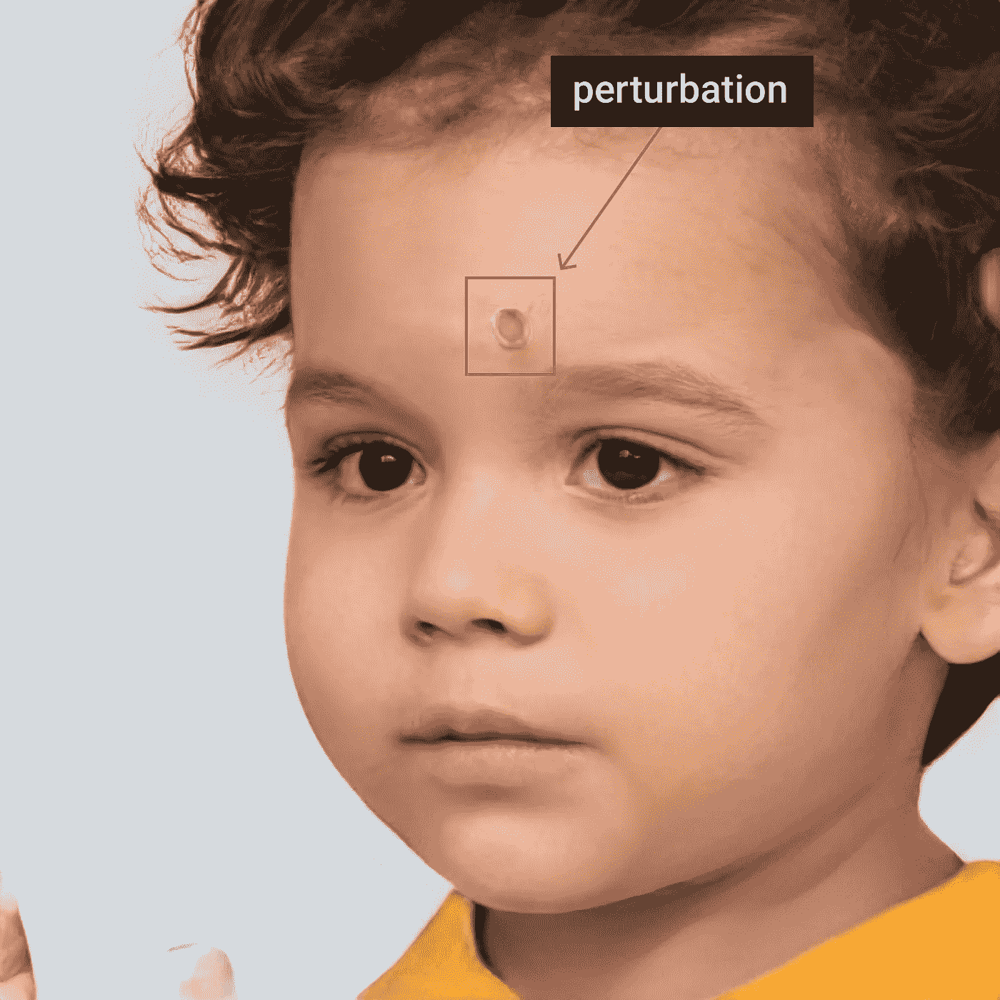
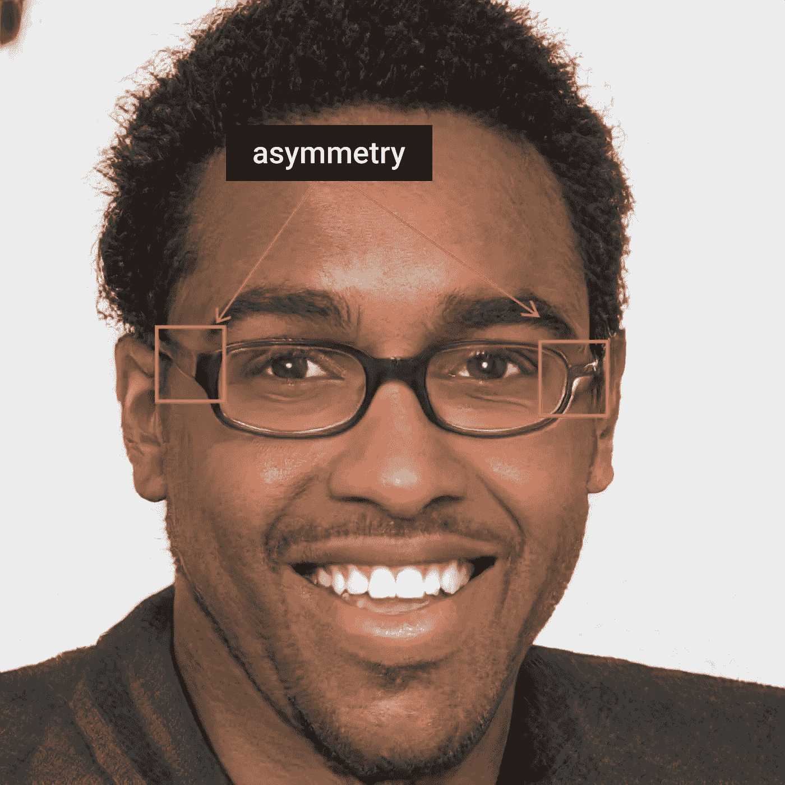
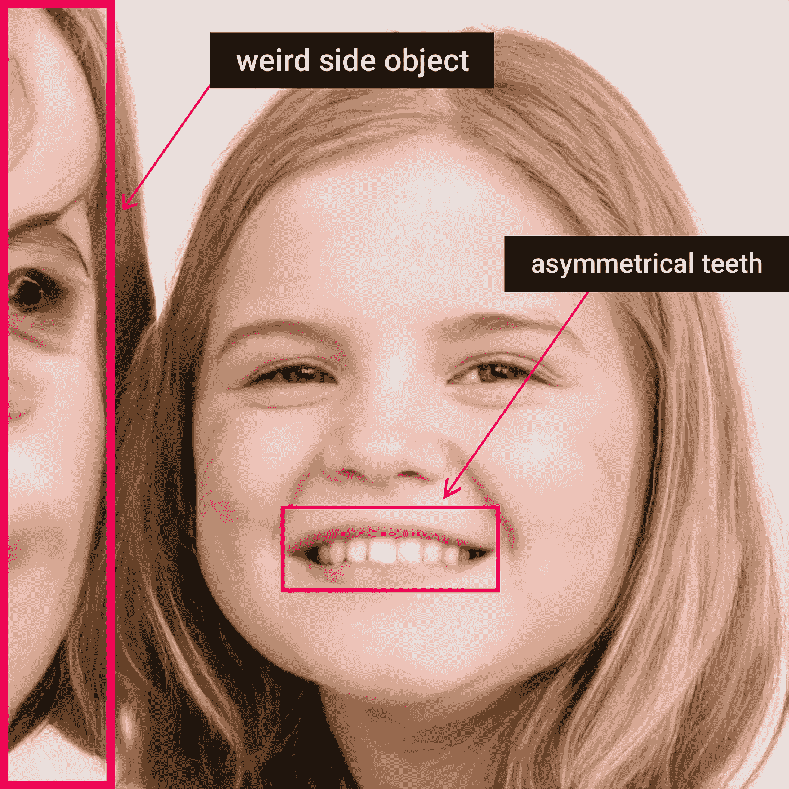
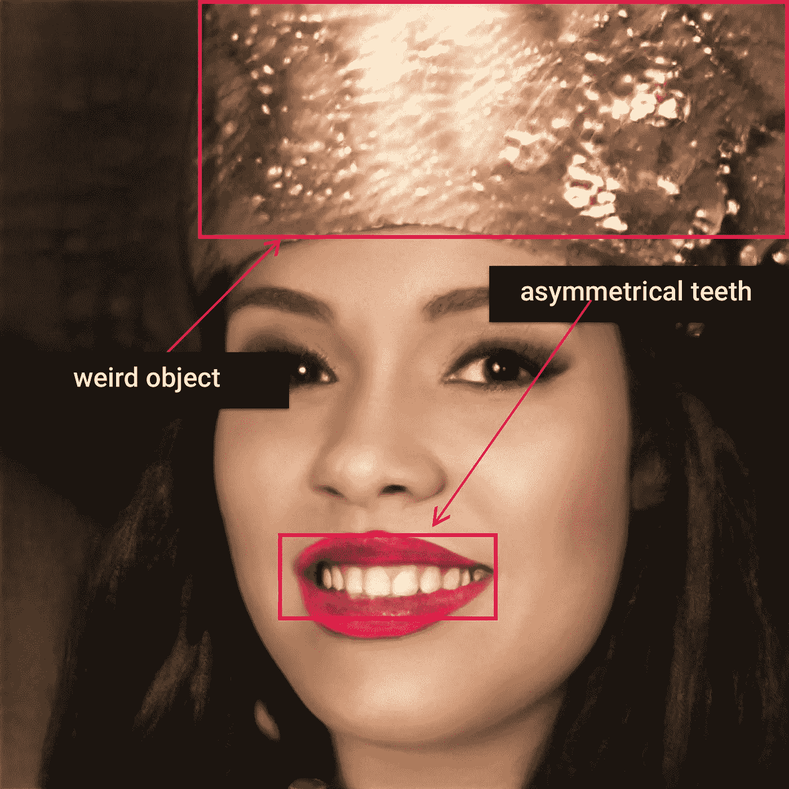
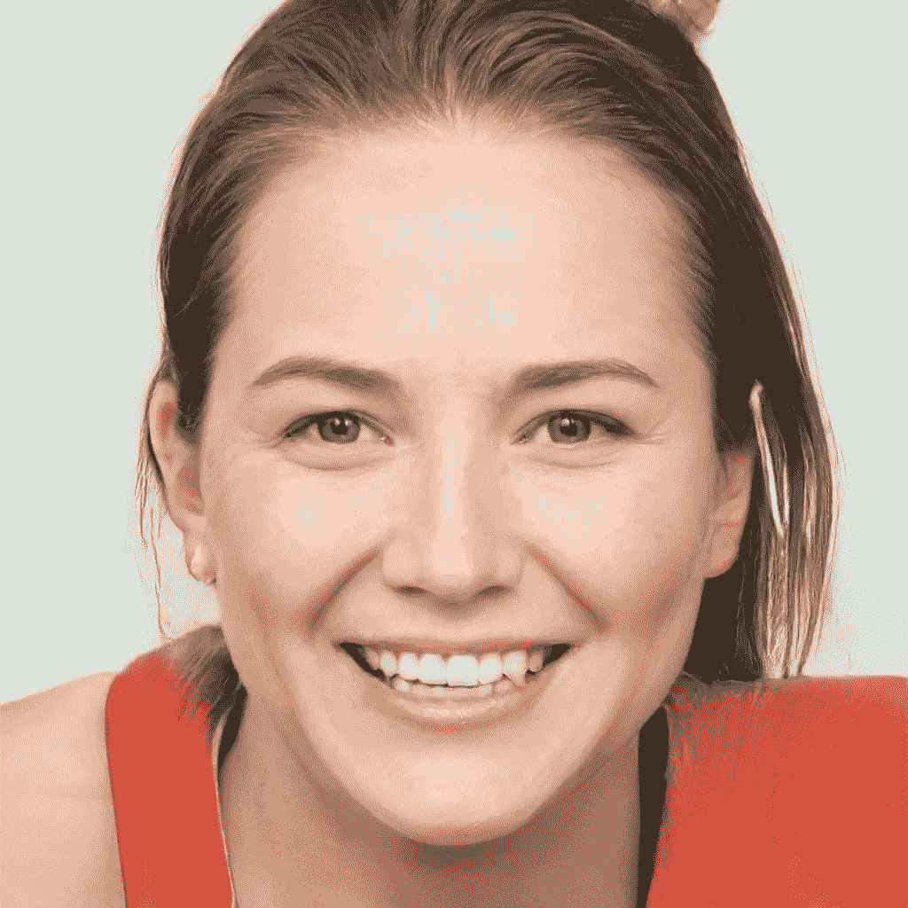
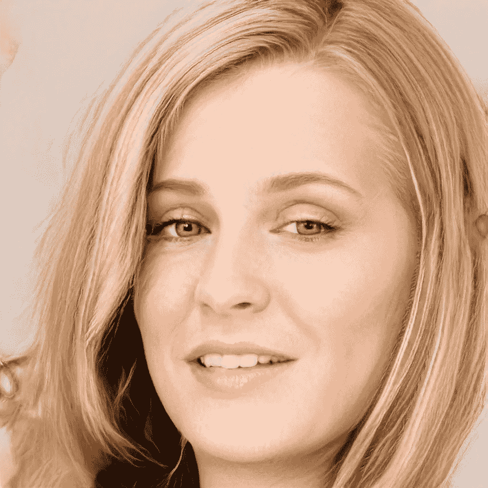
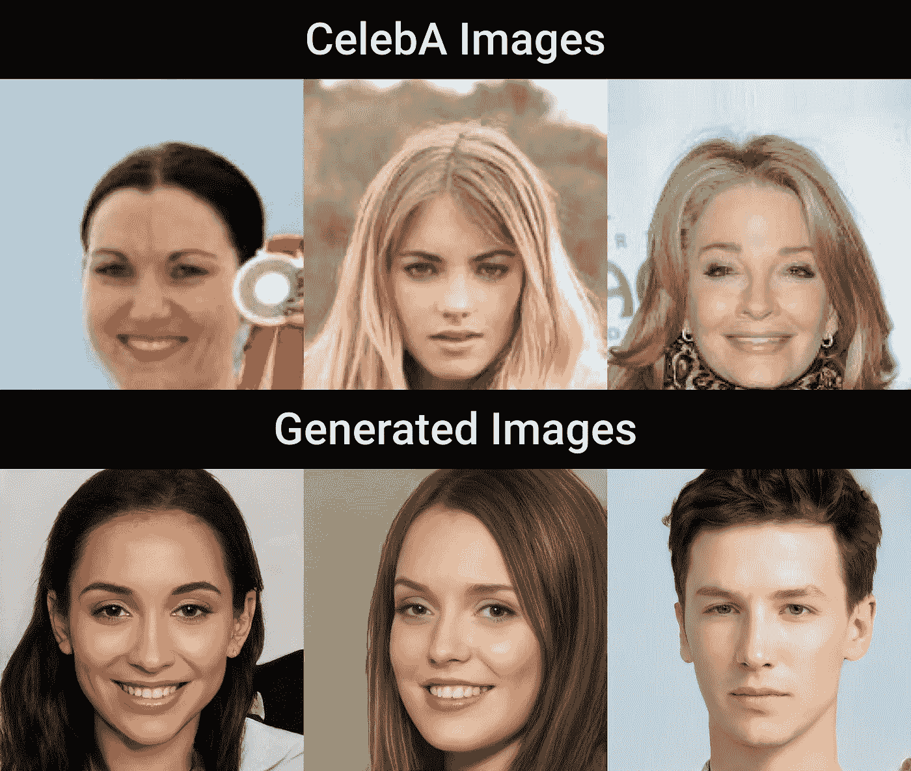
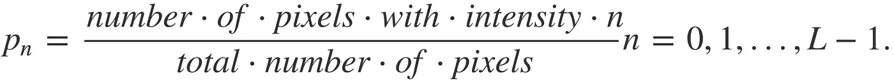
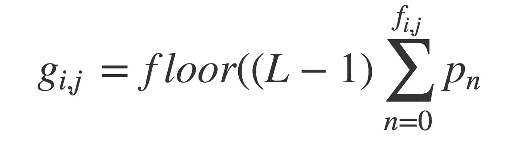
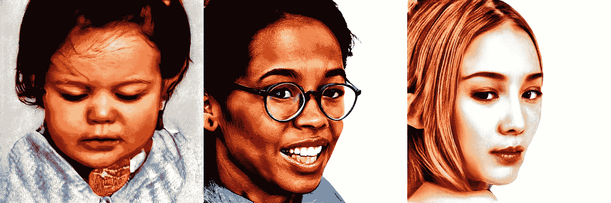

# 用 ResNexts 生成人脸分类

> 原文：<https://pub.towardsai.net/stylegan-generated-face-classification-with-resnexts-19535ed1d91d?source=collection_archive---------0----------------------->

## 对 AI 使用带有 StyleGAN | [的 ResNexts】](https://towardsai.net)

https://generated.photos

一两周前，一个团队发布了一个由 10 万张生成人脸图像组成的数据集，这些图像基于 StyleGAN [ *Karras 等人和 NVIDIA]* [*(见论文)*](https://arxiv.org/pdf/1812.04948.pdf) *。*

不久前，我们在[https://www.thispersondoesnotexist.com](https://www.thispersondoesnotexist.com)上看到类似的技术开放给公众互动，基本上为网站的每次访问生成一个全新的面孔。

网络是健全的，工作令人印象深刻，这是肯定的。老实说，我们这些 ML/DL 领域的人，特别是如果你玩过 GANs，熟悉计算机视觉的话，可以以某种方式检测出伪造。

无论如何，让我分享几个在大多数情况下生成图像的危险信号:

## 1.像素扰动

许多几乎完美的生成图像有残缺的像素，看起来像
“洞”。



从 https://generated.photos 中检索

## 2.不对称

物体是不对称的。在这种情况下，眼镜的两面是不同的。



从 https://generated.photos 中检索

## 3.奇怪的侧物，不对称的牙齿。

为了防止图像上出现另一个物体，我们破坏了它的概念。在这幅图像中，我们看到了一个人的想法，但它似乎很怪异。



检索自[https://generated . photos](https://generated.photos)

## 4.不对称的牙齿，奇怪的侧物

又是不对称和奇怪的物体，但在这种情况下，牙齿的不对称被清楚地展示出来，物体给我们的感觉就像我们知道它是什么，但不能描述它。



检索自[https://generated . photos](https://generated.photos)

## 5.人造皮肤

生成的图像中的皮肤结构不良。过渡、高光和锐度很容易识别。



检索自[https://generated . photos](https://generated.photos)

## 6.头发

头发在大多数情况下是杂乱的，并且与不同的物体、皮肤或背景混合在一起。



检索自[https://generated . photos](https://generated.photos)

# *数据使用义务*

嗯，当你看到一个免费的公开数据时，很难不去尝试一下。生成的图像可免费用于商业和研究目的*，“只是为了链接回它们”*，如使用条款所述。

说到[**Google Colab**](https://colab.research.google.com)**依赖者，出于几个原因，收集全部数据确实很有挑战性，比如 a .在添加到我的驱动器时没有完全访问权限。b .嗯，有 100K 的图像， **Colab** 在读/写(移动、复制)媒体文件的情况下确实很慢。**

**并且，我选择使用 CelebA 图像作为**【True】**类。
所以:*真实图像* : **真**，*生成图像* : **假****

**在分析数据集时，我注意到了一些差异和相似之处:**

1.  **嗯，—质量。CelebA 对齐的图像是像素化的，质量较低，而 StyleGAN 生成的图像具有**超分辨率(1024x1024)****
2.  **背景多样性 CelebA 图像中呈现了各种背景，如横幅、田野、汽车等。但是，在生成的情况下，我们有几乎相同的背景。**
3.  **亮度——CelebA 图像自然突出显示，而 stylegan 图像生成了合成光。**

****

**在这种情况下，模型将很容易过度拟合数据，这是肯定的。
说得更清楚一点——我并不是在构建一个最优的假脸检测器，只是试图对这些规格生成的图像进行分类。所以，一点点过度拟合不是一个大问题。**

**我在 PyTorch 中工作，除了 ***水平/垂直翻转*** *和* ***颜色抖动:*****

## **Clache 过滤(直方图均衡算法):**

**我们取 3 个通道(LAB ),其中(L)通道表示图像上的白色强度，**

**并且在黑色(0)和白色(100)之间计算。**

**绿色(-)和红色(+)之间的通道**

**b 通道—介于蓝色(-)和黄色(+)之间**

****

**并且，图像 *g* 的直方图均衡化将表示为**

****

## ****亮度和对比度正常化****

****

**CLACHE 和 B/C 规范化**

**通过应用亮度和对比度标准化和 CLACHE 预处理的图像似乎可以区分图像的异常并使其尽可能清晰。
图像被调整到 **299x299。****

# **ResNeXt**

**想法是通过完成以下步骤使用 torchvision 预训练的 ResNeXt-101 模型:**

1.  **仅培训网络负责人[ ***lr=1e-3，SGD*** ]**
2.  **训练层 4 及以上[ ***lr=1e-3，SGD*** ]**
3.  **训练全网[ ***lr=1e-4，SGD*** ]**

# **培训和结果**

```
Epoch 1 Train loss: 0.452.. Test loss: 0.495.. Test accuracy: 0.795 Epoch 1 Train loss: 0.363.. Test loss: 0.400.. Test accuracy: 0.827 Epoch 2 Train loss: 0.302.. Test loss: 0.331.. Test accuracy: 0.843 Epoch 2 Train loss: 0.166.. Test loss: 0.271.. Test accuracy: 0.880 Epoch 3 Train loss: 0.015.. Test loss: 0.252.. Test accuracy: 0.909 Epoch 3 Train loss: 0.062.. Test loss: 0.194.. Test accuracy: 0.911 Epoch 4 Train loss: 0.108.. Test loss: 0.183.. Test accuracy: 0.936 Epoch 4 Train loss: 0.029.. Test loss: 0.142.. Test accuracy: 0.964 Epoch 5 Train loss: 0.279.. Test loss: 0.135.. Test accuracy: 0.968 Epoch 5 Train loss: 0.119.. Test loss: 0.110.. Test accuracy: 0.973
```

**该模型在测试集上显示了非常有希望的结果。而且，只要在大多数情况下，模型的表现与它们在测试集中表现的方式不同，这种情况的发生有很多原因:调优不佳、数据不规范等等。，我总是尝试在看不见的数据上手动测试它们。**

**通过选择 ***100 张真的*** 和 ***100 张假的*** 图片进行手动验证，我最终只有 3 个错误，但在验证程序后预测我的社交媒体个人资料图片时，模型完全混乱了。**

**整篇文章的想法是鼓励人们测试自己的想法，尝试不同的方法来检测虚假生成的数据，即使你可能没有太多的时间来微调模型，以便在不同的领域进行研究。因为，你的工作可能会对其他人有所启发，我们真的可以看到令人印象深刻的 GANs 用于非法目的的潜在风险。**

## **调整模型的链接:**

**[](https://drive.google.com/drive/folders/1QRvun5knO4Awo2hcl0C1INPkHO5UdNMf?usp=sharing) [## ResNext101 - Google Drive

### 编辑描述

drive.google.com](https://drive.google.com/drive/folders/1QRvun5knO4Awo2hcl0C1INPkHO5UdNMf?usp=sharing) 

***只需用 torch.load()函数加载，声明 classes = ['generated '，' groundtruth']，即可使用。*****