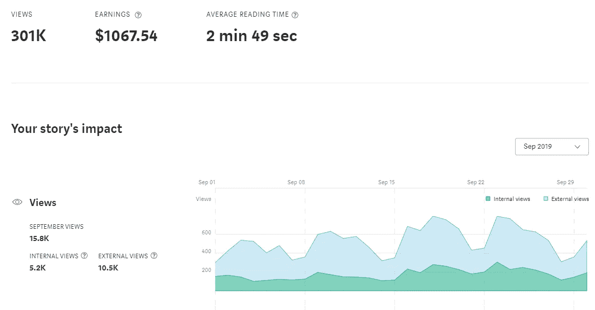
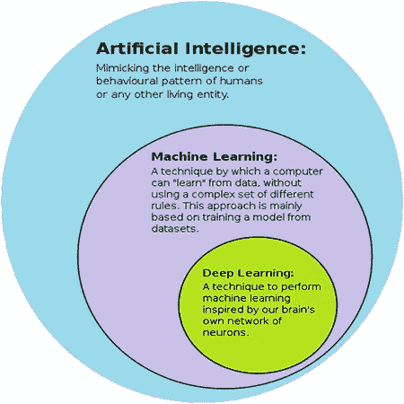

# 用走向人工智能为人工智能做贡献

> 原文：<https://pub.towardsai.net/submit-your-medium-story-to-towards-ai-a4fa7e8b141d?source=collection_archive---------0----------------------->

面向 AI 的作者→[https://towardsai.net/contribute](https://towardsai.net/contribute)

## 了解如何获得出版与[走向人工智能](https://towardsai.net/p)

最后更新 2022 年 9 月 25 日

## 航行

*   [我们是谁？](#23e5)
*   [为什么要投稿？](#419b)
*   [指导方针](#e350)
*   [主题](#de78)
*   [示例](#43b1)
*   [常见问题解答](#1acf)
*   [如何提交](#5189)
*   [资源](#8bbc)

# 什么是走向 AI？

自 2019 年以来，走向人工智能提供了一个共享信息、教育内容和人工智能研究的开放平台，目标是培养建设性的话语，使人工智能在任何体验水平上都可以访问。它拥有 2000 多名撰稿人，并受益于 [**人工智能社区**](https://community.towardsai.net) 的数十万追随者。

该平台是人工智能领导者、从业者、学生和爱好者的领先教育资源和社区空间。《走向人工智能》致力于发布不带偏见的人工智能和技术相关文章，并以透明的方式只与高度相关内容的赞助商合作。

 [## 一起学习人工智能，人工智能社区走向人工智能

### 加入拥有数千名数据领导者的 Learn AI 社区。支持我们，与其他人工智能爱好者合作…

community.towardsai.net](https://community.towardsai.net/) 

# 为什么要考虑成为《走向 AI》的投稿人？

*   我们发布的任何文章都会被添加到我们的队列中，然后通过我们的社交网络(270，000+关注者)和我们的媒体订阅者(25，000+)自动分享到我们的网站和媒体平台。
*   作为投稿人，您的文章也将在我们的社交网络上重新分享，新读者可以通过我们网站上的搜索和存档来访问。
*   我们从我们的投稿人中选择了我们的每周文章以及 1-4 个其他亮点，以在我们发送给 73，000 多名订户的每周人工智能时事通讯中进行特写。
*   如果你的文章在 Medium 的付费墙之后，你可以通过[**Medium Partner Program**](https://medium.com/creators)**获得收入，并保留 100%的收入。**
*   你也可以在没有付费墙的情况下发表文章，这些文章现在也有资格获得**的监管。**
*   **与我们广泛的社区建立联系。**
*   **必要时通过接受编辑反馈来提高写作水平。**

****

**通过 Medium Partner Program 在[发表的关于 AI](https://pub.towardsai.net/) 的策划文章示例。**

# **披露:**

*   **由于金融法规，我们不接受与金融、股票市场、加密货币、非金融交易、交易、估价或投资相关的内容。**
*   **如果你的公司已经收到了资金，并且有一个开源版本的软件，我们仍然认为你的作品是受赞助的。请使用我们的 [**赞助商表格**](https://sponsors.towardsai.net/) 提交，我们的编辑会审核。**
*   **我们所有的文章都来自他们各自的作者，可能不反映朝向人工智能公司，其编辑，或其其他作者的观点。有关完整条款，请访问我们的 [**服务条款页面**](https://towardsai.net/terms) 。**

# **指导方针**

*   **请提交 [**未发表的草稿**](https://help.medium.com/hc/en-us/articles/215564177-Sharing-drafts-and-getting-feedback) ，阅读时间至少为五分钟(850 字以上，我们的编辑可能会根据文章的质量对此准则做出例外规定)。**
*   **我们不接受抄袭。您可以引用其他来源的文本，但必须以数字形式引用([1] [2]等)，并且任何复制的文本不能超过一个作者内容的 10%。否则，你的文章将被拒绝。**
*   ****您投稿中的任何脏话都会自动过滤您的投稿，我们不会看到。请不要使用冒犯性的词语。****
*   **最好用漂亮的图片来吸引你的观众——免费的图片可以在****[**Unsplash**](https://unsplash.com/)**[**stock snap**](https://stocksnap.io/)**[**Flickr**](https://www.flickr.com/)**[**Pexels**](https://www.pexels.com/)**，】**************
*   ****请确保您有权使用您在文章中使用的任何图像，并在标题下引用它们。****
*   ****请确保您有权使用您文章中包含的任何图像，并在标题下引用它们。****

****以下是如何给出图片致谢:****

******对于知识共享图像:******

********

****来源:图片由 [xresch](https://pixabay.com/users/xresch-7410129/) 在 [Pixabay](https://pixabay.com/illustrations/tech-circle-technology-abstract-3041437/) 上拍摄****

********

****来源: [Wikimedia Commons](https://commons.wikimedia.org/wiki/File:AI-ML-DL.svg) ，根据[Creative Commons](https://en.wikipedia.org/wiki/en:Creative_Commons)[Attribution-Share likely 4.0 International](https://creativecommons.org/licenses/by-sa/4.0/deed.en)许可证授权。****

******对于您创建的图像:******

********

****来源:图片由作者提供。****

*   ****确保你的故事有意义——付出比得到更多。****
*   ****请使用语法和可读性工具，如****。**如果你的文章语法错误太多，就不会被接受。******
*   ****请确保遵循 [**Medium 的策展指南**](https://help.medium.com/hc/en-us/articles/360006362473)——你的作品将有更好的机会被策展。如果您是中型合作伙伴计划的一部分，您将能够创造收入。如果你的文章没有付费墙，它仍然有资格进行监管。****
*   ****出于**的可访问性目的，请包括 [**ALT 文本**](https://medium.com/gobeyond-ai/adding-alt-tags-to-images-on-medium-563d6d31130a) 到[**描述您的图片**](https://webaim.org/techniques/alttext/) ，并请在您文章的超链接上使用可辨别的链接。比如，不要说“你可以在这里找到代码****，**”而是说“你可以在 [**GitHub**](https://github.com/) **上找到代码。**“要了解更多关于可识别链接的信息，请访问俄勒冈州立大学关于 [**描述性链接**](https://accessibility.oregonstate.edu/descriptivelinks) 的指南。********
*   ****如果你的文章谈到一个 [**AI 创业**](https://sponsors.towardsai.net)**公司，或者产品，我们邀请你成为 [**走向 AI 发起人**](https://sponsors.towardsai.net) 。你将支持我们发布新内容的努力，建立和维护对人工智能社区有价值的产品和资源，并继续支持我们的贡献者。******

****点击下面的链接，了解更多关于如何成为“走向人工智能”赞助商的信息:****

**** [## 帮助将人工智能和技术初创公司扩展到企业|走向人工智能

### 《走向人工智能》每月通过我们的定制软件为数百万科技读者提供服务。我们拥有成千上万的人工智能和…

sponsors.towardsai.net](https://sponsors.towardsai.net) 

# 观众感兴趣的话题

我们的观众主要对人工智能(AI)和技术相关的话题感兴趣。虽然这听起来很简单，但它的范围非常广泛！随着人工智能应用进一步渗透到现代生活的几乎每个方面，主题并不短缺。我们鼓励对你所选主题的更大的道德和社会影响进行分析。这些对于挑战你和你的读者更好地理解定义你的主题的关系是重要的，正如这些影响将继续定义人类与技术的更大关系。

在选择主题时，我们鼓励写一些其他文章还没有涉及到的东西。你可以在我们的网站上搜索这个话题，看看是否有人写过这个话题。虽然在某些情况下重复是可以的，但我们努力为观众创造新颖的内容。如果你选择了一个经典的话题，试着加入你自己的观点，带来新鲜的想法。

# 例子

下面是一些你的读者会喜欢的文章示例(基于过去的表现统计):

 [## 贝叶斯更新和“图像变得更清晰”的类比

### 作者:大卫·奥尔德斯博士。贝叶斯更新——当新的信息可用时修改估计——是一个关键…

towardsai.net](https://towardsai.net/p/probability/bayesian-updating-and-the-picture-becomes-clearer-analogy-f5703b0cb820)  [## 感知器不是 SGD:通过伪梯度的更好解释

### 作者:弗朗切斯科·奥拉博纳博士与我妻子的真实对话(图片来自 xkcd.com)有一个流行的…

towardsai.net](https://towardsai.net/p/machine-learning/perceptron-is-not-sgd-a-better-interpretation-through-pseudogradients)  [## 一次一个乐高:解释神经网络如何学习的数学与实现…

### 作者:Omar U. Florez，博士。神经网络是线性和非线性模块的巧妙组合。当我们…

towardsai.net](https://towardsai.net/p/machine-learning/one-lego-at-a-time-explaining-the-math-of-how-neural-networks-learn-with-implementation-from-scratch-39144a1cf80)  [## 我们希望在研究生院拥有的深度学习工具

### 有多大决心可以解决我们的深度学习基础设施问题

towardsai.net](https://towardsai.net/p/deep-learning/the-deep-learning-tool-we-wish-we-had-in-grad-school)  [## 代数的基本定理

### 用复数证明所有多项式函数都有根

towardsai.net](https://medium.com/towards-artificial-intelligence/the-fundamental-theorem-of-algebra-f2ddf3ffa9f6)  [## 机器学习和数据科学的最佳公共数据集

### 适用于机器学习、数据科学、情感分析、计算机视觉、自然语言的最佳开放式数据集…

towardsai.net](https://medium.com/towards-artificial-intelligence/best-datasets-for-machine-learning-data-science-computer-vision-nlp-ai-c9541058cf4f)  [## 您应该如何、何时以及为什么对您的数据进行规范化/标准化/重新缩放？

### 作者:Swetha Lakshmanan 在深入这个主题之前，让我们先从一些定义开始。

towardsai.net](https://towardsai.net/p/data-science/how-when-and-why-should-you-normalize-standardize-rescale-your-data-3f083def38ff)  [## LSTMs 教程:计算观点

### 作者:Manu Rastogi 照片由 Jack Nagz 在 Unsplash 上提供最近，人们对嵌入产生了很大的兴趣…

towardsai.net](https://towardsai.net/p/machine-learning/tutorial-on-lstm-a-computational-perspective-f3417442c2cd)  [## 数据科学需要多少数学？

### 作者:Benjamin Obi Tayo，博士图像由 Benjamin O. Tayo 提供数学技能在数据科学和机器中至关重要…

towardsai.net](https://towardsai.net/p/data-science/how-much-math-do-i-need-in-data-science-d05d83f8cb19)  [## 探索性数据分析(EDA)——不要问怎么做。问什么

### 任何数据科学项目的第一步都是 EDA。本文将解释为什么 EDA 中的每一步都很重要…

towardsai.net](https://medium.com/towards-artificial-intelligence/exploratory-data-analysis-eda-dont-ask-how-ask-what-2e29703fb24a)  [## 每个人都能理解机器学习——回归树模型

### 没有公式、方程式和科学陈述回归树模型介绍

towardsai.net](https://medium.com/towards-artificial-intelligence/everyone-can-understand-machine-learning-regression-tree-model-28e3541b3e79) 

# 常见问题解答

## 媒体报道了我的文章。我能把它也加到《走向人工智能》里吗？

是的，绝对的。当您将您的故事添加到出版物中时，您就为它添加了全新的受众(在我们的案例中，我们的媒体关注者、我们的关系以及我们的社交媒体关注者)。你的故事将继续被 Medium 在其主页和其他地方推广，这取决于 Medium 的策展人。

## 中等付费墙呢？

我们的作者可以自由出版没有付费墙或通过中等付费墙。两种类型的文章都是以同样的方式推广的，都有资格在 Medium 下获得 [**策展**](https://help.medium.com/hc/en-us/articles/360006362473-Medium-s-Distribution-Standards-What-Writers-and-Publications-Need-to-Know) 。

## 《走向人工智能》会从我的收入中提成吗？

不会。作者通过 [**中型合作伙伴计划**](https://help.medium.com/hc/en-us/articles/115011694187-Getting-started-with-the-Medium-Partner-Program) 保留 100%的收入。

# 准备好提交您的文章了吗？

请通过下面的网站将您的文章( [**一个中稿的链接**](https://help.medium.com/hc/en-us/articles/215564177-Sharing-drafts-and-getting-feedback) ) **，**以及您的 LinkedIn 个人资料或简历的链接发送给我们。请不要忘记用语法检查器检查你的文章，比如语法检查器****来提高你文章的语法和可读性。****

# **有本文没有解决的问题吗？**

**请给我们发电子邮件，我们会尽快回复你。**

** [## 为迈向人工智能做出贡献

### 感谢您对发布《走向人工智能》感兴趣。请填写以下表格，我们会尽快回复…

contribute.towardsai.net](https://contribute.towardsai.net/) 

一旦你在我们这里发表了你的第一篇文章，你就被认为是一个拥有人工智能的作家，你可以直接通过媒介 提交你的文章 [**。**](https://help.medium.com/hc/en-us/articles/213904978-Add-draft-or-post-to-publication)

*   **对于提交反馈的任何延迟，我们深表歉意。我们每天都会收到几篇文章，我们会尽可能快地回复潜在作者。**
*   如有必要，我们保留编辑您文章的权利。
*   我们尽量在被批准发布后的 1-3 个工作日内发布提交的文章。
*   **请注意，我们只接受中等起源的文章，没有 pdf 格式，没有其他领域的链接。**

提前感谢您的时间和考虑。我们期待把《走向人工智能》打造成你的文章之家！

# 资源

如需更新，请务必订阅我们的 [**简讯**](https://towardsai.net/subscribe) 。

《走向人工智能》采用了美联社的风格:

 [## AP 风格//普渡写作实验室

### 这一页是普渡大学的猫头鹰带给你的。打印本页时，您必须包括完整的法律…

owl.purdue.edu](https://owl.purdue.edu/owl/subject_specific_writing/journalism_and_journalistic_writing/ap_style.html)  [## 标题大写工具-大写我的标题-标题大小写工具

### 通过单击选项卡选择上面的标题大写样式。如果您有问题，请阅读我们的标题大写…

capitalizemytitle.com](https://capitalizemytitle.com/) 

《走向人工智能》使用 IEEE 风格进行引用:

 [## 免费 IEEE 引文生成器，为我引用这个

### 使用 Cite This For Me 功能强大且易于使用的 IEEE 引文，快速引用书籍、期刊、网站等

www.citethisforme.com](https://www.citethisforme.com/citation-generator/ieee) 

延伸阅读:

 [## 走向人工智能类别

### 下面请按字母顺序(A-Z)找出所有的人工智能类别

towardsai.net](https://medium.com/towards-artificial-intelligence/towards-ai-categories-d59922a80d8e)  [## 对于作者来说，人工智能的变化

### 我们已经做了一些改变，以改善作者在向 AI 发布时的体验

towardsai.net](https://medium.com/towards-artificial-intelligence/for-authors-changes-on-towards-ai-ef6700162059)******