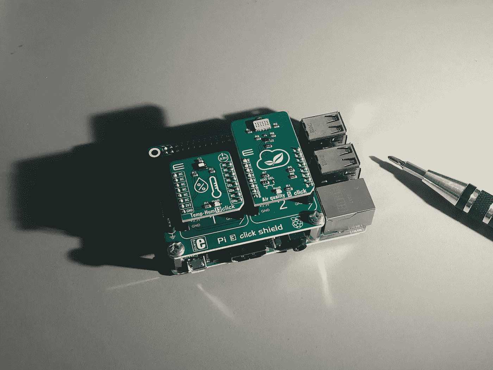
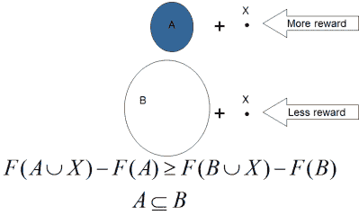

# 传感器放置问题中的子模

> 原文：<https://pub.towardsai.net/submodularity-in-sensor-placement-problems-a82e9fecf3f5?source=collection_archive---------4----------------------->

## [人工智能](https://towardsai.net/p/category/artificial-intelligence)

## 更多的是相对的

由 [Luigi Frunzio](https://unsplash.com/@giggiux?utm_source=unsplash&utm_medium=referral&utm_content=creditCopyText) 在 [Unsplash](https://unsplash.com/s/photos/sensor?utm_source=unsplash&utm_medium=referral&utm_content=creditCopyText) 拍摄的照片

总的来说，人工智能和计算机科学中的许多问题很难解决。这实际上意味着，计算机可能需要数百/数千/数百万年的计算才能解决这个问题。因此，许多科学家倾向于创建近似解决困难问题的算法，但在合理的时间范围内，即秒/分/小时。这是关于用准确性换取速度的问题。

像这样的问题就是*传感器放置问题*。这里的关键问题是

> *在一些空间中找到一些位置来放置一些传感器，以便更好地覆盖感兴趣的区域*。

具体的应用领域在这一点上并不是很重要。它可以是空气污染监测，可以是 wifi 信号的覆盖范围或任何其他形式的信号。

为了最佳地解决这个问题，计算机必须评估将传感器放置在所有不同位置的所有可能组合。抛出一些数字，在空间中有 5 个传感器和 100 个可能的位置；人们必须尝试 75287520 种组合才能找到最佳排列。想象一下，当问题是在一个城市放置数百个传感器时会发生什么，例如，那里有数千个或更多的选项。

在这样的问题中，*子模性*的性质就派上了用场。这个定理描述了适用于这类问题的函数的行为。特别是，主要观点是

> **一个小集合的增加比一个大集合的增加有更高的回报/效用/价值**。

这可以用一个例子来更好的理解。想象一下，有 10000 个传感器分散在一个室内区域，每 2 小时测量一次温度。现在想象一下，在那个房间里再增加一个传感器。我们这样做真的收获很大吗？

类似地，假设同一个房间只有一个传感器。多加 1 可以让我们更好地了解可能的某个角落区域，或者只是更好地估计房间的真实平均温度。因此，这个传感器比前一个案例更有价值。这正是我们的意思，即后来有了更高的效用。

事实证明，这一特性在数学、计算机科学，尤其是人工智能领域非常有用，因为它允许我们构建具有理论保证的算法。已经证明，就性能而言，贪婪算法达到最优算法的 63%。这一点最初由 Nemhauser 在纯数学背景下证明，后来由 Krause 等人证明。特别是用于如上所述的传感器放置问题。下图用图形和数学符号显示了该属性。

子模块性(摘自 Meliou 等人的 PowerPoint 演示文稿)

贪婪算法会迭代地将一个传感器添加到已经选择的传感器集合中，使得效用在每一步最大化地增加。然而，一旦放置了传感器，我们就不能撤销该操作，即使进一步的不同配置会更好。尽管如此，这在某些应用中也足够好了，而且知道它有性能保证是绝对值得的。

对于那些想了解更多这方面知识的人，我肯定会推荐这篇论文:[https://www.jmlr.org/papers/volume9/krause08a/krause08a.pdf](https://www.jmlr.org/papers/volume9/krause08a/krause08a.pdf)

关于子模性的更多理论，这一个:【https://las.inf.ethz.ch/files/krause12survey.pdf