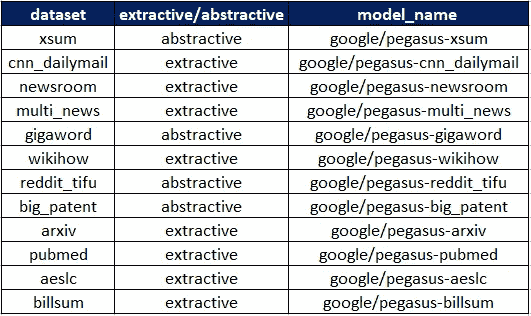

# 使用 Pegasus 模型和变压器库进行总结

> 原文：<https://pub.towardsai.net/summarization-using-pegasus-model-with-the-transformers-library-553cd0dc5c2?source=collection_archive---------0----------------------->

## [数据科学](https://towardsai.net/p/category/data-science)，[机器学习](https://towardsai.net/p/category/machine-learning)

## 使用 Google 的 Pegasus 模型和 Huggingface transformers 库生成文本摘要(提取的或抽象的)


PEGASUS 是谷歌最近在 2020 年 6 月开源的最新抽象摘要模型。它代表 **P** 再训练，带有 **E** 提取的 **G** ap 语句，用于**A**b 提取的**SU**mmalization**S**序列到序列模型。关于模型的更多细节，请参考关于 [**arXiv**](https://arxiv.org/abs/1912.08777) 的论文。

这篇文章假设你知道摘要和它的两种不同风格——提取摘要和抽象摘要。

# 装置

```
pip install transformers
```

# 使用

直到最近，我们不得不直接使用来自 Google 的 Pegasus [Github 库](https://github.com/google-research/pegasus)的代码，并且不得不按照我在本文[中所做的某些步骤来生成摘要输出。在](https://medium.com/@chetan.ambi/generate-summaries-using-googles-pegasus-library-772633a161c2) [HuggingFace](https://huggingface.co/) 的神奇团队将 Pegasus 包含在`transformers`库中之后，我们现在可以开始使用它，就像我们使用`transformers`库中的其他模型一样。

以下使用示例摘自[拥抱面](https://huggingface.co/transformers/model_doc/pegasus.html#usage-example)。正如您在下面看到的，只需几行代码，我们就可以使用 transformers 库生成最先进的摘要。如果您可以将这段代码与原始的 Pegasus 代码以及生成摘要所涉及的步骤进行比较，您就会体会到 transformers 库所提供的简单性。

*   作为第一步，我们将从变形金刚进口`torch`和所需模块。既然我们对飞马型号感兴趣`PegasusForConditionalGeneration`和`PegasusTokenizer`都是进口的。
*   Pegasus 在`C4` & `Hugenews`语料库上进行预训练，然后在 12 个下游数据集上进行微调。幸运的是，我们对所有的模型都有检查点，这样我们就可以直接使用这些预先训练好的模型来完成我们的下游任务。注意，这 12 个微调的模型本质上都是提取的和抽象的，因此模型的使用取决于用例(提取的或抽象的)。在上面的例子中，我们使用了在`reddit-tifu` 数据集上微调的模型，因为我们对抽象的摘要感兴趣。如果您需要使用不同于`reddit-tifu`的型号，您可以使用以下列表中的任何一种`model_name`。



作者图片

*   在接下来的步骤中，创建 Pegasus tokenizer 对象`tokenizer`，然后下载模型检查点(在本例中为`reddit-tifu`)并将其分配给`model`。之后，我们要为其生成摘要的源文本被传递到`prepare_seq2seq_batch`。
*   接下来，模型上的`generate`方法将生成编码格式的摘要，然后在通过`batch_encode`方法后，我们得到一个很好的摘要。`generate`方法有许多参数可用于控制汇总输出。您可以随意使用的一些重要参数有— `min_length`、`max_length`、`num_beams,`、`early stopping`等。有关这些参数的示例用法，请参考以下示例:

```
translated = model.generate(**batch, min_length=50, num_beams=5)
```

让我们尝试使用`reddit-tifu`模型生成摘要。生成摘要时，需要传递文本。你想把它总结到上面代码中的`src_text`字段。文章末尾还提供了完整的代码。

## 示例 1

***来源正文:***[https://www . NBC news . com/politics/2020-election/Georgia-secretary-state-raffensperger-says-sen-Graham-asked-him-about-n 1247968](https://www.nbcnews.com/politics/2020-election/georgia-secretary-state-raffensperger-says-sen-graham-asked-him-about-n1247968)

***摘要文本(输出):*** 佐治亚州国务卿表示，他将一名保守派参议员的提问解释为暗示他可以在总统竞选中扔掉合法选票，但该参议员表示，他不认为事实如此，这是“荒谬的”

## 示例 2

***来源正文***:[https://www . ndtv . com/India-news/Sputnik-v-新冠肺炎-vaccine-could-be-producted-in-India-China-Russian-president-2326475](https://www.ndtv.com/india-news/sputnik-v-covid-19-vaccine-could-be-produced-in-india-china-russian-president-2326475)

莫斯科:周二，弗拉基米尔·普京主席呼吁金砖国家在冠状病毒疫苗的开发上共同努力，因为他建议俄罗斯针对新冠肺炎的 Sputnik V 疫苗可以在中国和印度生产，这两个国家都是五国集团的成员。

> 注意:即使我们正在寻找一个抽象的总结，有时模型可能会产生一个抽象的总结，就像我们在上面的例子 2 中看到的那样。

# 完整代码

# 结论

在本文中，您已经了解了如何使用 Google 的 Pegasus 模型通过`transformers`库生成摘要。

您有兴趣使用 Streamlit 构建一个简单的 web 应用程序来进行汇总吗？参考下面的文章。

[](https://medium.com/towards-artificial-intelligence/build-a-text-summarization-web-app-using-streamlit-in-30-minutes-cbe78a8080af) [## 使用 Streamlit 在 30 分钟内创建一个文本摘要 Web 应用程序

### 使用 Streamlit 总结 ML 应用程序利用变压器模型

medium.com](https://medium.com/towards-artificial-intelligence/build-a-text-summarization-web-app-using-streamlit-in-30-minutes-cbe78a8080af) 

*阅读更多关于 Python 和数据科学的此类有趣文章，* [***订阅***](https://pythonsimplified.com/) *到我的博客*[***www.pythonsimplified.com***](http://www.pythonsimplified.com)***。*** 你也可以通过 [**LinkedIn**](https://www.linkedin.com/in/chetanambi/) 联系我。

# 参考

[1].[https://github.com/huggingface/transformers](https://github.com/huggingface/transformers)

[2].[https://ai . Google blog . com/2020/06/pegasus-state-of-art-model-for . html](https://ai.googleblog.com/2020/06/pegasus-state-of-art-model-for.html)

[3].[https://github.com/google-research/pegasus](https://github.com/google-research/pegasus)