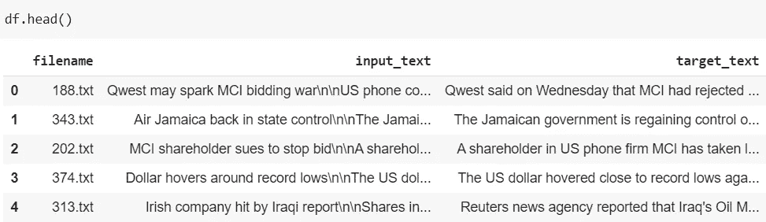

# 简单变压器总结

> 原文：<https://pub.towardsai.net/summarization-with-simple-transformers-14d158686faa?source=collection_archive---------3----------------------->

## [自然语言处理](https://towardsai.net/p/category/nlp)

## 使用简单的转换器生成摘要的实践指南


在 [Unsplash](https://unsplash.com/photos/uPuh-VwJRM0) 上由 [Arseny Togulev](https://unsplash.com/@tetrakiss) 拍照

Simpletransformers 库建立在 Huggingface 的变形金刚之上。我都用过，发现简单的变压器非常容易使用和直观。它帮助我们解决诸如分类、问题回答、语言建模、用于摘要的 Seq2Seq 模型等问题。在这篇文章中，我们将致力于文本摘要。你应该探究他们的 [GitHub repo](https://github.com/ThilinaRajapakse/simpletransformers) 和[文档](https://simpletransformers.ai/)以获得更多细节。

# 导入库和数据集

将数据集从 Kaggle 下载到 Colab。从你的 Kaggle 个人资料导航到`My Account > API`，然后点击`Create New API Token.`，这将下载`kaggle.json`文件。一旦你有了这个文件，运行下面的代码。在执行过程中，它会提示您上传一个 JSON 文件，以便您可以上传`kaggle.json`文件。此外，我们将从 Kaggle 下载 BBC 新闻文章并解压

```
from google.colab import files
files.upload()
!pip install -q kaggle
!mkdir ~/.kaggle
!cp kaggle.json ~/.kaggle/
!chmod 600 ~/.kaggle/kaggle.json
!kaggle datasets download -d pariza/bbc-news-summary
!unzip bbc-news-summary.zip
```

因为 Google Colab 预装了变形金刚，所以让我们升级变形金刚库，这样我们就有了它的最新版本，然后安装简单的变形金刚:

```
!pip install --upgrade transformers
!pip install simpletransformers
```

现在，导入所有必需的库:

```
import logging
import pandas as pd
from sklearn.model_selection import train_test_split
from simpletransformers.seq2seq import Seq2SeqModel, Seq2SeqArgs
```

# 预处理

BBC 新闻文章数据集对每个类别都有不同的文件夹——商业、娱乐、政治、体育和科技。但是为了简单起见，我们在这里只考虑业务类别。但是，您可以自由地在这些文件夹或您选择的任何数据集上尝试摘要。请注意，总结的准确性取决于我们在模型构建中使用的预训练和微调数据集。

从下面的代码中，我们只提取商业文章及其摘要。

```
all_articles = []
all_files1 = []
base_path = ‘/content/BBC News Summary/News Articles/business’
for filename in os.listdir(base_path):
    with open(os.path.join(base_path, filename), ‘r’) as f:
    all_articles.append(f.read())
    all_files1.append(filename)all_summaries = []
all_files2 = []
base_path = ‘/content/BBC News Summary/Summaries/business’
for filename in os.listdir(base_path):
    with open(os.path.join(base_path, filename), ‘r’) as f:
    all_summaries.append(f.read())
    all_files2.append(filename)
```

然后我们用`input_text`和`target_text`(摘要)创建一个数据帧。由于我们不需要`filename`列，我们将在继续之前删除它。

```
df = pd.DataFrame()
df[‘filename’] = all_files1
df[‘input_text’] = all_articles
df[‘target_text’] = all_summaries
df.head()
```



```
df.drop([‘filename’], axis=1, inplace=True)
```

我们将保留最后 10 条记录作为测试数据集，剩余的数据集将用于训练模型。

```
test_df = df[-10:]
df = df[:-10]
train_df, eval_df = train_test_split(df, test_size=0.05, random_state=42)
```

# 初始化 Seq2Seq 模型

对于汇总任务，`encoder_decoder_type`必须是`[bart](https://simpletransformers.ai/docs/seq2seq-model/#bart-models)`，`encoder_decoder_name`可以从[这里](https://huggingface.co/transformers/pretrained_models.html)的标准预训练模型列表中选择。在下面的例子中，我们使用的是`facebook/bart-large`。

此外，Seq2Seq 函数有许多参数可以微调。但是在这里，我只使用下面的参数。如有必要，请随意尝试其他参数。

```
model_args = Seq2SeqArgs()
model_args.num_train_epochs = 5
model_args.no_save = True
model_args.evaluate_generated_text = True
model_args.evaluate_during_training = True
model_args.evaluate_during_training_verbose = True
model_args.overwrite_output_dir = Truemodel = Seq2SeqModel(
encoder_decoder_type=”bart”,
encoder_decoder_name=”facebook/bart-large”,
args=model_args,
use_cuda=True,
)
```

# 训练模型

`train_model()`方法使用`train_df`数据帧训练模型。这将运行 10 个时期，因为我们已经将`num_train_epoch`设置为 10。

```
model.train_model(train_df, eval_data=eval_df)
```

# 评估模型

`eval_model()`方法将使用`eval_df`数据框架评估模型，并返回评估结果。

```
model.eval_model(eval_df)
```

# 预言；预测；预告

您现在可以在我们上面为 10 条记录创建的测试数据集`(test_df)`上生成(预测)摘要。然后比较实际摘要和预测摘要。如果结果不好，您可以尝试不同的模型，也可以尝试微调 Seq2Seq 参数，直到结果令人满意。

```
results = model.predict(test_df[‘input_text’])
```

您可以在下面找到完整的代码:

# 结论

希望你喜欢阅读本教程，并理解如何使用简单的变压器总结任务。

*阅读更多关于 Python 和数据科学的此类有趣文章，* [***订阅***](https://pythonsimplified.com/) *到我的博客*[***www.pythonsimplified.com***](http://www.pythonsimplified.com/)***。*** 你也可以通过 [**LinkedIn**](https://www.linkedin.com/in/chetanambi/) 联系我。

# 参考

[](https://simpletransformers.ai/) [## 简单变压器

### 使用变压器模型从未如此简单！内置支持:文本分类令牌分类…

simpletransformers.ai](https://simpletransformers.ai/)