# 用人工智能总结人工智能文章(还有什么？？)

> 原文：<https://pub.towardsai.net/summarizing-ai-articles-using-ai-what-else-c1c16a80dbb5?source=collection_archive---------0----------------------->

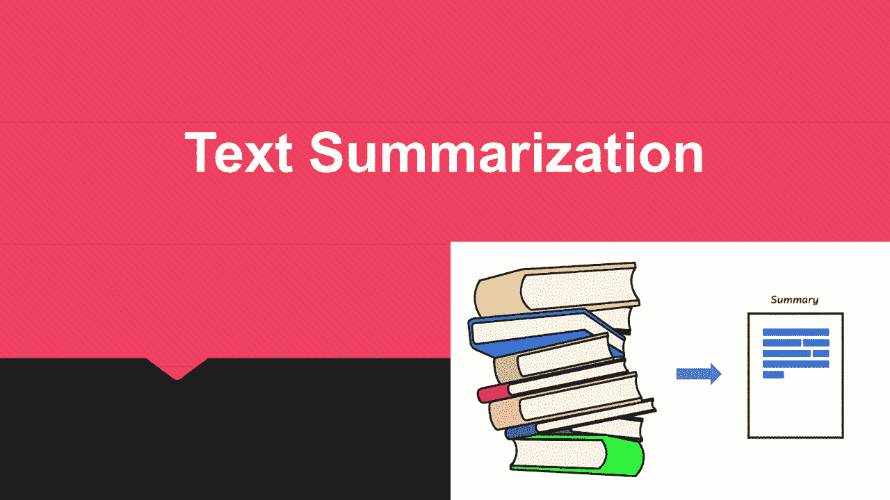

## [自然语言处理](https://towardsai.net/p/category/nlp)

## 这就是我如何使用人工智能来总结我最喜欢的关于人工智能的文章，并建立一个每周简讯。

我每周都会阅读无穷无尽的关于人工智能的文章，我相信收集它们并与尽可能多的人分享是一件好事。

但我喜欢用“聪明”的方式做这件事的想法，所以我在用人工智能(还有什么？)来自动化我喜欢的文章的数据收集、清理、总结的全过程。

我每周分享一份我在空闲时间在 Medium 上阅读的最相关文章的列表，并让我了解我的工作。

如果你愿意，你可以在这里阅读我列出的本周与人工智能最相关的文章:

 [## 每周人工智能通讯

### 关于人工智能最有趣文章的每周更新

medium.com](https://medium.com/@jairribeiro/weekly-a-i-newsletter-9baba4cdf361) 

# 使用自然语言处理的网络文章摘要工具

我已经开始了一项实验，对我每周定期阅读的十几篇关于人工智能、机器学习和数据科学的激动人心的文章进行自动摘要，直接从新闻链接中使用矢量化(Nltk)。

随着每天在不同渠道(如新闻、社交媒体和跟踪系统)中生成的大量新文本文档，自动文本摘要对我来说已经变得不可或缺，以便跟上、消化和理解如此多的内容。

文本摘要旨在提取或生成给定文本文档的简明和准确的摘要，同时保留原始文本文档中的关键信息。

自动摘要将大型文本文档缩减为一组简短的单词或一个段落，以传达全文的意思。

文本摘要问题的一个很好的例子是新闻文章摘要，它试图从给定的文章中自动产生摘要。它简明扼要地介绍了最新的新闻。

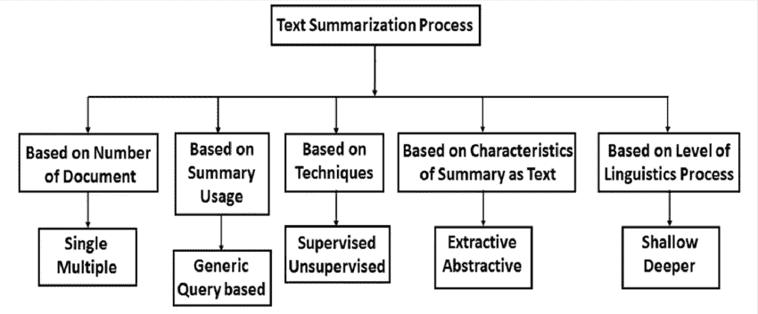

# 为什么文本摘要很重要？

总的来说，自动文本摘要技术也在推动广泛的行业垂直领域的业务场景，如媒体和娱乐、零售、技术和金融服务，如机器人顾问。

文本摘要有几种可能的用途，例如:

*   通过花最少的时间从非结构化文本数据中获取最多的信息。
*   增强文档的可读性。
*   删除多余的、无关紧要的文字，提供所需的信息。
*   加快信息研究的进程。

# 不同的文本摘要方法

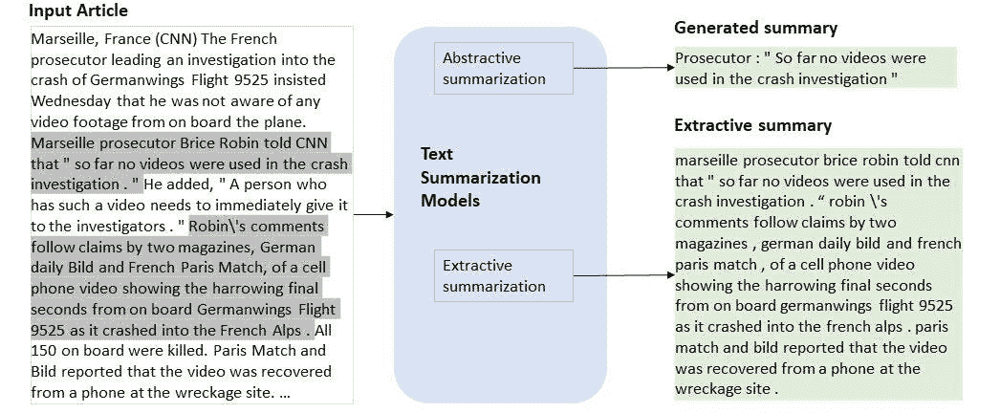

文本摘要方法可以是提取的或抽象的:

1.  提取方法选择原始文本中现有单词、短语或句子的子集来形成摘要。简而言之，我们从原文中找出关键句子或关键短语，并只从文本中提取它们。
2.  抽象方法构建内部语义表示，并使用自然语言生成技术来创建类似于人类创建的摘要。此摘要可能包含原始文档中没有的单词。使用先进的深度学习技术来生成新的摘要。

# 自动总结也有两种主要类型:

*   关键短语提取选择单个单词或短语来标记文档。
*   文档摘要选择整个句子来创建简短的段落摘要。

我的第一步是学习如何建立一个简单的摘要器，用于我每周的人工智能和人工智能时事通讯，所以我决定从提取摘要方法开始。

# 创建文本摘要所涉及的步骤

1.  从收集数据。csv 文件，然后使用 Urllib 库加载 URL。使用网络抓取(使用 Urllib 库)从维基百科收集数据。包含标题、Url、网站和 Dat 的 csv 文件，将由 Urllib 库使用，该库将连接到页面并检索 HTML。

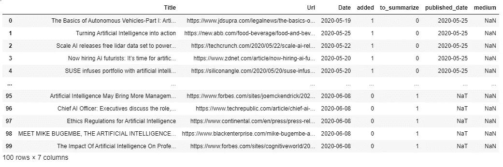

我将使用 urllib 中的 urlopen 函数。请求实用程序打开网页。然后，我将使用 read 函数读取抓取的数据对象。

2)解析数据的 URL 内容(使用 BeautifulSoup 库)

3)数据清理，如删除特殊字符、数值、停用词和标点符号。

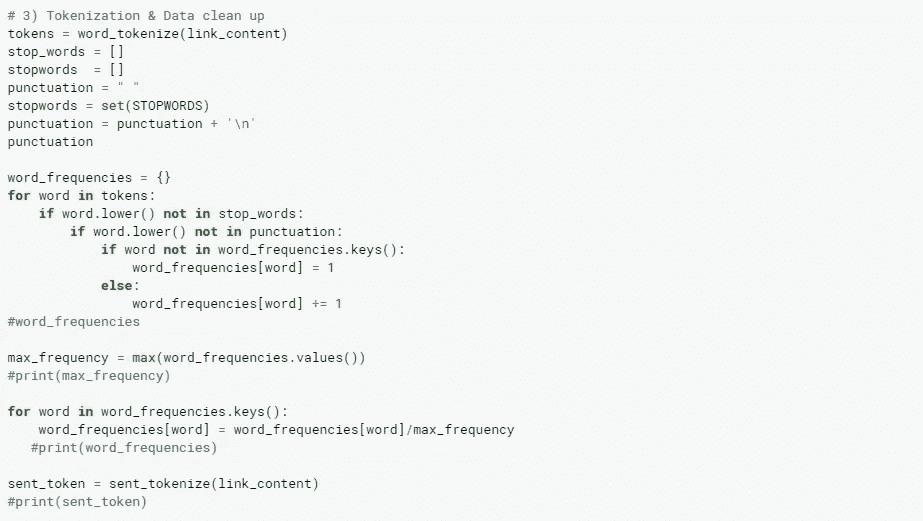

4)标记化——创建标记(单词标记和句子标记)为了将 article_content 分割成一组句子，我们将使用 nltk 库中的内置方法。从 NLTK 工具包中导入停用词，从字符串库中导入标点符号。停用词是任何语言中的一组常用词。例如，在英语中，“the”、“is”和“and”很容易成为停用词。在 NLP 和文本挖掘应用程序中，停用词用于消除不必要的词，使应用程序可以专注于重要的词。

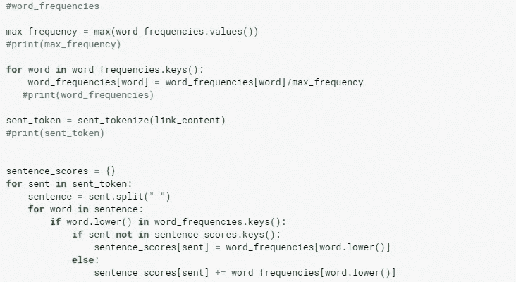

5)计算每个单词的词频。Word 对整个文本进行标记。我们必须用关键字和一个单词重复出现的次数来创建字典，然后用所有单词出现的次数除以最频繁出现的单词的频率。

6)计算每个句子的加权频率。为了评估文本中每个句子的得分，我们将分析每个术语的出现频率。在这种情况下，我们将根据单词对每个句子进行评分，也就是说，加上每个重要单词在句子中出现的频率。

7)使用 nalargest 库创建具有权重最高的句子的摘要，以获得权重最高的句子。然后，加入它，得到最终的摘要文本。

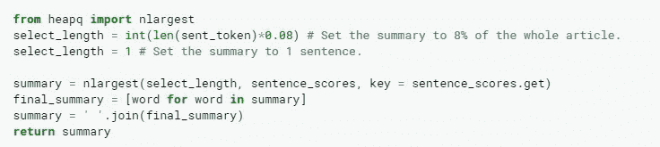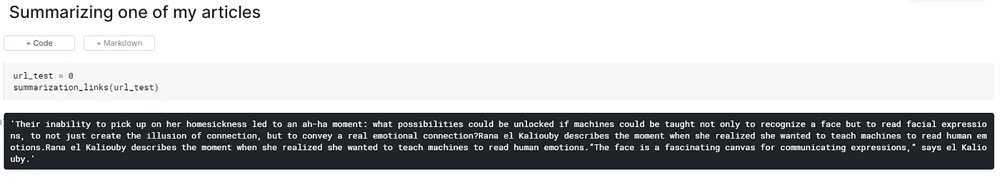

# 利用迁移学习总结文章

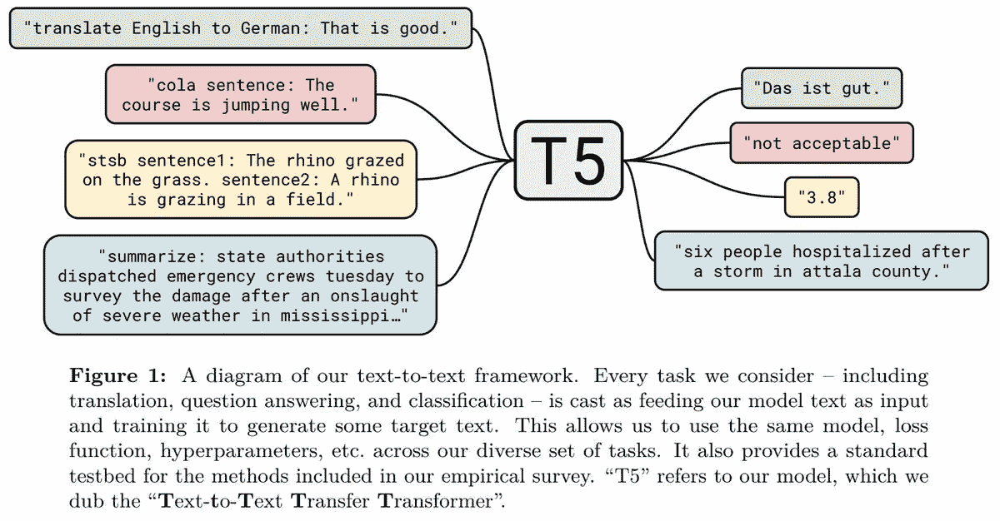

另外，我正在试验一种更先进的总结技术，使用一种叫做 T5 的迁移学习模型。

迁移学习(Transfer learning)是指首先对一个数据丰富的任务进行预训练，然后对一个下游任务进行微调，它已经成为几种语言理解任务中一种强大的自然语言处理(NLP)。

T5 是 Google 的一个新的 transformer 模型，以端到端的方式进行训练，将文本作为输入，将修改后的文本作为输出。

结合使用文本到文本转换器对大型文本语料库(如“庞大干净的爬行语料库”或 C4)进行训练的见解，T5 模型在多个自然语言处理任务(如摘要、问答、机器翻译等)上取得了最先进的结果。

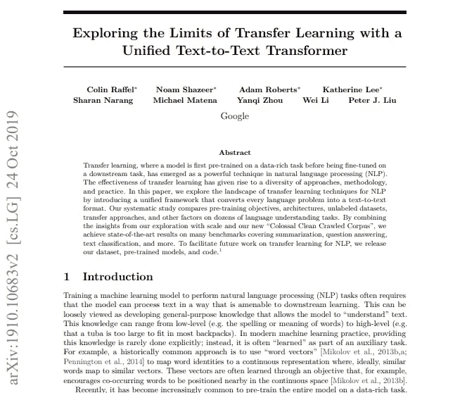

T5 模型的灵感来自于 Colin Raffel、Noam Shazeer、、Katherine Lee、Narang、Michael Matena、Yanqi Zhou、、Peter J. Liu 的论文[探索使用统一文本到文本转换器进行迁移学习的限制。](https://arxiv.org/pdf/1910.10683.pdf)

这里有更多的细节:[文本到文本转换转换器](https://github.com/google-research/text-to-text-transfer-transformer)。

T5 是一种抽象的总结算法。这意味着在必要时改写句子，而不仅仅是直接从原文中提取句子。

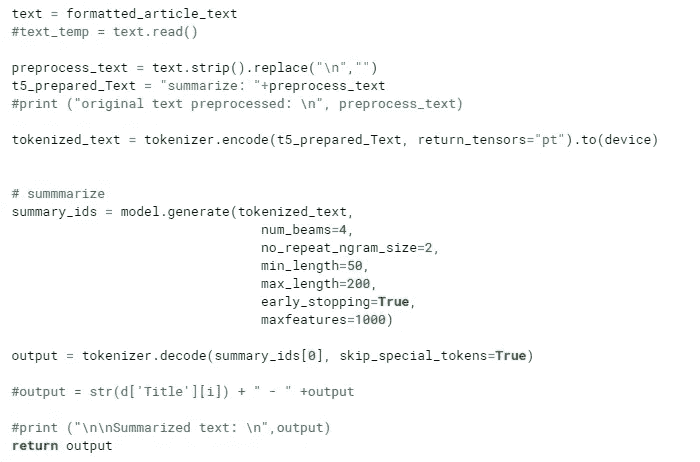

# 模型检查点

我们已经为本文中描述的预训练模型发布了以下检查点:

T5-小(6000 万参数):【T4://T5-data/pre trained _ models/SmallT5-Base(2.2 亿参数):[GS://T5-data/pre trained _ models/Base](https://console.cloud.google.com/storage/browser/t5-data/pretrained_models/base/)T5-Large(7.7 亿参数):[GS://T5-data/pre trained _ models/Large](https://console.cloud.google.com/storage/browser/t5-data/pretrained_models/large/)T5-3B(30 亿参数):[GS://T5-data/pre trained _ models/3B](https://console.cloud.google.com/storage/browser/t5-data/pretrained_models/3B/)T5–11B(111 亿参数):

参见[此处](https://github.com/google-research/text-to-text-transfer-transformer/blob/master/released_checkpoints.md)的附加实验性预训练模型检查点列表。

如果你想重现这一点，你可以在这里看看我的 kaggle 笔记本:

 [## 时事通讯摘要

### 使用 Kaggle 笔记本探索和运行机器学习代码|使用时事通讯数据

www.kaggle.com](https://www.kaggle.com/liberoliber/newsletter-summarizer) 

# 还有一件事…

如果你想在学习之旅中走得更远，我为你准备了一份令人惊叹的清单，其中包含 60 多门关于人工智能、机器学习、深度学习和数据科学的培训课程，你现在就可以免费参加:

*   [**什么是预测分析，你今天如何使用它？**](https://towardsdatascience.com/what-is-predictive-analytics-dc6db9759936)
*   [**今天学习 AI、ML、数据科学的最佳免费课程。**](https://jairribeiro.medium.com/my-favorite-free-or-free-to-audit-courses-to-learn-ai-ml-and-data-science-f15f614a84e5)
*   [**60 多门课程，有评分，有总结(当然是 AI 做的)。**](https://jairribeiro.medium.com/my-favorite-free-or-free-to-audit-courses-to-learn-ai-ml-and-data-science-f15f614a84e5)
*   [**是不是我们所知道的作品的终结？**](https://medium.com/predict/is-it-the-end-of-the-work-as-we-know-it-bf2f9a64e89a)[**世界经济论坛**](https://medium.com/predict/is-it-the-end-of-the-work-as-we-know-it-bf2f9a64e89a) 报告《2020 年就业前景》简析

如果你想继续发现新的资源并了解人工智能，在我的电子书(下面的[链接)中，我正在分享关于人工智能、机器学习、深度学习、数据科学、商业智能、分析和其他方面的最佳文章、网站和免费在线培训课程，以帮助你开始学习和发展职业生涯。](https://www.amazon.com/dp/B08WJ59G2V)

> [***学习 AI 在线:200 多种资源在线开始学习 AI***](https://www.amazon.com/dp/B08WJ59G2V)

此外，我刚刚在亚马逊上发布了其他有趣的[电子书，我相信其中一些可能会让你感兴趣……让我们保持联系，关注我，让我们一起做吧。](https://www.amazon.com/dp/B08RSJRNSN/)

*   [**终结者悖论:神经科学如何帮助我们理解移情和对人工智能的恐惧**](https://www.amazon.com/gp/product/B08STRHZ46)
*   [**人工智能从 A 到 Z:揭秘 AI 的本质概念**](https://www.amazon.com/gp/product/B08WZ3VDHB)
*   [**2020 年人工智能:写人工智能的一年**](https://www.amazon.com/gp/product/B08RSJRNSN)

# 订阅我的每周时事通讯，保持更新

如果你对人工智能、机器学习、数据科学和自动驾驶汽车的话题感兴趣，以及这些创新将如何扰乱世界各地的每一个企业，这份时事通讯肯定会让你保持更新。

# 点击下面的链接订阅人工智能新闻！

> [*https://medium.com/tech-cult-heartbeat/newsletters/ai-news*](https://medium.com/tech-cult-heartbeat/newsletters/ai-news)