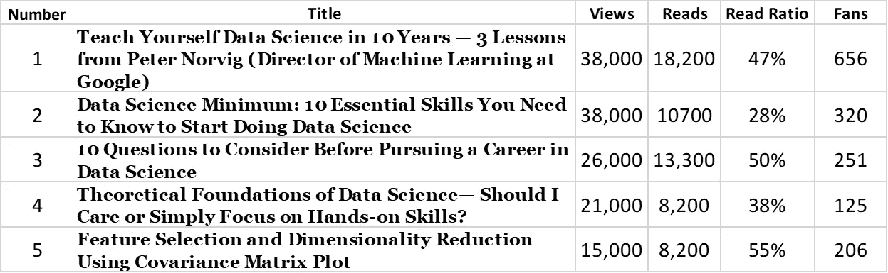
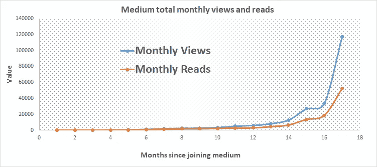

# 数据科学博客作者 2019 年成就总结

> 原文：<https://pub.towardsai.net/summary-of-2019-accomplishments-as-a-data-science-blogger-685d2d7e47ed?source=collection_archive---------1----------------------->

尼古拉斯·天梭在 [Unsplash](https://unsplash.com?utm_source=medium&utm_medium=referral) 上拍摄的照片

## 回顾 2019 年作为媒体作家的成就和经验教训，并讨论 2020 年的目标

T 作为一名数据科学博主，2019 年对我来说是不平凡的一年。自从 18 个月前我的第一篇文章在 medium 上发表以来，写作已经成为我生活中不可或缺的一部分。通过我的数据科学文章，我接触到了全世界成千上万热情的读者和学习者。

在这篇文章中，我将讨论我作为数据科学作家在 2019 年取得的成就的总结。我希望这篇文章将成为任何有兴趣开始博客生涯的人的灵感来源。

# 2019 年成就总结

发表的文章数量= 63

新关注者人数= 1400

总浏览量= 267，000

总读取次数= 124，000

粉丝总数= 3000

最低月收入= 1.47 美元

最高月收入= 933 美元

# 2019 年发表的前 5 篇文章

**2019 年发表的前 5 篇文章。**

# 查看、阅读、粉丝和收入数量的可视化

一般来说，作为一个成功的作家，你的浏览量、阅读量、阅读率、粉丝数和收入应该随着时间的推移以一个合适的速度增长。下面的图表显示了我作为一名作家加入 Medium 后的 17 个月里每月的浏览量、阅读量、粉丝量和收入。当你持续不断地发表高质量的文章时，你会看到你的浏览量、阅读量、粉丝数和收入随着时间的推移而增长。

# 读者的反馈和评论

**文章** : [机器学习项目策划](https://towardsdatascience.com/machine-learning-project-planning-71bdb3a44349)

**反馈和评论** : " *感谢您的分享，Benjamin，您的工作对我的数据科学之旅有着难以置信的帮助。干杯伙计，新年快乐。*

**第**条:[结合机器学习中的实际数据和模拟数据](https://towardsdatascience.com/combining-actual-data-with-simulated-data-in-machine-learning-fa07a68b9640)

反馈和评论::*你好，本！这篇文章和你在 Medium 上的其他文章值得称赞，它们太棒了！请问大家有没有用 Python 写的和这篇帖子上用的等价代码？非常感谢！*”

**文章** : [数据科学的理论基础——我应该关心还是仅仅关注实践技能？](https://towardsdatascience.com/theoretical-foundations-of-data-science-should-i-care-or-simply-focus-on-hands-on-skills-c53fb0caba66)

**反馈和评论**::*感谢你写这篇文章！对于像我这样的数据科学新手来说，这是非常有用的信息。就一件事，除了你提到的参考文献，还有什么学习数据科学所需数学的好书吗？*”

*谓清楚。简洁。爱死了！感谢发布。*”

**文章** : [数据科学 MOOC 验证证书——值得吗？](https://towardsdatascience.com/data-science-mooc-verified-certificate-is-it-worth-it-5d60a6e574e0)

**反馈和评论**::*非常感谢你如此惊人的努力。我期待着完成其中的一些课程。你真的帮了我。多谢*。”

**文章** : [利用协方差矩阵图进行特征选择和降维](https://medium.com/towards-artificial-intelligence/feature-selection-and-dimensionality-reduction-using-covariance-matrix-plot-b4c7498abd07)

**反馈和评论**::*很棒的帖子。非常容易理解并直奔主题。谢谢*。”

# 2020 年的目标

自从 18 个月前我的第一篇文章在 medium 上发表以来，写作已经成为我生活中不可或缺的一部分。通过我的文章，我与世界各地成千上万热情的学习者分享了我在物理、材料科学、在线教育、数据科学、机器学习和分析方面的不同经验。我的目标是继续提高自己作为一名作家的水平，不断鞭策自己写啊写啊写。写作是奇妙而有趣的！

如果你对数据科学博客感兴趣，下面是一些可以帮助你入门的资源。

# 帮助您入门的有用资源

[2020 年开始数据科学博客](https://medium.com/towards-artificial-intelligence/start-data-science-blogging-in-2020-70a6336b3503)

[在媒体上撰写数据科学博客的初学者指南](https://medium.com/towards-artificial-intelligence/beginners-guide-to-writing-data-science-blogs-on-medium-a74774cf8f66)

[为您的数据科学文章选择合适的特色图片](https://medium.com/towards-artificial-intelligence/choose-the-right-featured-image-for-your-data-science-article-e101719600cf)

如何成为一名成功的媒体作家——从一本古书中学到的两个教训