# 超级灵活的 Matplotlib 子情节结构

> 原文：<https://pub.towardsai.net/super-flexible-matplotlib-structure-for-subplots-d26b005252f1?source=collection_archive---------1----------------------->

## 一图多轴


Brannon Naito 在 [Unsplash](https://unsplash.com/s/photos/flexible?utm_source=unsplash&utm_medium=referral&utm_content=creditCopyText) 上拍摄的照片

Matplotlib 是我在数据科学之旅中了解的第一批库之一。令我惊讶的是，它允许在可视化界面上定制几乎所有的东西。

这种超级灵活的结构也可以通过支线剧情观察到。在这篇文章中，我们将学习用支线剧情创建人物的不同方法，以及正确使用支线剧情的一些技巧。

在继续之前，让我们定义两个基本的 Matplotlib 对象类型:*图*和*轴*。

这个图形可以被认为是最外层的容器，它把所有的东西放在一起。所有其他对象在该容器中保持活动状态。一个图形可以有一个或多个轴对象。事实上，我们需要轴来反对实际绘制东西。图形上的每个子情节实际上是一个轴对象。

# 数据集

对于本文中的例子，我们将使用两个不同的数据集。第一个是熊猫数据框，有日期和随机数:

```
import pandas as pddf = pd.DataFrame({
    "date": pd.date_range(start="2022-09-01", freq="D", periods=20),
    "store1": np.random.randint(80, 100, size=20),
    "store2": np.random.randint(50, 70, size=20)
})df.head()
```

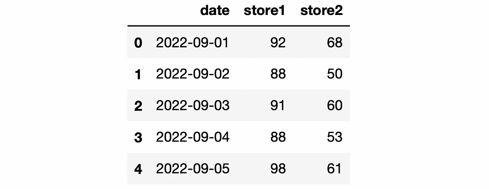

(图片由作者提供)

第二个是我用模拟数据创建的示例销售数据集。你可以从我的 GitHub 页面上的[数据集](https://github.com/SonerYldrm/datasets)库中下载。我们将在本文中使用的数据集称为商店销售数据。让我们通过读取这个数据集来创建一个熊猫数据帧。我们还将做一些过滤，以消除离群值。

```
sales = pd.read_csv(
   "sales_data_with_stores.csv",
   usecols=["store","product_code","cost","price","last_week_sales"]
)sales = sales[
   (sales["cost"]>50) & (sales["cost"]<500)
].reset_index(drop=True)sales.head()
```

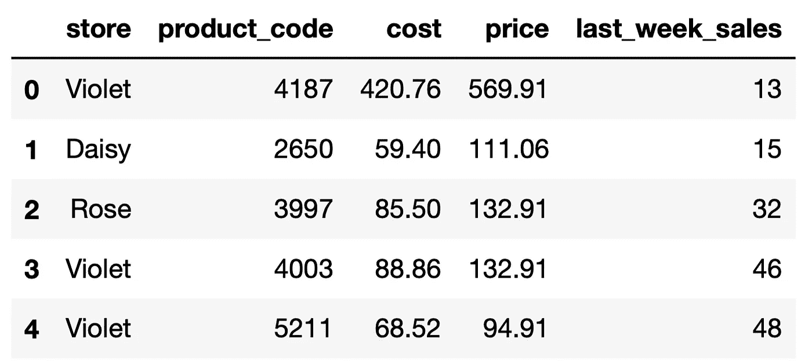

(图片由作者提供)

# 重叠轴对象

我们可以将多个轴对象叠加到一个图形上，如下所示。它们的大小其实是一样的。出于演示的目的，我把它们画得不同。默认情况下，轴对象共享相同的 x 轴和 y 轴。

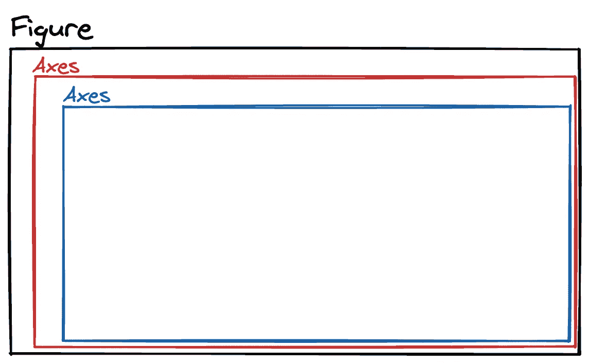

(图片由作者提供)

这种情况的一个例子是在同一个图形上创建两个线图。

```
import matplotlib.pyplot as plt# create a Figure object
plt.figure(figsize=(14,5))# Figure title
plt.title("September Sales", fontsize=15)# first Axes
plt.plot(df["date"], df["store1"])# second Axes
plt.plot(df["date"], df["store2"])# add legend
plt.legend(["Store1", "Store2"])plt.show()
```

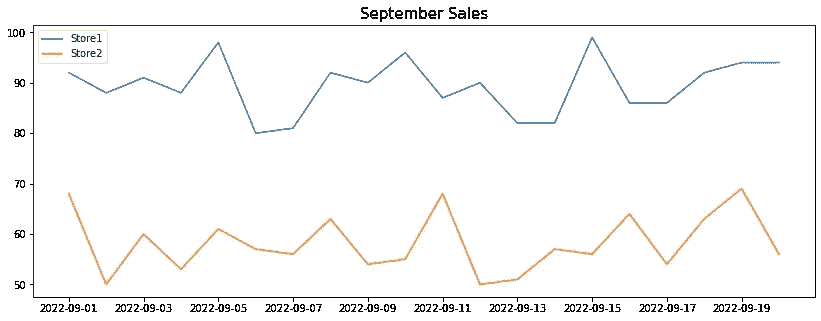

(图片由作者提供)

两个商店的值都在 50 和 100 之间，因此它们可以共享同一个 y 轴。在 y 值差异巨大的情况下，我们应该考虑增加一个[辅助 y 轴](https://towardsdatascience.com/3-tricks-to-prettify-matplotlib-plots-d0a73b861c09)。

# 将对象置于不同的位置

我们还可以在图形的不同位置放置轴对象。

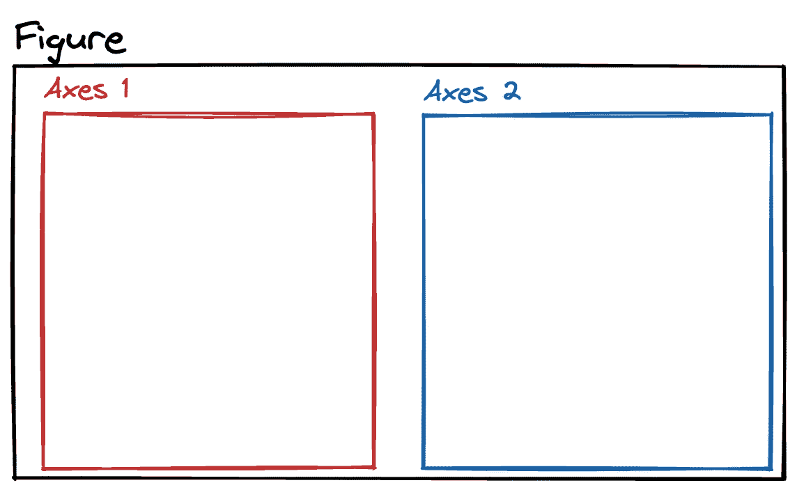

(图片由作者提供)

这个过程有两个步骤:

*   轴对象位置的排列
*   在每个轴对象上创建图

可以使用 add_subplot 或 subplot 函数进行排列。subplot 函数是 add_subplot 的包装器，是比较常用的一个。

我们首先创建支线剧情的模式。nrows 和 ncols 参数可用于此任务。例如，下面的代码行创建了一个有 4 个轴对象的图形。

```
fig, axs = plt.subplots(nrows=2, ncols=2)
```

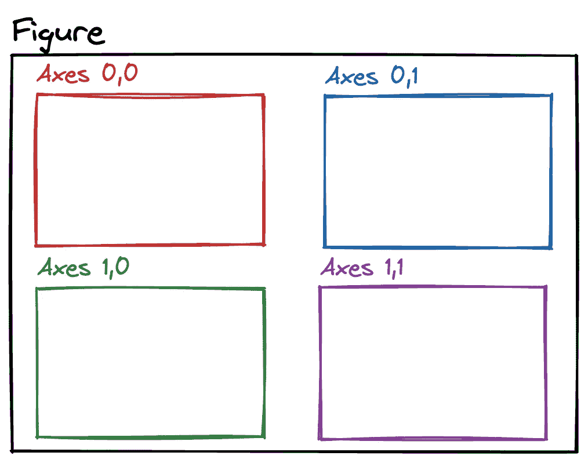

(图片由作者提供)

我们可以根据需要创建任意数量的轴对象。每个轴都可以通过其索引来访问。

让我们创建一个有两个轴的图形，并在销售数据帧中绘制成本和价格列的直方图。

```
# Figure with 2 Axes objects
fig, axs = plt.subplots(
    figsize=(10,5),
    ncols=2,
    sharey=True
)# Figure title
fig.suptitle("Histogram", fontsize=16)# First Axes
axs[0].hist(sales["price"])
axs[0].set_title("Price", fontsize=14)# Second Axes
axs[1].hist(sales["cost"], color="green")
axs[1].set_title("Cost", fontsize=14)plt.show()
```

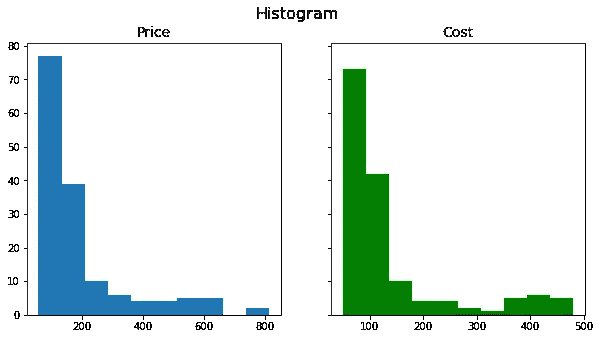

(图片由作者提供)

sharex 和 sharey 参数可用于消除多余的轴刻度。例如，在上图中，两个图可以有相同的 y 轴，所以我们可以从左边的图中去掉 y 轴。这可以通过将 sharey 参数的值设置为 True 来实现。

# 子图 2 网格

subplot 函数将图形分成单元格，每个 subplot 占用一个单元格。subplot2grid 函数为此增加了更多的灵活性。它让支线剧情占据多个单元格，所以我们可以创建如下所示的网格结构:

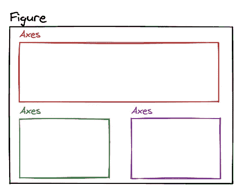

(图片由作者提供)

subplot2grid 函数要求您定义绘图的几何图形以及绘图在网格中的位置。上面的例子是一个 2 乘 2 的网格。顶部子情节的位置被定义为第一行和第一列。它横跨两列。底部的是第二行的图，每个占据一个单元格。

我们可以使用 Matplotlib 创建如下结构:

```
# Create Figure
plt.figure(figsize=(8,4))# top
ax1 = plt.subplot2grid((2, 2), (0, 0), colspan=2)# bottom left
ax2 = plt.subplot2grid((2, 2), (1, 0))# bottom right
ax2 = plt.subplot2grid((2, 2), (1, 1))plt.show()
```

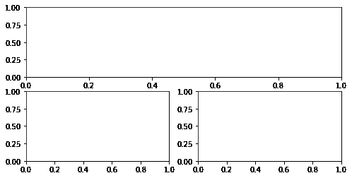

(图片由作者提供)

colspan 和 rowspan 参数用于创建占据多个单元格的子情节。

下图是一个更复杂的网格，其中包含跨越列和行的支线剧情。

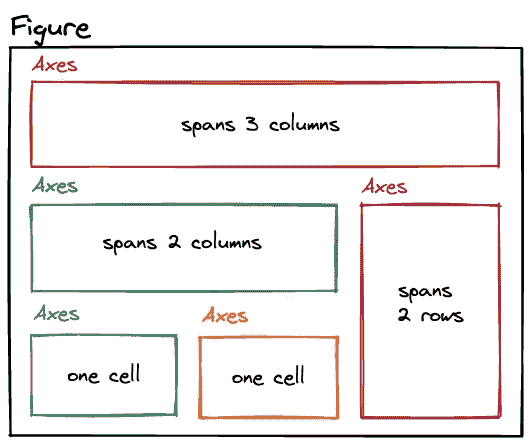

(图片由作者提供)

让我们用 Matplotlib 创建这个网格。这是一个 3x 3 的网格。

```
# Create Figure
plt.figure(figsize=(12,8))# Create subplots
ax1 = plt.subplot2grid((3, 3), (0, 0), colspan=3)
ax2 = plt.subplot2grid((3, 3), (1, 0), colspan=2)
ax3 = plt.subplot2grid((3, 3), (1, 2), rowspan=2)
ax4 = plt.subplot2grid((3, 3), (2, 0))
ax5 = plt.subplot2grid((3, 3), (2, 1))
```

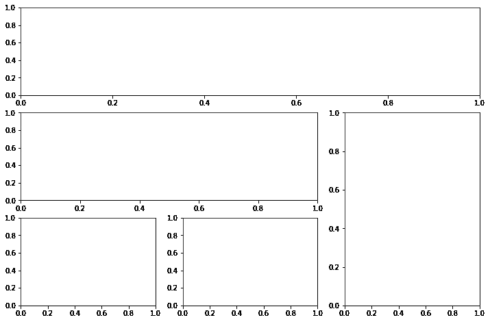

(图片由作者提供)

一旦我们有了网格，我们就可以用不同的情节填充支线剧情。

Matplotlib 是一个高度通用和灵活的工具，用于创建数据可视化。与其他流行的库相比，它可能需要编写更多的代码，但它带来的优势是可以更好地控制您所绘制的内容。

*你可以成为* [*媒介会员*](https://sonery.medium.com/membership) *解锁我的全部写作权限，外加其余媒介。如果你已经是了，别忘了订阅*[](https://sonery.medium.com/subscribe)**如果你想在我发表新文章时收到电子邮件。**

*感谢您的阅读。如果您有任何反馈，请告诉我。*