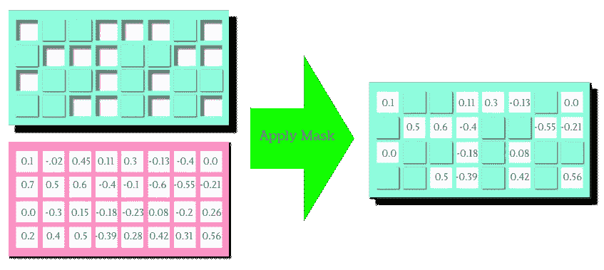
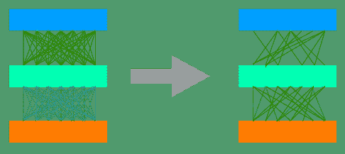

# super masks:py torch 中的简单介绍和实现

> 原文：<https://pub.towardsai.net/supermasks-a-simple-introduction-and-implementation-in-pytorch-a80cd9f1f0a6?source=collection_archive---------0----------------------->

## [深度学习](https://towardsai.net/p/category/machine-learning/deep-learning)

对神经网络的一般理解是，需要计算来调整神经网络的权重，以便它可以在给定的数据集上执行特定的任务。然而，这似乎并不完全正确。显然，给定一个随机初始化的密集神经网络:

1.  存在这样的子网络，当被训练时，可以在训练后实现与原始网络一样的性能。
2.  更令人惊讶的是，存在这样的子网络，它们无需任何训练，就能在某项任务上比随机初始化表现得更好。例如，在 MNIST 数据集上，它可以达到 86%的准确率，在 CIFAR-10 数据集上，可以达到 41%的准确率！

第一种情况下的子网被称为**彩票**，因为它们赢得了初始化彩票。在第二种情况下， **Supermasks** 是我们可以用来表示子网权重的方法。在这篇文章中，我解释了什么是超级掩码，以及我们如何通过反向传播找到超级掩码。

# 为什么我们要费心去寻找这样子网络呢？

神经网络的权重是随机生成的。然而，在现实中，随机数并没有那么随机。我的意思是，使用相同的种子号，我们可以确定性地生成相同的**随机数序列！**

同样，子网络可以用二进制序列表示。因此，一个庞大的神经网络的全部参数可以用一个种子数和几个二进制掩码来表示。在实践中，哪些是神经网络权重的压缩表示？

# 什么是超级任务？

在动手编写代码之前，我们先来讨论一下什么是 Supermask。超掩码是一个二元矩阵，其形状类似于线性层的权重矩阵。只要超掩码的元素为 1，权重矩阵上的相应元素将保持不变。否则，它们将被设置为零。Supermask 和权重矩阵的简单元素乘积将完成这项工作。

*“一图胜千言。”*对吧？

这就是二进制矩阵如何屏蔽实值矩阵。(图片由作者提供)

通过使用掩码将权重矩阵的值设置为零，我们实际上是在选择全连接网络的子网络。就像下图一样:

完全连接的网络(左)。及其子网络(右)。(图片由作者提供)

# 如何找到 Supermask？

通过本文[中描述的方法，可以通过反向传播找到超级掩码。](https://arxiv.org/abs/1905.01067)设 *Wf* 表示线性层的权重矩阵，该权重矩阵被随机初始化，之后保持不变。并且让 *Wm* 表示另一个权重矩阵，它也是随机初始化的，并且具有与 *Wf* 相同的形状。与 *Wf* 不同，矩阵 *Wm* 将通过反向传播进行更新。 *Wm* 通过一个基于元素的 sigmoid 函数来生成伯努利函数的概率:

然后，逐元素的伯努利函数通过将 *Wb* 的每个元素视为伯努利分布的概率来生成二进制掩码:

矩阵 m1 是一个二进制掩码。然后，它用于屏蔽全连接权重矩阵( *Wf)* 的值，以便计算 *Ws* ，即有效权重矩阵(即子网络的权重):

最后，子网络的权重可以应用于输入，然后通过激活函数，以便计算预测输出:

正如我们将在实现中看到的，这也可以扩展到多层架构。在反向传播过程中，计算损耗梯度 w.r.t *Wm* 。因此， *Wm* 被迭代更新。

在下一节中，我将讨论这个过程在 PyTorch 中的实现。

# 给我看看代码！

现在我们有了一个总体的想法和数学基础，实现它是简单的。首先，我应该提到 PyTorch 中的 Bernouli 函数，它不跟踪梯度。所以，我定义了我自己版本的支持梯度的 Bernouli 函数:

下一步是创建一个自定义线性图层，支持内部掩膜。我称之为**屏蔽线性。尽管这些代码是不言自明的(感谢脸书为 PyTorch :D 公司所做的工作)，我还是提供了一些注释以使其更加清晰:**

现在，我们可以将这些层放在一起，形成一个完全连接的神经网络:

最后，可以使用 PyTorch 的常规内置反向传播来训练该模型:

我已经在 Github 上提供了该项目的完整源代码。这是我自己可以得到的。并且可以直接在 [google colab](https://colab.research.google.com) 上运行。

# 结束讨论！

我发现彩票和超级任务的概念如此迷人。关于这些主题已经有了广泛的持续研究。这里实现的算法是所有算法中最简单的一个。然而，我鼓励读者查看我写这篇文章的主要参考资料。另外，我很感谢你花时间阅读这篇文章。请让我知道这篇文章中可能存在的任何科学和/或技术错误。并且分享这篇文章如果你觉得它有趣和有用！

# 参考资料:

[1]周、哈蒂、贾尼斯·兰、罗莎妮·刘和杰森·约辛斯基。[解构彩票:零、符号和超级谜题](https://arxiv.org/abs/1905.01067)。(2020 年 3 月 3 日)。神经信息处理系统进展 32 (NIPS 2019)

[2]https://eng.uber.com/deconstructing-lottery-tickets/

[3]弗兰克、乔纳森和迈克尔·卡宾。[彩票假说:寻找稀疏的、可训练的神经网络。](http://arxiv.org/abs/1803.03635)(2019 年 3 月 4 日)

[4] Ramanujan、Vivek、Mitchell Wortsman、Aniruddha Kembhavi、阿里·法尔哈迪和 Mohammad Rastegari。[随机加权的神经网络中隐藏着什么？](https://arxiv.org/abs/1911.13299)(2020 年 3 月 30 日)。CVPR 2020