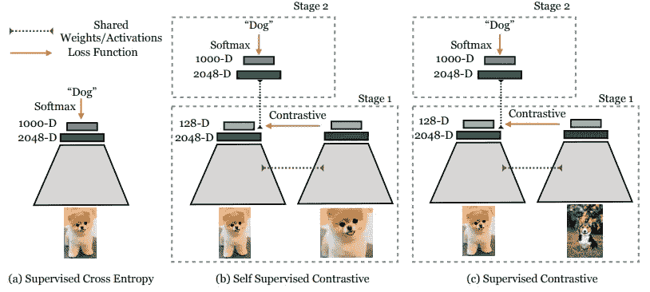
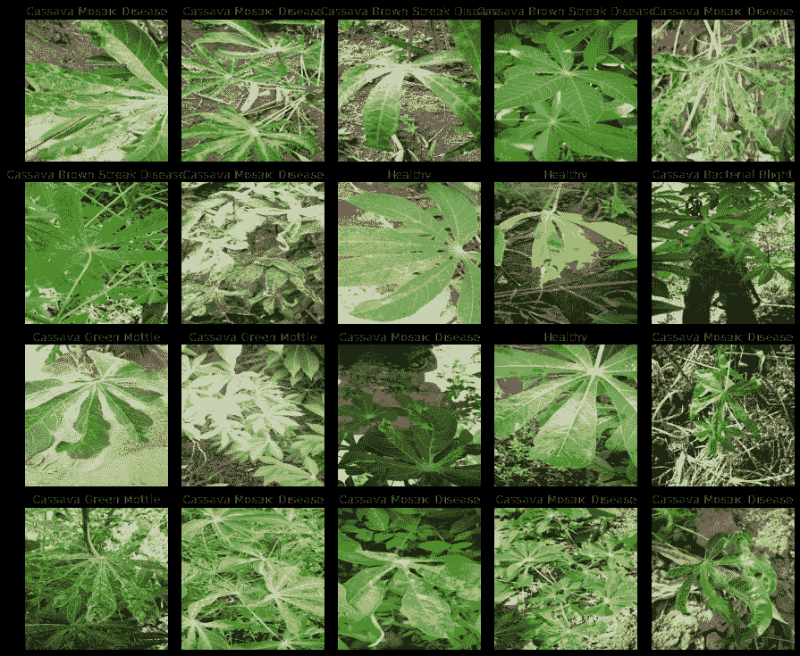
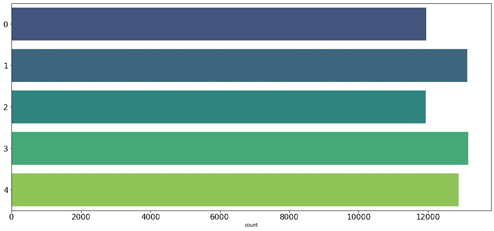
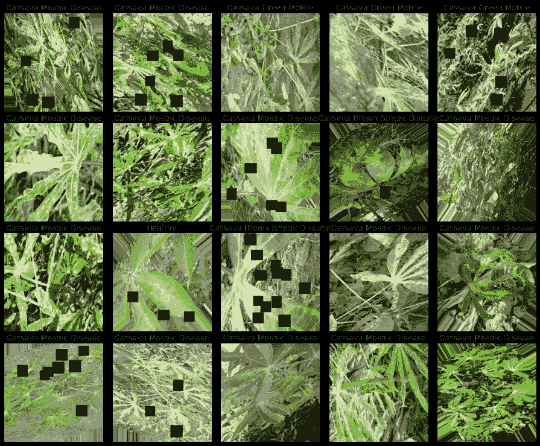
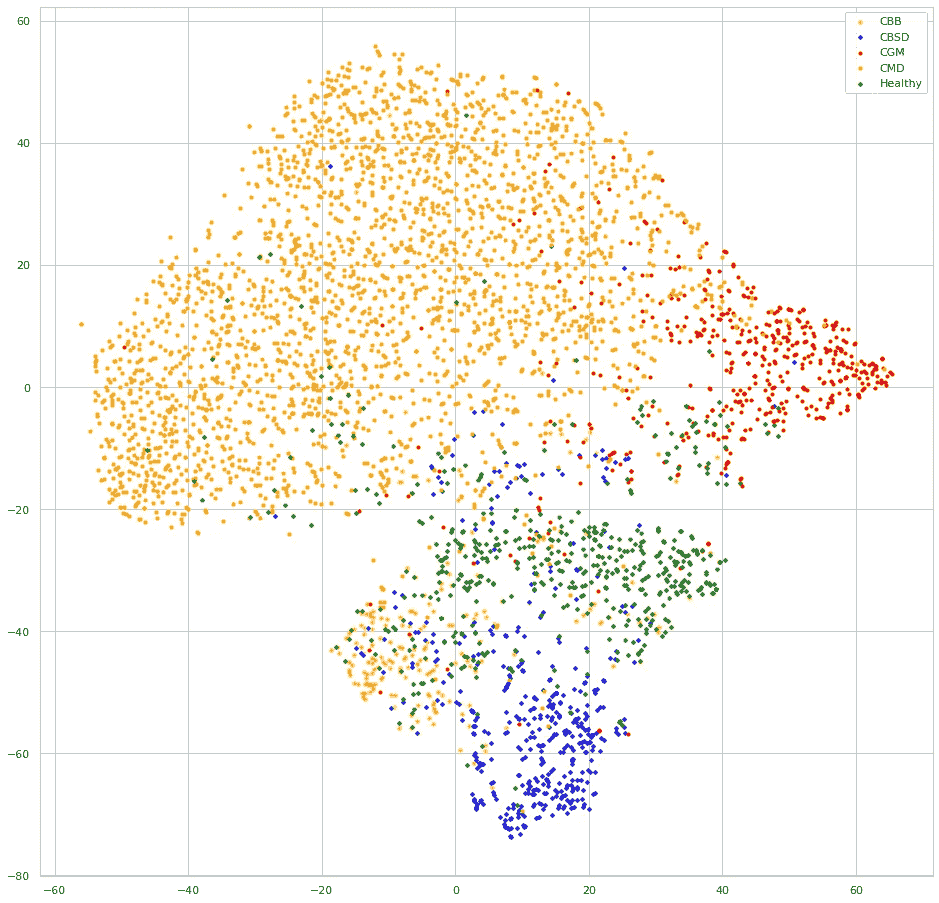
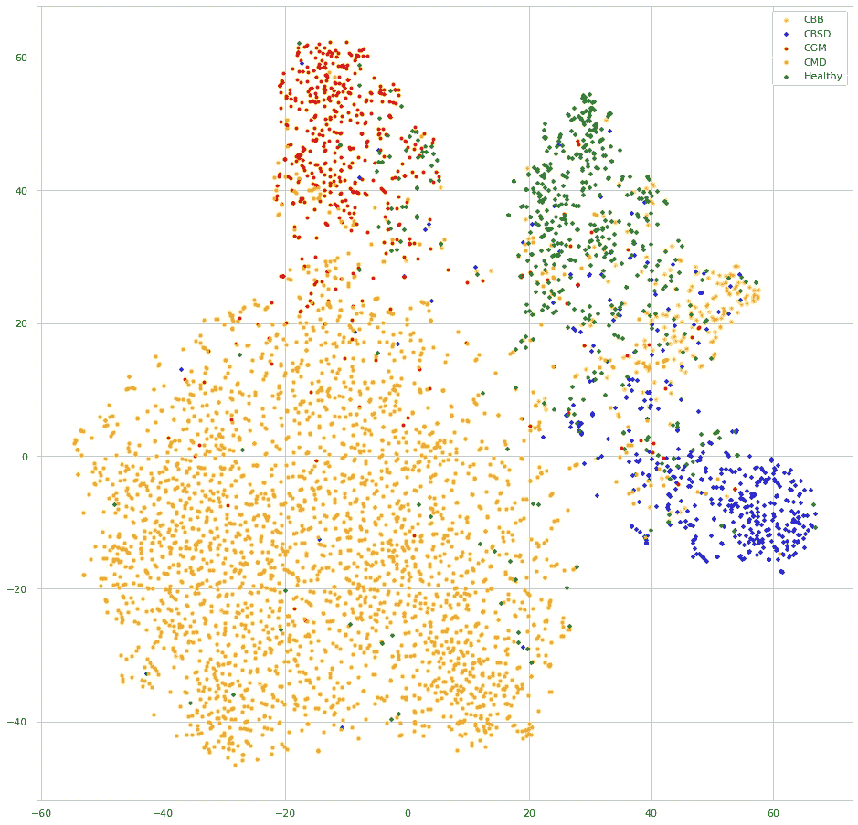

# 木薯叶部病害分类的监督对比学习

> 原文：<https://pub.towardsai.net/supervised-contrastive-learning-for-cassava-leaf-disease-classification-9dd47779a966?source=collection_archive---------1----------------------->

## [深度学习](https://towardsai.net/p/category/machine-learning/deep-learning)

## 应用深度学习和监督对比学习检测木薯叶片病害。


[马尔曼 xx](https://unsplash.com/@malmanxx?utm_source=medium&utm_medium=referral) 在 [Unsplash](https://unsplash.com?utm_source=medium&utm_medium=referral) 上的照片

有监督的对比学习(Prannay Khosla 等人)是一种在分类任务上优于交叉熵监督训练的训练方法。
想法是使用**监督对比学习(SCL)** 训练模型可以使模型编码器从样本中学习更好的类表示，这应该导致对图像和标签损坏的更好的泛化和鲁棒性。

> 在本文中，您将了解监督对比学习是什么，以及如何工作，您将看到代码实现，一个用例应用程序，最后是 SCL 和常规交叉熵之间的比较。

## 简而言之，这就是 SCL 的工作方式:

> 属于同一类的点的聚类在嵌入空间中被拉在一起，同时推开来自不同类的样本的聚类。

有许多对比学习方法，如“**监督对比学习**”、“**自我监督对比学习**”、“ **SimCLR** ”等，它们共有的对比部分是它们学习将一个领域的样本与其他领域的样本进行对比(推开)，但是 **SCL 以监督的方式利用标签信息**来完成这项任务。欲了解更多详细信息，请查阅论文。



不同的训练方法和架构。

本质上，使用监督对比学习训练分类模型分两个阶段执行:

1.  训练编码器以学习产生输入图像的矢量表示，使得同一类中的图像的表示与不同类中的图像的表示相比更相似。
2.  在冻结的编码器上训练分类器。

# 使用案例

我们将对来自 Kaggle 竞赛的数据集应用监督对比学习([木薯叶疾病分类](https://www.kaggle.com/c/cassava-leaf-disease-classification))目标是将木薯植物的叶片图像分为 5 类:

```
0: Cassava Bacterial Blight (CBB)
1: Cassava Brown Streak Disease (CBSD)
2: Cassava Green Mottle (CGM)
3: Cassava Mosaic Disease (CMD)
4: Healthy
```

我们有四种疾病和一类健康叶子，以下是一些图像样本:



木薯叶图像样本来自竞赛。

> 更多关于木薯叶疾病的信息，请点击 PlantVillage 的链接。

该数据有用于训练的 **21397** 幅图像和用于测试集的 **15000** 幅左右的图像。

# 实验装置

— **数据:**分辨率为 512 x 512 像素的图像。
— **型号(编码器):**B3 高效网。
Obs:你可以在这里查看[完整代码。](https://www.kaggle.com/dimitreoliveira/cassava-leaf-supervised-contrastive-learning)

通常，如果每个训练批次都有每个类的样本，对比学习方法会工作得更好，这将有助于编码器学习分批对比一个域与其他域的样本，这意味着使用较大的批次大小，在这种情况下，我已经对少数类进行了**过采样**，因此每个批次从每个类中获得样本的概率大致相同。



过采样后数据集的类分布。

**数据增强**通常有助于计算机视觉任务，在我的实验中，我也看到了数据增强的改进，这里我使用了剪切、旋转、翻转、裁剪、剪切以及饱和度、对比度和亮度的变化，这看起来可能很多，但图像与原始图像没有太大的不同。



扩充数据样本。

## 现在我们可以看代码了

## **编码器**

我们的编码器将是一个“ **EfficientNet B3** ”，但在编码器的顶部有一个平均池层，这个池层将输出一个大小为 2048 的向量，稍后它将用于检查编码器学习的表示。

```
def encoder_fn(input_shape):
    inputs = L.Input(shape=input_shape, name=’inputs’)
    base_model = efn.EfficientNetB3(input_tensor=inputs, 
                                    include_top=False,
                                    weights=’noisy-student’, 
                                    pooling=’avg’)

    model = Model(inputs=inputs, outputs=base_model.outputs)
    return model
```

## 投影头

投影头将放置在编码器的顶部，它将负责将编码器嵌入层的输出投影到一个**更小的维度**，在我们的例子中，它将把 2048 维编码器投影到一个 128 维向量。

```
def add_projection_head(input_shape, encoder):
    inputs = L.Input(shape=input_shape, name='inputs')
    features = encoder(inputs)
    outputs = L.Dense(128, activation='relu', 
                      name='projection_head', 
                      dtype='float32')(features)

    model = Model(inputs=inputs, outputs=outputs)
    return model
```

## 分类头

分类器头用于训练的可选第二阶段，在 SCL 训练阶段之后，我们可以移除投影头并将该分类器头添加到编码器，并使用常规的**交叉熵**损失来微调模型，这应该在编码器的层冻结的情况下完成。

```
def classifier_fn(input_shape, N_CLASSES, encoder, trainable=False):
    for layer **in** encoder.layers:
        layer.trainable = trainable

    inputs = L.Input(shape=input_shape, name='inputs')

    features = encoder(inputs)
    features = L.Dropout(.5)(features)
    features = L.Dense(1000, activation='relu')(features)
    features = L.Dropout(.5)(features)
    outputs = L.Dense(N_CLASSES, activation='softmax', 
                      name='outputs', dtype='float32')(features)

    model = Model(inputs=inputs, outputs=outputs)
    return model
```

## 监督对比学习损失

这是 SCL 损失的代码实现，这里唯一的参数是**温度**,“0.1”是默认值，但它可以调整，较大的温度可以导致班级更加分离，但较小的温度可以受益于更长的训练。

```
class **SupervisedContrastiveLoss**(losses.Loss):
    def __init__(self, temperature=0.1, name=None):
        super(SupervisedContrastiveLoss, self).__init__(name=name)
        self.temperature = temperature

    def __call__(self, labels, ft_vectors, sample_weight=None):
        *# Normalize feature vectors*
        ft_vec_normalized = tf.math.l2_normalize(ft_vectors, axis=1)
        *# Compute logits*
        logits = tf.divide(
            tf.matmul(ft_vec_normalized, 
                      tf.transpose(ft_vec_normalized)
            ), temperature
        )
        return tfa.losses.npairs_loss(tf.squeeze(labels), logits)
```

> “ **tfa** 是 [Tensorflow 插件包](https://www.tensorflow.org/addons)的别名。

# 培训

我将跳过 Tensorflow 样板培训代码，因为它非常标准，但是您可以在这个[笔记本](https://www.kaggle.com/dimitreoliveira/cassava-leaf-supervised-contrastive-learning/notebook#Training-(supervised-contrastive-learning))中查看完整的代码。

## 第一阶段培训(编码器+投影头)

第一阶段训练使用编码器+投影头，使用监督对比学习损失。

**建立模型**

```
with strategy.scope(): # Inside a strategy because I am using a TPU
  encoder = encoder_fn((None, None, CHANNELS)) # Get the encoder
  encoder_proj = add_projection_head((None, None, CHANNELS),encoder)
  # Add the projection head to the encoderencoder_proj.compile(optimizer=optimizers.Adam(lr=3e-4), 
                    loss=SupervisedContrastiveLoss(temperature=0.1))
```

**培训**

```
model.fit(x=get_dataset(TRAIN_FILENAMES, 
                        repeated=True, 
                        augment=True), 
          validation_data=get_dataset(VALID_FILENAMES, 
                                      ordered=True), 
          steps_per_epoch=100, 
          epochs=10)
```

## 第二阶段培训(编码器+分类器头)

对于训练的第二阶段，我们移除投影头，并在编码器的顶部添加分类器头，它现在已经训练了权重。对于这一步，我们可以使用常规的交叉熵损失，照常训练模型。

**建立模型**

```
with strategy.scope():
    model = classifier_fn((None, None, CHANNELS), N_CLASSES, 
                          encoder, # trained encoder
                          trainable=False) # with frozen weights model.compile(optimizer=optimizers.Adam(lr=3e-4),
                  loss=losses.SparseCategoricalCrossentropy(), 
                  metrics=[metrics.SparseCategoricalAccuracy()])
```

**训练** 跟以前差不多

```
model.fit(x=get_dataset(TRAIN_FILENAMES, 
                        repeated=True, 
                        augment=True), 
          validation_data=get_dataset(VALID_FILENAMES, 
                                      ordered=True), 
          steps_per_epoch=100, 
          epochs=10)
```

# 可视化嵌入输出

评估编码器的学习表示的一种有趣方式是可视化特征嵌入的输出，在我们的情况下，它是编码器的最后一层，即平均池层。
这里我们将比较用 SCL 训练的模型和另一个用常规交叉熵训练的模型，你可以在[参考笔记本](https://www.kaggle.com/dimitreoliveira/cassava-leaf-supervised-contrastive-learning)中看到完整的训练。
通过在验证数据集的嵌入输出处应用 t-SNE 来生成可视化。

## 交叉熵嵌入



交叉熵训练模型的嵌入可视化。

## 监督对比学习嵌入



用 SCL 训练的模型的嵌入可视化。

我们可以看到，这两个模型似乎在将每个类别的样本聚类在一起方面做得很好，但是查看用 SCL 训练的模型的嵌入，每个类别的样本比其他类别的样本聚类得更远，这是对比学习的结果，我们还可以预期这种行为将导致更好的泛化，因为类别决策边界将更加清晰， 理解这一优势的一个直观练习是，尝试在每次嵌入时绘制决策边界线来分隔类，SCL 嵌入会让您轻松得多。

# 结论

我们看到，使用监督对比学习方法的训练既容易实现又高效，它可以导致更好的准确性和更好的类表示，这反过来也可以导致能够更好地概括的更健壮的模型。如果你愿意尝试一下 SCL，一定要看看下面的链接。

## 参考

——[监督对比学习论文](https://arxiv.org/pdf/2004.11362.pdf)。
-[《SCL 论文评论》(Yannic Kilcher 拍摄的视频)](https://www.youtube.com/watch?v=MpdbFLXOOIw)。
- [官方 Keras 资源库的 SCL 教程](https://keras.io/examples/vision/supervised-contrastive-learning/)。
- [SCL 用于木薯叶部病害分类(Kaggle 竞争)](https://www.kaggle.com/dimitreoliveira/cassava-leaf-supervised-contrastive-learning)。
- [SCL 讨论线程(Kaggle 竞赛)](https://www.kaggle.com/c/cassava-leaf-disease-classification/discussion/206454)。

## 致谢:

*   论文作者:作者:Prannay Khosla、Piotr Teterwak、、Aaron Sarna、永龙田、Phillip Isola、Aaron Maschinot、、陈爱龙克里希南。
*   Keras 教程:Khalid Salama。

如果你想了解如何使用 Tensorflow 建立计算机视觉的训练管道，请查看这篇文章:“[有效地使用 TPU 进行图像分类](https://medium.com/swlh/efficiently-using-tpu-for-image-classification-ed20d2970893)”。