# 支持向量机(SVM):一个简单的直观解释——第一部分

> 原文：<https://pub.towardsai.net/support-vector-machine-svm-a-visual-simple-explanation-part-1-a7efa96444f2?source=collection_archive---------1----------------------->

## [机器学习](https://towardsai.net/p/category/machine-learning)

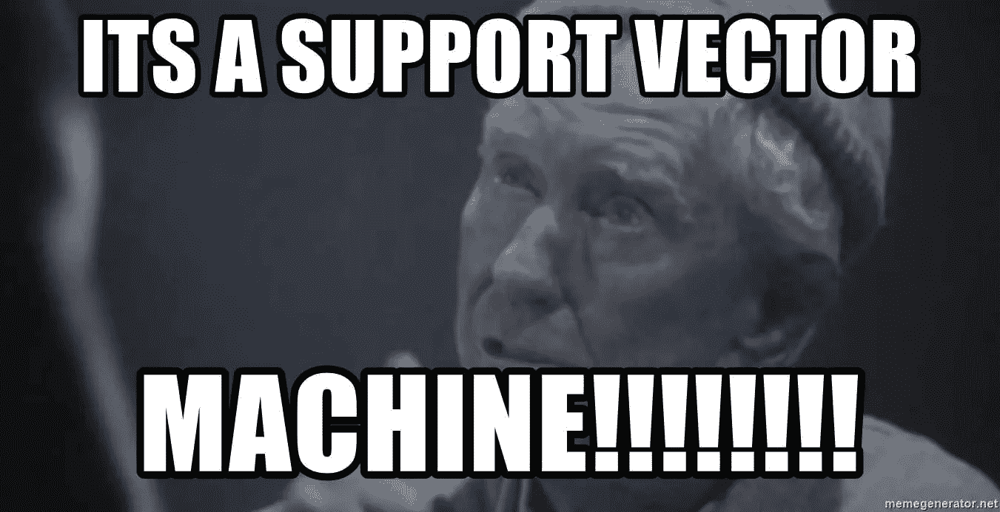

# 什么是 SVM？

> SVM 是一种使用超平面分离数据的监督分类方法。

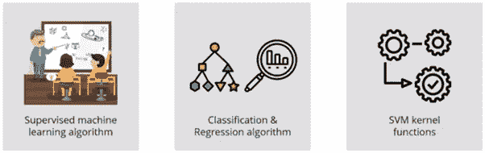

SVM 是一种受监督的机器学习算法，它将示例表示为空间中的点，通过映射，各个类别的示例被尽可能宽的清晰间隙分隔开。然后，新的例子被映射到相同的空间，并根据它们落在差距的哪一边来预测属于哪个类别。

> 除了执行线性分类，SVM 还可以使用所谓的**内核技巧**有效地执行非线性分类，将输入隐式映射到高维特征空间。(非线性数据基本上不能用直线分开)

# **SVM 是如何工作的？**

为了理解它是如何工作的，让我们考虑一个兔子和老虎的例子(两个数据点仅用于直观解释)。现在让我们考虑一个小场景，假设你拥有一个农场。比方说，你有一个问题，想建立一个围栏来保护你的兔子免受老虎的攻击。

但是，你在哪里建造围栏呢？

解决这个问题的一个方法是根据兔子和老虎的位置建立一个分类器。你可以把兔子归为一类，把老虎归为另一类

现在，如果我试图在兔子和老虎之间画一条分界线，它看起来像一条直线(请参考下图)，现在你可以清楚地沿着这条线建一个围栏。这正是 SVM 的工作方式，它在任何两个类之间画出一个决策边界，这是一个超平面，以便将它们分开或分类。

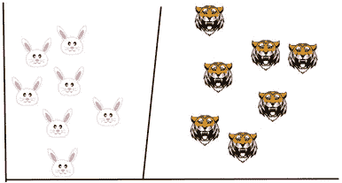

**但是，你怎么知道在哪里画超平面呢？**

SVM 背后的基本原理是绘制一个超平面，该超平面最好地分离这两个类，在我们的例子中，这两个类是兔子和老虎，所以你从绘制一个随机超平面开始，然后你检查超平面和每个类的最近数据点之间的距离。

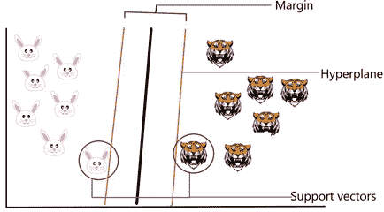

这些最接近超平面的数据点被称为支持向量，这就是支持向量机名称的由来，所以基本上，超平面是基于这些支持向量绘制的。通常，与支持向量具有最大距离的超平面是最佳超平面，并且超平面和支持向量之间的距离被称为边缘。

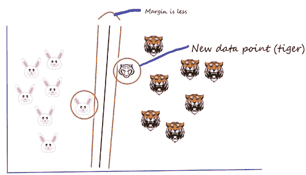

假设我们添加了一个新的数据点(又添加了一个 tiger ),现在我想画一个超平面来以最佳方式分隔这两个类。因此，我首先绘制一个超平面，如上图所示，然后检查超平面和支持向量之间的距离，并尝试检查该超平面的边距是否最大。在这种情况下，利润较少。

在第二个场景中，我绘制了一个不同的超平面，如下图所示，然后检查超平面和支持向量之间的距离，并尝试检查该超平面的边距是否最大。这种情况下利润很高。

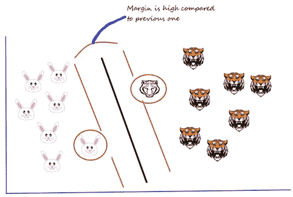

与前一个超平面相比，这个超平面的余量很高。因此，我选择这个超平面，作为一个经验法则，支持向量和超平面之间的距离(边距)应该是最大的。这就是我们如何选择超平面。

到目前为止，我们的数据是线性可分的，这意味着你可以画一条直线来区分这两个类。如果我们有如下数据点，我们能做什么？我们不能画一个超平面，因为它根本没有把两个类分开。

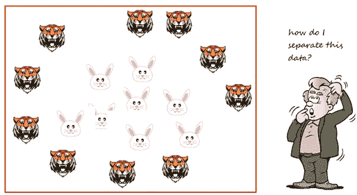

非线性数据点

# 非线性 SVM 简介

> 当数据不能用直线分离时，使用非线性 SVM。

在这种情况下，我们使用核函数来帮助将数据转换到另一个维度，在两个类之间有一个清晰的分界。核函数有助于将非线性空间转换成线性空间。

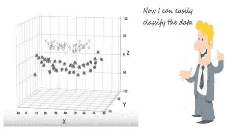

它将两个变量 x 和 y 转换到一个新的特征空间，其中包含一个名为 z 的新变量。到目前为止，我们正在二维空间上绘制数据。现在，我们基本上是在三维空间里做的。在 3D 空间中，我们可以清楚地看到这两个类之间的分界，我们可以通过绘制它们之间的最佳超平面来区分这两个类。

# SVM 的调谐参数

调整机器学习算法的参数值有效地提高了模型性能。让我们看看 SVM 可用的参数列表。让我们举一个小例子，

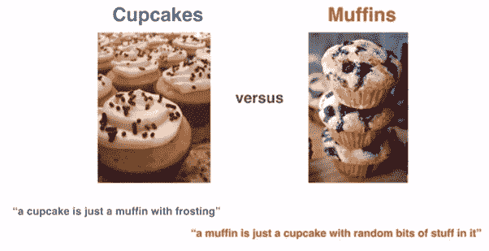

考虑到帖子的长度，我没有展示代码。详细的例子和编码将会包含在我的下一篇博客中。

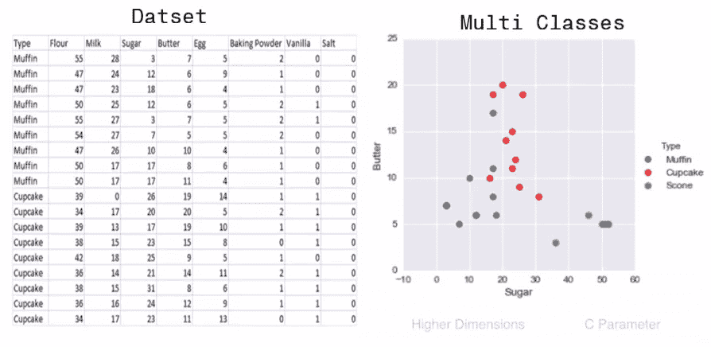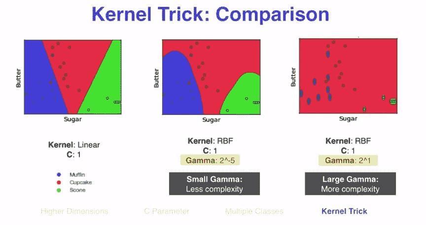

c-它是正则化参数。它允许你决定多少你想要惩罚错误分类的点。

内核—它指定要使用的内核类型。有不同的核选项，如线性、径向基函数(RBF)、多项式和 sigmoid。这里“rbf”和“poly”对于非线性超平面是有用的。

Gamma —它是“rbf”、“poly”和“sigmoid”的核心系数。较小的灰度系数复杂度较低，较大的灰度系数复杂度较高。

# 利弊——SVM

**优点:**

*   它对线性可分(硬边界)和非线性可分(软边界)数据都有用。
*   在高维空间是有效的。
*   这在维数大于样本数的情况下是有效的。
*   它在决策函数中使用训练点的子集(称为支持向量)，因此它也是内存高效的。

**缺点:**

*   选择正确的内核和参数需要大量的计算。
*   当数据集有更多噪声时，即目标类重叠时，它的性能也不是很好
*   SVM 没有直接提供概率估计，这些是通过昂贵的五重交叉验证计算出来的。

这是一个简单的 SVM 视觉介绍。希望这将作为理解支持向量机的一个好的起点。在下一篇文章中，我将通过一个案例研究展示如何在 SAS Enterprise Miner 中实现 SVM。

请继续学习，并关注更多内容！