# 用于二元和多类分类的支持向量机(SVM ): sci kit-Learn 实践

> 原文：<https://pub.towardsai.net/support-vector-machine-svm-for-binary-and-multiclass-classification-hands-on-with-scikit-learn-29cdbe5cb90e?source=collection_archive---------0----------------------->

## 使用 Python 和 Google Colab

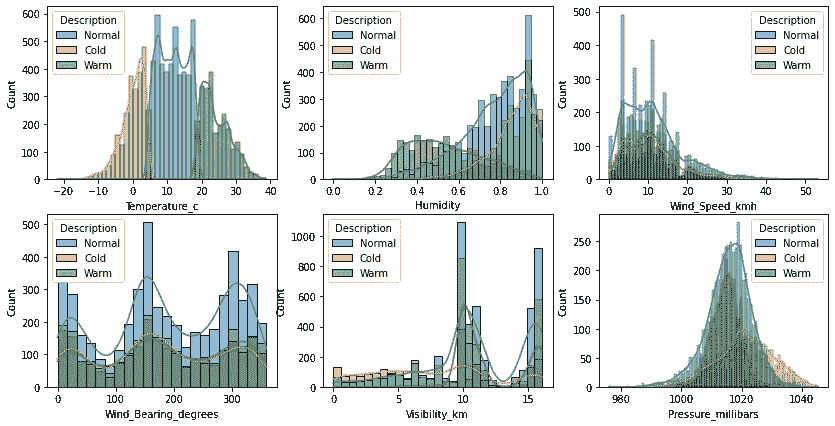

支持向量机(SVM)是一种基于线性模型的分类算法。它允许二进制或多类分类(应用 [one-vs-rest 技术](https://medium.com/p/560eb87a7b8))。在本文中，我将通过一个完整的实践教程来指导您在二进制和多类数据中实现 SVM 模型。

如果你想知道更多关于 SVM 和算法如何在幕后工作，你可以找到我的另一篇[文章](https://medium.com/p/560eb87a7b8):


【https://medium.com/p/560eb87a7b8 

## SVM 二元分类

在二元分类中，我们希望预测我们的数据属于两个类别中的哪一个。在本教程中，我将使用在 Kaggle 上免费下载的 [weather.csv](https://www.kaggle.com/zaraavagyan/weathercsv) 数据。这个数据集有六个数值变量和两个分类变量。分类变量，一个是二元的(“Rain”:0 或 1)，另一个是多类的(“Description”:0 代表正常温度，1 代表寒冷，2 代表温暖)。我们将使用数值变量来预测分类变量，对于二进制 SVM 使用“Rain ”,对于多分类 SVM 使用“Description”。

我们开始吧。

与我的其他项目示例一样，我将使用 Google Colab 来运行我的分析。

首先，我们需要加载必要的库:

```
import numpy as np
import pandas as pd
import matplotlib.pyplot as plt
import seaborn as sns
from sklearn.model_selection import train_test_split
from sklearn.svm import LinearSVC
from mlxtend.plotting import plot_decision_regions
```

要加载数据库，请执行以下操作:

```
df = pd.read_csv("/content/weather.csv")
df
```

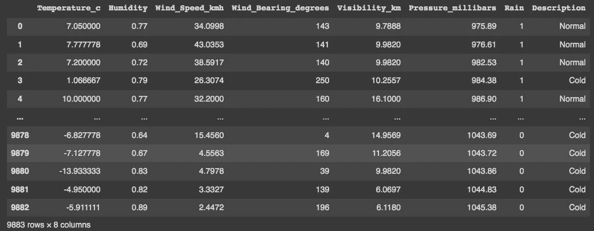

weather.csv 数据集

我们的目标是预测降雨，其中 1 表示*【下雨】，0 表示 ***【无雨】*** 。我们可以探索我们的数据集，并查看变量根据*或 ***【无雨】*** 类别的表现。我们可以检查相关性和分布。**

```
**#Exploring dataset:
sns.pairplot(df, kind="scatter", hue="Rain")
plt.show()**
```

**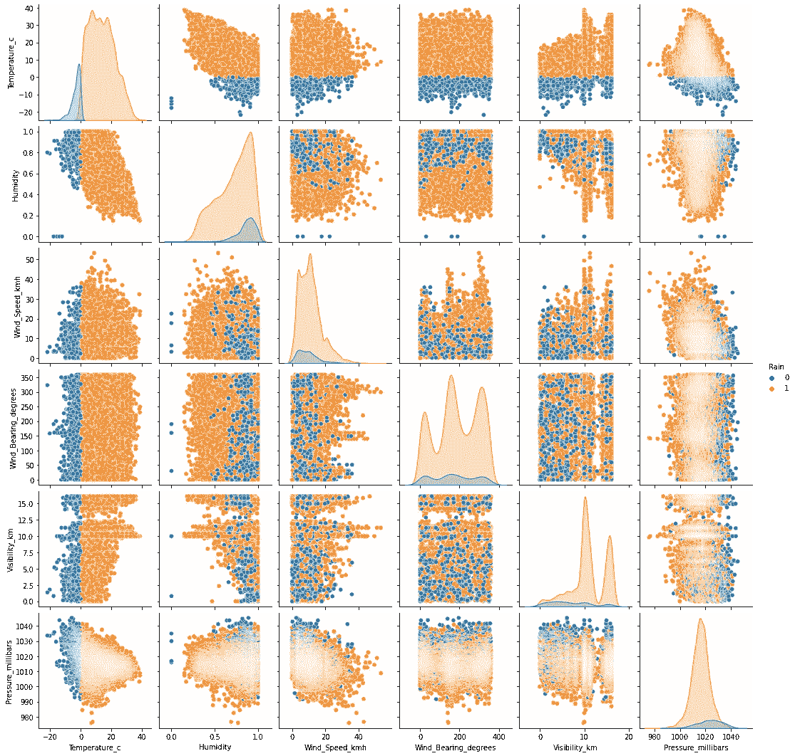**

**变量之间的相关性可以使用热图进行评估:**

****

**我们还可以根据两个类别检查参数的分布:**

```
**fig, axs = plt.subplots(2, 3, figsize=(14, 7))sns.histplot(data=df, x="Temperature_c", hue="Rain", kde=True, color="skyblue", ax=axs[0, 0])
sns.histplot(data=df, x="Humidity", hue="Rain", kde=True, color="skyblue", ax=axs[0, 1])
sns.histplot(data=df, x="Wind_Speed_kmh", hue="Rain", kde=True, color="skyblue", ax=axs[0, 2])
sns.histplot(data=df, x="Wind_Bearing_degrees", hue="Rain", kde=True, color="skyblue", ax=axs[1, 0])
sns.histplot(data=df, x="Visibility_km", hue="Rain", kde=True, color="skyblue", ax=axs[1, 1])
sns.histplot(data=df, x="Pressure_millibars", hue="Rain", kde=True, color="skyblue", ax=axs[1, 2])plt.show()**
```

**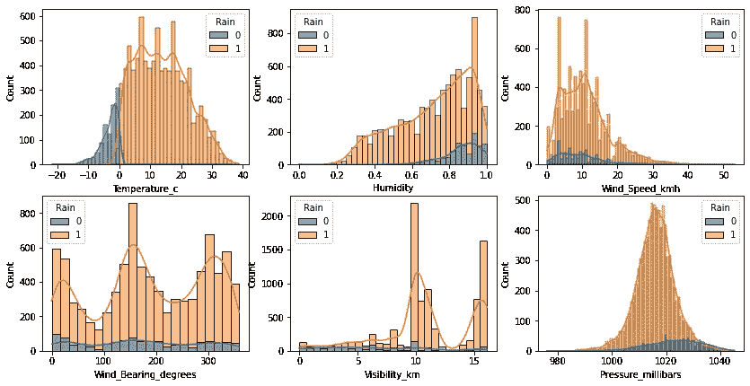**

```
**fig, axs = plt.subplots(2, 3, figsize=(14, 7))sns.boxplot(x=df["Rain"], y=df["Temperature_c"], ax=axs[0, 0])
sns.boxplot(x=df["Rain"], y=df["Humidity"], ax=axs[0, 1])
sns.boxplot(x=df["Rain"], y=df["Wind_Speed_kmh"], ax=axs[0, 2])
sns.boxplot(x=df["Rain"], y=df["Wind_Bearing_degrees"],ax=axs[1, 0])
sns.boxplot(x=df["Rain"], y=df["Visibility_km"], ax=axs[1, 1] )
sns.boxplot(x=df["Rain"], y=df["Pressure_millibars"], ax=axs[1, 2])plt.show()**
```

****

**一些变量似乎善于区分这两个群体，如温度或能见度。现在我们建立我们的 SVM 模型。我们需要创建我们的 ***X*** 变量(带有预测变量或特征)和*(带有标签)。***

```
***X = df.drop('Rain', axis=1)
X = df.drop('Description', axis=1)y = df['Rain']***
```

***并拆分我们的数据，80%的观测值用于建模，20%用于测试。***

```
***X_train, X_test, y_train, y_test = train_test_split(X, y, test_size=0.20)***
```

***现在我们可以构建和评估我们的模型:***

```
***LinearSVM = LinearSVC().fit(X_train, y_train)print("training set score: %f" % LinearSVM.score(X_train, y_train))
print("test set score: %f" % LinearSVM.score(X_test, y_test))***
```

***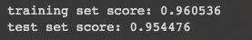***

***我们的模型在预测降雨方面表现很好，训练子样本的准确率为 96%，测试子样本的准确率为 95%。由于训练和测试精度非常接近，这意味着我们的模型没有过度拟合。然而，我们仍然可以通过改变 C 参数来改进我们的模型。你可以在我的另一篇文章中读到更多关于 [C 参数的内容。我们将使用 C=100 进行尝试。](/logistic-regression-for-binary-classification-hands-on-with-scikit-learn-a5c06b0f2d60)***

```
***#C=100
LinearSVM100 = LinearSVC(C=100).fit(X_train, y_train)print("training set score: %f" % LinearSVM100.score(X_train, y_train))
print("test set score: %f" % LinearSVM100.score(X_test, y_test))***
```

***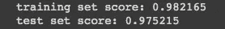***

***将 C 改为 100(默认情况下该值为 1)改进了我们的模型。现在我们的训练准确率达到 98.2%，测试准确率达到 97.5%。但是我们也可以尝试降低这个参数，看看会发生什么:***

```
***#C=0.01
LinearSVM001 = LinearSVC(C=0.01).fit(X_train, y_train)print("training set score: %f" % LinearSVM001.score(X_train, y_train))
print("test set score: %f" % LinearSVM001.score(X_test, y_test))***
```

***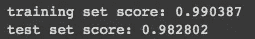***

***正如你所看到的，将 C 改为 0.01 改进了我们的 SVM 模型。现在，我们对训练数据集的准确率为 99%，对测试子样本的准确率为 98.2%。这应该是我们最好的模型。***

***为了可视化结果，我们可以用这两个类构建一个表示。我们在方框图中看到，最能区分这两个等级的参数是**温度 _c** 和**能见度 _km** 。因为我们将只构建一个二维图形可视化，所以我们将使用这两个特性。***

```
***data = pd.read_csv('weather.csv')def LinearSVM_comparison(data,c):
    x = data[[**'Temperature_c'**,**'Visibility_km'**,]].values
    y = data['Rain'].astype(int).values
    LinearSVM_plot = LinearSVC(C=c)
    LinearSVM_plot.fit(x,y)
    print(LinearSVM_plot.score(x,y))
    #Plot decision region:
    plot_decision_regions(x,y, clf=LinearSVM_plot, legend=2)
    #Adding axes annotations:
    plt.xlabel('X_train')
    plt.ylabel('y_train')
    plt.title('Linear SVM with C='+str(c))
    plt.show()***
```

***该函数还允许我们使用增强模型的 C 参数(C=0.01)来构建带有决策边界的图形:***

```
***LinearSVM_comparison(data,**0.01**)***
```

***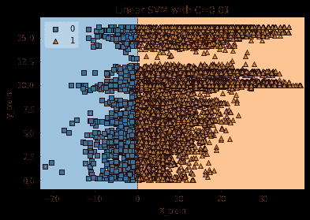***

## ***用 SVM 进行多类分类***

***使用 SVM 的多类分类类似于二分类，但是我们的机器应用一对其余(OVR)技术。我们现在要预测的三类是 0(常温)、1(冷)、2(暖)。和往常一样，我们从数据检查开始:***

```
***#Exploring dataset:
sns.pairplot(df, kind="scatter", hue="Description")
plt.show()***
```

***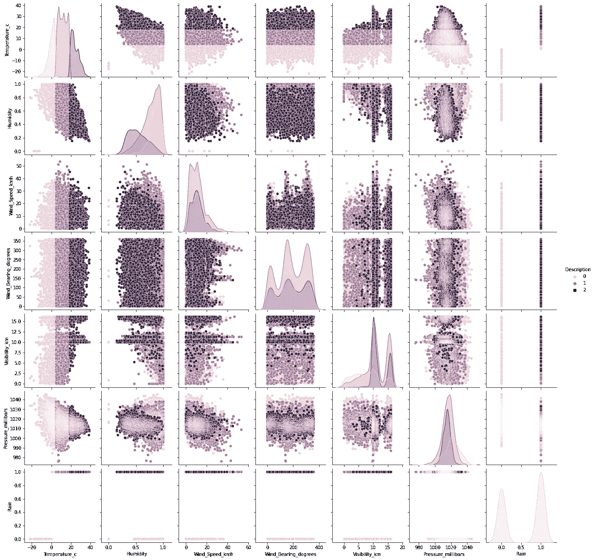***

***我们可以检查数据是如何分布在三个类别中的:***

```
***fig, axs = plt.subplots(2, 3, figsize=(14, 7))sns.histplot(data=df, x="Temperature_c", hue="Description", kde=True, color="skyblue", ax=axs[0, 0])
sns.histplot(data=df, x="Humidity", hue="Description", kde=True, color="skyblue", ax=axs[0, 1])
sns.histplot(data=df, x="Wind_Speed_kmh", hue="Description", kde=True, color="skyblue", ax=axs[0, 2])
sns.histplot(data=df, x="Wind_Bearing_degrees", hue="Description", kde=True, color="skyblue", ax=axs[1, 0])
sns.histplot(data=df, x="Visibility_km", hue="Description", kde=True, color="skyblue", ax=axs[1, 1])
sns.histplot(data=df, x="Pressure_millibars", hue="Description", kde=True, color="skyblue", ax=axs[1, 2])plt.show()***
```

***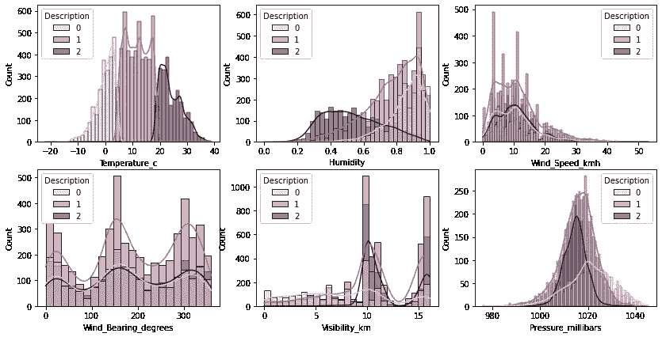***

***以及变量如何区分这三个类别:***

```
***fig, axs = plt.subplots(2, 3, figsize=(14, 7))sns.boxplot(x=df["Description"], y=df["Temperature_c"], ax=axs[0, 0])
sns.boxplot(x=df["Description"], y=df["Humidity"], ax=axs[0, 1])
sns.boxplot(x=df["Description"], y=df["Wind_Speed_kmh"], ax=axs[0, 2])
sns.boxplot(x=df["Description"], y=df["Wind_Bearing_degrees"], ax=axs[1, 0])
sns.boxplot(x=df["Description"], y=df["Visibility_km"], ax=axs[1, 1])
sns.boxplot(x=df["Description"], y=df["Pressure_millibars"], ax=axs[1, 2])plt.show()***
```

***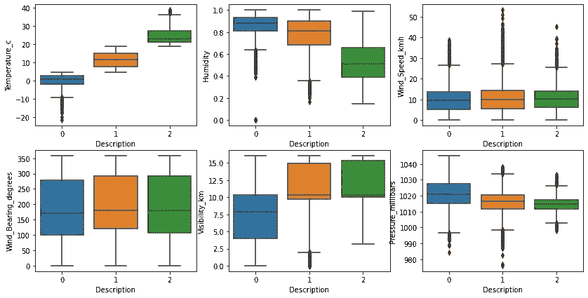***

***通过目测，**温度 _c** 和**湿度**似乎是划分三个等级的最佳特征。现在我们可以建立我们的模型了。我们将从创建一个新的 ***y*** 变量开始，因为我们已经从之前的二进制分类分析中获得了 ***X*** 。***

```
**y = df['Description']**
```

**并再次执行训练和测试数据分割(因为我们有不同的*):***

```
***X_train, X_test, y_train, y_test = train_test_split(X, y, test_size=0.20)***
```

***构建和评估模型:***

```
***LinearSVM = LinearSVC().fit(X_train, y_train)print("training set score: %f" % LinearSVM.score(X_train, y_train))
print("test set score: %f" % LinearSVM.score(X_test, y_test))***
```

******

***开箱即用，我们的模型具有良好的性能，训练集的准确率为 91%，测试集的准确率为 90%。模型没有过度拟合。我们仍然可以用不同的 C 值测试我们的模型，看看会发生什么:***

```
***#C=100
LinearSVM100 = LinearSVC(C=100).fit(X_train, y_train)print("training set score: %f" % LinearSVM100.score(X_train, y_train))
print("test set score: %f" % LinearSVM100.score(X_test, y_test))***
```

***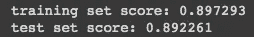***

***当 C=100 时，我们的模型精度下降了大约 1%，所以 C=100 不是更好的选择。***

```
***#C=0.01
LinearSVM001 = LinearSVC(C=0.01).fit(X_train, y_train)print("training set score: %f" % LinearSVM001.score(X_train, y_train))
print("test set score: %f" % LinearSVM001.score(X_test, y_test))***
```

***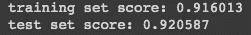***

***当 C=0.01 时，我们可以看到测试集的准确性有一点提高，所以我们应该使用这个值。现在让我们使用特征**湿度**和**温度 _c、**和 **C=0.01** 来构建一个具有决策边界的图形:***

```
***data = pd.read_csv('weather.csv')def LinearSVM_comparison(data,c):
    x = data[['**Humidity**','**Temperature_c**',]].values
    y = data['Description'].astype(int).values
    LinearSVM_plot = LinearSVC(C=c)
    LinearSVM_plot.fit(x,y)
    print(LinearSVM_plot.score(x,y))
    #Plot decision region:
    plot_decision_regions(x,y, clf=LinearSVM_plot, legend=2)
    #Adding axes annotations:
    plt.xlabel('X_train') 
    plt.ylabel('y_train') 
    plt.title('Linear SVM with C='+str(c))
    plt.show()LinearSVM_comparison(data,0.01)***
```

***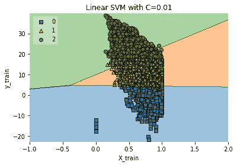***

***感谢您的阅读！如果你有建议要添加到这个列表中，请告诉我，不要忘记订阅以接收关于我未来出版物的通知。***

***如果:你喜欢这篇文章，别忘了关注我，这样你就能收到所有关于新出版物的更新。***

***否则如果:你想了解更多，你可以通过[我的推荐链接](https://cdanielaam.medium.com/membership)订阅媒体会员。它不会花你更多的钱，但会支付我一杯咖啡。***

***Else:谢谢！***