# 支持向量机(SVM)简介—机器学习

> 原文：<https://pub.towardsai.net/support-vector-machine-svm-introduction-machine-learning-8c56b7da63f1?source=collection_archive---------0----------------------->

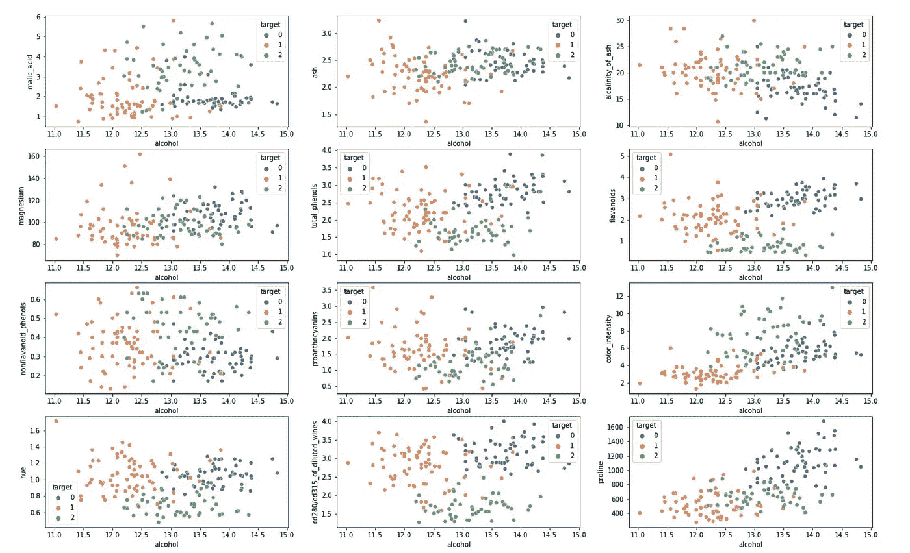

支持向量机(SVM)图用于我们在葡萄酒数据集上的实现，如下所示|来源:图片由作者提供。

## [数据科学](https://towardsai.net/p/category/data-science)，[社论](https://towardsai.net/p/category/editorial)，[机器学习](https://towardsai.net/p/category/machine-learning)

## 介绍机器学习中的支持向量机(SVM ),以及它们在有监督的最大似然学习中的作用，并举例说明

**作者:** [苏扬·希罗](https://www.linkedin.com/in/sujan-shirol/)，[罗伯托·伊里翁多](https://mktg.best/vguzs)

[](https://members.towardsai.net/) [## 加入我们吧↓ |面向人工智能成员|数据驱动的社区

### 向着 AI 加入。通过成为会员，你不仅将支持人工智能，但你将有机会…

members.towardsai.net](https://members.towardsai.net/) 

S VM 代表支持向量机(support vector machine)，虽然可以同时解决分类和回归问题，但主要用于 [**机器学习**](https://mld.ai/mldcmu) **(ML)** 中的分类问题。SVM 模型帮助我们根据以前分类的类似数据对新数据点进行分类，使其成为一种受监督的机器学习技术。本文的参考资料可以在 [**Google Colab**](https://colab.research.google.com/drive/151vvpQelTep3ftrvpK3LzqTeyF_HwFGW?usp=sharing) 或 [**Github**](https://github.com/towardsai/tutorials/tree/master/support-vector-machine-svm) 上找到。

## 机器学习中的分类是什么？

**分类**是一项受监督的 ML 任务，它需要机器学习算法来学习如何为来自问题领域的示例分配类别标签。一个容易理解的例子是将电子邮件分类为“*垃圾邮件*或“*非垃圾邮件*”

在机器学习中，我们可能会遇到几种不同类型的分类任务，以及可用于每个[【1】](https://machinelearningmastery.com/types-of-classification-in-machine-learning/#:~:text=In%20machine%20learning%2C%20classification%20refers,one%20of%20the%20known%20characters.)的专门建模方法。这种模型将需要输入数据和标签来学习和理解，然后估计分类或映射新输入数据的最佳方法。

有许多不同类型的算法，SVM 是其中之一，是最广泛使用的。分类任务有四种类型:

1.  二元分类:两个类别标签，垃圾邮件/非垃圾邮件，0/1。
2.  多类分类:两个以上的类标签面临分类。
3.  多标签分类:每个实例可以被分配多个类别。
4.  不平衡分类:每个类中的实例数量不相等。

> 如果你还没有退房，推荐我们的[**K-近邻教程**](https://news.towardsai.net/knn) ，因为它是有监督机器学习中学习分类的基本机器学习算法之一。

[](/k-nearest-neighbors-knn-algorithm-tutorial-machine-learning-basics-ml-ec6756d3e0ac) [## k 近邻(KNN)算法教程—机器学习基础

### 潜入 K-最近邻，一个基本的经典机器学习(ML)算法

pub.towardsai.net](/k-nearest-neighbors-knn-algorithm-tutorial-machine-learning-basics-ml-ec6756d3e0ac) 

支持向量机负责在高维或无限维空间中构建一个超平面或一组超平面，进而可用于分类、回归或其他任务，如离群值检测。

直观地，通过具有到任何类别的最近训练数据点的最显著距离的超平面(所谓的函数裕度)来实现良好的分离，因为一般来说，裕度越大，分类器的泛化误差越低[[2]](https://en.wikipedia.org/wiki/Support-vector_machine#Definition)。

> **术语警告**
> 
> 1.支持向量
> 
> 2.超平面
> 
> 3.功能保证金(从现在起称为保证金)
> 
> 4.线性可分的
> 
> 5.非线性可分的

[**机器学习算法**](https://news.towardsai.net/mla) 因为使用的术语，听起来很花哨，很吓人。然而，它们很容易理解，并且来源于日常生活事件。

让我们用分类例子来理解 SVM 的每个术语。

## SVM 的功能

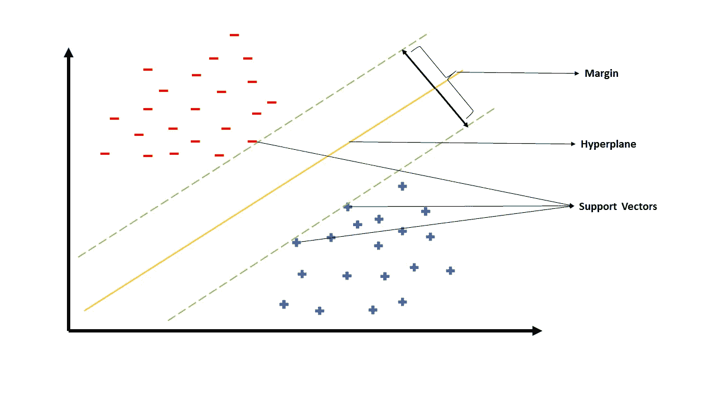

图 1:SVM 的功能

该图像代表了理想的 SVM 分类器在二维平面上的样子。有两类:阴性和阳性，分别用红色和蓝色标记。将它们标记为消极和积极的确切原因将会更加明显。SVM 在二维特征中创建一个平面，在多维特征中创建一个超平面，称为*决策边界*。

超平面分离特征，并帮助根据其值对新的输入数据点进行分类。可以生成 n 个可能的超平面，可以把类分开，找到最优的？这时*裕度*和*支持向量*开始发挥作用。

当生成决策边界的超平面时，它还生成两个被称为*边缘平面、*的超平面，这两个超平面精确地平行于决策边界，使得这两个边缘平面都通过各自类别的至少一个最近点。这两个边缘平面通过的最近点称为支持向量。

最佳决策边界是两个平行边缘超平面之间距离最大的边界，它们之间的距离称为*边缘*。因此，SVM 算法致力于最大限度地提高利润。

关于数据分布有两类分类问题:*线性可分*和*非线性可分*。如果平面上至少有一条线，所有的蓝点在线的一边，所有的红点在线的另一边，那么两组是线性可分的[【3】](https://en.wikipedia.org/wiki/Linear_separability)。

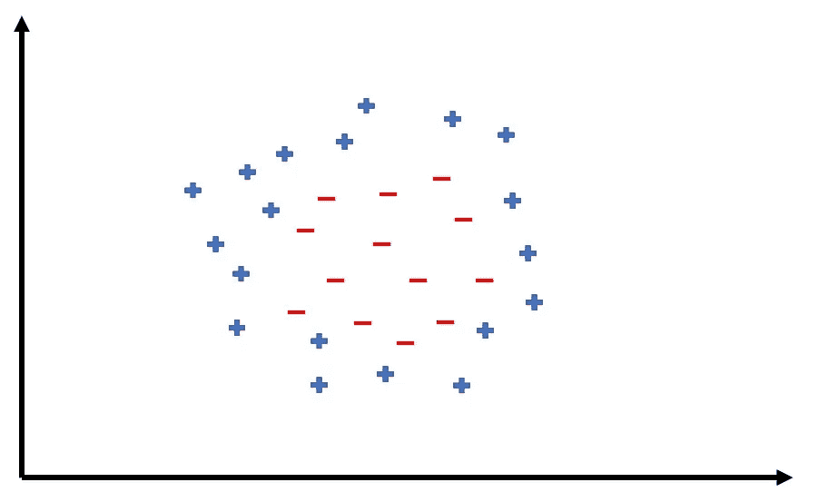

图 2:非线性可分离点。

当数据点不能用直线或直超平面分开时，这些类型被称为非线性可分的。在这种情况下，SVM 核起作用并将低维转换成高维，使得数据点是线性可分的。如需了解更多信息，请查看下面的视频。

来源:视频由 [udiprod](https://www.youtube.com/channel/UCcf4LQogGFtYzPhq05uHE4g)

## SVM 用例

1.  人脸检测
2.  文本和超文本分类
3.  图像分类
4.  生物信息学
5.  远程同源性检测
6.  笔迹检测
7.  广义预测控制

## SVM 背后的数学

超平面的方程由下式给出:

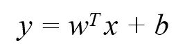

图 3:超平面的方程。

其中输出 *y* 指示它是在正类还是负类中。 *w 是表示飞机参数的矩阵*，也是 *x* 的系数，其中 *x* 是输入数据。 *b* 代表超平面的截距。

当我们有多维特征时，比如说有 *p* 个特征，等式扩展为:

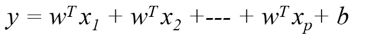

图 4:超平面的扩展方程。

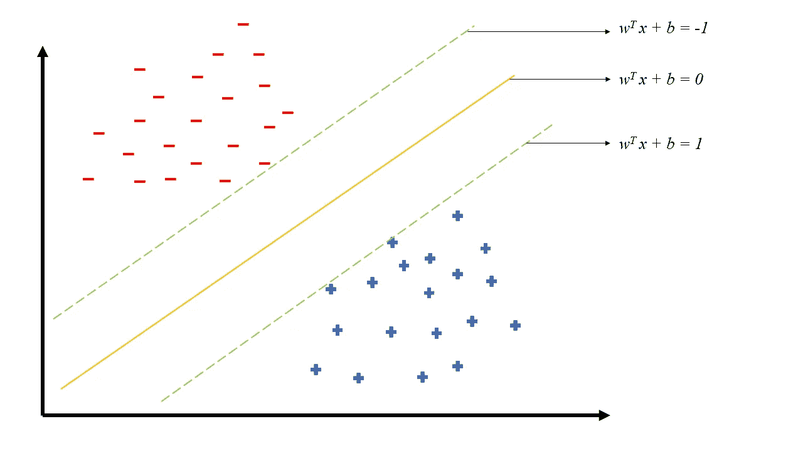

图 5:超平面中的支持向量机(SVM)。

在我们考虑的这个特定例子中，我们期望分类器方程的输出是正数，表示数据点属于正类，或者是负数，表示数据点属于负类。如果任意点正好在决策边界上，那么分类器的输出将为零，因此，决策边界的等式为:

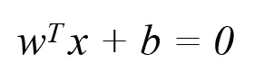

图 6:决策边界的等式。

类似地，边缘超平面的分类器方程:

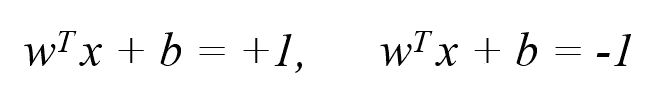

图 7:边缘超平面的方程。

我们不要盲目相信它。我们将继续推导为什么这个方程的输出不是正的就是负的。

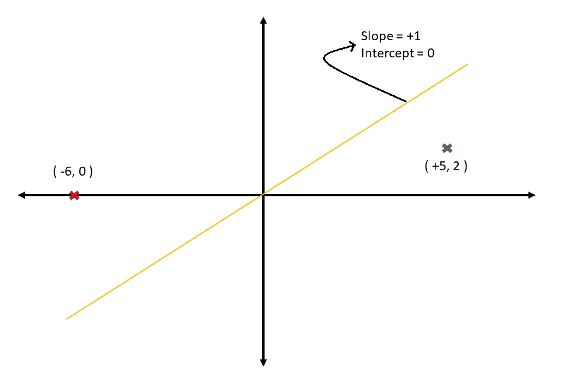

图 8:等式表示的推导。

考虑上述问题，其中判定边界穿过原点，因此截距为零，斜率为+1。超平面每一侧的单个数据点代表正类和负类。代入超平面方程中的值:

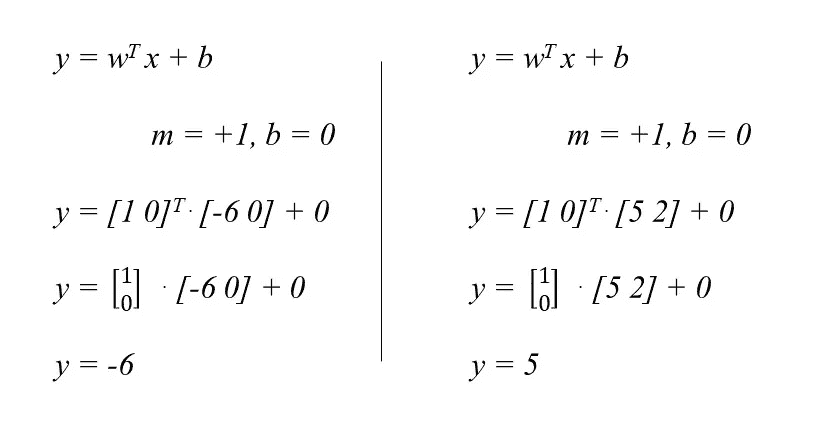

图 9:超平面方程中的值替换。

超平面下面的任何点总是正的，超平面上面的点总是负的。

接下来，必须最大化裕量，以找到最佳决策边界。考虑负支持向量为点 *x1，正支持向量为*点 x2。*余量就是 *x1* 和 *x2* 之差。让我们借助解线性方程组来得出这个方程。数学上，我们有两个带有两个未知数的方程( *x1* 和 *x2* )。要找出未知数，从一个方程中减去另一个方程。*

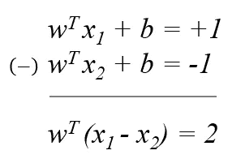

图 10:寻找未知数。

为了找到 *x1* - *x2* ， *w* 必须被送到等式的左侧，这给出了 2 除以 *w* 。已经知道 *w* 是向量，向量不能像标量值一样直接分割。相当于将两边除以 *w、*的长度，即 *w* 的范数的大小。

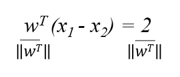

图 11:*w*的范数的大小。

当 *w* 除以它的范式时，它仍然指向相同的方向，但是幅度将是 1 个单位，相当于标量 1。因此

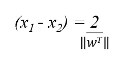

图 12:量级 1 相当于标量 1。

既然我们已经得到了余量的等式，那么就认为需要使用优化算法(如梯度下降)来最大化优化函数。优化算法在寻找局部最小值时工作得最好，因此为了缓解问题，最小化 *x1* - *x2* 的倒数可以用作优化函数，这是 *w* 超过 2 的规范。

SVM 模型也可能具有一定百分比的误差，即新数据的错误分类，并且这必须被集成到我们的优化函数中，其中 *Ci* 表示误差点的数量，换句话说，错误分类的数据点的数量以及边缘超平面和错误分类的数据点之间的距离的总和。

> **术语警告**
> 
> 1.**硬裕度**:不能容忍任何误差的裕度称为硬裕度。它对异常值很敏感，单个异常值就能影响决策边界。
> 
> 2.**软余量**:可以考虑一定百分比误差的余量称为软余量。对异常值不敏感。

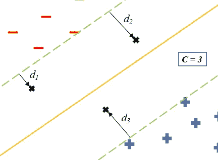

图 13:硬边界和软边界。

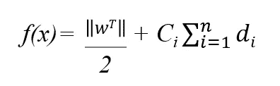

图 14:最终函数。

> **总结:**
> 
> 完全理解数学并不是强制性的。如果你不能理解推导过程，也没关系。基本上，必须知道 SVM 创建了一个超平面，作为分类数据点的决策边界，为了找到正确的边界，需要考虑两个超平面，它们之间的距离必须最大。

## SVM 核

为线性可分的数据点构建超平面时，SVM 很容易。然而，当数据是非线性可分的时，就更具挑战性了。如上所述，SVM 核有助于将低维非线性可分离数据点转换成高维线性可分离数据点。有三种广为人知的 SVM 核:

1.  多项式
2.  径向基函数
3.  乙状结肠的

让我们通过将 1-d 非线性可分数据转换成 2-d 线性可分数据来建立内核如何工作的直觉。

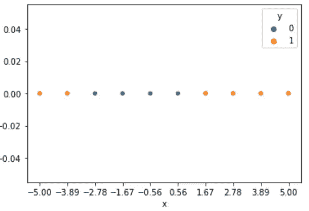

图 15:内核转换。

考虑上述数据点，它是二元分类(1 和 0)的一个例子。不可能画出一条直线来区分这两个阶级。对每个点应用变换会将一维数据点转换为二维数据点，有助于建立决策边界。这里，转换函数是:

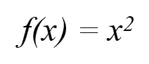

图 16:运输功能。

也就是说，将每个数据点平方，并将结果绘制为第二维( *y 轴*)。

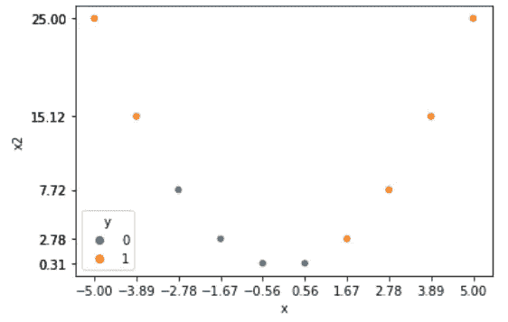

图 17:第二维度的结果图(y 轴)。

原始数据点绘制在 *x 轴*上，变换后的数据点(x-square)绘制在 *y 轴*上。现在，数据点很容易通过绘制一个线性超平面来分离。可视化更高维度的数据点将是具有挑战性的。然而，SVM 核也类似地处理高维数据点，将低维数据转换成高维数据，以便它们转换成线性可分离的数据点。

## 履行

python 的实现非常简单。Python 开源为我们提供了现成的包来实现几种机器学习算法，SVM 也不例外。使用 sklearn 的 SVC 包提供了几个优点和灵活性。SVC 代表支持向量分类，实现基于 [**libsvm**](https://www.csie.ntu.edu.tw/~cjlin/libsvm/) 和一个围绕 svm 的包装器。让我们导入必要的包。

```
import pandas as pd
import numpy as np
import matplotlib.pyplot as plt
import seaborn as sns#classic datasets from sklearn library
from sklearn import datasetsfrom sklearn.model_selection import train_test_split#Support Vector Classification-wrapper around SVM
from sklearn.svm import SVC#different matrices to score model performance
from sklearn import metrics
from sklearn.metrics import classification_report,confusion_matrix
```

出于实现的目的，我们将使用一个葡萄酒数据集。这是一个多类数据集，包含 3 个类、178 个样本和 13 个要素。这一数据来自于对意大利同一地区种植的三种不同品种的葡萄酒的化学分析。分析确定了三种葡萄酒中 13 种成分的含量。

让我们从 sklearn 库中加载葡萄酒数据。由于数据是从 sklearn 加载的，如果我们将它存储到一个**数据帧**中，使用起来会更容易。

```
#loading WINE dataset
cancer_data = datasets.load_wine()#storing into DataFrame
df = pd.DataFrame(cancer_data.data, columns = cancer_data.feature_names)
df['target'] = cancer_data.target
df.head()
```

通过绘制图表来执行分析将有助于更好地理解数据集。总是建议检查数据是否平衡，也就是说，是否所有的目标类都有相同数量的记录。

```
#analysing target variable
sns.countplot(df.target)
plt.show()
```

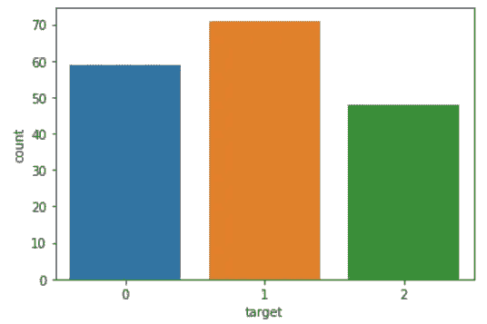

图 18:目标类的图表。

作为一个多类分类问题，它也代表了一个不平衡的分类问题。接下来，让我们检查我们的数据是否是线性可分的。这将给出一个初步的推断，以决定哪种类型的内核最适合对数据进行分类。为了简单起见，让我们根据酒精绘制每个特征，并根据它们的类别给数据点着色。

```
#visualizing datapoints separability
fig, axes = plt.subplots(6, 2, figsize=(22,14))
axes = [ax for axes_rows in axes for ax in axes_rows]
columns = list(df.columns)
columns.remove('target')
columns.remove('alcohol')#looping through every columns of data
#and plotting against alcohol
for i, col in enumerate(columns):
   sns.scatterplot(data=df, x='alcohol', y=col, hue='target',         palette="deep", ax=axes[i])
```

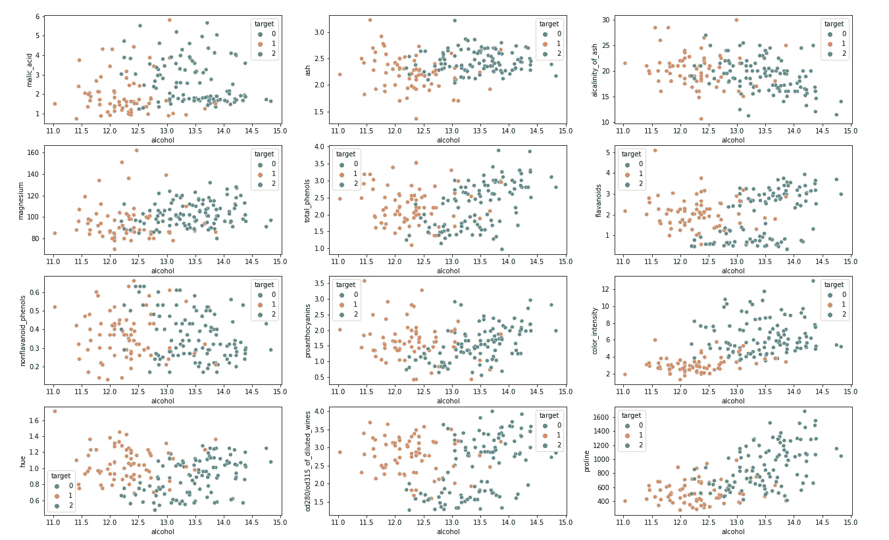

图 19:葡萄酒数据集的数据类特性。

显而易见，数据点是线性可分的，当然有一些重叠百分比，这是现实世界数据中的理想情况。现在构建线性 SVM 更有意义。在构建任何模型之前，建议将数据集分为训练数据和测试数据。训练数据用于训练我们的模型，测试用于评估已训练模型的性能。理想情况下，80%的数据用于训练，20%用于测试。

```
#splitting data into 80:20 train test ratio
X = df.drop('target', axis=1)
y = df.targetX_train, X_test, y_train, y_test = train_test_split(X, y, test_size=0.2, random_state=10)
```

*X_train* 和 *X_test* 包含所有特征，随机选择 80%的行，而 *y_train* 和 *y_test* 只包含相应行的目标值。让我们使用 sklearn 库中的 SVC 包来构建线性 SVM 模型。函数 *predict()* 用于预测特征 *x* 数据的目标 *y* 值。

```
#training SVM model with linear kernel
model = SVC(kernel='linear', random_state = 10)
model.fit(X_train, y_train)#predicting output for test data
pred = model.predict(X_test)
```

混淆矩阵是评价分类模型性能的首选方法之一。它通过绘制预测值与实际值的图表，对正确分类和错误分类的几个测试数据点进行可视化分析。

```
#building confusion matrix
cm = confusion_matrix(y_test, pred)#defining the size of the canvas
plt.rcParams['figure.figsize'] = [15,8]#confusion matrix to DataFrame
conf_matrix = pd.DataFrame(data = cm,columns = ['Predicted:0','Predicted:1', 'Predicted:2'], index = ['Actual:0','Actual:1', 'Actual:2'])#plotting the confusion matrix
sns.heatmap(conf_matrix, annot = True, fmt = 'd', cmap = 'Paired', cbar = False,linewidths = 0.1, annot_kws = {'size':25})
plt.xticks(fontsize = 20)
plt.yticks(fontsize = 20)
plt.show()
```

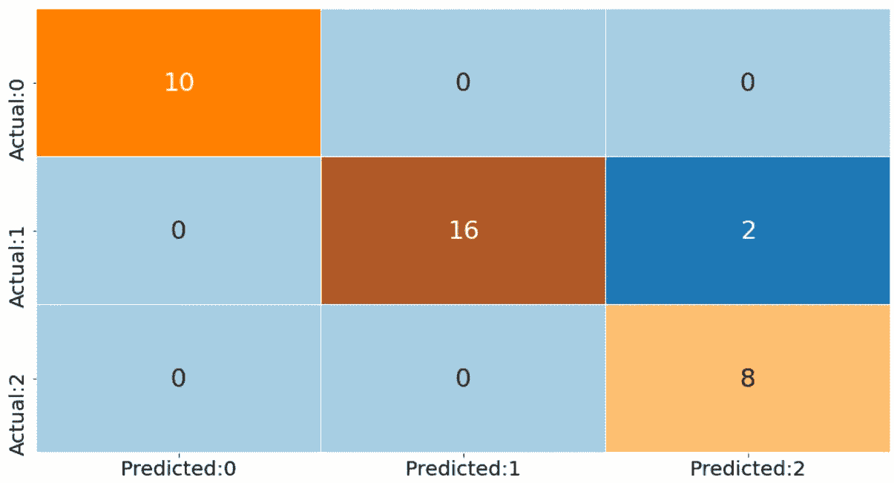

图 20:预测值与实际值的对比。

0、1 和 2 是类别，该图给出了属于相应块的测试数据点的数量。*类 0* 和 *2* 的所有 10 个数据点都被正确预测/分类。也就是说，预测等于实际。而*类别 1* 的 2 个数据点被错误预测为*类别 2* 。更多的推论，如精确度、召回率、准确度分数、f1 分数等等。混淆矩阵可以用*分类 _ 报告*包提取。

```
print(classification_report(y_test,pred))
```

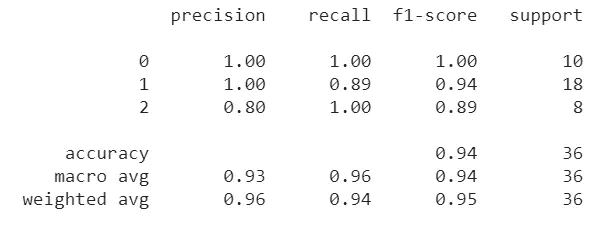

图 21:结果，突出显示我们的 SVM 具有 94%的显著准确性。

准确率得分显著 94%。来自类别 1 的两个错误分类数据解释了 6%准确度的损失，这是合理可接受的和预期的。

**免责声明:**本文所表达的观点均为作者个人观点，不代表与作者(直接或间接)相关的任何公司的观点。这项工作并不打算成为最终产品，而是当前思想的反映，同时也是讨论和改进的催化剂。

**除非另有说明，所有图片均来自作者。**

经由[发布**走向 AI** 发布](https://towardsai.net/)

## 资源:

[](https://github.com/towardsai/tutorials/tree/master/support-vector-machine-svm) [## 支持向量机知识库| Github

### AI 相关教程。免费访问其中任何一个→https://towardsai.net/editorial-toward sai/教程

github.com](https://github.com/towardsai/tutorials/tree/master/support-vector-machine-svm) [](https://colab.research.google.com/drive/151vvpQelTep3ftrvpK3LzqTeyF_HwFGW?usp=sharing) [## SVM 介绍——谷歌合作实验室

colab.research.google.com](https://colab.research.google.com/drive/151vvpQelTep3ftrvpK3LzqTeyF_HwFGW?usp=sharing) 

## 参考资料:

[1]詹森·布朗利。2020.“机器学习中的 4 类分类任务”。机器学习精通。[https://machine learning mastery . com/types-of-class ification-in-machine-learning/。](https://machinelearningmastery.com/types-of-classification-in-machine-learning/.)

[2]“支持向量机——维基百科”。2021.En.Wikipedia.Org。[https://en . Wikipedia . org/wiki/Support-vector _ machine #定义。](https://en.wikipedia.org/wiki/Support-vector_machine#Definition.)

[3]“线性可分性——维基百科”。2021.En.Wikipedia.Org。[https://en.wikipedia.org/wiki/Linear_separability.](https://en.wikipedia.org/wiki/Linear_separability.)

[4]《UCI 机器学习知识库:葡萄酒数据集》。2021.Archive.Ics.Uci.Edu。https://archive.ics.uci.edu/ml/datasets/wine.

[](https://ws.towardsai.net/shop) [## 店铺↓ |走向 AI

### 发布最好的技术、科学和工程|社论→https://towardsai.net/p/editorial |订阅→…

ws.towardsai.net](https://ws.towardsai.net/shop) [](https://members.towardsai.net/) [## 加入我们吧↓ |面向人工智能成员|数据驱动的社区

### 向着 AI 加入。通过成为会员，你不仅将支持人工智能，但你将有机会…

members.towardsai.net](https://members.towardsai.net/) [](https://sponsors.towardsai.net/) [## 赞助商|了解如何成为《走向人工智能》的赞助商

### 无论你是想以一种吸引读者的方式突出你的产品，吸引高度相关的小众受众，还是…

sponsors.towardsai.net](https://sponsors.towardsai.net/)