# 支持向量机

> 原文：<https://pub.towardsai.net/support-vector-machines-a78afdc9357f?source=collection_archive---------4----------------------->

## 监督学习方法:第三部分

## 支持向量机:

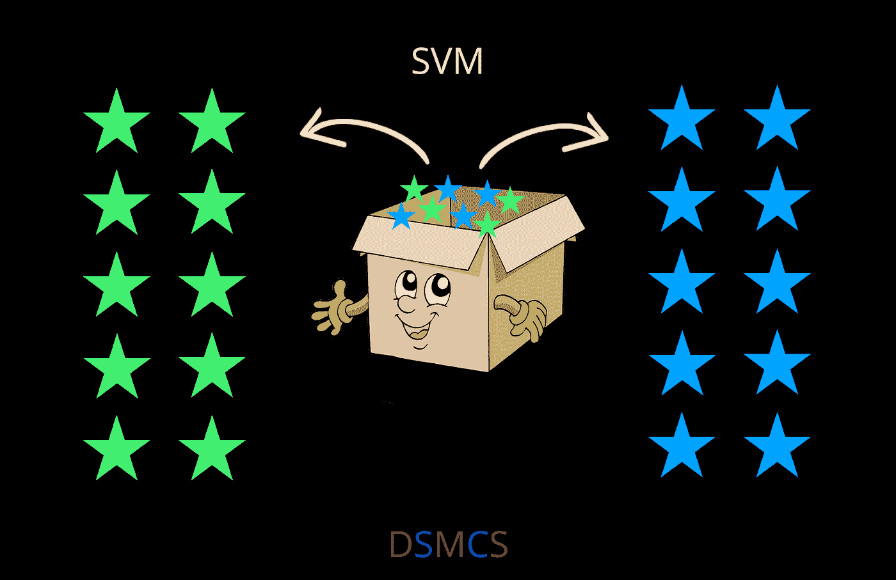

*来源:作者图片*

让我们先理解这个例子，以便在进入下一个术语之前有一个更好的开始。

考虑以下场景:一家在线美容公司希望开发一个分类引擎来分析水疗、护肤、护发、化妆和身体护理这五个类别中销量最好的产品。

注意:在机器学习中，每当我们使用监督学习算法时，我们总是处理矩阵(行和列的总数)和目标，即(类别)，但是在无监督学习中，目标是不可用的，所以我们只使用矩阵。

## 在这种情况下应该做些什么？

【https://giphy.com/】来源:

*我们最初的想法是利用分类方法对项目进行分组，以理解、识别和将概念和事物分类到预定的组中，这基本上是分类的过程。*

*我们要做的第一件事是设置目标向量，这是一个多类分类。这包括首先决定哪些产品属于哪个类别，并相应地对它们进行分类。这意味着我们有许多行和列，这增加了过度拟合的风险。在这种情况下，我们需要一种算法来帮助我们实现目标，同时降低过度拟合的风险。支持向量机算法在这一点上进入了画面。*

*一种叫做支持向量机的算法可以处理很多列和很多预测，只需要很少的交易次数。*

## *支持向量机分为两类:*

1.  *线性支持向量机*
2.  *非线性支持向量机*

## *1.线性支持向量机；*

*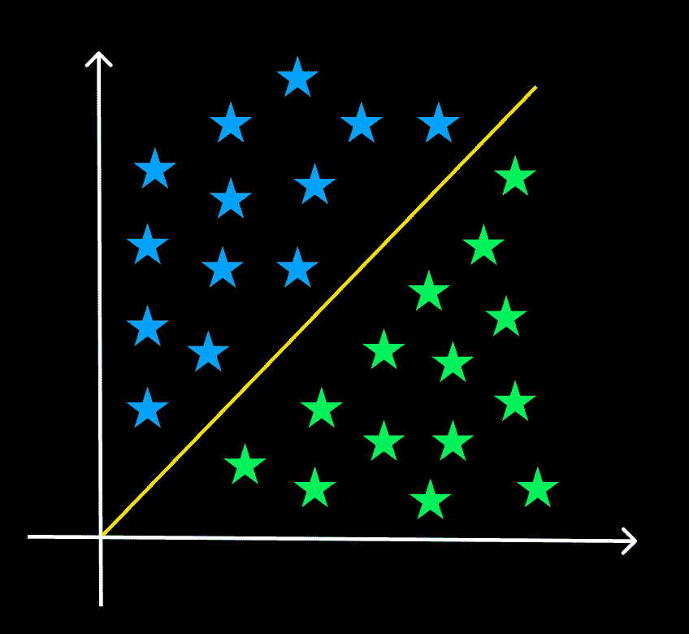*

**来源:作者图片**

*当一个数据集可以通过一条直线分成两个类时，它被称为是线性可分的，所使用的分类器被称为线性 SVM 分类器。*

*让我们从算法的基础构件数学开始，以便从头开始掌握它:*

**

**来源:*[*https://giphy.com/*](https://giphy.com/)*

## *点积*

*每个人自然都是这方面的专家，因为我们早年都学过如何计算点积。*

*点积也称为投影积。为什么？让我们看看*

****我在网上找到的这篇惊人的文章就是这个问题的最好例子:****

*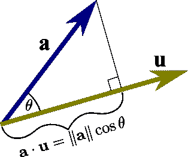*

**来源:【https://mathinsight.org/applet/dot_product_projection】**

**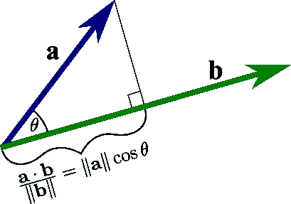**

***来源:*[*【https://mathinsight.org/applet/dot_product_projection】*](https://mathinsight.org/applet/dot_product_projection)**

**“a”在“b”上的投影是矢量“a”(蓝色)和“b”(绿色)的点积，除以“b”的大小。从“b”的尾部到“a”的头部在“b”上的投影的红色线段就是这种投影的一个例子。**

## **点积和超平面:**

**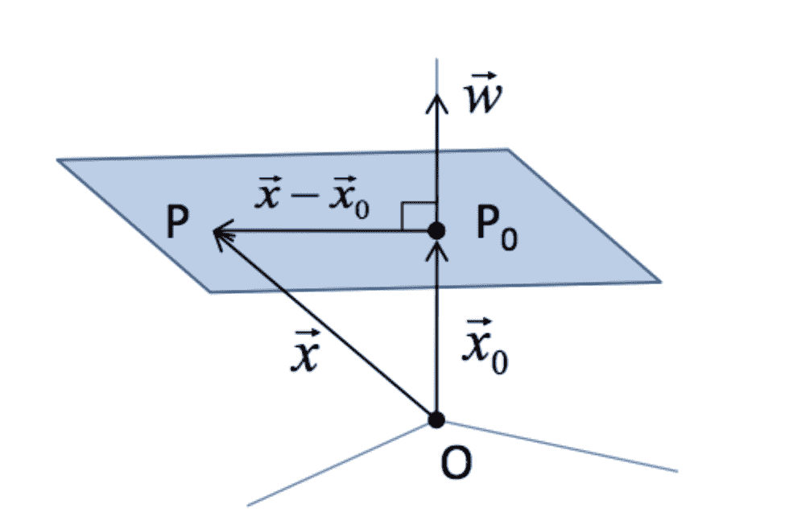**

***来源:*[*https://CCC . ina oep . MX/~ e morales/Cursos/NvoAprend/Acetatos/SVM 2019 . pdf*](https://ccc.inaoep.mx/~emorales/Cursos/NvoAprend/Acetatos/svm2019.pdf)**

## **SVM 的超平面到底是什么意思？**

**在支持向量机中，超平面是区分两个类别的决策边界。各种类别可以通过位于超平面每一侧的数据点来识别，如上面的线性支持向量机图所示。数据集中的特征数量决定了超平面的维度。**

**平面最基本的方程。即**

**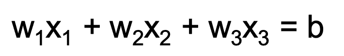**

***来源:作者***

## **替代规格**

*   **指定一个点和一个垂直矢量。**
*   **设 P & P0 是超平面上的两点。**
*   **设 x & x0 是支撑超平面的两个向量。**

**考虑向量“w ”,它与 x0 处的超平面正交**

*   **(x- x0)必须位于超平面上→ w 必须正交于(x- x0)**
*   **w(转置)(x-x0) = 0**
*   **w(转置)x = -w(转置)x0**
*   **w(转置)x = b**

## **线性分类器:**

**在特征空间中区分类的工作可以被视为二元分类:**

**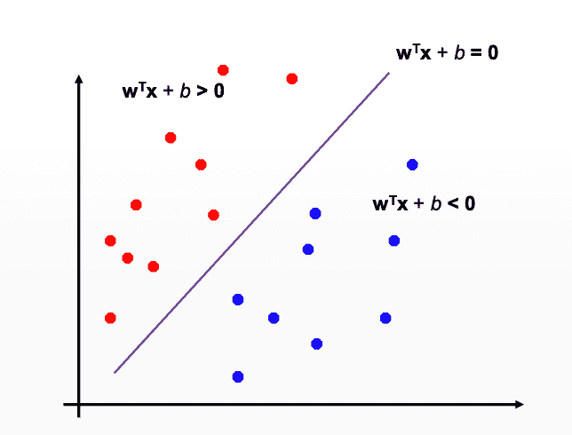**

***来源:作者图片***

## **分类器的边距以便对数据进行分类？**

****

***来源:作者图片***

**边距是直线和最近的数据点之间的间隔。裕度最大的线是可以划分两类的最佳或理想线。**

## **最大利润:**

**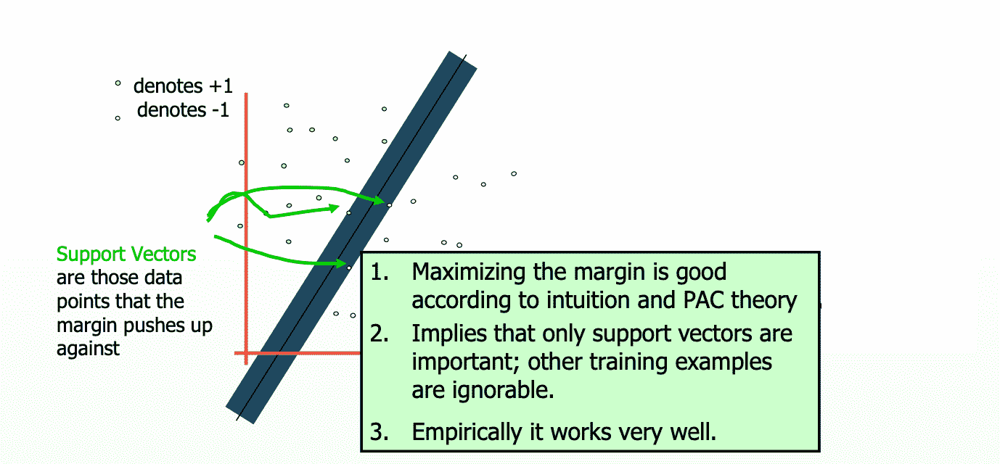**

***来源:作者图片***

**具有最大间隔的线性分类器被称为最大间隔线性分类器。**

****这是最简单的一种支持向量机，也称为线性支持向量机。****

**既然我们讨论的是真实世界的场景，我们可以看到，这些情况下的数据点通常不是线性可分的，而且容易出现噪声和异常值，因此我们实际上无法使用之前的公式对这些数据进行分类。**

## **为什么超平面和边缘是 SVM 的重要概念？**

**边距是一个术语，可用于描述直线和最近数据点之间的间隔。具有最宽裕度的线是可用于划分两个类别的最佳或理想线。我们称之为最大边缘超平面。**

## **如何修正公式以处理噪声和异常值:**

**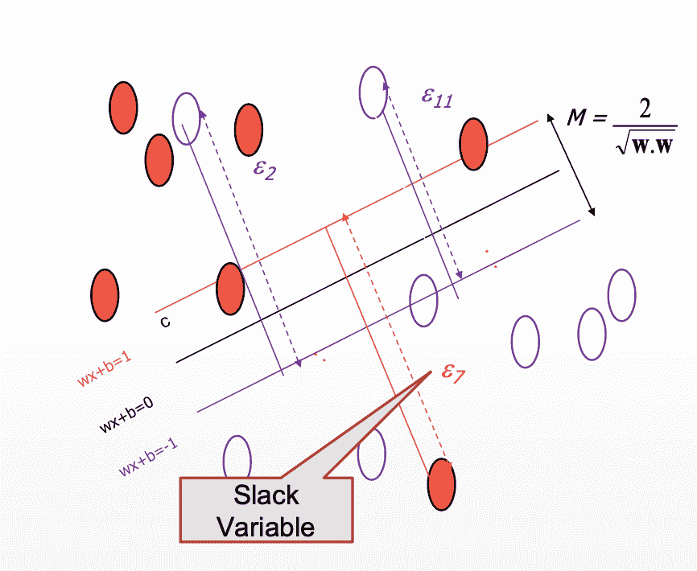**

***来源:作者图片***

## **用于修复噪声和异常值的公式:**

**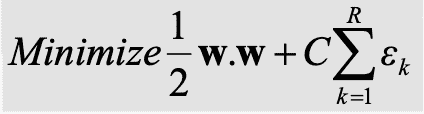**

***来源:作者图片***

**现在继续，当分析给定的数字时，唯一可能困扰人类智慧的是那个***【C】是什么意思？*** 和 ***我们为什么选择那个？*****

**好吧，那我们开始吧。**

****这里的“C”代表支持向量参数-****

**为了在将来方便地分类新的数据点，SVM 算法寻求识别用于分类 n 维空间的最佳线或决策边界。最佳选择边界是一个超平面。**

**通过选择附近的显著点，使用 SVM 创建更高维度的空间。这种方法被称为支持向量机，这些极端情况被称为支持向量。**

## **SVM 参数— C:**

1.  **控制训练误差。**
2.  **它用于防止过度拟合。**
3.  **让我们和 c 一起玩。(因为为什么不呢😁)**

**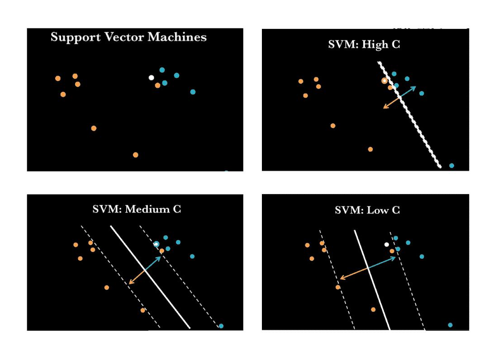**

***来源:*[*https://www.youtube.com/watch?v=5oVQBF_p6kY*](https://www.youtube.com/watch?v=5oVQBF_p6kY)*+Photoshop***

## **2.非线性支持向量机；**

**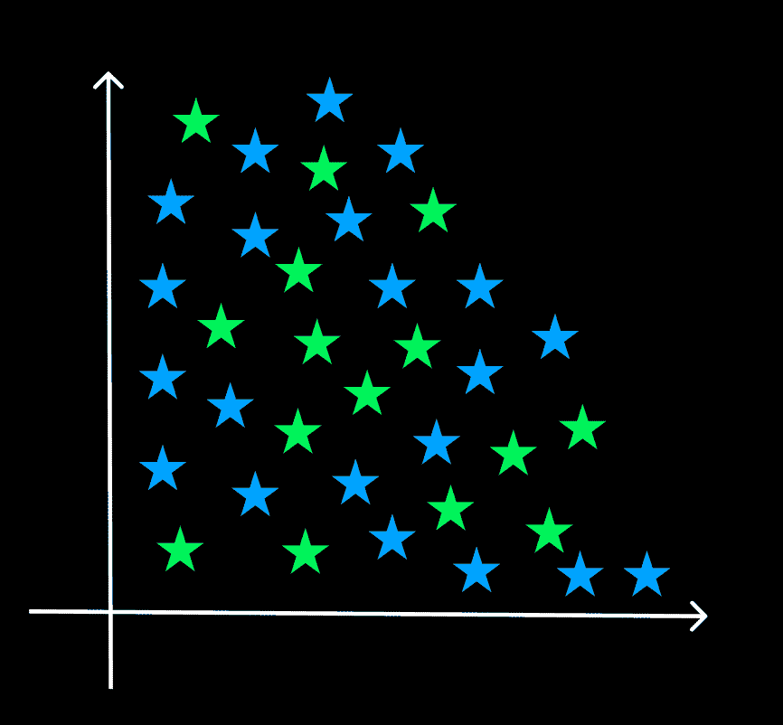**

**来源:作者图片**

**非线性分类是对不能线性分离的情况进行分类的过程。我们使用非线性 SVM 中的高维分类器来划分数据点。**

****让我们来看看非线性 SVM 中最著名的技巧****

## **内核技巧:**

**内核是一种将二维平面引入到更高维度环境中，并在那里弯曲它的技术。核是将低维空间转换到高维空间的函数。**

**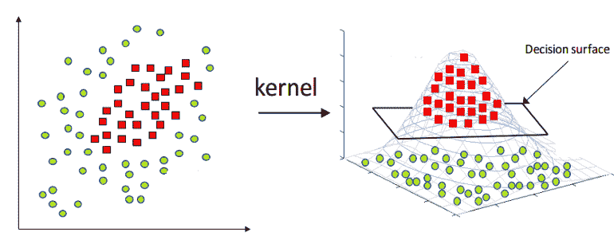**

***来源:*[*https://www . mdpi . com/2076-3417/11/10/4657/htm # B49-appl sci-11-04657*](https://www.mdpi.com/2076-3417/11/10/4657/htm#B49-applsci-11-04657)*(原始和内核化特征空间)***

## **为什么内核诡计？**

**支持向量机很难对非线性数据进行分类。在这种情况下，使用内核技巧是简单的解决办法。核技巧是一种直接的技术，它涉及将非线性数据投影到一个更高维的空间，在那里它可以被一个平面线性分割，从而更容易对数据进行分类。拉格朗日公式和拉格朗日乘数用于数学上实现这一点。(下面的数学部分提供了更多信息。)**

## **总结这些步骤:**

****

***来源:*[*https://giphy.com/*](https://giphy.com/)**

1.  **预处理(缩放、数值映射等。)训练数据。**
2.  **使用内核技巧来解决对非线性数据进行分类时引起的问题。**
3.  **使用交叉验证找到最佳 C 和σ参数值。**
4.  **使用最佳 C，σ在整个训练集上进行训练。**
5.  **测试。**

## **需要记住的几点(重要的几点) :**

****

***来源:*[*【https://giphy.com/】*](https://giphy.com/)**

1.  **支持向量机(SVMs)在实践中对于一大类分类问题非常有效。**
2.  **支持向量机的工作原理是学习最大间隔超平面，这导致良好的泛化能力。**
3.  **基本的线性 SVM 公式可以扩展到处理噪声和不可分的数据。**
4.  **内核技巧可以用来学习复杂的非线性模式。**
5.  **为了获得更好的性能，必须使用验证集来调整 SVM 参数(如 C)和内核参数。**

**我希望这篇博客能让支持向量机背后的数学和基本思想变得清晰。😎**

**敬请关注下一篇博客，我们将通过一个惊人的案例研究来讨论如何用 PYTHON 实现 SVM。❤️**

****关注我们，享受学习数据科学博客和文章的乐趣:💙****

****领英:**[https://www.linkedin.com/company/dsmcs/](https://www.linkedin.com/company/dsmcs/)**

****insta gram:**[https://www.instagram.com/datasciencemeetscybersecurity/?hl=en](https://www.instagram.com/datasciencemeetscybersecurity/?hl=en)**

****GITHUB:**[https://github.com/Vidhi1290](https://github.com/Vidhi1290)**

****推特:**https://twitter.com/VidhiWaghela**

****中等:**https://medium.com/@datasciencemeetscybersecurity-**

****网址:**[https://www.datasciencemeetscybersecurity.com/](https://datasciencemeetscybersecurity.blogspot.com/)**

**—团队数据科学与网络安全❤️相遇💙**