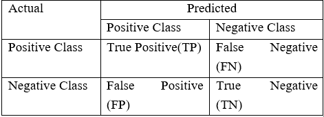

# 支持向量机:预测未来-案例研究

> 原文：<https://pub.towardsai.net/support-vector-machines-predicting-future-case-study-adf14b1d0dee?source=collection_archive---------4----------------------->

## 监督学习方法的延续:第三部分

正如之前在[支持向量机——监督学习方法的第三部分](https://medium.com/towards-artificial-intelligence/support-vector-machines-a78afdc9357f)中承诺的，让我们来谈谈一个惊人的案例研究，分析和理解支持向量在实际业务问题中的应用，并为没有人真正看到的惊人结果和预测做好准备。


图片来源:【https://giphy.com/ 

## 问题陈述:

在这个问题陈述中，我们将研究一个案例，在这个案例中，我们将根据影响肝炎的诊断因素来尝试预测这个人是否能够存活。

先说一下我们要用的数据集。该数据集包含人群中肝炎的发生率。

## 这个数据集的来源呢？


图片来源:【https://tenor.com/ +Photoshop

UCI 机器学习知识库被用来获得这个数据集..它有两种不同类型的 155 个记录，其中 32 个是死亡记录，123 个是现场记录。数据集中有 20 个特征(14 个二元属性和 6 个数值属性)

在本案例研究中，我们将使用多种方法，根据影响肝炎的诊断因素和正确的误差指标，成功预测患者能否存活。其中一种方法是混淆矩阵。

如果你对这个推销不清楚，请参考我们之前关于[混淆指标](https://medium.com/towards-artificial-intelligence/world-of-classification-in-machine-learning-a3c1f008b1fc)的博文。(归入分类博客世界)



图片来源:[https://lwmachinenglearning . WordPress . com/portfolio/unbalanced-data-credit-card-fraud-detection/](https://lwmachinelearning.wordpress.com/portfolio/unbalanced-data-credit-card-fraud-detection/)

## 让我们从实际部分开始:


图片来源:[https://giphy.com/](https://giphy.com/)

## 步骤 1:加载必需的和强制的库:

```
#THIS WILL HELP US IGNORE THE WARNINGS WHILE RUNNING OUR CODE
import warnings
warnings.filterwarnings("ignore")
```

```
 import os
import numpy as np
import pandas as pd

from sklearn.model_selection import train_test_split
from sklearn.preprocessing import StandardScaler, OneHotEncoder

from sklearn.impute import SimpleImputer

from sklearn.svm import SVC

from sklearn.metrics import confusion_matrix, accuracy_score, recall_score, precision_score, f1_score

from sklearn.model_selection import GridSearchCV
```

## 步骤 2:读取肝炎数据集:

```
data = pd.read_csv("/content/hepatitis.csv")
```

## 探索性数据分析:

***重要性:***EDA 是一种旨在揭示数据集底层结构的详细分析。它对业务问题很重要，因为它揭示了趋势、模式和不明显的联系。

```
#Checking the dimensions (rows and columns)
data.shape

#Checking the datatypes of each variable
data.dtypes

#Checking the head of the data (i.e top 5 rows)
data.head()

#Checking the basic summary statistics
data.describe()
#Checking the number of unique levels in each attribute
data.nunique()

#Target attribute Distribution
data.target.value_counts()

data.target.value_counts(normalize=True)*100
```

## 第三步:数据预处理:

**为什么我们需要准确地预处理数据？**


图片来源:[https://giphy.com/](https://giphy.com/)

每当我们决定使用数据时，第一步就是收集数据，这些数据通常处于未分类和未清理的状态。一旦我们开始处理这些数据，数据科学家就很难通过这种类型的数据找到清晰的模式和结果，这可能会导致许多误报、漏报和混淆。

因此，为了防止这种混乱，我们对原始数据进行清理和预处理，以提高准确性和可靠性。我们还消除了缺失(即数据中的零空间)或不一致的数据值，以允许算法或模型平稳运行，而不会遇到任何重大错误值。

为了使原始数据更易于理解、实用和有效，数据预处理也被认为是数据挖掘中的一个重要方法。这整个数据预处理过程有助于改善我们的结果。

```
#Let's drop the columns which are not that signicant and in use
data.drop(["ID"], axis = 1, inplace=True)
```

```
#Storing categorical and numerical values:
num_cols = ["age", "bili", "alk", "sgot", "albu", "protime"]
```

```
cat_cols = ['gender', 'steroid', 'antivirals', 'fatigue', 'malaise', 'anorexia', 'liverBig',
           'liverFirm', 'spleen', 'spiders', 'ascites', 'varices', 'histology']
```

```
 #Checking the head of dataset once again to see how dataframe looks
data.head()
```

```
 #Converting the attributes into appropriate type to avoid the future error
data[cat_cols] = data[cat_cols].astype('category')
```

```
#After converting the attribute types check the datatypes to be sure once again
data.dtypes
```

## 步骤 4:将数据分为“X”和“Y”:

```
 #Time to split the data into X and Y
X = data.drop(["target"], axis = 1)
y = data["target"]
```

```
#Getting the shape of data
print(X.shape, y.shape)
```

```
#Training the data
X_train, X_test, y_train, y_test = train_test_split(X, y, test_size = 0.2, random_state = 123, stratify=y)
```

```
#Getting the shape of trained data to find the difference between untrained and trained data.
print(X_train.shape)
print(X_test.shape)
print(y_train.shape)
print(y_test.shape)
```

```
#Check for distribution target variables
y_train.value_counts()

y_train.value_counts(normalize=True)*100
```

## 步骤 5:数据预处理在将数据分成“X”和“Y”之后:

```
#Checking the null values
X_train.isna().sum()

X_test.isna().sum()
```

## 模式为的插补缺失分类列:

```
df_cat_train = X_train[cat_cols]
df_cat_test = X_test[cat_cols]

cat_imputer = SimpleImputer(strategy='most_frequent')
cat_imputer.fit(df_cat_train)
```

```
df_cat_train = pd.DataFrame(cat_imputer.transform(df_cat_train), columns=cat_cols)
df_cat_test = pd.DataFrame(cat_imputer.transform(df_cat_test), columns=cat_cols)

df_num_train = X_train[num_cols]
df_num_test = X_test[num_cols]
```

## 用中位数插补缺失的数字列:

```
num_imputer = SimpleImputer(strategy='median')
num_imputer.fit(df_num_train[num_cols])
```

```
 df_num_train = pd.DataFrame(num_imputer.transform(df_num_train), columns=num_cols)
df_num_test =  pd.DataFrame(num_imputer.transform(df_num_test), columns=num_cols)
```

## 现在，将估算的分类列和数字列结合起来:

```
 # Combine numeric and categorical in train
X_train = pd.concat([df_num_train, df_cat_train], axis = 1)

# Combine numeric and categorical in test
X_test = pd.concat([df_num_test, df_cat_test], axis = 1)
```

## 标准化数字属性:


图片来源:[https://giphy.com/](https://giphy.com/)

由于我们采用的方法假设了各种形式的分布，如线性和逻辑回归，当我们的数据具有不同的规模时，标准化是一个非常有用的策略。

当回归模型使用表示为多项式或交互的变量时，数据科学家通常会将该模型的数据标准化。由于这些术语非常重要，能够揭示响应因子和预测因子之间的联系，因此它们也可能导致高度的多重共线性。

```
 scaler = StandardScaler()
scaler.fit(X_train[num_cols])
```

```
X_train_std = scaler.transform(X_train[num_cols])
X_test_std = scaler.transform(X_test[num_cols])
```

```
print(X_train_std.shape)
print(X_test_std.shape)
```

## ONEHOTENCODER:将分类属性转换为数字属性:

***为什么？***

机器学习模型的所有输入和输出变量都必须是数字。这意味着，为了拟合和评估模型，分类数据必须首先编码为数据中的数字。


图片来源:[https://giphy.com/](https://giphy.com/)

```
 enc = OneHotEncoder(drop = 'first')
enc.fit(X_train[cat_cols])
```

```
X_train_ohe=enc.transform(X_train[cat_cols]).toarray()
X_test_ohe=enc.transform(X_test[cat_cols]).toarray()
```

## 连接属性:

使用一键编码标准化数字属性和分类属性。

```
X_train_con = np.concatenate([X_train_std, X_train_ohe], axis=1)
X_test_con = np.concatenate([X_test_std, X_test_ohe], axis=1)
```

```
print(X_train_con.shape)
print(X_test_con.shape)
```

## 第六步:最后用线性 SVM 建模:

**使用线性内核创建 SVC 分类器:**

```
linear_svm = SVC(kernel='linear', C=1)
```

```
#Training the classifier
linear_svm.fit(X=X_train, y= y_train)
```

```
#Predicting the results
train_predictions = linear_svm.predict(X_train)
test_predictions = linear_svm.predict(X_test)
```

## 误差矩阵:

有助于确定和预测分类模型可行性的评估过程称为混淆矩阵，也称为误差矩阵。通过使用混淆矩阵，您可以观察到许多预测错误。


图片来源:[https://giphy.com/](https://giphy.com/)

```
#Defining the error matrix
def evaluate_model(act, pred):
   print("Confusion Matrix \n", confusion_matrix(act, pred))
   print("Accuracy : ", accuracy_score(act, pred))
   print("Recall   : ", recall_score(act, pred))
   print("Precision: ", precision_score(act, pred))
   print("F1_score : ", f1_score(act, pred))
```

```
### Train data accuracy
evaluate_model(y_train, train_predictions)

### Test data accuracy
evaluate_model(y_test, test_predictions)
```

虽然我很喜欢为你们写文章，但我希望你们也喜欢实施这个案例并从中学习。如果您有任何问题或需要数据集源或 GitHub gist 的帮助(如果您对部分代码有困难)，请联系；我们非常乐意帮忙。😁❤️


图片来源:[https://giphy.com/](https://giphy.com/)

## 继续预见，学习，探索！❤️

## 关注我们，享受学习数据科学博客和文章的乐趣:💙

**领英:**【https://www.linkedin.com/company/dsmcs/】T4

**insta gram:**https://www.instagram.com/datasciencemeetscybersecurity/?hl=en

**GITHUB:**[https://github.com/Vidhi1290](https://github.com/Vidhi1290)

**推特:**[https://twitter.com/VidhiWaghela](https://twitter.com/VidhiWaghela)

**中等:**https://medium.com/@datasciencemeetscybersecurity-

**网址:**[https://datasciencemeetscybersecurity.blogspot.com/](https://datasciencemeetscybersecurity.blogspot.com/)

**—团队数据科学与网络安全❤️相遇💙**